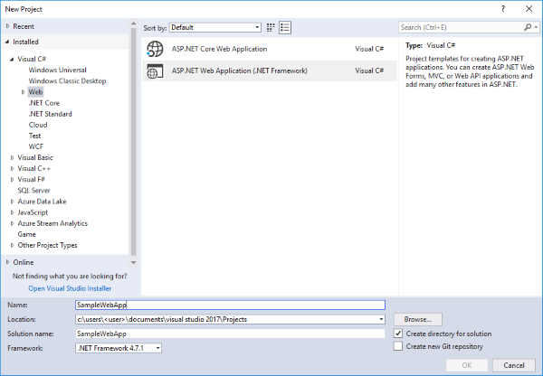
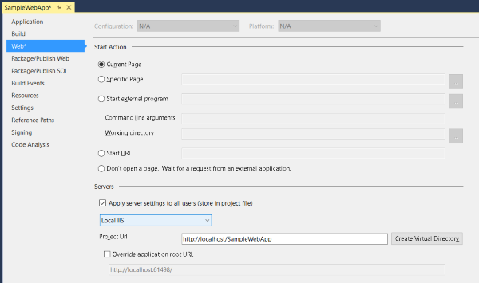
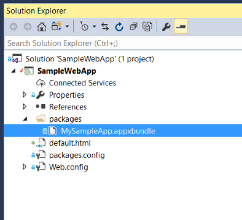
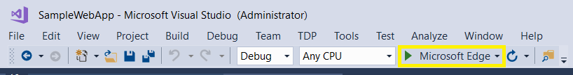
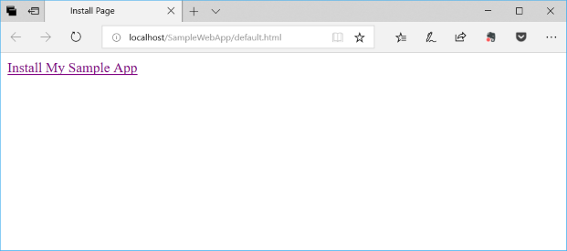

# Install a UWP app from an IIS server

This tutorial demonstrates how to set up an IIS server, verify that your web app can host app packages, and invoke and use App Installer effectively.

The App Installer app allows developers and IT Pros to distribute Windows 10 apps by hosting them on their own Content Delivery Network (CDN). This is useful for enterprises that don't want or need to publish their apps to the Microsoft Store, but still want to take advantage of the Windows 10 packaging and deployment platform. 

## Setup

To successfully go through with this tutorial, you will need the following:

1. Visual Studio 2017  
2. Web development tools and IIS 
3. UWP app package - The app package that you will distribute

Optional: [Starter Project](https://github.com/AppInstaller/MySampleWebApp) on GitHub. This is helpful if you don't have app packages to work with, but would still like to learn how to use this feature.

## Step 1 - Install IIS and ASP.NET 

[Internet Information Services](https://www.iis.net/) is a Windows feature that can be installed via the Start menu. In **Start menu** search for **Turn Windows features on or off**.

Find and select **Internet Information Services** to install IIS.

> [!NOTE]
> You don't need to select all the check boxes under Internet Information Services. Only the ones selected when you check **Internet Information Services** are sufficient.

You will also need to install ASP.NET 4.5 or greater. To install it, locate **Internet Information Services -> World Wide Web Services -> Application Development Features**. Select a version of ASP.NET that is greater than or equal to ASP.NET 4.5.


## Step 2 - Install Visual Studio 2017 and Web Development tools 

[Install Visual Studio 2017](https://docs.microsoft.com/visualstudio/install/install-visual-studio) if you have not already installed it. If you already have Visual Studio 2017, ensure that the following workloads are installed. If the workloads are not present on your installation, follow along using the Visual Studio Installer (found from the Start menu).  

During installation, select **ASP.NET and Web development** and any other workloads that you are interested in. 

Once installation is complete, launch Visual Studio and create a new project (**File** -> **New Project**).

## Step 3 - Build a Web App

Launch Visual Studio 2017 as **Administrator** and create a new **Visual C# Web Application** project with an **empty** project template. 



## Step 4 - Configure IIS with our Web App 

From the Solution Explorer, right click on the root project and select **Properties**.

In the web app properties, select the **Web** tab. In the **Servers** section, choose **Local IIS** from the drop down menu and click **Create Virtual Directory**. 



## Step 5 - Add an app package to a web application 

Add the app package that you are going to distribute into the web application. You can use the app package that is part of the provided [starter project packages](https://github.com/AppInstaller/MySampleWebApp/tree/master/MySampleWebApp/packages) on GitHub if you don't have an app package available. The certificate (MySampleApp.cer) that the package was signed with is also with the sample on GitHub. You must have the certificate installed to your device prior to installing the app (Step 9).

In the starter project web application, a new folder was added to the web app called `packages` that contains the app packages to be distributed. To create the folder in Visual Studio, right click on the root of the Solution Explorer, select **Add** -> **New Folder** and name it `packages`. To add app packages to the folder, right click on the `packages` folder and select **Add** -> **Existing Item...** and browse to the app package location. 



## Step 6 - Create a Web Page

This sample web app uses simple HTML. You are free to build your web app as required per your needs. 

Right click on the root project of the Solution explorer, select **Add** -> **New Item**, and add a new **HTML Page** from the **Web** section.

Once the HTML page is created, right click on the HTML page in the Solution Explorer and select **Set As Start Page**.  

Double-click the HTML file to open it in the code editor window. In this tutorial, only the elements in the required in the web page to invoke the App Installer app successfully to install a Windows 10 app will be used. 

Include the following HTML code in your web page. The key to successfully invoking App Installer is to use the custom scheme that App Installer registers with the OS: `ms-appinstaller:?source=`. See the code example below for more details.

> [!NOTE]
> Ensure that the URL path specified after the custom scheme matches the Project Url in the web tab of your VS solution.
 
```HTML
<html>
<head>
    <meta charset="utf-8" />
    <title> Install Page </title>
</head>
<body>
    <a href="ms-appinstaller:?source=http://localhost/SampleWebApp/packages/MySampleApp.appxbundle"> Install My Sample App</a>
</body>
</html>
```

## Step 7 - Configure the web app for app package MIME types

Open the **Web.config** file from the solution explorer and add the following lines within the `<configuration>` element. 

```xml
<system.webServer>
   <!--This is to allow the web server to serve resources with the appx/appxbundle/appinstaller extension-->
   <staticContent>
      <mimeMap fileExtension=".appx" mimeType="application/appx"/>
      <mimeMap fileExtension=".appxbundle" mimeType="application/appxbundle"/>
      <mimeMap fileExtension=".appinstaller" mimeType="application/appinstaller" />
   </staticContent>
</system.webServer>
```

## Step 8 - Add loopback exemption for App Installer

Due to network isolation, UWP apps like App Installer are restricted to use IP loopback addresses like http://localhost/. When using local IIS Server, App Installer must be added to the loopback exempt list. 

To do this, open **Command Prompt** as an **Administrator** and enter the following:
```Command Line
CheckNetIsolation.exe LoopbackExempt -a -n=microsoft.desktopappinstaller_8wekyb3d8bbwe
```

To verify that the app is added to the exempt list, use the following command to display the apps in the loopback exempt list: 
```Command Line
CheckNetIsolation.exe LoopbackExempt -s
```

You should find `microsoft.desktopappinstaller_8wekyb3d8bbwe` in the list.

Once the local validation of app installation via App Installer is complete, you can remove the loopback exemption that you added in this step by:

```Command Line
CheckNetIsolation.exe LoopbackExempt -d -n=microsoft.desktopappinstaller_8wekyb3d8bbwe
```

## Step 9 - Run the Web App 

Build and run the web application by clicking on the run button on the VS Ribbon as shown in the image below:



A web page will open in your browser:



Click on the link in the web page to launch the App Installer app and install your Windows 10 app package.


## Troubleshooting issues

### Not sufficient privilege 

If running the web app in Visual Studio displays an error such as "You do not have sufficient privilege to access IIS web sites on your machine", you will need to run Visual Studio as an administrator. Close the current instance of Visual Studio and reopen it as an admin.

### Set start page 

If running the web app causes the browser to load with an HTTP 403.14 - Forbidden error, it's because the web app doesn't have a defined start page. Refer to Step 6 in this tutorial to learn how to define a start page.
