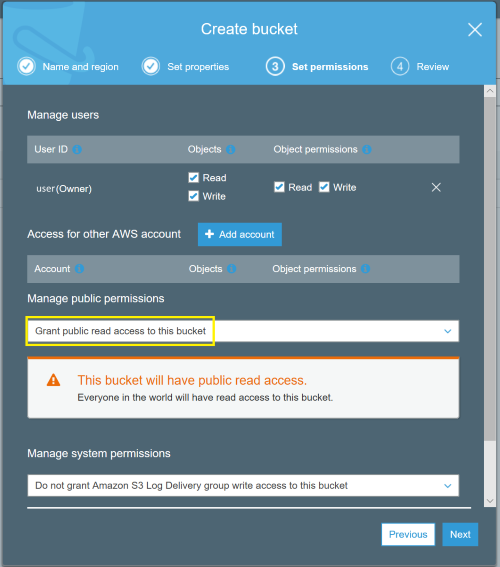
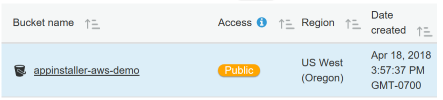
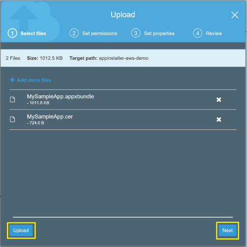
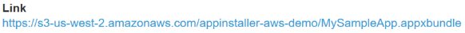

# Hosting UWP app packages on AWS for web install

The App Installer app allows developers and IT Pros to distribute Windows 10 apps by hosting them on their own Content Delivery Network (CDN). This is useful for enterprises that don't want or need to publish their apps to the Microsoft Store, but still want to take advantage of the Windows 10 packaging and deployment platform.

This topic outlines the steps to configure an Amazon Web Services (AWS) website to host UWP app packages, and how to use the App Installer app to install the app packages.

## Setup

To successfully follow this tutorial, you will need the following:
 
1. AWS subscription 
2. Web page
3. UWP app package - The app package that you will distribute

Optional: [Starter Project](https://github.com/AppInstaller/MySampleWebApp) on GitHub. This is helpful if you don't an app package or web page to work with, but would still like to learn how to use this feature.

This tutorial will go over how to setup a web page and host packages on AWS. This will require an AWS subscription. Depending on the scale of your operation, you can use their free membership to follow this tutorial. 

## Step 1 - AWS membership
To get an AWS membership, visit the [AWS account details page](https://aws.amazon.com/free/). For the purposes of this tutorial, you can use a free membership.

## Step 2 - Create an Amazon S3 bucket

Amazon Simple Storage Service (S3) is an AWS offering for collecting, storing and analyzing data. S3 buckets are a convenient way to host UWP app packages and web pages for distribution. 

After logging in to AWS with your credentials, under `Services` find `S3`. 

Select **Create bucket**, and enter a **Bucket name** for your website. Follow the dialog prompts for setting properties and permissions. To ensure that your UWP app can be distributed from your website, enable **Read** and **Write** permissions for your bucket and select **Grant public read access to this bucket**.

 

Review the summary to make sure the selected options are reflected. Click **Create bucket** to finish this step. 

## Step 3 - Upload UWP app package and web pages to an S3 bucket

One you have created an Amazon S3 bucket, you will be able to see it in your Amazon S3 view. Here's an example of what our demo bucket looks like:



We are now ready to upload the app packages and web pages that we would like to host in our Amazon S3 bucket. 

Click on the newly created bucket to upload content. The bucket is currently empty since nothing has been uploaded yet. Click the **Upload** button and select the app packages and web page files that you like to upload.

> [!NOTE]
> You can use the app package that is part of the provided [Starter Project](https://github.com/AppInstaller/MySampleWebApp) repository on GitHub if you don't have an app package available. The certificate (MySampleApp.cer) that the package was signed with is also with the sample on GitHub. You must have the certificate installed to your device prior to installing the app.



Similar to the permissions for creating an Amazon S3 bucket, the content in the bucket must also have **read**, **write**, and **Grant public read access to this object(s)** permissions.

If you would like to test uploading a web page, but don't have one, you can use the sample html page (default.html) from the [Starter Project](https://github.com/AppInstaller/MySampleWebApp/blob/master/MySampleWebApp/default.html).

> [!IMPORTANT]
> Before you upload the web page, confirm that the app package reference in your web page is correct. 

To get the app package reference, upload the app package first and copy the app package URL. Edit the html web page to reflect the correct app package path. See the code example for more details. 

Select the uploaded app package file to get the reference link to the app package, it should be similar to this example:



**Copy** the link to the app package and add the reference in your web page. 

```html
<html>
    <head>
        <meta charset="utf-8" />
        <title> Install My Sample App</title>
    </head>
    <body>
        <a href="ms-appinstaller:?source=https://s3-us-west-2.amazonaws.com/appinstaller-aws-demo/MySampleApp.appxbundle"> Install My Sample App</a>
    </body>
</html>
```
Upload the html file to your Amazon S3 bucket. Remember to set the permissions to allow **read** and **write** access.

## Step 4 - Test

Once the web page is uploaded into your Amazon S3 bucket, get the link to the web page by selecting the uploaded html file.

Use the link to open the web page. Since we set permissions to grant public access to the app package and web page, anyone with the link to the web page will be able to access it and install your UWP app packages using App Installer. Note that App Installer is part of the Windows 10 platform. As a developer, you do not need to add any additional code or features to your app to enable the use of App Installer. 

## Troubleshooting

### App Installer fails to install 

App installation will fail if the certificate that the app package is signed with isn't installed on the device. To fix this, you will need to install the certificate prior to the installation of the app. If you are hosting an app package for public distribution, it's recommended to sign your app package with a certificate from a certificate authority. 


