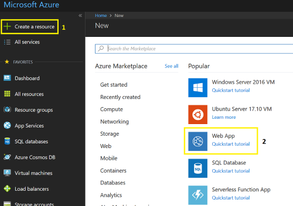
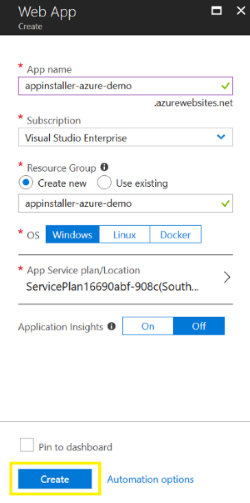
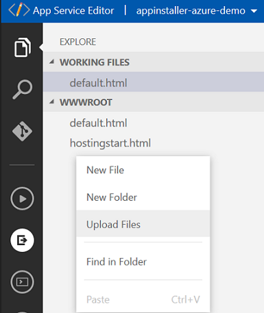
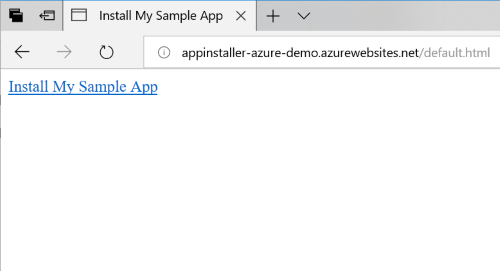
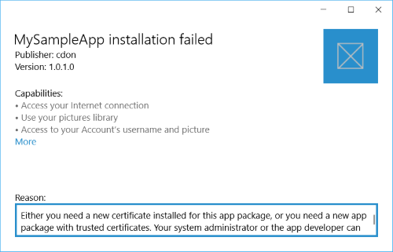

# Install a UWP app from an Azure Web App

The App Installer app allows developers and IT Pros to distribute Windows 10 apps by hosting them on their own Content Delivery Network (CDN). This is useful for enterprises that don't want or need to publish their apps to the Microsoft Store, but still want to take advantage of the Windows 10 packaging and deployment platform.

This topic outlines the steps to configure an Azure Web Server to host UWP app packages, and how to use the App Installer app to install the app packages.

In this tutorial, we will go over setting up an IIS server to locally verify that your web application can properly host the app packages and invoke and use App Installer app effectively. We will also have tutorials for hosting your web applications properly on the popular cloud web services in the field (Azure and AWS) to ensure that they meets the App Installer web install requirements. This step-by-step tutorial doesn't require any expertise and is very easy to follow. 

## Setup

To successfully follow this tutorial, you will need the following:
 
1. Microsoft Azure subscription 
2. UWP app package - The app package that you will distribute

Optional: [Starter Project](https://github.com/AppInstaller/MySampleWebApp) on GitHub. This is helpful if you don't an app package or web page to work with, but would still like to learn how to use this feature.

### Step 1 - Get an Azure subscription
To get an Azure subscription, visit the [Azure account page](https://azure.microsoft.com/free/). For the purposes of this tutorial, you can use a free membership.

### Step 2 - Create an Azure Web App 
In the Azure portal page, click the **+ Create a Resource** button and then select **Web App**



Create a unique **App name** and leave the rest of the fields as default. Click **Create** to finish the Web App creation wizard. 



### Step 3 - Hosting the app package and the web page 
Once the web app had been created, you can access it from the dashboard on the Azure portal. In this step, we're going to create a simple web page with the GUI of the Azure portal.

After selecting the newly created web app from the dashboard, use the search field to find and open **App Service Editor**. 

In the editor, there is a default `hostingstart.html` file. Right-click in the empty space of file explorer panel and select **Upload Files** to begin uploading your app packages.

> [!NOTE]
> You can use the app package that is part of the provided [Starter Project](https://github.com/AppInstaller/MySampleWebApp) repository on GitHub if you don't have an app package available. The certificate (MySampleApp.cer) that the package was signed with is also with the sample on GitHub. You must have the certificate installed to your device prior to installing the app.



Right-click in the empty space of file explorer panel and select **New Files** to create a new file. Name the file: `default.html`.

If you're using the app package provided in the [Starter Project](https://github.com/AppInstaller/MySampleWebApp), copy the following HTML code to the newly create web page `default.html`. If you're using your own app package, modify the app service URL (the URL after `source=`). You can get the app service URL from your app's overview page in the Azure portal.

```html
<html>
<head>
    <meta charset="utf-8" />
    <title> Install My Sample App</title>
</head>
<body>
    <a href="ms-appinstaller:?source=https://appinstaller-azure-demo.azurewebsites.net/MySampleApp.appxbundle"> Install My Sample App</a>
</body>
</html>
```

### Step 4 - Configure the web app for app package MIME types

Add a new file to the web app named: `Web.config`. Open the `Web.config` file from the explorer and add the following lines. 

```xml
<?xml version="1.0" encoding="utf-8"?>
<configuration>
  <system.webServer>
    <!--This is to allow the web server to serve resources with the appx/appxbundle/appinstaller extension-->
    <staticContent>
      <mimeMap fileExtension=".appx" mimeType="application/appx" />
      <mimeMap fileExtension=".appxbundle" mimeType="application/appxbundle" />
      <mimeMap fileExtension=".appinstaller" mimeType="application/appinstaller" />
    </staticContent>
  </system.webServer>
</configuration>
```

### Step 5 - Run and test

To launch the web page that you created, use the URL from step 3 into the browser followed by `/default.html`. 



Click "Install My Sample App" to launch App Installer and install your app package. 

## Troubleshooting Issues

### App Installer app fails to install 
App install will fail if the certificate that the app package is signed with isn't installed on the device. To fix this, you will need to install the certificate prior to the installation of the app. If you are hosting an app package for public distribution, we recommended signing your app package with a certificate from a certificate authority. 



### Nothing happens when you click the link 
Ensure that the App Installer app is installed. Go to **Settings** -> **Apps & Features** and find App Installer in the installed apps list. 

