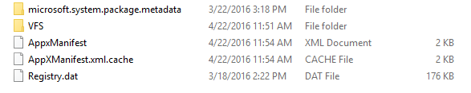
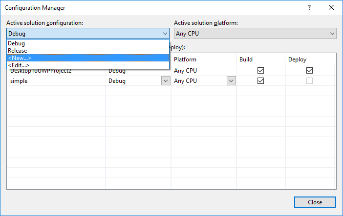
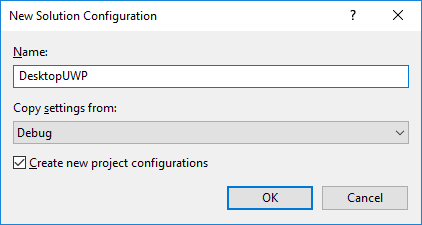

---
author: awkoren
Description: Deploy and debug a Universal Windows Platform (UWP) app converted from a Windows desktop application (Win32, WPF, and Windows Forms) by using the Desktop to UWP Bridge.
Search.Product: eADQiWindows 10XVcnh
title: Debug apps converted with the Desktop Bridge
ms.author: alkoren
ms.date: 02/08/2017
ms.topic: article
ms.prod: windows
ms.technology: uwp
keywords: windows 10, uwp
---

# Debug apps converted with the Desktop Bridge

This topic contains info to help you be successful debugging your app after converting it with the Desktop to UWP Bridge. You have a few options for debugging your converted app.

## Attach to process

When Microsoft Visual Studio is running "as administrator", the *Start Debugging* and *Start Without * commands will work for a converted app's project, but the launched app will run with [medium integrity level](https://msdn.microsoft.com/library/bb625963) (that is, it will not have elevated privileges). To confer administrator privileges onto the launched app, first you need to launch the "as administrator" via a shortcut or a tile. Once the app is running, from an instance of Microsoft Visual Studio running "as administrator", invoke the __Attach to Process__ and select your app's process from the dialog.

## F5 debug

Visual Studio now supports a new packaging project. The new project enables you to automatically copy any updates when you build your application into the Appx package created from the converter on your application's installer. Once you configure the packaging project you can now also use F5 to debug directly into the AppX package. 

>Note: You can also use the option to debug an existing Appx package, using the option Debug -> Other Debug Targets -> Debug Installed App Package.

Here's how to get started: 

1. First, ensure you're set up to use the Desktop App Converter. For instructions, see [Desktop App Converter](desktop-to-uwp-run-desktop-app-converter.md).

2. Run the converter and then installer for your Win32 application. The converter captures the layout, and any changes made to the registry and outputs an Appx with manifest and registery.dat to virtualize the registry:



3. Install and launch [Visual Studio 2017 RC](https://www.visualstudio.com/downloads/#visual-studio-community-2017-rc). 

4. Install the Desktop to UWP Packaging VSIX project from the [Visual Studio Gallery](http://go.microsoft.com/fwlink/?LinkId=797871). 

5. Open the corresponding Win32 solution that was converted in Visual Studio.
 
6. Add the new packaging project to your solution by right clicking on the solution and choosing "Add New Project". Then pick the Desktop to UWP Packaging Project under Setup and Deployment:

	

	The resulting project will be added to your solution:

	

	In the Packaging project, the AppXFileList provides a mapping of files into the AppX layout. References begins empty, but should be manually set to the .exe project for build ordering. 

7. The DesktopToUWPPackaging project has a property page which allows you to configure the AppX package root and which tile to execute:

	

	Set the PackageLayout to the root location of the AppX that was created by the converter (above). Then pick which tile to execute.

8.	Open and edit the AppXFileList.xml. This file defines how to copy the output of the Win32 debug build into the AppX layout  the converter built. By default, we have a placeholder in the file with an example tag and comment:

	```XML
	<?xml version="1.0" encoding="utf-8"?>
	<Project ToolsVersion="4.0" xmlns="http://schemas.microsoft.com/developer/msbuild/2003">
	  <ItemGroup>
	<!— Use the following syntax to copy debug output to the AppX layout
	   <AppxPackagedFile Include="$(outdir)\App.exe">
		  <PackagePath>App.exe</PackagePath>
		</AppxPackagedFile> 
		See http://etc...
	-->
	  </ItemGroup>
	</Project>
	```

	Below is an example of creating the mapping. In this case, we copy the .exe and .dll from the Win32 build location into the package layout location. 

	```XML
	<?xml version="1.0" encoding=utf-8"?>
	<Project ToolsVersion=14.0" xmlns="http://scehmas.microsoft.com/developer/msbuild/2003">
		<PropertyGroup>
			<MyProjectOutputPath>{relativepath}</MyProjectOutputPath>
		</PropertyGroup>
		<ItemGroup>
			<LayoutFile Include="$(MyProjectOutputPath)\ProjectTracker.exe">
				<PackagePath>$(PackageLayout)\VFS\Program Files (x86)\Contoso Software\Project Tracker\ProjectTracker.exe</PackagePath>
			</LayoutFile>
			<LayoutFile Include="$(MyProjectOutputPath)\ProjectTracker.Models.dll">
				<PackagePath>$(PackageLayout)\VFS\Program Files (x86)\Contoso Software\Project Tracker\ProjectTracker.Models.dll</PackagePath>
			</LayoutFile>
		</ItemGroup>
	</Project>
	```

	The file is defined as follows: 

	First, we define *MyProjectOutputPath* to point at the location where the Win32 project is building to:

	```XML
	<?xml version="1.0" encoding="utf-8"?>
	<Project ToolsVersion="14.0" xmlns="http://schemas.microsoft.com/developer/msbuild/2003">
		<PropertyGroup>
			<MyProjectOutputPath>..\ProjectTracker\bin\DesktopUWP</MyProjectOutputPath>
		</PropertyGroup>
	```

	Then, each *LayoutFile* specifies a file to copy from the Win32 build location to the Appx Package layout. In this case first a .exe, then a .dll are copied. 

	```XML
		<ItemGroup>
			<LayoutFile Include="$(MyProjectOutputPath)\ProjectTracker.exe">
				<PackagePath>$(PackageLayout)\VFS\Program Files (x86)\Contoso Software\Project Tracker\ProjectTracker.exe</PackagePath>
			</LayoutFile>
			<LayoutFile Include="$(MyProjectOutputPath)\ProjectTracker.Models.dll">
				<PackagePath>$(PackageLayout)\VFS\Program Files (x86)\Contoso Software\Project Tracker\ProjectTracker.Models.dll</PackagePath>
			</LayoutFile>
		</ItemGroup>
	</Project>
	```

9. Set the packaging project the start-up project. This will copy the Win32 files into the AppX and then launch the debugger when the project is built and run.  

	

10.	Finally, you can now set a breakpoint in the Win32 code and hit F5 to launch the debugger. It will copy any updates you have made to your Win32 application across to the AppX package and allow you to debug directly from within Visual Studio.

11.	If you update your application, you'll need to use MakeAppX to repackage your app again. For more information, see [App packager (MakeAppx.exe)](https://msdn.microsoft.com/library/windows/desktop/hh446767(v=vs.85).aspx). 

If you have multiple build configurations (for instance for release and debug), you can add the following to the AppXFileList.xml file to copy the Win32 build from different locations:

```XML
<PropertyGroup>
	<MyProjectOutputPath Condition="$(Configuration) == 'DesktopUWP'">C:\Users\peterfar\Desktop\ProjectTracker\ProjectTracker\bin\DesktopUWP>
	</MyProjectOutputPath>
	<MyProjectOutputPath Condition="$(Configuration) == 'ReleaseDesktopUWP'"> C:\Users\peterfar\Desktop\ProjectTracker\ProjectTracker\bin\ReleaseDesktopUWP</MyProjectOutputPath>
</PropertyGroup>
```

You can also use conditional compilation to enable particular code paths if you update your application to UWP but also still want to build it for Win32. 

1.	In the example below the code will only be compiled for DesktopUWP and will show a tile using the WinRT API. 

	```C#
	[Conditional("DesktopUWP")]
	private void showtile()
	{
		XmlDocument tileXml = TileUpdateManager.GetTemplateContent(TileTemplateType.TileSquare150x150Text01);
		XmlNodeList textNodes = tileXml.GetElementsByTagName("text");
		textNodes[0].InnerText = string.Format("Welcome to DesktopUWP!");
		TileNotification tileNotification = new TileNotification(tileXml);
		TileUpdateManager.CreateTileUpdaterForApplication().Update(tileNotification);
	}
	```

2.	You can use Configuration Manager to add the new build configuration:

	

	

3.	Then under the project properties add support for conditional compilation symbols:

	

4.	You can now toggle the build target to DesktopUWP if you want to build to target the UWP API you added.

## PLMDebug 

Visual Studio F5 and Attach to Process are useful for debugging your app while it runs. In some cases, however, you may want finer-grained control over the debugging process, including the ability to debug your app before it starts. In these more advanced scenarios, use [**PLMDebug**](https://msdn.microsoft.com/library/windows/hardware/jj680085(v=vs.85).aspx). This tool allows you to debug your converted app using the Windows debugger and offers full control over app lifecycle including suspending, resuming, and termination. 

PLMDebug is included with the Windows SDK. For more information, see [**PLMDebug**](https://msdn.microsoft.com/library/windows/hardware/jj680085(v=vs.85).aspx). 

## Run another process inside the full trust container 

You can invoke custom processes inside the container of a specified app package. This can be useful for testing scenarios (for example, if you have a custom test harness and want to test output of the app). To do so, use the ```Invoke-CommandInDesktopPackage``` PowerShell cmdlet: 

```CMD
Invoke-CommandInDesktopPackage [-PackageFamilyName] <string> [-AppId] <string> [-Command] <string> [[-Args]
    <string>]  [<CommonParameters>]
```
