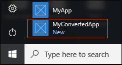
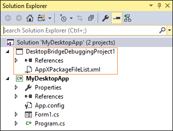
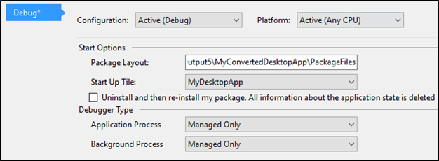
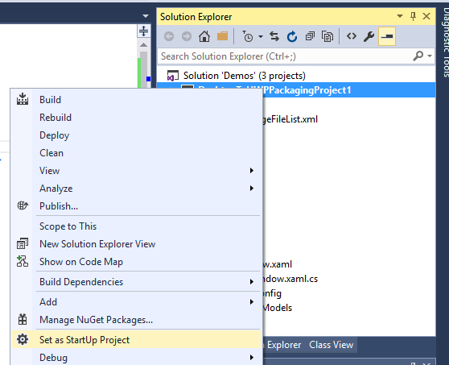
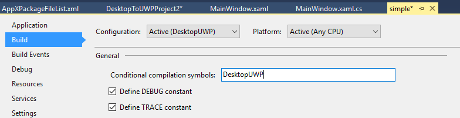

# Run, debug, and test a packaged desktop app (Desktop Bridge)

Run your packaged app and see how it looks without having to sign it. Then, set breakpoints and step through code. When you're ready to test your app in a production environment, sign your app and then install it. This topic shows you how to do each of these things.

<span id="run-app" />
## Run your app

You can run your app to test it out locally without having to obtain a certificate and sign it.

If you created your package by using a UWP project in Visual Studio, just press CTRL+F5 to start your app.

If you used the Desktop App Converter or you package your app manually, open a Windows PowerShell command prompt, and from the **PacakgeFiles** subfolder of your output folder, run this cmdlet:

```
Add-AppxPackage –Register AppxManifest.xml
```
To start your app, find it in the Windows Start menu.



> [!NOTE]
> A packaged app always runs as an interactive user, and any drive that you install your packaged app on to must be formatted to NTFS format.

## Debug your app

Select your package in a dialog box each time that you debug your app or install an extension and debug your app without having to select your package each time that you start the session.

### Debug your app by selecting the package

This option has the least amount of setup time, but requires you to perform an extra step each time you want to start the debug session.


1. Make sure that you start your packaged app at least one time so that it's installed on your local machine.

   See the [Run your app](#run-app) section above.

2. Start Visual Studio.

   If you want to debug your app with elevated permissions, start Visual Studio by using the **Run as Administrator** option.

3. In Visual Studio, choose **Debug**->**Other Debug Targets**->**Debug Installed App Package**.

4. In the **Installed App Packages** list, select your app package, and then choose the **Start** button.


### Debug your app without having to select the package

This option has the most amount of setup time, but you won't have to select the installed package every time you start your app. You'll need to install
[Visual Studio 2017](https://www.visualstudio.com/vs/whatsnew/) to use this approach.

1. First, install the [Desktop Bridge Debugging Project](http://go.microsoft.com/fwlink/?LinkId=797871).

2. Start Visual Studio, and open the desktop application project.

6. Add a **Desktop Bridge Debugging** project to your solution.

   You can find the project template in the **Other Project Types** group of installed templates.

	

	The **Desktop Bridge Debugging** project will appear in your solution.

	

7. Open the property pages of the **Desktop Bridge Debugging** project.

8. Set the **Package Layout** field to the location of your package manifest file (AppxManifest.xml), and choose your app's executable file from the **Start Up Tile** drop-down list.

	 

8. Open the AppXPackageFileList.xml file in the code editor.

9. Uncomment the block of XML and add values for these elements:

   **MyProjectOutputPath**: The relative path to debug folder of your desktop application.

   **LayoutFile**: The executable that is in the debug folder of your desktop application.

   **PackagePath**: The fully qualified file name of your desktop application's executable that was copied to your Windows app package folder during the conversion process.

	Here's an example:

	```XML
  <?xml version="1.0" encoding="utf-8"?>
  <Project ToolsVersion="14.0" xmlns="http://schemas.microsoft.com/developer/msbuild/2003">
    <PropertyGroup>
     <MyProjectOutputPath>..\MyDesktopApp\bin\Debug</MyProjectOutputPath>
    </PropertyGroup>
    <ItemGroup>
      <LayoutFile Include="$(MyProjectOutputPath)\MyDesktopApp.exe">
        <PackagePath>$(PackageLayout)\MyDesktopApp.exe</PackagePath>
      </LayoutFile>
    </ItemGroup>
  </Project>
	```

  If your app consumes dll files that are generated from other projects in your solution, and you want to step into the code that is contained in those dlls, include a **LayoutFile** element for each of those dll files.

  ```XML
  ...
      <LayoutFile Include="$(MyProjectOutputPath)\MyDesktopApp.Models.dll">
      <PackagePath>$(PackageLayout)\MyDesktopApp.Models.dll</PackagePath>
      </LayoutFile>
  ...
  ```

10. Set the packaging project the start-up project.  

	

11.	Set breakpoints in your desktop application code, and then start the debugger.

  

  Visual Studio copies the executables and dll files that you specified in the XML file to your Windows app package and then start the debugger.

#### Handle multiple build configurations

If you've defined multiple build configurations (for example: Release and Debug), you can modify your AppXPackageFileList.xml file to copy only those files that match the build configuration that choose in Visual Studio when you start the debugger.

Here's an example.

```XML
<PropertyGroup>
	<MyProjectOutputPath Condition="$(Configuration) == 'Debug'">..\MyDesktopApp\bin\Debug</MyProjectOutputPath>
	<MyProjectOutputPath Condition="$(Configuration) == 'Release'"> ..\MyDesktopApp\bin\Release</MyProjectOutputPath>
</PropertyGroup>
```

#### Debug UWP enhancements to your app
You might want to enhance your app with modern experiences such as live tiles. If you do, you can use conditional compilation to enable code paths with specific build configurations.

1. First, in Visual Studio, define a build configuration and give it a name like "DesktopUWP".

2. In the **Build** tab of the project properties of your project, add that name in the **Conditional compilation symbols** field.

	 

3. Add conditional code blocks. This code compiles only for the **DesktopUWP** build configuration.

	```csharp
	[Conditional("DesktopUWP")]
	private void showtile()
	{
		XmlDocument tileXml = TileUpdateManager.GetTemplateContent(TileTemplateType.TileSquare150x150Text01);
		XmlNodeList textNodes = tileXml.GetElementsByTagName("text");
		textNodes[0].InnerText = string.Format("Welcome to DesktopUWP!");
		TileNotification tileNotification = new TileNotification(tileXml);
		TileUpdateManager.CreateTileUpdaterForApplication().Update(tileNotification);
	}
	```

### Debug the entire app lifecycle

In some cases, you might want finer-grained control over the debugging process, including the ability to debug your app before it starts.

You can use [PLMDebug](https://msdn.microsoft.com/library/windows/hardware/jj680085(v=vs.85).aspx) to get full control over app lifecycle including suspending, resuming, and termination.

[PLMDebug](https://msdn.microsoft.com/library/windows/hardware/jj680085(v=vs.85).aspx) is included with the Windows SDK.


### Modify your app in between debug sessions

If you make your changes to your app to fix bugs, repackage it by using the MakeAppx tool. See [Run the MakeAppx tool](desktop-to-uwp-manual-conversion.md#make-appx).

## Test your app

To test your app in a realistic setting as you prepare for distribution, it's best to sign your app and then install it.

If you packaged you app by using Visual Studio, you can run a script to sign your app and then install it. See [Sideload your package](../packaging/packaging-uwp-apps.md#sideload-your-app-package).

If you package your app by using the Desktop App Converter, you can use the ``sign`` parameter to automatically sign your app by using a generated certificate. You'll have to install that certificate, and then install the app. See [Run the packaged app](desktop-to-uwp-run-desktop-app-converter.md#run-app).   

You can also sign your app manually. Here's how

1. Create a certificate. See [Create a certificate](../packaging/create-certificate-package-signing.md).

2. Install that certificate into the **Trusted Root** or **Trusted People** certificate store on your system.

3. Sign your app by using that certificate, see [Sign an app package using SignTool](../packaging/sign-app-package-using-signtool.md).

  > [!IMPORTANT]
  > Make sure that the publisher name on your certificate matches the publisher name of your app.

### Test your app for Windows 10 S

Before you publish your app, make sure that it will operate correctly on devices that run Windows 10 S.

See [Test your Windows app for Windows 10 S](https://docs.microsoft.com/windows/uwp/porting/desktop-to-uwp-test-windows-s).

### Run another process inside the full trust container

You can invoke custom processes inside the container of a specified app package. This can be useful for testing scenarios (for example, if you have a custom test harness and want to test output of the app). To do so, use the ```Invoke-CommandInDesktopPackage``` PowerShell cmdlet:

```CMD
Invoke-CommandInDesktopPackage [-PackageFamilyName] <string> [-AppId] <string> [-Command] <string> [[-Args]
    <string>]  [<CommonParameters>]
```

## Next steps

**Find answers to specific questions**

Our team monitors these [StackOverflow tags](http://stackoverflow.com/questions/tagged/project-centennial+or+desktop-bridge).

**Give feedback about this article**

Use the comments section below.
