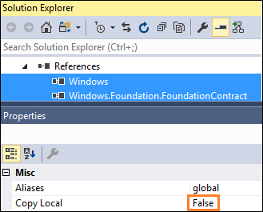
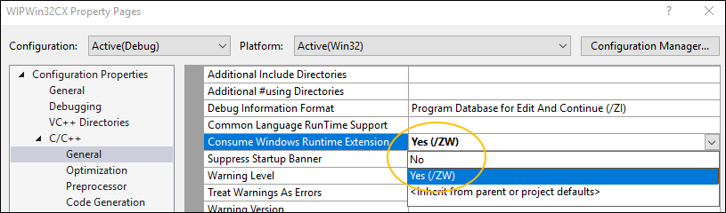
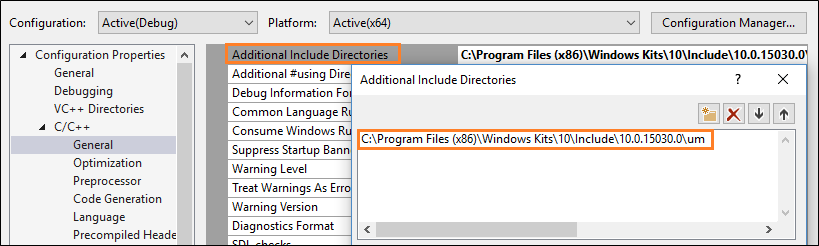
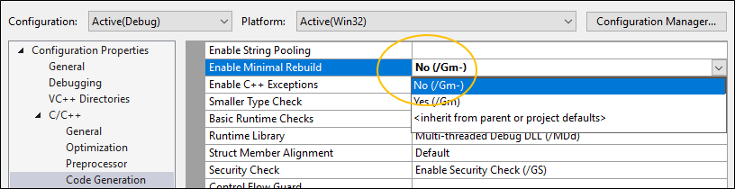
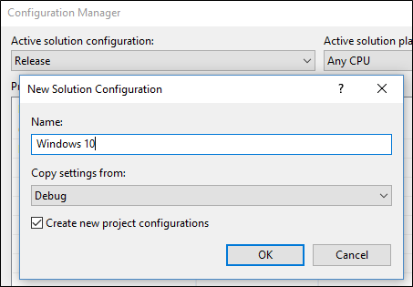

# Enhance your desktop application for Windows 10

You can use UWP APIs to add modern experiences that light up for Windows 10 users.

First, set up your project. Then, add Windows 10 experiences. You can build separately for Windows 10 users or distribute the same exact binaries to all users regardless of which version of Windows they run.

## First, set up your project

You'll have to make a few changes to your project to use UWP APIs.

### Modify a .NET project to use UWP APIs

Open the **Reference Manager** dialog box, choose the **Browse** button, and then select  **All Files**.


Then, add a reference to these files.

|File|Location|
|--|--|
|System.Runtime.WindowsRuntime|C:\Program Files (x86)\Reference Assemblies\Microsoft\Framework\\.NETCore\v4.5|
|System.Runtime.WindowsRuntime.UI.Xaml|C:\Program Files (x86)\Reference Assemblies\Microsoft\Framework\\.NETCore\v4.5|
|System.Runtime.InteropServices.WindowsRuntime|C:\Program Files (x86)\Reference Assemblies\Microsoft\Framework\\.NETCore\v4.5|
|Windows.winmd|C:\Program Files (x86)\Windows Kits\10\UnionMetadata\Facade|
|Windows.Foundation.UniversalApiContract.winmd|C:\Program Files (x86)\Windows Kits\10\References\<*sdk version*>\Windows.Foundation.UniversalApiContract\<*version*>|
|Windows.Foundation.FoundationContract.winmd|C:\Program Files (x86)\Windows Kits\10\References\<*sdk version*>\Windows.Foundation.FoundationContract\<*version*>|

In the **Properties** window, set the **Copy Local** field of each *.winmd* file to **False**.



### Modify a C++ project to use UWP APIs

Open the property pages of your project.

In the **General** settings of the **C/C++** settings group, set the **Consume Windows Runtime Extension** field to **Yes(/ZW)**.

   

Open the **Additional #using Directories** dialog box, and add these directories.

* %VSInstallDir%\Common7\IDE\VC\vcpackages
* C:\Program Files (x86)\Windows Kits\10\UnionMetadata
* C:\Program Files (x86)\Windows Kits\10\References\Windows.Foundation.UniversalApiContract\<*latest version*>
* C:\Program Files (x86)\Windows Kits\10\References\Windows.Foundation.FoundationContract\<*latest version*>

Open the **Additional Include Directories** dialog box, and add this directory: C:\Program Files (x86)\Windows Kits\10\Include\<*latest version*>\um



In the **Code Generation** settings of the **C/C++** settings group, set the **Enable Minimal Rebuild** setting to **No(/GM-)**.




## Add Windows 10 experiences

Now you're ready to add modern experiences that light up when users run your application on Windows 10. Use this design flow.

:white_check_mark: **First, decide what experiences you want to add**

There's lots to choose from. For example, you can simplify your purchase order flow by using monetization APIs, or direct attention to your app when you have something interesting to share, such as a new picture that another user has posted.


Even if users ignore or dismiss your message, they can see it again in the action center, and then click on the message to open your app. This increases engagement with your app and has the added bonus of making your app appear deeply integrated with the operating system. We'll show you the code for that experience a bit later.

Visit our [developer center](https://developer.microsoft.com/windows) for ideas.

:white_check_mark: **Decide whether to enhance or extend**

You'll often hear us use the terms "enhance" and "extend" so we'll take a moment to explain exactly what each of these terms mean.

We use the term "enhance" to describe UWP APIs that you can call directly from your desktop application. When you've chosen a Windows 10 experience, identify the APIs that you need to create it, and then see if that API appears in this [list](desktop-to-uwp-supported-api.md). This is a list of APIs that you can call directly from your desktop application. If your API does not appear in this list, that's because the functionality associated with that API can run only within a UWP process. Often times, these include APIs that show modern UIs such as a UWP map control or a Windows Hello security prompt.

That said, if you want to include those experiences in your application, just "extend" the application by adding a UWP project to your solution. The desktop project is still the entry point of your application, but the UWP project gives you access to all of the APIs that do not appear in this [list](desktop-to-uwp-supported-api.md). The desktop application can communicate with the UWP process by using a an app service and we have lots of guidance on how to set that up. If you want to add an experience that requires a UWP project, see [Extend with UWP](desktop-to-uwp-extend.md).

:white_check_mark: **Reference API contracts**

If you can call the API directly from your desktop application, open a browser and search for the reference topic for that API.
Beneath the summary of the API, you'll find a table that describes the API contract for that API. Here's an example of that table:


If you have a .NET-based desktop app, add a reference to that API contract, and then set the **Copy Local** property of that file to **False**. If you have a C++-based project, add to your **Additional Include Directories**, a path to the folder that contains this contract.

:white_check_mark: **Call the APIs to add your experience**

Here's the code that you'd use to show the notification window that we looked at earlier. These APIs appear in this [list](desktop-to-uwp-supported-api.md) so you can add this code to your desktop application and run it right now.

```csharp
using Windows.Foundation;
using Windows.System;
using Windows.UI.Notifications;
using Windows.Data.Xml.Dom;
...

private void ShowToast()
{
    string title = "featured picture of the day";
    string content = "beautiful scenery";
    string image = "https://picsum.photos/360/180?image=104";
    string logo = "https://picsum.photos/64?image=883";

    string xmlString =
    $@"<toast><visual>
       <binding template='ToastGeneric'>
       <text>{title}</text>
       <text>{content}</text>
       <image src='{image}'/>
       <image src='{logo}' placement='appLogoOverride' hint-crop='circle'/>
       </binding>
      </visual></toast>";

    XmlDocument toastXml = new XmlDocument();
    toastXml.LoadXml(xmlString);

    ToastNotification toast = new ToastNotification(toastXml);

    ToastNotificationManager.CreateToastNotifier().Show(toast);
}
```

```C++
using namespace Windows::Foundation;
using namespace Windows::System;
using namespace Windows::UI::Notifications;
using namespace Windows::Data::Xml::Dom;

void UWP::ShowToast()
{
	Platform::String ^title = "featured picture of the day";
	Platform::String ^content = "beautiful scenery";
	Platform::String ^image = "https://picsum.photos/360/180?image=104";
	Platform::String ^logo = "https://picsum.photos/64?image=883";

	Platform::String ^xmlString =
		L"<toast><visual><binding template='ToastGeneric'>" +
		L"<text>" + title + "</text>" +
		L"<text>"+ content + "</text>" +
		L"<image src='" + image + "'/>" +
		L"<image src='" + logo + "'" +
		L" placement='appLogoOverride' hint-crop='circle'/>" +
		L"</binding></visual></toast>";

	XmlDocument ^toastXml = ref new XmlDocument();

	toastXml->LoadXml(xmlString);

	ToastNotificationManager::CreateToastNotifier()->Show(ref new ToastNotification(toastXml));
}
```
To learn more about notifications, see [Adaptive and Interactive toast notifications](https://docs.microsoft.com/windows/uwp/design/shell/tiles-and-notifications/adaptive-interactive-toasts).

## Support Windows XP, Windows Vista, and Windows 7/8 install bases

You can modernize your app for Windows 10 without having to create a new branch and maintain separate code bases.

If you want to build separate binaries for Windows 10 users, use conditional compilation. If you'd prefer to build one set of binaries that you deploy to all Windows users, use runtime checks.

Let's take a quick look at each option.

### Conditional compilation

You can keep one code base and compile a set of binaries just for Windows 10 users.

First, add a new build configuration to your project.



For that build configuration, create a constant that to identify code that calls UWP APIs.  

For .NET-based projects, the constant is called a **Conditional Compilation Constant**.


For C++-based projects, the constant is called a **Preprocessor Definition**.


Add that constant before any block of UWP code.

```csharp

[System.Diagnostics.Conditional("_UWP")]
private void ShowToast()
{
 ...
}

```

```C++

#if _UWP
void UWP::ShowToast()
{
 ...
}
#endif

```

The compiler builds that code only if that constant is defined in your active build configuration.

### Runtime checks

You can compile one set of binaries for all of your Windows users regardless of which version of Windows they run. Your app calls UWP APIs only if the user is runs your app as a packaged app on Windows 10.

The easiest way to add runtime checks to your code is to install this Nuget package: [Desktop Bridge Helpers](https://www.nuget.org/packages/DesktopBridge.Helpers/) and then use the ``IsRunningAsUWP()`` method to gate off all UWP code. see this blog post for more details: [Desktop Bridge - Identify the application's context](https://blogs.msdn.microsoft.com/appconsult/2016/11/03/desktop-bridge-identify-the-applications-context/).

## Related Video

<iframe src="https://mva.microsoft.com/en-US/training-courses-embed/developers-guide-to-the-desktop-bridge-17373/Demo-Use-UWP-APIs-in-Your-Code-3d78c6WhD_9506218965" width="636" height="480" allowFullScreen frameBorder="0"></iframe>

## Related Samples

* [Hello World Sample](https://github.com/Microsoft/DesktopBridgeToUWP-Samples/tree/master/Samples/HelloWorldSample)
* [Secondary Tile](https://github.com/Microsoft/DesktopBridgeToUWP-Samples/tree/master/Samples/SecondaryTileSample)
* [Store API Sample](https://github.com/Microsoft/DesktopBridgeToUWP-Samples/tree/master/Samples/StoreSample)
* [WinForms app that implements a UWP UpdateTask](https://github.com/Microsoft/DesktopBridgeToUWP-Samples/tree/master/Samples/WinFormsUpdateTaskSample)
* [Desktop app bridge to UWP Samples](https://github.com/Microsoft/DesktopBridgeToUWP-Samples)


## Support and feedback

**Find answers to your questions**

Have questions? Ask us on Stack Overflow. Our team monitors these [tags](http://stackoverflow.com/questions/tagged/project-centennial+or+desktop-bridge). You can also ask us [here](https://social.msdn.microsoft.com/Forums/en-US/home?filter=alltypes&sort=relevancedesc&searchTerm=%5BDesktop%20Converter%5D).

**Give feedback or make feature suggestions**

See [UserVoice](https://wpdev.uservoice.com/forums/110705-universal-windows-platform/category/161895-desktop-bridge-centennial).
