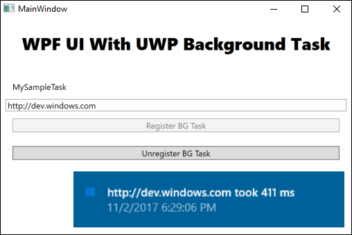

# Extend your desktop application with modern UWP components

Some Windows 10 experiences (For example: a touch-enabled UI page) must run inside of a modern app container . If you want to add these experiences, extend your desktop application with UWP projects and Windows Runtime Components.

In many cases you can call UWP APIs directly from your desktop application, so before you review this guide, see [Enhance for Windows 10](desktop-to-uwp-enhance.md).

>[!NOTE]
>This guide assumes that you've created a Windows app package for your desktop application by using the Desktop Bridge. If you haven't yet done this, see [Desktop Bridge](desktop-to-uwp-root.md).

If you're ready, let's start.

<a id="setup" />

## First, setup your Solution

Add one or more UWP projects and runtime components to your solution.

Start with a solution that contains a **Windows Application Packaging Project** with a reference to your desktop application.

This image shows an example solution.


If your solution doesn't contain a packaging project, see [Package your app by using Visual Studio](desktop-to-uwp-packaging-dot-net.md).

### Add a UWP project

Add a **Blank App (Universal Windows)** to your solution.

This is where you'll build a modern XAML UI or use APIs that run only within a UWP process.


In your packaging project, right-click the **Applications** node, and then click **Add Reference**.


Then, add a reference the UWP project.


Your solution will look something like this:


### (Optional) Add a Windows Runtime Component

To accomplish some scenarios, you'll have to add code to a Windows Runtime Component.


Then, from your UWP project, add a reference to the runtime component. Your solution will look something like this:


Let's take a look at a few things you can do with your UWP projects and runtime components.

## Show a modern XAML UI

As part of your application flow, you can incorporate modern XAML-based user interfaces into your desktop application. These user interfaces are naturally adaptive to different screen sizes and resolutions and support modern interactive models such as touch and ink.

For example, with a small amount of XAML markup, you can give users with powerful map-related visualization features.

This image shows a Windows Forms application that opens a XAML-based modern UI that contains a map control.


### The design pattern

To show a XAML-based UI, do these things:

:one: [Setup your Solution](#solution-setup)

:two: [Create a XAML UI](#xaml-UI)

:three: [Add a protocol extension to the UWP project](#protocol)

:four: [Start the UWP app from your desktop app](#start)

:five: [In the UWP project, show the page that you want](#parse)

<a id="solution-setup" />

### Setup your Solution

For general guidance on how to set your solution up, see the [First, setup your Solution](#setup) section at the beginning of this guide.

Your solution would look something like this:


In this example, the Windows Forms project is named **Landmarks** and the UWP project that contains the XAML UI is named **MapUI**.

<a id="xaml-UI" />

### Create a XAML UI

Add a XAML UI to your UWP project. Here's the XAML for a basic map.

```xml
<Grid Background="{ThemeResource ApplicationPageBackgroundThemeBrush}" Margin="12,20,12,14">
    <Grid.ColumnDefinitions>
        <ColumnDefinition Width="Auto"/>
        <ColumnDefinition Width="*"/>
    </Grid.ColumnDefinitions>
    <maps:MapControl x:Name="myMap" Grid.Column="0" Width="500" Height="500"
                     ZoomLevel="{Binding ElementName=zoomSlider,Path=Value, Mode=TwoWay}"
                     Heading="{Binding ElementName=headingSlider,Path=Value, Mode=TwoWay}"
                     DesiredPitch="{Binding ElementName=desiredPitchSlider,Path=Value, Mode=TwoWay}"    
                     HorizontalAlignment="Left"               
                     MapServiceToken="<Your Key Goes Here" />
    <Grid Grid.Column="1" Margin="12">
        <StackPanel>
            <Slider Minimum="1" Maximum="20" Header="ZoomLevel" Name="zoomSlider" Value="17.5"/>
            <Slider Minimum="0" Maximum="360" Header="Heading" Name="headingSlider" Value="0"/>
            <Slider Minimum="0" Maximum="64" Header=" DesiredPitch" Name="desiredPitchSlider" Value="32"/>
        </StackPanel>
    </Grid>
</Grid>
```

### Add a protocol extension

In **Solution Explorer**, open the **package.appxmanifest** file of the UWP project in your solution, and add this extension.

```xml
<Extensions>
  <uap:Extension Category="windows.protocol" Executable="MapUI.exe" EntryPoint="MapUI.App">
    <uap:Protocol Name="xamluidemo" />
  </uap:Extension>
</Extensions>    
```

Give the protocol a name, provide the name of the executable produced by the UWP project, and the name of the entry point class.

You can also open the **package.appxmanifest** in the designer, choose the **Declarations** tab, and then add the extension there.


> [!NOTE]
> Map controls download data from the internet so if you use one, you'll have to add the "internet client" capability to your manifest as well.

<a id="start" />

### Start the UWP app

First, from your desktop application, create a [Uri](https://msdn.microsoft.com/library/system.uri.aspx) that includes the protocol name and any parameters you want to pass into the UWP app. Then, call the [LaunchUriAsync](https://docs.microsoft.com/uwp/api/windows.system.launcher.launchuriasync) method.

```csharp

private void Statue_Of_Liberty_Click(object sender, EventArgs e)
{
    ShowMap(40.689247, -74.044502);
}

private async void ShowMap(double lat, double lon)
{
    string str = "xamluidemo://";

    Uri uri = new Uri(str + "location?lat=" +
        lat.ToString() + "&?lon=" + lon.ToString());

    var success = await Windows.System.Launcher.LaunchUriAsync(uri);

}
```

<a id="parse" />

### Parse parameters and show a page

In the **App** class of your UWP project, override the **OnActivated** event handler. If the app is activated by your protocol, parse the parameters and then open the page that you want.

```csharp
protected override void OnActivated(Windows.ApplicationModel.Activation.IActivatedEventArgs e)
{
    if (e.Kind == ActivationKind.Protocol)
    {
        ProtocolActivatedEventArgs protocolArgs = (ProtocolActivatedEventArgs)e;
        Uri uri = protocolArgs.Uri;
        if (uri.Scheme == "xamluidemo")
        {
            Frame rootFrame = new Frame();
            Window.Current.Content = rootFrame;
            rootFrame.Navigate(typeof(MainPage), uri.Query);
            Window.Current.Activate();
        }
    }
}
```

Override the ``OnNavigatedTo`` method to use the parameters passed into the page. In this case, we'll use the latitude and longitude that were passed into this page to show a location in a map.

```csharp
protected override void OnNavigatedTo(NavigationEventArgs e)
 {
     if (e.Parameter != null)
     {
         WwwFormUrlDecoder decoder = new WwwFormUrlDecoder(e.Parameter.ToString());

         double lat = Convert.ToDouble(decoder[0].Value);
         double lon = Convert.ToDouble(decoder[1].Value);

         BasicGeoposition pos = new BasicGeoposition();

         pos.Latitude = lat;
         pos.Longitude = lon;

         myMap.Center = new Geopoint(pos);

         myMap.Style = MapStyle.Aerial3D;

     }

     base.OnNavigatedTo(e);
 }
```

### Similar Samples

[Adding a UWP XAML user experience to VB6 Application](https://github.com/Microsoft/DesktopBridgeToUWP-Samples/tree/master/Samples/VB6withXaml)

[Northwind sample: End-to-end example for UWA UI & Win32 legacy code](https://github.com/Microsoft/DesktopBridgeToUWP-Samples/tree/master/Samples/NorthwindSample)

[Northwind sample: UWP app connecting to SQL Server](https://github.com/Microsoft/DesktopBridgeToUWP-Samples/tree/master/Samples/SQLServer)

## Provide services to other apps

You add a service that other apps can consume. For example, you can add a service that gives other apps controlled access to the database behind your app. By implementing a background task, apps can reach the service even if your desktop app is not running.

Here's a sample that does this.


### Have a closer look at this app

:heavy_check_mark: [Get the app](https://www.microsoft.com/en-us/store/p/winforms-appservice/9p7d9b6nk5tn)

:heavy_check_mark: [Browse the code](https://github.com/Microsoft/DesktopBridgeToUWP-Samples/tree/master/Samples/WinformsAppService)

### The design pattern

To show provide a service, do these things:

:one: [Implement the app service](#appservice)

:two: [Add an app service extension](#extension)

:three: [Test the app service](#test)

<a id="appservice" />

### Implement the app service

Here's where you'll validate and handle requests from other apps. Add this code to a Windows Runtime Component in your solution.

```csharp
public sealed class AppServiceTask : IBackgroundTask
{
    private BackgroundTaskDeferral backgroundTaskDeferral;
 
    public void Run(IBackgroundTaskInstance taskInstance)
    {
        this.backgroundTaskDeferral = taskInstance.GetDeferral();
        taskInstance.Canceled += OnTaskCanceled;
        var details = taskInstance.TriggerDetails as AppServiceTriggerDetails;
        details.AppServiceConnection.RequestReceived += OnRequestReceived;
    }
 
    private async void OnRequestReceived(AppServiceConnection sender,
                                         AppServiceRequestReceivedEventArgs args)
    {
        var messageDeferral = args.GetDeferral();
        ValueSet message = args.Request.Message;
        string id = message["ID"] as string;
        ValueSet returnData = DataBase.GetData(id);
        await args.Request.SendResponseAsync(returnData);
        messageDeferral.Complete();
    }
 
 
    private void OnTaskCanceled(IBackgroundTaskInstance sender,
                                BackgroundTaskCancellationReason reason)
    {
        if (this.backgroundTaskDeferral != null)
        {
            this.backgroundTaskDeferral.Complete();
        }
    }
}
```

<a id="extension" />

### Add an app service extension to the UWP project

Open the **package.appxmanifest** file of the UWP project, and add an app service extension to the ``<Application>`` element.

```xml
<Extensions>
      <uap:Extension
          Category="windows.appService"
          EntryPoint="AppServiceComponent.AppServiceTask">
        <uap:AppService Name="com.microsoft.samples.winforms" />
      </uap:Extension>
    </Extensions>    
```
Give the app service a name and provide the name of the entry point class. This is the class in which you implemented the service.

<a id="test" />

### Test the app service

Test your service by calling it from another app. This code can be a desktop application such as a Windows forms app or another UWP app.

> [!NOTE]
> This code only works if you properly set the ``PackageFamilyName`` property of the ``AppServiceConnection`` class. You can get that name by calling ``Windows.ApplicationModel.Package.Current.Id.FamilyName`` in the context of the UWP project. See [Create and consume an app service](https://docs.microsoft.com/windows/uwp/launch-resume/how-to-create-and-consume-an-app-service).

```csharp
private async void button_Click(object sender, RoutedEventArgs e)
{
    AppServiceConnection dataService = new AppServiceConnection();
    dataService.AppServiceName = "com.microsoft.samples.winforms";
    dataService.PackageFamilyName = "Microsoft.SDKSamples.WinformWithAppService";
 
    var status = await dataService.OpenAsync();
    if (status == AppServiceConnectionStatus.Success)
    {
        string id = int.Parse(textBox.Text);
        var message = new ValueSet();
        message.Add("ID", id);
        AppServiceResponse response = await dataService.SendMessageAsync(message);
 
        if (response.Status == AppServiceResponseStatus.Success)
        {
            if (response.Message["Status"] as string == "OK")
            {
                DisplayResult(response.Message["Result"]);
            }
        }
    }
}
```

Learn more about app services here: [Create and consume an app service](https://docs.microsoft.com/windows/uwp/launch-resume/how-to-create-and-consume-an-app-service).

### Similar Samples

[App service bridge sample](https://github.com/Microsoft/DesktopBridgeToUWP-Samples/tree/master/Samples/AppServiceBridgeSample)

[App service bridge sample with C++ win32 app](https://github.com/Microsoft/DesktopBridgeToUWP-Samples/tree/master/Samples/AppServiceBridgeSample_C%2B%2B)

[MFC application that receives push notifications](https://github.com/Microsoft/DesktopBridgeToUWP-Samples/tree/master/Samples/MFCwithPush)


## Making your desktop application a share target

You can make your desktop application a share target so that users can easily share data such as pictures from other apps that support sharing.

For example, users could choose your app to share pictures from Microsoft Edge, the Photos app. Here's a WPF sample app that has that capability.


### Have a closer look at this app

:heavy_check_mark: [Get the app](https://www.microsoft.com/en-us/store/p/wpf-app-as-sharetarget/9pjcjljlck37)

:heavy_check_mark: [Browse the code](https://github.com/Microsoft/DesktopBridgeToUWP-Samples/tree/master/Samples/WPFasShareTarget)

### The design pattern

To make your application a share target, do these things:

:one: [Add a share target extension](#share-extension)

:two: [Override the OnNavigatedTo event handler](#override)

<a id="share-extension" />

### Add a share target extension

In **Solution Explorer**, open the **package.appxmanifest** file of the UWP project in your solution and add the extension.

```xml
<Extensions>
      <uap:Extension
          Category="windows.shareTarget"
          Executable="ShareTarget.exe"
          EntryPoint="ShareTarget.App">
        <uap:ShareTarget>
          <uap:SupportedFileTypes>
            <uap:SupportsAnyFileType />
          </uap:SupportedFileTypes>
          <uap:DataFormat>Bitmap</uap:DataFormat>
        </uap:ShareTarget>
      </uap:Extension>
</Extensions>  
```

Provide the name of the executable produced by the UWP project, and the name of the entry point class. You'll also have to specify what types of files can be shared with your app.

<a id="override" />

### Override the OnNavigatedTo event handler

Override the **OnNavigatedTo** event handler in the **App** class of your UWP project.

This event handler is called when users choose your app to share their files.

```csharp
protected override async void OnNavigatedTo(NavigationEventArgs e)
{
  this.shareOperation = (ShareOperation)e.Parameter;
  if (this.shareOperation.Data.Contains(StandardDataFormats.StorageItems))
  {
      this.sharedStorageItems =
        await this.shareOperation.Data.GetStorageItemsAsync();
       
      foreach (StorageFile item in this.sharedStorageItems)
      {
          ProcessSharedFile(item);
      }
  }
}
```

## Create a background task

You add a background task to run code even when the app is suspended. Background tasks are great for small tasks that don't require the user interaction. For example, your task can download mail, show a toast notification about an incoming chat message, or react to a change in a system condition.

Here's a WPF sample app that registers a background task.



The task makes an http request and measures the time that it takes for the request to return a response. Your tasks will likely be much more interesting, but this sample is great for learning the basic mechanics of a background task.

### Have a closer look at this app

:heavy_check_mark: [Browse the code](https://github.com/Microsoft/Windows-Packaging-Samples/tree/master/BGTask)

### The design pattern

To create a background service, do these things:

:one: [Implement the background task](#implement-task)

:two: [Configure the background task](#configure-background-task)

:three: [Register the background task](#register-background-task)

<a id="implement-task" />

### Implement the background task

Implement the background task by adding code to a Windows Runtime component project.

```csharp
public sealed class SiteVerifier : IBackgroundTask
{
    public async void Run(IBackgroundTaskInstance taskInstance)
    {

        taskInstance.Canceled += TaskInstance_Canceled;
        BackgroundTaskDeferral deferral = taskInstance.GetDeferral();
        var msg = await MeasureRequestTime();
        ShowToast(msg);
        deferral.Complete();
    }

    private async Task<string> MeasureRequestTime()
    {
        string msg;
        try
        {
            var url = ApplicationData.Current.LocalSettings.Values["UrlToVerify"] as string;
            var http = new HttpClient();
            Stopwatch clock = Stopwatch.StartNew();
            var response = await http.GetAsync(new Uri(url));
            response.EnsureSuccessStatusCode();
            var elapsed = clock.ElapsedMilliseconds;
            clock.Stop();
            msg = $"{url} took {elapsed.ToString()} ms";
        }
        catch (Exception ex)
        {
            msg = ex.Message;
        }
        return msg;
    }
```

<a id="configure-background-task" />

### Configure the background task

In the manifest designer, open the **package.appxmanifest** file of the UWP project in your solution.

In the **Declarations** tab, add a **Background Tasks** declaration.


Then, choose the desired properties. Our sample uses the **Timer** property.


Provide the fully qualified name of the class in your Windows Runtime Component that implements the background task.


<a id="register-background-task" />

### Register the background task

Add code to your desktop application project that registers the background task.

```csharp
public void RegisterBackgroundTask(String triggerName)
{
    var current = BackgroundTaskRegistration.AllTasks
        .Where(b => b.Value.Name == triggerName).FirstOrDefault().Value;

    if (current is null)
    {
        BackgroundTaskBuilder builder = new BackgroundTaskBuilder();
        builder.Name = triggerName;
        builder.SetTrigger(new MaintenanceTrigger(15, false));
        builder.TaskEntryPoint = "HttpPing.SiteVerifier";
        builder.Register();
        System.Diagnostics.Debug.WriteLine("BGTask registered:" + triggerName);
    }
    else
    {
        System.Diagnostics.Debug.WriteLine("Task already:" + triggerName);
    }
}
```
## Support and feedback

**Find answers to your questions**

Have questions? Ask us on Stack Overflow. Our team monitors these [tags](http://stackoverflow.com/questions/tagged/project-centennial+or+desktop-bridge). You can also ask us [here](https://social.msdn.microsoft.com/Forums/en-US/home?filter=alltypes&sort=relevancedesc&searchTerm=%5BDesktop%20Converter%5D).

**Give feedback or make feature suggestions**

See [UserVoice](https://wpdev.uservoice.com/forums/110705-universal-windows-platform/category/161895-desktop-bridge-centennial).
