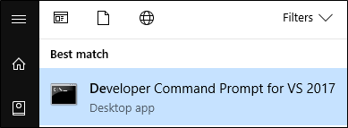

# Package an app manually (Desktop Bridge)

This topic shows you how to package your app without using tools such as Visual Studio or the Desktop App Converter (DAC).

To manually package your app, create a package manifest file, and then run a command line tool to generate a Windows app package.

Consider manual packaging if you install your app by using the xcopy command, or you're familiar with the changes that your app's installer makes to the system and want more granular control over the process.

If you're uncertain about what changes your installer makes to the system, or if you'd rather use automated tools to generate your package manifest, consider any of [these](desktop-to-uwp-root.md#convert) options.

>[!IMPORTANT]
>The Desktop Bridge was introduced in Windows 10, version 1607, and it can only be used in projects that target Windows 10 Anniversary Update (10.0; Build 14393) or a later release in Visual Studio.

## First, prepare your application

Review this guide before you begin creating a package for your application: [Prepare to package an app (Desktop Bridge)](desktop-to-uwp-prepare.md).

## Create a package manifest

Create a file, name it **appxmanifest.xml**, and then add this XML to it.

It's a basic template that contains the elements and attributes that your package needs. We'll add values to these in the next section.

```XML
<?xml version="1.0" encoding="utf-8"?>
<Package
	xmlns="http://schemas.microsoft.com/appx/manifest/foundation/windows10"
  xmlns:uap="http://schemas.microsoft.com/appx/manifest/uap/windows10"
  xmlns:rescap="http://schemas.microsoft.com/appx/manifest/foundation/windows10/restrictedcapabilities">
  <Identity Name="" Version="" Publisher="" ProcessorArchitecture="" />
    <Properties>
       <DisplayName></DisplayName>
       <PublisherDisplayName></PublisherDisplayName>
			 <Description></Description>
      <Logo></Logo>
    </Properties>
    <Resources>
      <Resource Language="" />
    </Resources>
	  <Dependencies>
	  <TargetDeviceFamily Name="Windows.Desktop" MinVersion="" MaxVersionTested="" />
	  </Dependencies>
	  <Capabilities>
	    <rescap:Capability Name="runFullTrust"/>
	  </Capabilities>
    <Applications>
      <Application Id="" Executable="" EntryPoint="Windows.FullTrustApplication">
        <uap:VisualElements DisplayName="" Description=""	Square150x150Logo=""
				   Square44x44Logo=""	BackgroundColor="" />
      </Application>
     </Applications>
  </Package>
```

## Fill in the package-level elements of your file

Fill in this template with information that describes your package.

### Identity information

Here's an example **Identity** element with placeholder text for the attributes. You can set the ``ProcessorArchitecture`` attribute to ``x64`` or ``x86``.

```XML
<Identity Name="MyCompany.MySuite.MyApp"
          Version="1.0.0.0"
          Publisher="CN=MyCompany, O=MyCompany, L=MyCity, S=MyState, C=MyCountry"
			    ProcessorArchitecture="x64">
```
> [!NOTE]
> If you've reserved your app name in the Windows store, you can obtain the Name and Publisher by using the Windows Dev Center dashboard. If you plan to sideload your app onto other systems, you can provide your own names for these as long as the publisher name that you choose matches the name on the certificate you use to sign your app.

### Properties

The [Properties](https://docs.microsoft.com/uwp/schemas/appxpackage/appxmanifestschema/element-properties) element has 3 required child elements. Here is an example **Properties** node with placeholder text for the elements. The **DisplayName** is the name of your app that you reserve in the store, for apps which are uploaded to the store.

```XML
<Properties>
  <DisplayName>MyApp</DisplayName>
  <PublisherDisplayName>MyCompany</PublisherDisplayName>
  <Logo>images\icon.png</Logo>
</Properties>
```

### Resources

Here is an example [Resources](https://docs.microsoft.com/uwp/schemas/appxpackage/appxmanifestschema/element-resources) node.

```XML
<Resources>
  <Resource Language="en-us" />
</Resources>
```
### Dependencies

For desktop apps that you package by using the desktop bridge, always set the ``Name`` attribute to ``Windows.Desktop``.

```XML
<Dependencies>
<TargetDeviceFamily Name="Windows.Desktop" MinVersion="10.0.14316.0" MaxVersionTested="10.0.15063.0" />
</Dependencies>
```

### Capabilities
For desktop apps that you package by using the desktop bridge, you'll have to add the ``runFullTrust`` capability.

```XML
<Capabilities>
  <rescap:Capability Name="runFullTrust"/>
</Capabilities>
```
## Fill in the application-level elements

Fill in this template with information that describes your app.

### Application element

For desktop apps that you package by using the desktop bridge, the ``EntryPoint`` attribute of the Application element is always ``Windows.FullTrustApplication``.

```XML
<Applications>
  <Application Id="MyApp"     
		Executable="MyApp.exe" EntryPoint="Windows.FullTrustApplication">
   </Application>
</Applications>
```

### Visual elements

Here is an example [VisualElements](https://docs.microsoft.com/uwp/schemas/appxpackage/appxmanifestschema/element-visualelements) node.

```XML
<uap:VisualElements
	BackgroundColor="#464646"
	DisplayName="My App"
	Square150x150Logo="images\icon.png"
	Square44x44Logo="images\small_icon.png"
	Description="A useful description" />
```
<a id="target-based-assets" />

## (Optional) Add Target-based unplated assets

Target-based assets are for icons and tiles that appear on the Windows taskbar, task view, ALT+TAB, snap-assist, and the lower-right corner of Start tiles. You can read more about them [here](https://docs.microsoft.com/windows/uwp/shell/tiles-and-notifications/app-assets#target-based-assets).

1. Obtain the correct 44x44 images and then copy them into the folder that contains your images (i.e., Assets).

2. For each 44x44 image, create a copy in the same folder and append **.targetsize-44_altform-unplated** to the file name. You should have two copies of each icon, each named in a specific way. For example, after completing the process, your assets folder might contain **MYAPP_44x44.png** and **MYAPP_44x44.targetsize-44_altform-unplated.png**.

   > [!NOTE]
   > In this example, the icon named **MYAPP_44x44.png** is the icon that you'll reference in the ``Square44x44Logo`` logo attribute of your Windows app package.

3.	In the Windows app package, set the ``BackgroundColor`` for every icon you are making transparent.

4. Continue to the next subsection to generate a new Package Resource Index file.

<a id="make-pri" />

### Generate a Package Resource Index (PRI) file

If you create target-based assets as described in the section above, or you modify any of the visual assets of your app after you've created the package, you'll have to generate a new PRI file.

1.	Open a **Developer Command Prompt for VS 2017**.

    

2.  Change directory to the package's root folder, and then create a priconfig.xml file by running the command ``makepri createconfig /cf priconfig.xml /dq en-US``.

5.	Create the resources.pri file(s) by using the command ``makepri new /pr <PHYSICAL_PATH_TO_FOLDER> /cf <PHYSICAL_PATH_TO_FOLDER>\priconfig.xml``.

    For example, the command for your app might look like this: ``makepri new /pr c:\MYAPP /cf c:\MYAPP\priconfig.xml``.

6.	Package your Windows app package by using the instructions in the next step.

<a id="make-appx" />

## Generate a Windows app package

Use **MakeAppx.exe** to generate a Windows app package for your project. It's included with the Windows 10 SDK, and if you have Visual Studio installed, it can be easily accessed through the Developer Command Prompt for your Visual Studio version.

See [Create an app package with the MakeAppx.exe tool](https://docs.microsoft.com/windows/uwp/packaging/create-app-package-with-makeappx-tool)

## Run the packaged app

You can run your app to test it out locally without having to obtain a certificate and sign it. Just run this PowerShell cmdlet:

```Add-AppxPackage –Register AppxManifest.xml```

To update your app's .exe or .dll files, replace the existing files in your package with the new ones, increase the version number in AppxManifest.xml, and then run the above command again.

> [!NOTE]
> A packaged app always runs as an interactive user, and any drive that you install your packaged app on to must be formatted to NTFS format.

## Next steps

**Find answers to your questions**

Have questions? Ask us on Stack Overflow. Our team monitors these [tags](http://stackoverflow.com/questions/tagged/project-centennial+or+desktop-bridge).You can also ask us [here](https://social.msdn.microsoft.com/Forums/en-US/home?filter=alltypes&sort=relevancedesc&searchTerm=%5BDesktop%20Converter%5D).

**Give feedback or make feature suggestions**

See [UserVoice](https://wpdev.uservoice.com/forums/110705-universal-windows-platform/category/161895-desktop-bridge-centennial).

**Step through code / find and fix issues**

See [Run, debug, and test a packaged desktop app (Desktop Bridge)](desktop-to-uwp-debug.md)

**Sign your app and then distribute it**

See [Distribute a packaged desktop app (Desktop Bridge)](desktop-to-uwp-distribute.md)
