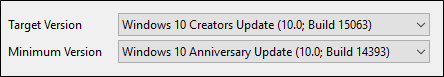
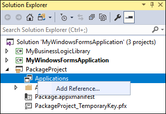
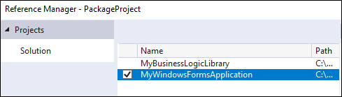
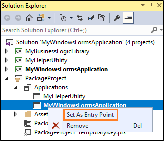

# Package an app by using Visual Studio (Desktop Bridge)

You can use Visual Studio to generate a package for your desktop app. Then, you can publish that package to the Windows store or sideload it onto one or more PCs.

The latest version of Visual Studio provides a new version of the packaging project that eliminates all of the manual steps that used to be necessary to package your app. Just add a packaging project, reference your desktop project, and then press F5 to debug your app. No manual tweaks necessary. This new streamlined experience is a vast improvement over the experience that was available in the previous version of Visual Studio.

>[!IMPORTANT]
>The Desktop Bridge was introduced in Windows 10, version 1607, and it can only be used in projects that target Windows 10 Anniversary Update (10.0; Build 14393) or a later release in Visual Studio.

## First, prepare your application

Review this guide before you begin creating a package for your application: [Prepare to package an app (Desktop Bridge)](desktop-to-uwp-prepare.md).

<a id="new-packaging-project"/>

## Create a package

1. In Visual Studio, open the solution that contains your desktop application project.

2. Add a **Windows Application Packaging Project** project to your solution.

   You won't have to add any code to it. It's just there to generate a package for you. We'll refer to this project as the "packaging project".

   

   >[!NOTE]
   >This project appears only in Visual Studio 2017 version 15.5 or higher.

3. Set the **Target Version** of this project to any version that you want, but make sure to set the **Minimum Version** to **Windows 10 Anniversary Update**.

   

4. In the packaging project, right-click the **Applications** folder, and then choose **Add Reference**.

   

5. Choose your desktop application project, and then choose the **OK** button.

   

   You can include multiple desktop applications in your package, but only one of them can start when users choose your app tile. In the **Applications** node, right-click the application that you want users to start when they choose the app's tile, and then choose **Set as Entry Point**.

   

6. Build the packaging project to ensure that no errors appear.

7. Use the [Create App Packages](../packaging/packaging-uwp-apps.md) wizard to generate an appxupload file.

   You can upload that file directly to the store.

**Video**

&nbsp;
> [!VIDEO https://www.youtube.com/embed/fJkbYPyd08w]

## Next steps

**Find answers to your questions**

Have questions? Ask us on Stack Overflow. Our team monitors these [tags](http://stackoverflow.com/questions/tagged/project-centennial+or+desktop-bridge). You can also ask us [here](https://social.msdn.microsoft.com/Forums/en-US/home?filter=alltypes&sort=relevancedesc&searchTerm=%5BDesktop%20Converter%5D).

**Give feedback or make feature suggestions**

See [UserVoice](https://wpdev.uservoice.com/forums/110705-universal-windows-platform/category/161895-desktop-bridge-centennial).

**Run, debug or test your app**

See [Run, debug, and test a packaged desktop app (Desktop Bridge)](desktop-to-uwp-debug.md)

**Enhance your desktop app by adding UWP APIs**

See [Enhance your desktop application for Windows 10](desktop-to-uwp-enhance.md)

**Extend your desktop app by adding UWP projects and Windows Runtime Components**

See [Extend your desktop application with modern UWP components](desktop-to-uwp-extend.md).

**Distribute your app**

See [Distribute a packaged desktop app (Desktop Bridge)](desktop-to-uwp-distribute.md)
