# Desktop Bridge Packaging Guide for .NET Desktop apps with Visual Studio

The Windows 10 Anniversary Update allows developers to use the Desktop Bridge to package existing Win32 apps using the new package model (.appx), which enables Store publishing or easy sideloading. This guide explains how to configure your Visual Studio Solution so you can edit, debug, and package your app. 

To get started, fill out the form at [Bring your existing apps and games to the Windows Store with the Desktop Bridge](https://developer.microsoft.com/windows/projects/campaigns/desktop-bridge). Microsoft will contact you to start the onboarding process. Once your account has been approved to submit Desktop Bridge apps, follow the instructions in this document to prepare your appxupload package for upload. 

> Have feedback our encounter issues as you journey along the Desktop Bridge? The best place to make feature suggestions is on the [Windows Developer UserVoice](https://wpdev.uservoice.com/forums/110705-universal-windows-platform/category/161895-desktop-bridge-centennial). For questions and bug reports, please head over to the [Developing Universal Windows apps forums](https://social.msdn.microsoft.com/Forums/home?forum=wpdevelop).

## Default Universal Windows Platform packages

Visual Studio allows you to generate the debug and release packages that can be distributed using the Windows Store or app sideloading. To facilitate the package creation, Visual Studio helps you creating an. appxupload file ready to be submitted to the store. For more info, see [Packaging UWP Apps](..\packaging\packaging-uwp-apps.md).

## Desktop Bridge Packages

The [Desktop Bridge](desktop-to-uwp-root.md) allows different configurations to integrate Win32 binaries within the application package (appx). We can think of the progression across the Desktop Bridge as a journey with four key steps. 

- **Step 1 - Convert**: Package existing Win32 binaries with zero or minimal code changes.
- **Step 2 - Enhance**: Include some basic UWP features (such as a live tile) in the existing app by referencing Windows.winmd from the existing Win32 code.
- **Step 3 - Extend**: Include advanced UWP capabilities (like background tasks) with the existing app. If your UWP and Win32 components are built using managed languages (like C# or VB.Net) the resulting package will have mixed binaries that need to be processed carefully to guarantee the correct .NET Native processing. 
- **Step 4 - Migrate**: You have migrated your UI to modern XAML and C#/VB.NET, but still have legacy Win32 code. The entry point is now a UWP .NET executable, but you still have binaries in the package that use some Win32 APIs.

The next table summarizes some of the differences for your app at each of the four steps. 

| Step | Binaries | EntryPoint | .NET Native | F5 Debug |
|---|---|---|---|---|
| 1 (Convert) | Win32 | Win32 | N/A | VS Extension |
| 2 (Enhance) | Refs WinMD | Win32 | N/A | VS Extension |
| 3 (Extend) | Win32 + CoreCLR (*) | Win32 | By User (**) | VS Extension |
| 4 (Migrate)	| CoreCLR (*) + Win32 | UWP | By User (**) | VS |
| 5 (UWP) | CoreCLR | UWP |By Store | VS |

(*) [CoreCLR](https://github.com/dotnet/coreclr) refers to the .NET Core runtime that UWP components written in a managed language (C#/VB.NET) rely on. These components will also require .NET Native processing.

(**) In Steps 3 and 4, the user should process the CoreCLR assemblies to produce the .NET native binaries and corresponding symbols before publishing to the store.

## Configure your Visual Studio Solution

Visual Studio includes the tools you need to configure your application package, such as the manifest editor and the Package Creation Wizard. To use these tools, you need a UWP project that will act as the appx container for your app. While you can use any UWP project (including C#, VB.NET, C++, or JavaScript), there are some known issues with C#, VB.NET, and C++ projects (see the [Known Issues](#known-issues-anchor) section later in this document), so we will use JavaScript for this example. 

If you want to debug your app in the context of the appx application model, you will need to add another project that will enable the F5 appx debugging. For more information see the section [Debugging your Desktop Bridge app](#debugging-anchor).

Let's start with Step 1 in the journey.

### Step 1: Convert

This step shows how to create a Desktop Bridge app from an existing Win32 project. In this example, we'll use a basic WinForms Project that performs read and write operations on the registry.

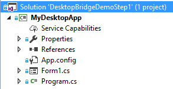

#### Add the UWP project 

To create the Desktop Bridge package, add a JavaScript UWP project to the same solution.

> Note: even though we are using a JavaScript UWP template, we are not going to write any JavaScript code. We are only using the project as a tool.

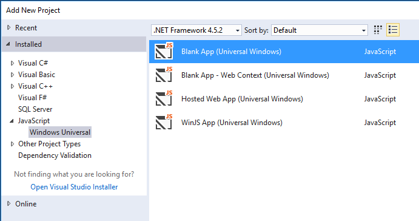

#### Add the Win32 binaries to the win32 folder

All the Win32 binaries will be stored in your UWP project in a folder called win32 (though this exact name is not required; you can use any name you like).

If you are using Visual Studio, you can automate the project to copy the files after each build, improving your development workflow. Edit your project file (.csproj in this example) to include an AfterBuild target that will copy all the Win32 output files to the win32 folder in the UWP project as follows: 

```xml
  <Target Name="AfterBuild">
    <PropertyGroup>
      <TargetUWP>..\MyDesktopApp.Package\win32\</TargetUWP>
    </PropertyGroup>
     <ItemGroup>
       <Win32Binaries Include="$(TargetDir)\*" />
     </ItemGroup>
    <Copy SourceFiles="@(Win32Binaries)" DestinationFolder="$(TargetUWP)" />
  </Target>
```

If you are using another tool to produce your Win32 binaries, just copy all the files required at runtime to the win32 folder. 

#### Edit the App Manifest to enable the Desktop Bridge Extensions

This template includes a package.appxmanifest that you can use to add the Desktop Bridge extensions. To edit this file, right click and select "View Code," and add or modify these items: 

- `<Package xmlns="http://schemas.microsoft.com/appx/manifest/foundation/windows10" xmlns:uap="http://schemas.microsoft.com/appx/manifest/uap/windows10" xmlns:rescap="http://schemas.microsoft.com/appx/manifest/foundation/windows10/restrictedcapabilities" IgnorableNamespaces="uap rescap">`

- `<TargetDeviceFamily Name="Windows.Desktop" MinVersion="10.0.14393.0" MaxVersionTested="10.0.14393.0" />`

- `<rescap:Capability Name="runFullTrust" />`

- `<Application Id="MyDesktopAppStep1" Executable="win32\MyDesktopApp.exe" EntryPoint="Windows.FullTrustApplication">`

Here's a complete example of the manifest file: 

```xml
<?xml version="1.0" encoding="utf-8"?>
<Package xmlns="http://schemas.microsoft.com/appx/manifest/foundation/windows10"
        xmlns:uap="http://schemas.microsoft.com/appx/manifest/uap/windows10"
        xmlns:mp="http://schemas.microsoft.com/appx/2014/phone/manifest"
        xmlns:rescap="http://schemas.microsoft.com/appx/manifest/foundation/windows10/restrictedcapabilities"
        IgnorableNamespaces="uap rescap mp">
  <Identity Name="MyDesktopAppStep1"
            ProcessorArchitecture="x64"
            Publisher="CN=Microsoft Corporation, O=Microsoft Corporation, L=Redmond, S=Washington, C=US"
            Version="1.0.0.5" />
  <mp:PhoneIdentity PhoneProductId="6f6600a4-6da1-4d91-b493-35808d01f8de" PhonePublisherId="00000000-0000-0000-0000-000000000000" />
  <Properties>
    <DisplayName>MyDesktopAppStep1</DisplayName>
    <PublisherDisplayName>CN=Test</PublisherDisplayName>
    <Logo>Assets\SampleAppx.150x150.png</Logo>
  </Properties>
  <Resources>
    <Resource Language="en-us" />
  </Resources>
  <Dependencies>
    <TargetDeviceFamily Name="Windows.Desktop" 
                        MinVersion="10.0.14393.0" 
                        MaxVersionTested="10.0.14393.0" />
  </Dependencies>
  <Capabilities>
    <rescap:Capability Name="runFullTrust" />
  </Capabilities>
  <Applications>
    <Application Id="MyDesktopAppStep1" 
                 Executable="win32\MyDesktopApp.exe" 
                 EntryPoint="Windows.FullTrustApplication">
      <uap:VisualElements DisplayName="MyDesktopAppStep1" 
                          Description="MyDesktopAppStep1" 
                          BackgroundColor="#777777" 
                          Square150x150Logo="Assets\SampleAppx.150x150.png" 
                          Square44x44Logo="Assets\SampleAppx.44x44.png">
      </uap:VisualElements>
    </Application>
  </Applications>
</Package>
```

#### Configure the Win32 binaries

To include the binaries needed by your app in the output package, select each file in Visual Studio. Set its properties as "Content", and its build behavior to "Copy if newer". 


If you want to avoid committing binary files to your source code repository, you can use the .gitignore file to exclude all the files in the win32 folder. 

#### Optional: Use wildcards to specify the files in your win32 folder

If your Win32 app needs several files, you can edit your project file to specify a wildcard to specify which files should be marked as “Content” based on a wildcard expression. You need to open the . jsproj file with a text editor and include the files you need as shown below:

```xml
<Content Include="win32\*.dll">
  <CopyToOutputDirectory>PreserveNewest</CopyToOutputDirectory>
</Content>
<Content Include="win32\*.exe">
  <CopyToOutputDirectory>PreserveNewest</CopyToOutputDirectory>
</Content>
<Content Include="win32\*.config">
  <CopyToOutputDirectory>PreserveNewest</CopyToOutputDirectory>
</Content>
<Content Include="win32\*.pdb">
  <CopyToOutputDirectory>PreserveNewest</CopyToOutputDirectory>
</Content>
```

### Step 2: Enhance

If you want to call the UWP APIs available from your Win32 code, you need add a reference to `\Program Files (x86)\Windows Kits\10\UnionMetadata\Windows.winmd`. The full list of UWP APIs available to your app is listed in the article [Supported UWP APIs for apps converted with the Desktop Bridge](desktop-to-uwp-supported-api.md).  

Because this file is not needed in Windows 10, you don't need to distribute it. In the reference properties, set the property "Copy Local" to false.

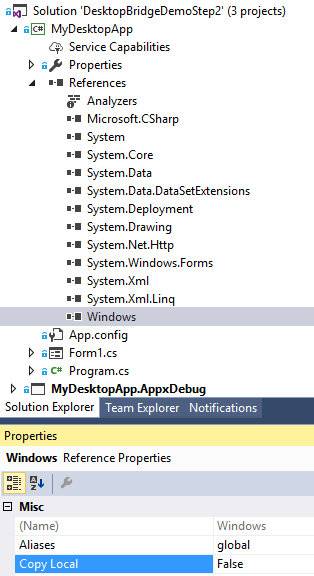

To add the Win32 binaries, use the same instructions as in Step 1. 

### Step 3: Extend 

For this example, we will extend a Win32 app with a background task. This requires registering the background task in the UWP app’s package.appxmanifest and adding a reference to the project implementing the background task, as shown below.

```xml
<Extensions>
  <Extension Category="windows.backgroundTasks" 
              EntryPoint="BackgroundTasks.MyBackgroundTask">
    <BackgroundTasks>
      <Task Type="timer" />
    </BackgroundTasks>
  </Extension>
</Extensions>
```

If the background task is implemented with C# or VB.NET, the resulting output will contain CoreCLR binaries that need to be processed by the .NET Native toolchain before being submitted to the store, as described in Step 3 and 4. Create appxupload with mixed binaries.

### Step 4: Migrate

This scenario already has a C# UWP entry point, so there is no need to add an additional UWP project. However, you need to follow the steps described in the Step 1 to include and configure the Win32 binaries.

To execute the Win32 process, use the [**FullTrustProcessLauncher**](https://msdn.microsoft.com/library/windows/apps/Windows.ApplicationModel.FullTrustProcessLauncher) APIs. You'll need to add the desktop extension and *fullTrustProcess* capability to your app's manifest to use the APIs, like this: 

```xml
..
xmlns:desktop=http://schemas.microsoft.com/appx/manifest/desktop/windows10
..
<desktop:Extension Category="windows.fullTrustProcess" 
                    Executable="win32\MyDesktopApp.exe" />
```

## Generate Packages for your Desktop Bridge app

Once you have followed the instructions above, you should be ready to generate your packages using Visual Studio as described in [Packaging UWP Apps](..\packaging\packaging-uwp-apps.md). 

### Steps 1 and 2: Create appxupload with Win32 binaries

To submit packages with the *fullTrust* capability, you need to generate an appxupload file that includes the symbols for each platform in an appxsym file, and a bundle containing the appx platform packages.

In steps 1 and 2, your package does not contain any CoreCLR binaries, so you don't need to worry about which platform to choose. Select "Neutral" and "Release (Any CPU)", as shown in the figure below.

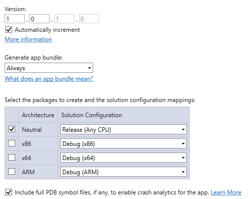

After you select the "Generate Store packages" option, the wizard will generate the appxupload file ready to submit to the store.

### Step 3 and 4: Create appxupload with mixed binaries

You should also build for Release, and in this case, it's mandatory to specify which platforms we want to target because it is required for .NET Native to produce the native binaries for each platform.

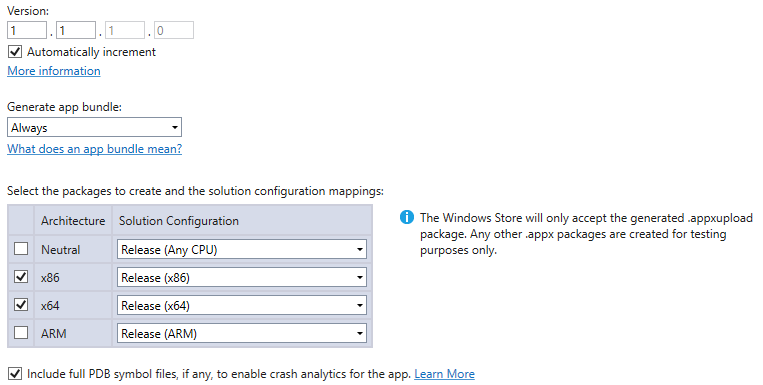

To create the new appxupload file, we will create a new zip archive to include the generated appxsym and appxbundle from the _Test folder.

Create a new zip file that contains the appxsym and appxbundle files, and then rename the extension to appxupload.


<span id="debugging-anchor" />
## Debugging your Desktop Bridge app

Although you can start your projects from Visual Studio without debugging (Ctrl + F5),there is a known issue where Visual Studio is not able to attach automatically to the running process. However, you can attach later using one of the next attach methods:

### Attach to the running App

#### Attach to an existing process

Once you have successfully launched your app using Ctrl + F5, you can attach to your Win32 process; however, you will not be able to debug .NET Native modules. 

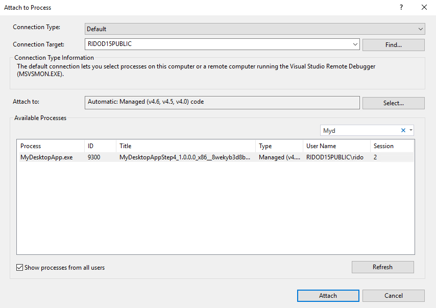

#### Attach to an installed App

You can also attach to any existing Appx package, using the option Debug -> Other Debug Targets -> Debug Installed App Package.

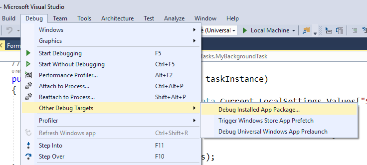

Where you can select your local machine, or connect to a remote one.

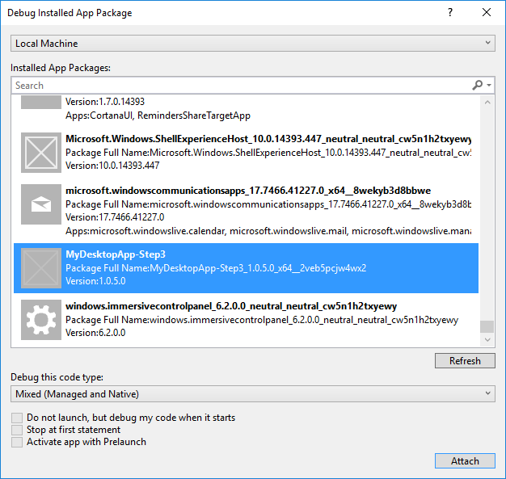

Using this option, you should be able to debug .NET Native code.

### Use Visual Studio extension to debug your Desktop Bridge app 

If you prefer to run debug your app using F5, you need to install the Visual Studio 2017 extension [Desktop Bridge Debugging Project](https://marketplace.visualstudio.com/items?itemName=VisualStudioProductTeam.DesktoptoUWPPackagingProject) from the Visual Studio gallery.

This project allows you to debug any Win32 app that is being migrated to UWP using Visual Studio (as described in this document) or using the Desktop App Converter.

#### Add the debugging project to your solution

To start, add a new Desktop Bridge Debugging Project to your project to your solution.

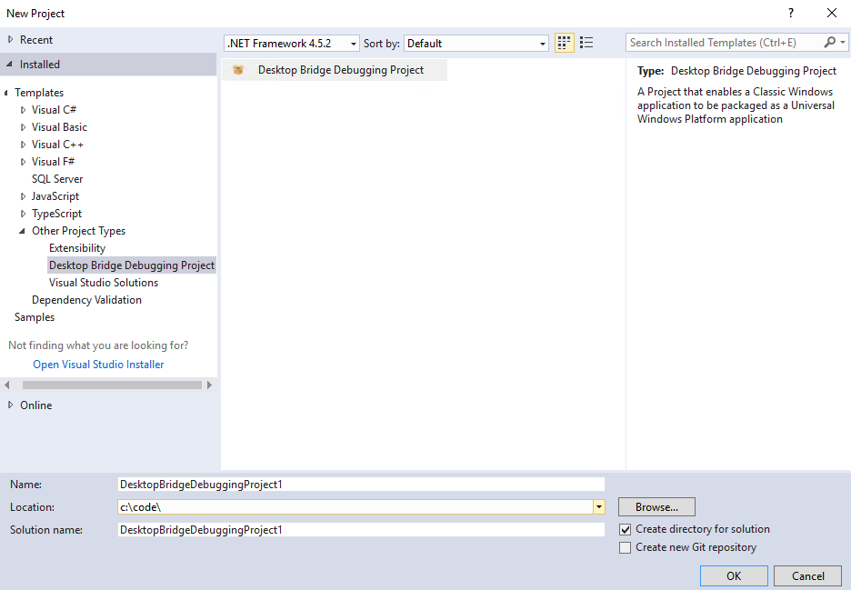

To configure this project, you need to define the PackageLayout property in the properties window for each configuration/platform you want to use for debugging.
To configure for Debug/x86 we will set the package layout property to the folder bin\x86\debug folder of the UWP project using a relative path: `..\MyDesktopApp.Package\bin\x86\Debug`. 

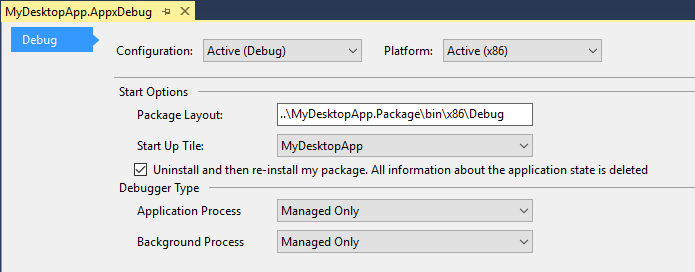

And edit the AppXFileLayout.xml file to specify your entry point:

```xml
<?xml version="1.0" encoding="utf-8"?>
<Project ToolsVersion="14.0" 
         xmlns="http://schemas.microsoft.com/developer/msbuild/2003">
  <PropertyGroup>
    <MyProjectOutputPath>$(PackageLayout)</MyProjectOutputPath>
  </PropertyGroup>
  <ItemGroup>
    <LayoutFile Include="$(MyProjectOutputPath)\win32\MyDesktopApp.exe">
      <PackagePath>$(PackageLayout)\win32\MyDesktopApp.exe</PackagePath>
    </LayoutFile>
  </ItemGroup>
</Project>
```

Finally, you should configure your solution dependencies to make sure that the projects are built in the proper order. 

As an example, let's review the solution created for Step 3.

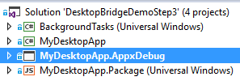

To configure the build order, you can use the Project Dependencies configuration. Right-click your solution and select the Project Dependencies option. Once you set the right dependencies, you can validate the build order as shown below (for Step 3):

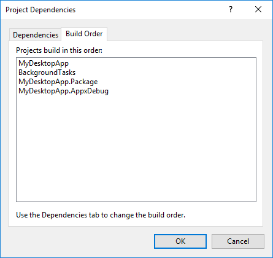

<span id="known-issues-anchor" />
## Known issues with C#/VB.NET and C++ UWP projects

If you prefer to use a C# project to package your app, you need to be aware of the following known issues. 

- **Building the app in Debug results in the error: Microsoft.Net.CoreRuntime.targets(235,5): error : Applications with custom entry point executables are not supported. Check Executable attribute of the Application element in the package manifest.** As a workaround, use Release mode instead.

- **Win32 Binaries stored in the root folder of the UWP project are removed in Release**. If you don't use a folder to store your Win32 binaries, the .NET Native compiler will remove those from the final package, resulting in a manifest validation error since the executable entry point can't be found.

