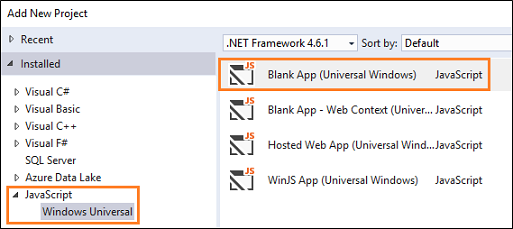
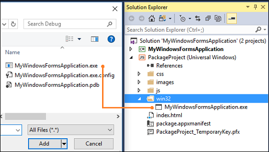

# Package an app by using Visual Studio (Desktop Bridge)

You can use Visual Studio to generate a package for your desktop app. Then, you can publish that package to the Windows store or sideload it onto one or more PCs.

This guide shows you how to set up your solution and then generate a package for your desktop application.

## First, consider how you'll distribute your app

If you plan to publish your app to the [Windows Store](https://www.microsoft.com/store/apps), start by filling out [this form](https://developer.microsoft.com/windows/projects/campaigns/desktop-bridge). Microsoft will contact you to start the onboarding process. As part of this process, you'll reserve a name in the store, and obtain information that you'll need to package your app.

## Add a packaging project to your solution

1. In Visual Studio, open the solution that contains your desktop application project.

2. Add a JavaScript **Blank App (Universal Windows)** project to your solution.

   You won't have to add any code to it. It's just there to generate a package for you. We'll refer to this project as the "packaging project".

   

   >[!IMPORTANT]
   >In general, you should use the JavaScript version of this project.  The C#, VB.NET, and C++ versions have a few issues but if you want to use of those, see the [Known Issues](https://docs.microsoft.com/windows/uwp/porting/desktop-to-uwp-known-issues#known-issues-anchor) guide before you do.

## Add the desktop application binaries to the packaging project

Add the binaries directly to the packaging project.

1. In **Solution Explorer**, create a subfolder and name it whatever you want (For example: **win32**).

2. Right-click the subfolder, and then choose **Add Existing Item**.

3. In the **Add Existing Item** dialog box, locate and then add the relevant binary executable or dll files from your desktop application project.

   

   Every time you make a change to your desktop application project, you'll have to copy a new version of your binaries to the packaging project. You can automate this by adding a post-build event to the project file of the packaging project. Here's an example.

   ```XML
   <Target Name="PostBuildEvent">
     <Copy SourceFiles="..\MyWindowsFormsApplication\bin\Debug\MyWindowsFormsApplication.exe"
       DestinationFolder="." />
   </Target>
   ```

## Modify the package manifest

The packaging project contains a file that describes the settings of your package. By default, this file describes a UWP app, so you'll have to modify it so that the system understands that your package includes a desktop application that runs in full trust.  

1. In **Solution Explorer**, expand the packaging project, right-click the **package.appxmanifest** file, and then choose **View Code**.

   

2. Add this namespace to the top of the file, and add the namespace prefix to the list of ``IgnorableNamespaces``.

   ```XML
   <Package xmlns:rescap="http://schemas.microsoft.com/appx/manifest/foundation/windows10/restrictedcapabilities"
            IgnorableNamespaces="rescap">

   ```

3. Set the ``Name`` attribute of the ``TargetDeviceFamily`` element to **Windows.Desktop**.

   ```XML
   <TargetDeviceFamily Name="Windows.Desktop" />
   ```

4. Remove the ``StartPage`` attribute from the ``Application`` element. Then, add the``Executable`` and ``EntryPoint`` attributes.

   The ``Application`` element will look like this.

   ```XML
   <Application Id="App"  StartPage="index.html"  Executable=" " EntryPoint=" ">
   ```

5. Set the ``Executable`` attribute to the name of your desktop application's executable file. Then, set the ``EntryPoint`` attribute to **Windows.FullTrustApplication**.

   The ``Application`` element will look similar to this.

   ```XML
   <Application Id="App"  StartPage="index.html"  Executable="WindowsFormsApp.exe" EntryPoint="Windows.FullTrustApplication">
   ```

   >[!IMPORTANT]
   If your creating a package for a C++ desktop application, you'll have to make a few extra changes to your manifest file so that you can deploy the Visual C++ runtimes along with your app. See [Using Visual C++ runtimes in a desktop bridge project](https://blogs.msdn.microsoft.com/vcblog/2016/07/07/using-visual-c-runtime-in-centennial-project/).

6. If you want to test your package, see [Run, debug, and test a packaged desktop app (Desktop Bridge)](desktop-to-uwp-debug.md).

   Then, return to this guide, and see the next section to generate your package.

## Generate a package

To generate a package your app, follow the guidance described in this topic: [Packaging UWP Apps](..\packaging\packaging-uwp-apps.md).

When you reach the **Select and Configure Packages** screen, Take a moment to consider what sorts of binaries you're including in your package before you select any of the checkboxes.

* If you've [extended](desktop-to-uwp-extend.md) your desktop application by adding a adding a C#, C++, or VB.NET-based Universal Windows Platform project to your solution, select the **x86** and **x64** checkboxes.  

* Otherwise, choose the **Neutral** checkbox.

>[!NOTE]
The reason that you'd have to explicitly choose each supported platform is because an solution that you've extended contains two types of binaries; one for the UWP project and one for the desktop project. Because these are different types of binaries, .NET Native needs to explicitly produce native binaries for each platform.

If you receive errors when you attempt to generate your package, see the [Known Issues](https://docs.microsoft.com/windows/uwp/porting/desktop-to-uwp-known-issues#known-issues-anchor) guide and if your issue does not appear in that list, please share the issue with us [here](http://stackoverflow.com/questions/tagged/project-centennial+or+desktop-bridge).

## Next steps

**Run your app / find and fix issues**

See [Run, debug, and test a packaged desktop app (Desktop Bridge)](desktop-to-uwp-debug.md)

**Enhance your desktop app by adding UWP APIs**

See [Enhance your desktop application for Windows 10](desktop-to-uwp-enhance.md)

**Extend your desktop app by adding UWP components**

See [Extend your desktop application with modern UWP components](desktop-to-uwp-extend.md).

**Distribute your app**

See [Distribute a packaged desktop app (Desktop Bridge)](desktop-to-uwp-distribute.md)

**Find answers to specific questions**

Our team monitors these [StackOverflow tags](http://stackoverflow.com/questions/tagged/project-centennial+or+desktop-bridge).

**Give feedback about this article**

Use the comments section below.
