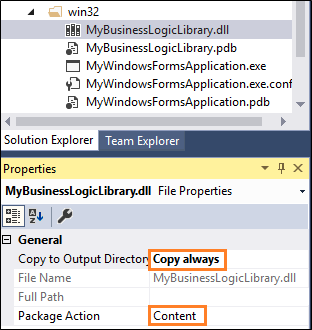
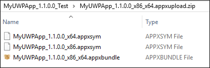

# Package an app by using Visual Studio (Desktop Bridge)

You can use Visual Studio to generate a package for your desktop app. Then, you can publish that package to the Windows store or sideload it onto one or more PCs.

>[!IMPORTANT]
>The Desktop Bridge was introduced in Windows 10, version 1607, and it can only be used in projects that target Windows 10 Anniversary Edition (10.0; Build 14393) or a later release in Visual Studio.

## First, consider how you'll distribute your app

If you plan to publish your app to the [Microsoft Store](https://www.microsoft.com/store/apps), start by filling out [this form](https://developer.microsoft.com/windows/projects/campaigns/desktop-bridge). Microsoft will contact you to start the onboarding process. As part of this process, you'll reserve a name in the store, and obtain information that you'll need to package your app.

<a id="new-packaging-project"/>
## Use the new packaging project available in the 15.4 release of Visual Studio 2017

The 15.4 release of Visual Studio introduces a new packaging project that eliminates all of the manual steps that used to be necessary to package your app. Just add a packaging project, reference your desktop project, and then press F5 to debug your app. No manual tweaks necessary. This new streamlined experience is a vast improvement over the experience that was available in the previous version of Visual Studio.

1. In Visual Studio, open the solution that contains your desktop application project.

2. Add a **Windows Application Packaging Project** project to your solution.

   You won't have to add any code to it. It's just there to generate a package for you. We'll refer to this project as the "packaging project".

   

3. Set the **Target Version** of this project to any version that you want, but make sure to set the **Minimum Version** to **Windows 10 Anniversary Update**.

   

4. In the packaging project, right-click the **Applications** folder, and then choose **Add Reference**.

   

5. Choose your desktop application project, and then choose the **OK** button.

   

   You can include multiple desktop applications in your package, but only one of them can start when users choose your app tile. In the **Applications** node, right-click the application that you want users to start when they choose the app's tile, and then choose **Set as Entry Point**.

   

6. Build the packaging project to ensure that no errors appear.

7. Use the [Create App Packages](..\packaging\packaging-uwp-apps.md) wizard to generate an appxupload file.

   You can upload that file directly to the store.

## Use a JavaScript UWP project in Visual Studio 2017

If you haven't yet installed the 15.4 release of Visual Studio, you can use the following steps to package your app.

### Add a packaging project to your solution

1. In Visual Studio, open the solution that contains your desktop application project.

2. Add a JavaScript **Blank App (Universal Windows)** project to your solution.

   You won't have to add any code to it. It's just there to generate a package for you. We'll refer to this project as the "packaging project".

   >[!IMPORTANT]
   >In general, you should use the JavaScript version of this project.  The C#, VB.NET, and C++ versions have a few issues but if you want to use of those, see the [Known Issues](https://docs.microsoft.com/windows/uwp/porting/desktop-to-uwp-known-issues#known-issues-anchor) guide before you do.

### Add the desktop application binaries to the packaging project

Add the binaries directly to the packaging project.

1. In **Solution Explorer**, expand the packaging project folder, create a subfolder, and name it whatever you want (For example: **win32**).

2. Right-click the subfolder, and then choose **Add Existing Item**.

3. In the **Add Existing Item** dialog box, locate and then add the files from your desktop application's output folder. This includes not just the executable files, but any dlls or .config files that are located in that folder.

   

   Every time you make a change to your desktop application project, you'll have to copy a new version of those files to the packaging project. You can automate this by adding a post-build event to the project file of the packaging project. Here's an example.

   ```XML
   <Target Name="PostBuildEvent">
     <Copy SourceFiles="..\MyWindowsFormsApplication\bin\Debug\MyWindowsFormsApplication.exe"
       DestinationFolder="win32" />
     <Copy SourceFiles="..\MyWindowsFormsApplication\bin\Debug\MyWindowsFormsApplication.exe.config"
       DestinationFolder="win32" />
     <Copy SourceFiles="..\MyWindowsFormsApplication\bin\Debug\MyWindowsFormsApplication.pdb"
       DestinationFolder="win32" />
     <Copy SourceFiles="..\MyWindowsFormsApplication\bin\Debug\MyBusinessLogicLibrary.dll"
       DestinationFolder="win32" />
     <Copy SourceFiles="..\MyWindowsFormsApplication\bin\Debug\MyBusinessLogicLibrary.pdb"
       DestinationFolder="win32" />
   </Target>
   ```

### Add binaries into the Windows app package

Configure each binary so that they get copied into the final output package.

1. In Visual Studio, open the **Properties** window and for each binary, set the **Package Action** property to **Content** and the **Copy to Output Directory** property to **Copy always**.

   

   If your binary subfolder contains alot of desktop application binary files, you can use wildcard expressions to specify which files you want to include. You'll have to open the .jsproj file in a text editor to do this. Here's an example:

   ```xml
   <Content Include="win32\*.dll">
     <CopyToOutputDirectory>PreserveNewest</CopyToOutputDirectory>
   </Content>
   <Content Include="win32\*.exe">
     <CopyToOutputDirectory>PreserveNewest</CopyToOutputDirectory>
   </Content>
   <Content Include="win32\*.config">
     <CopyToOutputDirectory>PreserveNewest</CopyToOutputDirectory>
   </Content>
   <Content Include="win32\*.pdb">
     <CopyToOutputDirectory>PreserveNewest</CopyToOutputDirectory>
   </Content>
   ```

   >[!NOTE]
   >If you want to avoid committing binary files to your source code repository, you can use the .gitignore file to exclude all of the files in your desktop application binary subfolder.


### Modify the package manifest

The packaging project contains a file that describes the settings of your package. By default, this file describes a UWP app, so you'll have to modify it so that the system understands that your package includes a desktop application that runs in full trust.  

1. In **Solution Explorer**, expand the packaging project, right-click the **package.appxmanifest** file, and then choose **View Code**.

   

2. Add this namespace to the top of the file, and add the namespace prefix to the list of ``IgnorableNamespaces``.

   ```XML
   xmlns:rescap="http://schemas.microsoft.com/appx/manifest/foundation/windows10/restrictedcapabilities"
   ```
   When you're done, your namespace declarations will look something like this:

   ```XML
   <Package
     xmlns="http://schemas.microsoft.com/appx/manifest/foundation/windows10"
     xmlns:mp="http://schemas.microsoft.com/appx/2014/phone/manifest"
     xmlns:uap="http://schemas.microsoft.com/appx/manifest/uap/windows10"
     xmlns:rescap="http://schemas.microsoft.com/appx/manifest/foundation/windows10/restrictedcapabilities"
     IgnorableNamespaces="uap mp rescap">
   ```

3. Find the ``TargetDeviceFamily`` element, and set the ``Name`` attribute to **Windows.Desktop**, the ``MinVersion`` attribute to the minimum version of the packaging project, and the ``MaxVersionTested`` to the target version of the packaging project.

   ```XML
   <TargetDeviceFamily Name="Windows.Desktop" MinVersion="10.0.10586.0" MaxVersionTested="10.0.15063.0" />
   ```

   You can find the minimum version and target version in the property pages of the packaging project.

   


4. Remove the ``StartPage`` attribute from the ``Application`` element. Then, add the``Executable`` and ``EntryPoint`` attributes.

   The ``Application`` element will look like this.

   ```XML
   <Application Id="App"  Executable=" " EntryPoint=" ">
   ```

5. Set the ``Executable`` attribute to the name of your desktop application's executable file. Then, set the ``EntryPoint`` attribute to **Windows.FullTrustApplication**.

   The ``Application`` element will look similar to this.

   ```XML
   <Application Id="App"  Executable="win32\MyWindowsFormsApplication.exe" EntryPoint="Windows.FullTrustApplication">
   ```
6. Add the ``runFullTrust`` capability to the ``Capabilities`` element.

   ```XML
     <rescap:Capability Name="runFullTrust"/>
   ```
   Blue squiggly marks might appear beneath this declaration, but you can safely ignore them.

   >[!IMPORTANT]
   If your creating a package for a C++ desktop application, you'll have to make a few extra changes to your manifest file so that you can deploy the Visual C++ runtimes along with your app. See [Using Visual C++ runtimes in a desktop bridge project](https://blogs.msdn.microsoft.com/vcblog/2016/07/07/using-visual-c-runtime-in-centennial-project/).

7. Build the packaging project to ensure that no errors appear.

8. If you want to test your package, see [Run, debug, and test a packaged desktop app (Desktop Bridge)](desktop-to-uwp-debug.md).

   Then, return to this guide, and see the next section to generate your package.

### Generate a package

To generate a package your app, follow the guidance described in this topic: [Packaging UWP Apps](..\packaging\packaging-uwp-apps.md).

When you reach the **Select and Configure Packages** screen, Take a moment to consider what sorts of binaries you're including in your package before you select any of the checkboxes.

* If you've [extended](desktop-to-uwp-extend.md) your desktop application by adding a C#, C++, or VB.NET-based Universal Windows Platform project to your solution, select the **x86** and **x64** checkboxes.

* Otherwise, choose the **Neutral** checkbox.

>[!NOTE]
The reason that you'd have to explicitly choose each supported platform is because an solution that you've extended contains two types of binaries; one for the UWP project and one for the desktop project. Because these are different types of binaries, .NET Native needs to explicitly produce native binaries for each platform.

If you receive errors when you attempt to generate your package, see the [Known Issues](https://docs.microsoft.com/windows/uwp/porting/desktop-to-uwp-known-issues#known-issues-anchor) guide and if your issue does not appear in that list, please share the issue with us [here](http://stackoverflow.com/questions/tagged/project-centennial+or+desktop-bridge).

#### Obtaining the appxupload file that you submit to the store

The **Create App Packages** wizard generates an appxupload file that you can submit to the Microsoft Store but the wizard won't automatically generate one if you've [extended](desktop-to-uwp-extend.md) your desktop application by adding a C#, C++, or VB.NET-based Universal Windows Platform project to the packaged solution. In that case, you'll have to manually create the appxupload file. Here's how.

1. Create a new zip archive to include the generated appxsym and appxbundle from the \_Test folder.

2. Create a new zip file that contains the appxsym and appxbundle files, and then rename the extension to appxupload.

   

## Next steps

**Find answers to your questions**

Have questions? Ask us on Stack Overflow. Our team monitors these [tags](http://stackoverflow.com/questions/tagged/project-centennial+or+desktop-bridge).

**Run, debug or test your app**

See [Run, debug, and test a packaged desktop app (Desktop Bridge)](desktop-to-uwp-debug.md)

**Enhance your desktop app by adding UWP APIs**

See [Enhance your desktop application for Windows 10](desktop-to-uwp-enhance.md)

**Extend your desktop app by adding UWP components**

See [Extend your desktop application with modern UWP components](desktop-to-uwp-extend.md).

**Distribute your app**

See [Distribute a packaged desktop app (Desktop Bridge)](desktop-to-uwp-distribute.md)
