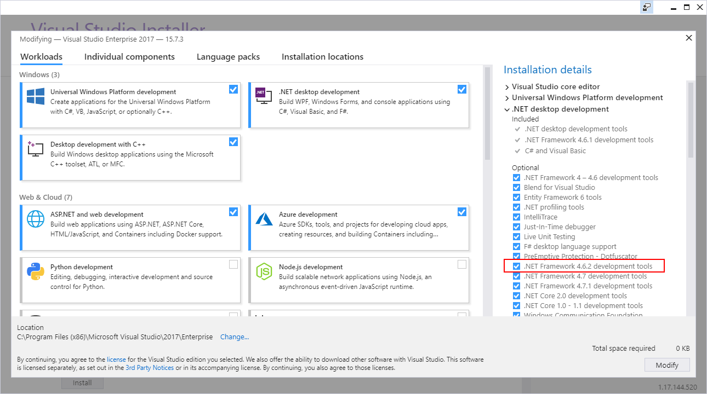
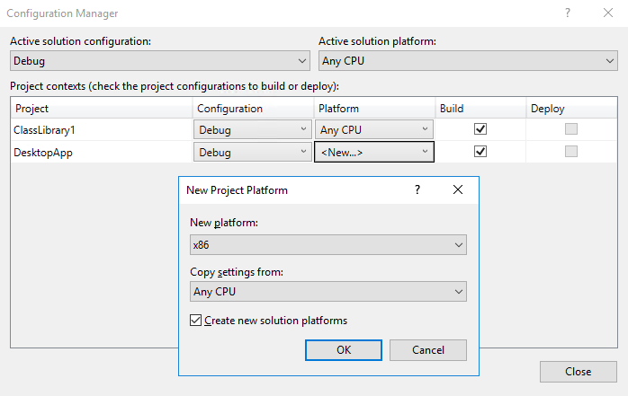

# Optimize your .NET Desktop apps with native images

> [!NOTE]
> Some information relates to pre-released product which may be substantially modified before it’s commercially released. Microsoft makes no warranties, express or implied, with respect to the information provided here.

You can optimize your .NET Framework application by pre-compiling your binaries. You can use this technology on applications that you package and distribute through the Windows Store. In some cases, we've observed a 20% performance improvement. You can learn more about this technology in the [technical overview](https://github.com/dotnet/coreclr/blob/master/Documentation/botr/readytorun-overview.md).

We've released a preview version of the native image compiler as a [NuGet package](https://www.nuget.org/packages/Microsoft.DotNet.Framework.NativeImageCompiler). You can apply this package to any .NET Framework application that targets the .NET Framework version 4.6.2 or later. This package adds a post build step that includes a native payload to all the binaries used by your application. This optimized payload will be loaded when the application runs in .NET 4.7.2 and above while previous versions will still load the MSIL code.

The [.NET framework 4.7.2](https://blogs.msdn.microsoft.com/dotnet/2018/04/30/announcing-the-net-framework-4-7-2/) is included in the [Windows 10 April 2018 update](https://blogs.windows.com/windowsexperience/2018/04/30/how-to-get-the-windows-10-april-2018-update/). You can also install this version of the .NET Framework on PC's that run Windows 7+ and Windows Server 2008 R2+.

> [!IMPORTANT]
> If you want to produce native images for your application packaged by  the Windows Application Packaging project, make sure to set the Target Platform Minimum version of the project to the Windows Anniversary Update.

## How to produce native images

Follow these instructions to configure your projects.

1. Configure the target framework as 4.6.2 or above

2. Configure the target platform as x86 or x64 

3. Add the NuGet packages.

4. Create a Release Build.

## Configure the target framework as 4.6.2 or above

To configure your project to target .NET Framework 4.6.2 you will need the .NET Framework 4.6.2 development tools or newer. These tools are available through the Visual Studio installer as optional components under the .NET desktop development workload:



Alternatively, you can get the .NET developer packs from: [https://www.microsoft.com/net/download/visual-studio-sdks](https://www.microsoft.com/net/download/visual-studio-sdks)

## Configure the target platform as x86 or x64

The native image compiler optimizes the code for a given platform. To use it, you need to configure your application to target one specific platform such as x86 or x64.

If you have multiple projects in your solution, only the entry point project (most likely the project that produces an executable file) has to be compiled as x86 or x64. Additional binaries referenced from the main project will be processed with the architecture specified in the main project, even if they are compiled as AnyCPU.

To configure your project:

1. Right-click your solution, and then select **Configuration Manager**.

2. Select **<New ..>** in the **Platform** dropdown menu beside the name of the project that produces your executable file.

3. In the **New Project Platform** dialog box, make sure that the **Copy Settings from** dropdown list is set to **Any CPU**.



Repeat this step for `Release/x64` if you want produce x64 binaries.

>[!IMPORTANT]
> AnyCPU configuration is not supported by the native image compiler.

## Add the NuGet packages

The native image compiler is provided as a NuGet package that you need to add to the Visual Studio project that produces the executable file. This is typically your Windows Forms or WPF project. Use this PowerShell command to do that.

```PS
PM> Install-Package Microsoft.DotNet.Framework.NativeImageCompiler -PRE
```

> [!NOTE]
> The preview packages are published in NuGet.org as unlisted. You won’t find them by browsing NuGet.org or by using the Package Manager UI in Visual Studio. However, you can install them from the Package Manager Console, and when you restoring from a different machine. We'll make the packages fully accessible when we publish the first non-preview version.

## Create a Release Build

The NuGet package configures the project to run an additional tool for release builds. This tool adds the native code to the same binaries.
To verify that the tool has processed the binaries you can review the build output to make sure it includes a message such as this one:

```
Native image obj\x86\Release\\R2R\DesktopApp1.exe generated successfully.
```

## FAQ

**Q. Do the new binaries work on machines without .NET Framework 4.7.2?**

A. Optimized binaries will benefit from the improvements when running with .NET Framework 4.7.2. Clients that run previous .NET framework versions will load the non-optimized MSIL code from the binary.

**Q. How can I provide feedback or report issues?**

A. Report an issue by using the Feedback tool in Visual Studio 2017. [More information](https://docs.microsoft.com/visualstudio/ide/how-to-report-a-problem-with-visual-studio-2017).

**Q. What’s the impact of adding the native image to existing binaries?**

A. The optimized binaries contain the managed and native code, making the final files greater.

**Q. Can I release binaries using this technology?**

A. This version includes a Go Live license that you can use today.
