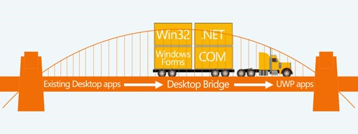
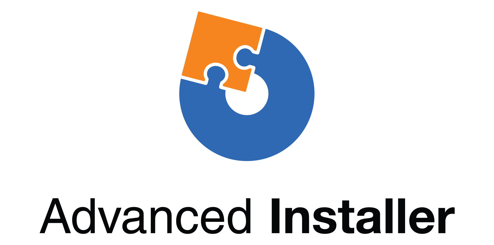
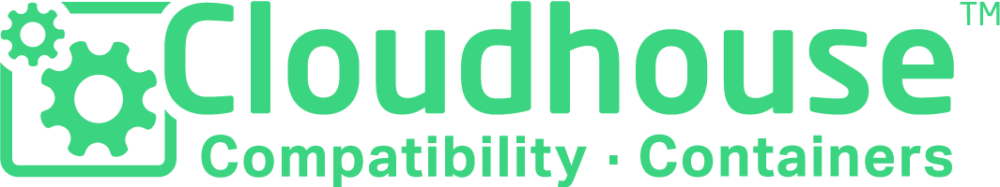
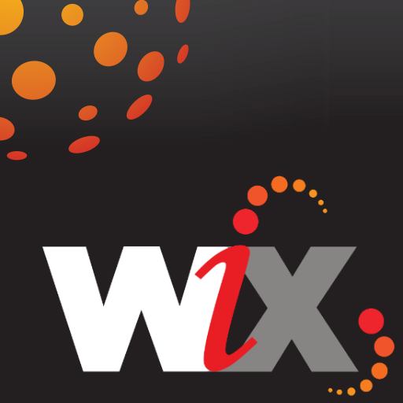
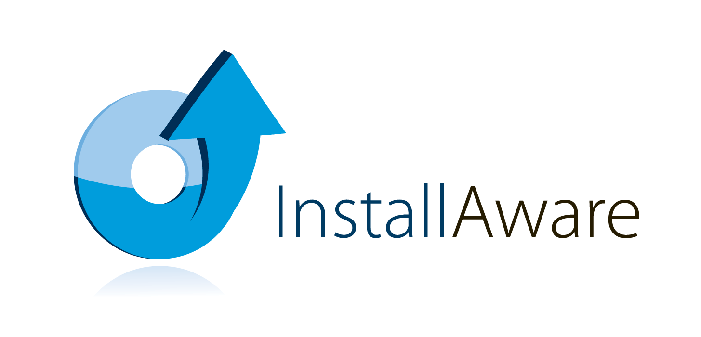
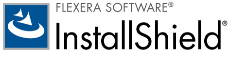
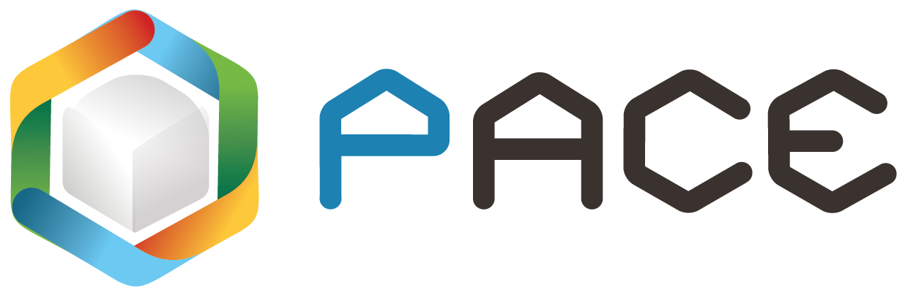
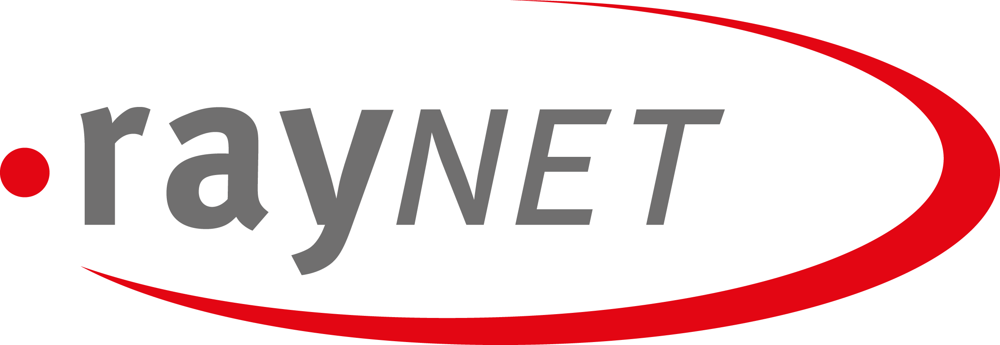

# Desktop Bridge

Take your existing desktop app and add modern experiences for Windows 10 users. Then, achieve greater reach across international markets by distributing it through the Microsoft Store. You can monetize your app in much simpler ways by leveraging features built right into the store. Of course, you don't have to use the store. Feel free to use your existing channels.

The Desktop Bridge is the infrastructure that we’ve built into the platform that lets you distribute your Windows Forms, WPF, or Win32 desktop app or game efficiently by using a modern Windows App package.

This package gives your app an identity and with that identity, your desktop app has access to Windows Universal Platform (UWP) APIs. You can use them to light up modern and engaging experiences such as live tiles and notifications.  Use simple conditional compilation and runtime checks to run UWP code only when your app runs on Windows 10.

Aside from the code that you use to light up Windows 10 experiences, your app remains unchanged and you can continue to distribute it to your existing Windows 7, Windows Vista, or Windows XP user base. On Windows 10, your app continues to run in full-trust user mode just like it’s doing today.

>[!IMPORTANT]
>The Desktop Bridge was introduced in Windows 10, version 1607, and it can only be used in projects that target Windows 10 Anniversary Update (10.0; Build 14393) or a later release in Visual Studio.

> [!NOTE]
> Checkout <a href="https://mva.microsoft.com/en-US/training-courses/developers-guide-to-the-desktop-bridge-17373?l=oZG0B1WhD_8406218965/">this series</a> of short videos published by the Microsoft Virtual Academy. These videos walk you through the entire process of bringing your desktop app to the Universal Windows Platform (UWP).

## Benefits

Here's some reasons to create a Windows App package for your desktop application:

:heavy_check_mark: **Streamlined deployment**. Apps and games that use the bridge have a great deployment experience. This experience ensures that users can confidently install an app and update it. If a user chooses to uninstall the app, it's removed completely with no trace left behind. This reduces time authoring setup experiences and keeping users up-to-date.

:heavy_check_mark: **Automatic updates and licensing**. Your app can participate in the Microsoft Store's built-in licensing and automatic update facilities. Automatic update is a highly reliable and efficient mechanism, because only the changed parts of files are downloaded.

:heavy_check_mark: **Increased reach and simplified monetization**. Choosing to distribute through the Microsoft Store expands your reach to millions of Windows 10 users, who can acquire apps, games and in-app purchases with local payment options.

:heavy_check_mark: **Add UWP features**.  At your own pace, you can add UWP features to your app's package, like a XAML user-interface, live tile updates, UWP background tasks, app services, and many more.

:heavy_check_mark: **Broadened use-cases across device**. Using the bridge, you can gradually migrate your code to the Universal Windows Platform to reach every Windows 10 device, including phones, Xbox One and HoloLens.

To view a more complete list of benefits, see [Desktop Bridge](https://developer.microsoft.com/windows/bridges/desktop).

## Prepare

First, prepare your application by reviewing the article [Prepare to package your desktop app](desktop-to-uwp-prepare.md), and then addressing any of the issues that apply to your app before you create a Windows app package for it. You might not have to make many changes to your app before you create the package. However, there are some situations that might require you to tweak your app before you create a package for it.

<a id="convert" />

## Package

Here's some tools that you can use to create a Windows app package for your app.

### Desktop App Converter

While the term "Converter" appears in the name of this tool, it doesn't actually convert your app. Your app remains unchanged. However, this tool generates a Windows app package for you. It can be very convenient in cases where your app makes lots of system modifications, or if you have any uncertainty about what your installer does.

The Desktop App Converter translates the actions of your installer to the virtual file and registry system that the packaged version of your app will use. The Desktop App Converter also does a few extra things for you. Here's a few of them.

:heavy_check_mark: Automatically register your preview handlers, thumbnail handlers, property handlers, firewall rules, URL flags.

:heavy_check_mark: Automatically registers file type mappings that enable users to group files by using the **Kind** column in File Explorer.

:heavy_check_mark: Registers your public COM servers.

:heavy_check_mark: Generates a certificate to that you can use to run your app.

:heavy_check_mark: Validates your app against Desktop Bridge and Microsoft Store requirements.

Another great reason to use the Desktop App Converter is if you maintain your app by using a different development environment other than Visual Studio. You can use the Desktop App Converter even if your app doesn't have an installer.

See [Package an app using the Desktop App Converter (Desktop Bridge)](desktop-to-uwp-run-desktop-app-converter.md)

### Visual Studio

If you maintain your application by using Visual Studio, and your application doesn't have an installer or your installer doesn't perform too many complicated tasks, consider using Visual Studio instead.

Visual Studio makes it abundantly easy to create a package. You'll add a packaging project, reference your desktop project, and then press F5 to debug your app. No manual tweaks necessary. This new streamlined experience is a vast improvement over the experience that was available in the previous version of Visual Studio. Here's a few other things you can do with it.

:heavy_check_mark: Automatically generate visual assets.

:heavy_check_mark: Make changes to your manifest by using a visual designer.

:heavy_check_mark: Generate your package by using a wizard.

:heavy_check_mark: Easily assign an identity to your app from a name that you've already reserved in the Windows Dev Center dashboard.

See [Package a .NET app by using Visual Studio (Desktop Bridge)](desktop-to-uwp-packaging-dot-net.md)

### Third-party installer

 Several popular third-party products and installers now support the Desktop Bridge. You can use them to generate MSI installers or app packages with only a few clicks. While we don't produce documentation on how to use these tools, visit their websites to learn more.

#### Advanced Installer

Caphyon provides a free, GUI-based, desktop app packaging tool that helps you to generate a Windows app package for your application with only a few clicks. It can use any installer; even ones that run in silent mode, and performs a validation check to determine whether the app is suitable for packaging.
The Desktop App Converter also integrates with Hyper-V and [VMware](http://www.vmware.com/). This means that you can use your own virtual machines, without having to download a matching [Docker](https://docs.docker.com/) image that can be over 3GB in size.

You can use [Advanced Installer](http://www.advancedinstaller.com/) to generate MSI and [Windows app packages](http://www.advancedinstaller.com/uwp-app-package.html) from existing projects. You can also use Advanced installer to import Windows app packages that you generate by using the Microsoft Desktop App Converter. Once imported, you can maintain them by using visual tools that are specifically designed for UWP apps.

Advanced Installer also provides an extension for Visual Studio 2017 and 2015 that can use to [build and debug Desktop Bridge apps](http://www.advancedinstaller.com/debug-desktop-bridge-apps.html).

See this [video](https://www.youtube.com/watch?v=cmLKgn04Vfg&feature=youtu.be) for a quick overview.

> [!TIP]
> Be sure to checkout the recently released [Advanced Installer Express Edition](https://www.advancedinstaller.com/express-edition.html).

#### Cloudhouse Compatibility Containers

For Enterprise customers who have line of business applications that are incompatible with Windows 10 and 10 S, Cloudhouse’s Compatibility Containers enable Windows XP and 7 apps to run on Windows 10 and then converts them to run on the Universal Windows Platform (UWP) for delivery through Microsoft Store for Business, or Microsoft InTune without changing the source code. Register for a [Free Trial](http://www.cloudhouse.com/free-trial).

Cloudhouse provides an Auto Packager for packaging line of business applications into [Compatibility Containers](https://docs.cloudhouse.com/37613-overview/266723-compatibility-containers-for-applications) on the operating systems that the apps runs on today (For example: Windows XP), and then [prepare it for conversion](https://docs.cloudhouse.com/37613-overview/266725-compatibility-containers-for-desktop-bridge?from_search=17883905) to UWP. The Container is then converted to the new Windows app package format by integrating it with Microsoft’s Desktop App Converter tool.

The Auto Packager uses install / capture and runtime analysis to create a Container for the application which includes the application’s files, registry, runtimes, dependencies, and the compatibility and redirection engine required to enable the application to run on Windows 10. The Container provides isolation for the application and its runtimes, so that that they do not affect or conflict with other applications running on the user’s device.

Find out more about how you can deliver business applications through the Microsoft Store for Business Read in our [Release blog](http://www.cloudhouse.com/resources/release-solution-to-get-any-line-of-business-app-to-uwp).

#### FireGiant

The [FireGiant Appx extension](https://www.firegiant.com/products/wix-expansion-pack/appx) lets you create Windows app packages and MSI packages simultaneously from the same WiX source code. Every time you build, you can target Desktop Bridge in Windows 10 with a Windows app package and earlier versions of Windows with MSI.

The FireGiant Appx extension uses static analysis and intelligent emulation of your WiX projects to create Windows app packages without the disk space and runtime overhead of containers or virtual machines.

Because the FireGiant Appx extension doesn't convert your installer by running it, you can maintain your WiX installer without having to repeatedly convert it to Windows app packages. All your users on different versions of Windows get your latest improvements and you don't have to worry about MSI and Windows app packages getting out of sync.

Check out this [video](https://www.youtube.com/watch?v=AFBpdBiAYQE) and see how in a couple lines of code FireGiant CEO Rob Mensching creates an Appx (Windows app package) version of the popular open-source 7-Zip compression tool and then how he improves both Windows app and MSI packages with changes in the same WiX source code.

#### InstallAware

Install**Aware**, with a [track record](https://www.installaware.com/press-room.htm) of quickly supporting Microsoft's innovations, builds [Windows app packages (Desktop Bridge)](https://www.installaware.com/appx-builder.htm), App-V (Application Virtualization), MSI (Windows Installer), and EXE (Native Code) packages from a single source.

Install**Aware** provides free Install**Aware** extensions for Visual Studio versions 2012-2017. You can use them to create Windows app packages with a single click directly from the [Visual Studio toolbar](https://www.installaware.com/visual-studio-installer-2015.htm).

You can also import any setup, even if you don't have the source code for that setup, by using Package**Aware** (snapshot-free setup captures), or the Database Import Wizard (for all MSI installers and MSM merge modules). You can use [GUI tools](https://www.installaware.com/scripting-two-way-integrated-ide.htm) to maintain and enhance your imports, visually or by scripting.

[Advanced APPX creation options](https://www.installaware.com/mhtml5/desktop/appx.htm) help you target Microsoft Store submissions, or produce signed Windows app package binaries for sideload distribution to end-users. You can even build **WSA**(Windows Server Applications) Installer packages that target deployments to **Nano Server** all from a single source, and with full support for [command line automation](https://www.installaware.com/scripting-automation-interface.htm), in addition to a GUI.

Install**Aware** also [open sourced](https://www.installaware.com/gnu.asp) an **APPX builder library**, together with an example command line applet, under the GNU Affero GPL license. These are designed for use with open source platforms such as WiX.

#### InstallShield

InstallShield provides a single solution to develop MSI and EXE installers, create Universal Windows Platform (UWP) and Windows Server App (WSA) packages, and virtualize applications with minimal scripting, coding and rework.

Scan your InstallShield project in seconds to save hours of investigative work by automatically identifying potential compatibility issues between your application and UWP and WSA packages.

Prepare for the Microsoft Store and simplify your software’s installation experience on Windows 10 by building UWP app packages from your existing InstallShield projects. Build both Windows Installer and UWP App Packages to support all of your customers’ desired deployment scenarios. Support Nano Server and Windows Server 2016 deployments by building WSA packages from your existing InstallShield projects.

Develop your installation in modules for easier deployment and maintenance, and then merge the components and dependencies at build time into a single UWP app package for the Microsoft Store. For direct distribution outside the store, bundle your UWP App Packages and other dependencies together with a Suite/Advanced UI installer.

Learn more in this [eBook](https://na01.safelinks.protection.outlook.com/?url=https%3A%2F%2Fresources.flexerasoftware.com%2Fweb%2Fpdf%2FeBook-IS-Your-Fast-Track-to-Profit.pdf&data=02%7C01%7Cnormesta%40microsoft.com%7C86b9a00bc8e345c2ac6208d4ba464802%7C72f988bf86f141af91ab2d7cd011db47%7C1%7C1%7C636338258409706554&sdata=IAYNp9nFc8B5ayxwrs%2FQTWowUmOda6p%2Fn%2BjdHea257M%3D&reserved=0).

#### PACE Suite

[PACE Suite](https://pacesuite.com/) is an application packaging tool that you can use to bring your desktop apps to the Universal Windows Platform.

With PACE Suite, you don't need to prepare special packaging environments or install additional Windows SDK components. PACE Suite can build Windows app packages independently in your standard packaging environment under Windows 10 or Windows Server 2016. Check out this [illustrated example](https://pacesuite.com/convert-exe-to-appx/) to learn how PACE Suite approaches repackaging an installer to a Windows app package.

Apart from creating Windows app packages, you can also use PACE Suite to create Windows Installer packages (MSI), patches (MSP), transforms (MST) and App-V packages. When it comes to MSI authoring, PACE Suite helps with managing upgrades, permission settings, custom actions, scripts and others. You can also publish your applications directly to System Center Configuration Manager.

To review all application packaging capabilities, see [PACE Suite features](https://pacesuite.com/features/).

#### RAD Studio

See [RAD Studio by Embarcadero](https://www.embarcadero.com/products/rad-studio/windows-10-store-desktop-bridge)

#### RayPack Studio

Raynet's packaging solution, [RayPack Studio](https://raynet.de/Raynet-Products/RayPackStudio), supports the Desktop Bridge as one of several possible outcomes of efficient and easy-to-configure conversion and repackaging framework.

Existing virtual environments (VMware Workstation, Hyper-V) can be used to perform automated/bulk conversion without a lengthy environment setup. A component of the studio ([RayQC Advanced](https://raynet.de/Raynet-Products/RayQCad)) is able to make pre-conversion screening and compatibility tests to verify software that is eligible for conversion. Additionally, users can now perform comprehensive collision and compatibility checks with various Windows 10 editions including Anniversary and Creators updates.

Next to the creation of software packages for Windows 10 APPX/UWP format, RayPack Studio can also be used to create classic Windows Installer packages (MSI), patches (MSP), transforms (MST), and App-V packages. Furthermore, this solution comes with a set of software products and components for professional enterprise software packaging. In addition to software packaging and virtualization, RayPack Studio considers all packaging-related tasks: conflict and compatibility checks of software applications and packages ([RayQC Advanced](https://raynet.de/Raynet-Products/RayQCad)), software evaluation ([RayEval](https://raynet.de/Raynet-Products/RayEval)), and quality assurance ([RayQC](https://raynet.de/Raynet-Products/RayQC)).

Combined with [RayFlow](https://raynet.de/Raynet-Products/RayFlow), Raynet´s Enterprise Workflow System, users can efficiently work on the software through the whole enterprise application lifecycle, from package ordering, through evaluation, analysis, packaging, quality assurance, user acceptance tests and deployment. All packages and formats can be stored and deployed directly into SCCM or other solutions. The entire application lifecycle process is tracked and managed by RayFlow. In addition, any order systems such as ServiceNow can be integrated. Raynet builds software packaging factories worldwide with its tools for service providers.

Convince yourself and get the [free trial license](https://raynet.de/contact?init=license) of Raynet's RayPack Studio and RayFlow. For more information, please visit [www.raynet.de](https://raynet.de/home).

**Related links**:

* Raynet: [https://raynet.de/home](https://raynet.de/home)
* RayPack Studio: [https://raynet.de/Raynet-Products/RayPackStudio](https://raynet.de/Raynet-Products/RayPackStudio)
* RayFlow: [https://raynet.de/Raynet-Products/RayFlow](https://raynet.de/Raynet-Products/RayFlow)
* RayEval: [https://raynet.de/Raynet-Products/RayEval](https://raynet.de/Raynet-Products/RayEval)
* RayQC: [https://raynet.de/Raynet-Products/RayQC](https://raynet.de/Raynet-Products/RayQC)
* RayQC Advanced: [https://raynet.de/Raynet-Products/RayQCad](https://raynet.de/Raynet-Products/RayQCad)
* Free Trial License: [https://raynet.de/contact?init=license](https://raynet.de/contact?init=license)

### Manual packaging

As a final option, you can convert your app without using any of these tools. If you want that granular control over your conversion, you can create a manifest file, and then run the **MakeAppx.exe** tool to create your Windows app package.

See [Package an app manually (Desktop Bridge)](desktop-to-uwp-manual-conversion.md).

## Integrate

If your app needs to integrate with the system (For example: establish firewall rules), describe those things in the package manifest of your app and the system will do the rest. For most of these tasks, you won't have to write any code at all. With a bit of XML in the manifest, you can do things like start a process when the user logs on, integrate your app into File Explorer, and add your app a list of print targets that appear in other apps.

See [Integrate your app with Windows 10 (Windows Desktop Bridge)](desktop-to-uwp-extensions.md).

## Enhance

Once you've packaged your app, you can light it up with features such as live tiles, and push notifications. Some of these capabilities can significantly improve the engagement level of your app and they cost you very little time to add. Some enhancements require a bit more code.

See [Enhance your desktop application for Windows 10](desktop-to-uwp-enhance.md).

## Extend

Some Windows 10 experiences (For example: a touch-enabled UI page) must run inside of a modern app container. In general, you should first determine whether you can add your experience by [Enhancing](desktop-to-uwp-enhance.md) your existing desktop application with UWP APIs. If you have to use a UWP component, to achieve the experience, then you can add a UWP project to your solution and use app services to communicate between your desktop app and the UWP component.

See [Extend your desktop application with modern UWP components](desktop-to-uwp-extend.md).

## Migrate

While there's no tool that can convert a desktop application to a UWP app, you can reuse a lot of your existing code, and that lowers the cost of building one. You can do that by moving as much business logic as you can into .NET Standard 2.0 libraries.

The .NET Standard 2.0 includes a massive increase in the number of .NET APIs along with a compatibility shim for your favorite NuGet packages and third party libraries.

Migrate your code to .NET Standard libraries, and then create a Universal Windows Platform (UWP) app to reach all Windows 10 devices.

See [Share code between a desktop app and a UWP app](desktop-to-uwp-migrate.md)

## Test

To test your app in a realistic setting as you prepare for distribution, it's best to sign your app and then install it. See [Test your app](https://docs.microsoft.com/en-us/windows/uwp/porting/desktop-to-uwp-debug#test-your-app).

>[!IMPORTANT]
> If you plan to publish your app to the Microsoft Store, make sure that your app operates correctly on devices that run Windows 10 in S mode. This is a store requirement. See [Test your Windows app for Windows 10 in S mode](desktop-to-uwp-test-windows-s.md).

## Validate

To give your app the best chance of being published on the Microsoft Store or becoming [Windows Certified](http://go.microsoft.com/fwlink/p/?LinkID=309666), validate and test it locally before you submit it for certification.

If you're using the DAC to package your app, you can use the new ``-Verify`` flag to validate your package against the Desktop Bridge and Store requirements. See [Package an app, sign the app, and prepare it for store submission](desktop-to-uwp-run-desktop-app-converter.md#optional-parameters).

If you're using Visual Studio, you can validate your app from the **Create App Packages** wizard. See [Create an app package upload file](../packaging/packaging-uwp-apps.md#create-an-app-package-upload-file).

To run the tool manually, see [Windows App Certification Kit](../debug-test-perf/windows-app-certification-kit.md).

To review the list of tests that the Windows App Certification uses to validate your app, see [Windows Desktop Bridge app tests](../debug-test-perf/windows-desktop-bridge-app-tests.md).

## Distribute

You can distribute your app by publishing it the Microsoft Store or by sideloading it onto other systems.

See [Distribute a packaged desktop app (Desktop Bridge)](desktop-to-uwp-distribute.md).

## Support and feedback

**Find answers to your questions**

Have questions? Ask us on Stack Overflow. Our team monitors these [tags](http://stackoverflow.com/questions/tagged/project-centennial+or+desktop-bridge). You can also ask us [here](https://social.msdn.microsoft.com/Forums/en-US/home?filter=alltypes&sort=relevancedesc&searchTerm=%5BDesktop%20Converter%5D).

**Give feedback or make feature suggestions**

See [UserVoice](https://wpdev.uservoice.com/forums/110705-universal-windows-platform/category/161895-desktop-bridge-centennial).

## In this section

| Topic | Description |
|-------|-------------|
| [Prepare to package an app](desktop-to-uwp-prepare.md) | Provides a list of items to review before you package your desktop app. |
| [Package an app using the Desktop App Converter (Desktop Bridge)](desktop-to-uwp-run-desktop-app-converter.md) | Shows how to run Desktop App Converter. |
| [Package an app manually (Desktop Bridge)](desktop-to-uwp-manual-conversion.md) | Learn how to create an app package and manifest to by hand. |
| [Package a .NET app using Visual Studio (Desktop Bridge)](desktop-to-uwp-packaging-dot-net.md)| Shows you how to package your desktop app by using Visual Studio. |
| [Integrate your app with Windows 10 (Desktop Bridge)](desktop-to-uwp-extensions.md) | Integrate your app with Windows 10 by using by describing tasks in the package manifest file of your packaging project. |
| [Enhance your desktop application for Windows 10](desktop-to-uwp-enhance.md)| Use UWP APIs to add modern experiences that light up for Windows 10 users. |
| [UWP APIs available to a packaged desktop app (Desktop Bridge)](desktop-to-uwp-supported-api.md) | See what UWP APIs are available for your packaged desktop app to use. |
| [Extend your desktop application with modern UWP components](desktop-to-uwp-extend.md)| Add advanced experiences that must run within a UWP app container. Connect your desktop app with the UWP process by using app services.|
| [Run, debug, and test a packaged desktop app (Desktop Bridge)](desktop-to-uwp-debug.md) | Explains options for debugging your packaged app. |
| [Distribute a packaged desktop app (Desktop Bridge)](desktop-to-uwp-distribute.md) | See how you can distribute your converted app to users.  |
| [Behind the scenes of the Desktop Bridge (Desktop Bridge)](desktop-to-uwp-behind-the-scenes.md) | Take a deeper dive on how the Desktop Bridge works under the covers. |
| [Known Issues (Desktop Bridge)](desktop-to-uwp-known-issues.md) | Lists known issues with the Desktop Bridge. |
| [Desktop Bridge code samples](https://github.com/Microsoft/DesktopBridgeToUWP-Samples) | Code samples on GitHub demonstrating features of converted apps. |
