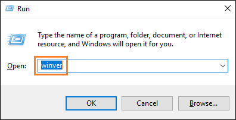
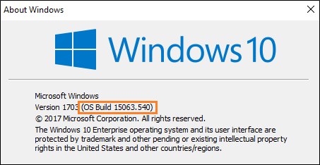

# Package an app using the Desktop App Converter (Desktop Bridge)

[Get the Desktop App Converter](https://aka.ms/converter)

You can use the Desktop App Converter (DAC) to bring your desktop apps to the Universal Windows Platform (UWP). This includes Win32 apps and apps that you've created by using .NET 4.6.1.


While the term "Converter" appears in the name of this tool, it doesn't actually convert your app. Your app remains unchanged. However, this tool generates a Windows app package with a package identity and the ability to call a vast range of WinRT APIs.

You can install that package by using the Add-AppxPackage PowerShell cmdlet on your development machine.

The converter runs the desktop installer in an isolated Windows environment by using a clean base image provided as part of the converter download. It captures any registry and file system I/O made by the desktop installer and packages it as part of the output.

>[!IMPORTANT]
>The Desktop Bridge was introduced in Windows 10, version 1607, and it can only be used in projects that target Windows 10 Anniversary Update (10.0; Build 14393) or a later release in Visual Studio.

> [!NOTE]
> Checkout <a href="https://mva.microsoft.com/en-US/training-courses/developers-guide-to-the-desktop-bridge-17373?l=oZG0B1WhD_8406218965/">this series</a> of short videos published by the Microsoft Virtual Academy. These videos walk you through some common ways to use the Desktop App Converter.

## The DAC does more than just generate a package for you

Here's a few extra things it can do for you.

**Windows 10 Creators Update**

:heavy_check_mark: Automatically register your preview handlers, thumbnail handlers, property handlers, firewall rules, URL flags.

:heavy_check_mark: Automatically register file type mappings that enable users to group files by using the **Kind** column in File Explorer.

:heavy_check_mark: Register your public COM servers.

**Windows 10 Anniversary Update or later**

:heavy_check_mark: Automatically sign your package so that you can test your app.

:heavy_check_mark: Validate your app against Desktop Bridge and Microsoft Store requirements.

To find a complete list of options, see the [Parameters](#command-reference) section of this guide.

If you're ready to create your package, let's start.

## First, prepare your application

Review this guide before you begin creating a package for your application: [Prepare to package an app (Desktop Bridge)](desktop-to-uwp-prepare.md).

## Make sure that your system can run the converter

Make sure that your system meets the following requirements:

* Windows 10 Anniversary Update (10.0.14393.0 and later) Pro or Enterprise edition.
* 64 bit (x64) processor
* Hardware-assisted virtualization
* Second Level Address Translation (SLAT)
* [Windows Software Development Kit (SDK) for Windows 10](https://go.microsoft.com/fwlink/?linkid=821375).

## Start the Desktop App Converter

1. Download and install the [Desktop App Converter](https://aka.ms/converter).

2. Run the Desktop App Converter as an administrator.

    

   A console window appears. You'll use that console window to run commands.

## Set a few things up (apps with installers only)

You can skip ahead to the next section if your app doesn't have an installer.

1. Identify the version number of your operating system.

   To do that, type **winver** in the **Run** dialog box, and then choose the **OK** button.

   

   You'll find the version of your Windows build in the **About Windows** dialog box.

   

2. Download the appropriate [Desktop app Converter base image](https://aka.ms/converterimages).

   Make sure that the version number that appears in the name of the file matches the version number of your Windows build.

   >[!IMPORTANT]
   > If you're using build number **15063**, and the minor version of that build is equal to or greater than **.483** (For example: **15063.540**), make sure to download the **BaseImage-15063-UPDATE.wim** file. If the minor version of that build is less than **.483**, download the **BaseImage-15063.wim** file. If you've already setup an incompatible version of this base file, you can fix it. This [blog post](https://blogs.msdn.microsoft.com/appconsult/2017/08/04/desktop-app-converter-fails-on-windows-10-15063-483-and-later-how-to-solve-it/) explains how to do that.

3. Place the downloaded file anywhere on your computer where you'll be able to find it later.

4. In the console window that appeared when you started the Desktop App Converter, run this command: ```Set-ExecutionPolicy bypass```.
5. Set up the converter by running  this command: ```DesktopAppConverter.exe -Setup -BaseImage .\BaseImage-1XXXX.wim -Verbose```.
6. Restart your computer if you're prompted to do so.

   Status messages appear in the console window as the converter expands the base image. If you don't see any status messages, press any key. This can cause the contents of the console window to refresh.

   

   When the base image is fully expanded, move to the next section.

## Package an app

To Package your app, run the ``DesktopAppConverter.exe`` command in the console window that opened when you started the Desktop App Converter.  

You'll specify the package name, publisher and version number of the app by using parameters.

> [!NOTE]
> If you've reserved your app name in the Windows store, you can obtain the package and publisher names by using the Windows Dev Center dashboard. If you plan to sideload your app onto other systems, you can provide your own names for these as long as the publisher name that you choose matches the name on the certificate you use to sign your app.

### A quick look at command parameters

Here are the required parameters.

```CMD
DesktopAppConverter.exe
-Installer <String>
-Destination <String>
-PackageName <String>
-Publisher <String>
-Version <Version>
```
You can read about each one [here](#command-reference).

### Examples

Here's a few common ways to package your app.

* [Package an app that has an installer (.msi) file](#installer-conversion)
* [Package an app that has a setup executable file](#setup-conversion)
* [Package an app that doesn't have an installer](#no-installer-conversion)
* [Package an app, sign the app, and prepare it for store submission](#optional-parameters)

<a id="installer-conversion" />

#### Package an app that has an installer (.msi) file

Point to the installer file by using the ``Installer`` parameter.

```cmd
DesktopAppConverter.exe -Installer C:\Installer\MyAppSetup.msi -Destination C:\Output\MyApp -PackageName "MyApp" -Publisher "CN=MyPublisher" -Version 0.0.0.1
```

> [!IMPORTANT]
> There are two important things to keep in mind here. First, make sure that your installer is located in an independent folder and that only files related to that installer are in the same folder. The converter copies all of the contents of that folder to the isolated Windows environment. <br> Secondly, if the dev center assigns an identity to your package that begins with a number, make sure that you also pass in the <i>-AppId</i> parameter, and use only the string suffix (after the period separator) as the value of that parameter.  

**Video**

<iframe src="https://mva.microsoft.com/en-US/training-courses-embed/developers-guide-to-the-desktop-bridge-17373/Demo-Convert-an-Application-That-Has-an-MSI-Installer-Kh1UU2WhD_7106218965" width="636" height="480" allowFullScreen frameBorder="0"></iframe>

If your installer includes installers for dependent libraries or frameworks, you might have to organize things a bit a differently. See [Chaining multiple installers with the Desktop Bridge](https://blogs.msdn.microsoft.com/appconsult/2017/09/11/chaining-multiple-installers-with-the-desktop-app-converter/).

<a id="setup-conversion" />

#### Package an app that has a setup executable file

Point to the setup executable by using the ``Installer`` parameter.

```cmd
DesktopAppConverter.exe -Installer C:\Installer\MyAppSetup.exe -InstallerArguments "/S" -Destination C:\Output\MyApp -PackageName "MyApp" -Publisher "CN=MyPublisher" -Version 0.0.0.1
```
>[!IMPORTANT]
>If the dev center assigns an identity to your package that begins with a number, make sure that you also pass in the <i>-AppId</i> parameter, and use only the string suffix (after the period separator) as the value of that parameter.

The ``InstallerArguments`` parameter is an optional parameter. However, because the Desktop App Converter needs your installer to run in unattended mode, you might have to use it if your app needs silent flags to run silently. The ``/S`` flag is a very common silent flag, but the flag that you use might be different depending on which installer technology you used to create the setup file.

**Video**

<iframe src="https://mva.microsoft.com/en-US/training-courses-embed/developers-guide-to-the-desktop-bridge-17373/Demo-Convert-an-Application-That-Has-a-Setup-exe-Installer-amWit2WhD_5306218965" width="636" height="480" allowFullScreen frameBorder="0"></iframe>

<a id="no-installer-conversion" />

#### Package an app that doesn't have an installer

In this example, use the ``Installer`` parameter to point to the root folder of your app files.

Use the `AppExecutable` parameter to point to your apps executable file.

```cmd
DesktopAppConverter.exe -Installer C:\Installer\MyApp\ -AppExecutable MyApp.exe -Destination C:\Output\MyApp -PackageName "MyApp" -Publisher "CN=MyPublisher" -Version 0.0.0.1
```

>[!IMPORTANT]
>If the dev center assigns an identity to your package that begins with a number, make sure that you also pass in the <i>-AppId</i> parameter, and use only the string suffix (after the period separator) as the value of that parameter.

**Video**

<iframe src="https://mva.microsoft.com/en-US/training-courses-embed/developers-guide-to-the-desktop-bridge-17373/Demo-Convert-a-No-Installer-Application-agAXF2WhD_3506218965" width="636" height="480" allowFullScreen frameBorder="0"></iframe>

<a id="optional-parameters" />

#### Package an app, sign the app, and run validation checks on the package

This example is similar to first one except it shows how you can sign your app for local testing, and then validate your app against Desktop Bridge and Microsoft Store requirements.

```cmd
DesktopAppConverter.exe -Installer C:\Installer\MyAppSetup.exe -InstallerArguments "/S" -Destination C:\Output\MyApp -PackageName "MyApp" -Publisher "CN=MyPublisher" -Version 0.0.0.1 -MakeAppx -Sign -Verbose -Verify
```
>[!IMPORTANT]
>If the dev center assigns an identity to your package that begins with a number, make sure that you also pass in the <i>-AppId</i> parameter, and use only the string suffix (after the period separator) as the value of that parameter.

The ``Sign`` parameter generates a certificate and then signs your app with it. To run your app, you'll have to install that generated certificate. To learn how, see the [Run the packaged app](#run-app) section of this guide.

You can validate you app by using the ``Verify`` parameter.

### A quick look at optional parameters

The ``Sign`` and ``Verify`` parameters are optional. There are many more optional parameters.  Here are some of the more commonly used optional parameters.

```CMD
[-ExpandedBaseImage <String>]
[-AppExecutable <String>]
[-AppFileTypes <String>]
[-AppId <String>]
[-AppDisplayName <String>]
[-AppDescription <String>]
[-PackageDisplayName <String>]
[-PackagePublisherDisplayName <String>]
[-MakeAppx]
[-LogFile <String>]
[<CommonParameters>]
```
You can read about all of them in the next section.

<a id="command-reference" />

### Parameter Reference

Here's the complete list of parameters (organized by category) that you can use when you run the Desktop App Converter.

* [Setup](#setup-params)
* [Conversion](#conversion-params)
* [Package identity](#identity-params)
* [Package manifest](#manifest-params)
* [Cleanup](#cleanup-params)
* [Architecture](#architecture-params)
* [Miscellaneous](#other-params)

You can also view the entire list by running the ``Get-Help`` command in the app console window.   

||||
|-------------|-----------|-------------|
|<a id="setup-params" /> <strong>Setup parameters</strong>  ||
|-Setup [&lt;SwitchParameter&gt;] |Required |Runs DesktopAppConverter in setup mode. Setup mode supports expanding a provided base image.|
|-BaseImage &lt;String&gt; | Required |Full path to an unexpanded base image. This parameter is required if -Setup is specified.|
| -LogFile &lt;String&gt; |Optional |Specifies a log file. If omitted, a log file temporary location will be created.|
|-NatSubnetPrefix &lt;String&gt; |Optional |Prefix value to be used for the Nat instance. Typically, you would want to change this only if your host machine is attached to the same subnet range as the converter's NetNat. You can query the current converter NetNat config by using the **Get-NetNat** cmdlet. |
|-NoRestart [&lt;SwitchParameter&gt;] |Required |Don't prompt for reboot when running setup (reboot is required to enable the container feature). |
|<a id="conversion-params" /> <strong>Conversion parameters</strong>|||
|-AppInstallPath &lt;String&gt;  |Optional |The full path to your application's root folder for the installed files if it were installed (e.g., "C:\Program Files (x86)\MyApp").|
|-Destination &lt;String&gt; |Required |The desired destination for the converter's appx output - DesktopAppConverter can create this location if it doesn't already exist.|
|-Installer &lt;String&gt; |Required |The path to the installer for your application - must be able to run unattended/silently. No-installer conversion, this is the path to the root directory of your app files. |
|-InstallerArguments &lt;String&gt; |Optional |A comma-separated list or string of arguments to force your installer to run unattended/silently. This parameter is optional if your installer is an msi. To get a log from your installer, supply the logging argument for the installer here and use the path &lt;log_folder&gt;, which is a token that the converter replaces with the appropriate path. <br><br>**NOTE**: The unattended/silent flags and log arguments will vary between installer technologies. <br><br>An example usage for this parameter: -InstallerArguments "/silent /log &lt;log_folder&gt;\install.log" Another example that doesn't produce a log file may look like: ```-InstallerArguments "/quiet", "/norestart"``` Again, you must literally direct any logs to the token path &lt;log_folder&gt; if you want the converter to capture it and put it in the final log folder.|
|-InstallerValidExitCodes &lt;Int32&gt; |Optional |A comma-separated list of exit codes that indicate your installer ran successfully (for example: 0, 1234, 5678).  By default this is 0 for non-msi, and 0, 1641, 3010 for msi.|
|<a id="identity-params" /><strong>Package identity parameters</strong>||
|-PackageName &lt;String&gt; |Required |The name of your Universal Windows App package. If the dev center assigns an identity to your package that begins with a number, make sure that you also pass in the <i>-AppId</i> parameter, and use only the string suffix (after the period separator) as the value of that parameter. |
|-Publisher &lt;String&gt; |Required |The publisher of your Universal Windows App package |
|-Version &lt;Version&gt; |Required |The version number for your Universal Windows App package |
|<a id="manifest-params" /><strong>Package manifest parameters</strong>||
|-AppExecutable &lt;String&gt; |Optional |The name of your application's main executable (eg "MyApp.exe"). This parameter is required for a no-installer conversion. |
|-AppFileTypes &lt;String&gt;|Optional |A comma-separated list of file types which the application will be associated with. Example usage: -AppFileTypes "'.md', '.markdown'".|
|-AppId &lt;String&gt; |Optional |Specifies a value to set Application Id to in the Windows app package manifest. If it is not specified, it will be set to the value passed in for *PackageName*. In many cases, using the *PackageName* is fine. However, if the dev center assigns an identity to your package that begins with a number, make sure that you also pass in the <i>-AppId</i> parameter, and use only the string suffix (after the period separator) as the value of that parameter. |
|-AppDisplayName &lt;String&gt;  |Optional |Specifies a value to set Application Display Name to in the Windows app package manifest. If it is not specified, it will be set to the value passed in for *PackageName*. |
|-AppDescription &lt;String&gt; |Optional |Specifies a value to set Application Description to in the Windows app package manifest. If it is not specified, it will be set to the value passed in for *PackageName*.|
|-PackageDisplayName &lt;String&gt; |Optional |Specifies a value to set Package Display Name to in the Windows app package manifest. If it is not specified, it will be set to the value passed in for *PackageName*. |
|-PackagePublisherDisplayName &lt;String&gt; |Optional |Specifies a value to set Package Publisher Display Name to in the Windows app package manifest. If it is not specified, it will be set to the value passed in for *Publisher*. |
|<a id="cleanup-params" /><strong>Cleanup parameters</strong>|||
|-Cleanup [&lt;Option&gt;] |Required |Runs cleanup for the DesktopAppConverter artifacts. There are 3 valid options for the Cleanup mode. |
|-Cleanup All | |Deletes all expanded base images, removes any temporary converter files, removes the container network, and disables the optional Windows feature, Containers. |
|-Cleanup WorkDirectory |Required |Removes all the temporary converter files. |
|-Cleanup ExpandedImage |Required |Deletes all the expanded base images installed on your host machine. |
|<a id="architecture-params" /><strong>Package architecture parameters</strong>|||
|-PackageArch &lt;String&gt; |Required |Generates a package with the specified architecture. Valid options are 'x86' or 'x64'; for example, -PackageArch x86. This parameter is optional. If unspecified, the DesktopAppConverter will try to auto-detect package architecture. If auto-detection fails, it will default to x64 package. |
|<a id="other-params" /><strong>Miscellaneous parameters</strong>|||
|-ExpandedBaseImage &lt;String&gt;  |Optional |Full path to an already expanded base image.|
|-MakeAppx [&lt;SwitchParameter&gt;]  |Optional |A switch that, when present, tells this script to call MakeAppx on the output. |
|-LogFile &lt;String&gt;  |Optional |Specifies a log file. If omitted, a log file temporary location will be created. |
| -Sign [&lt;SwitchParameter&gt;] |Optional |Tells this script to sign the output Windows app package by using a generated certificate for testing purposes. This switch should be present alongside the switch ```-MakeAppx```. |
|&lt;Common parameters&gt; |Required |This cmdlet supports the common parameters: *Verbose*, *Debug*, *ErrorAction*, *ErrorVariable*, *WarningAction*, *WarningVariable*, *OutBuffer*, *PipelineVariable*, and *OutVariable*. For more info, see [about_CommonParameters](http://go.microsoft.com/fwlink/?LinkID=113216). |
| -Verify [&lt;SwitchParameter&gt;] |Optional |A switch that, when present, tells the DAC to validate the app package against Desktop Bridge and Microsoft Store requirements. The result is a validation report "VerifyReport.xml", which is best visualized in a browser. This switch should be present alongside the switch `-MakeAppx`. |
|-PublishComRegistrations| Optional| Scans all public COM registrations made by your installer and publishes the valid ones in your manifest. Use this flag only if you want to make these registrations available to other applications. You don't need to use this flag if these registrations will be used only by your application. <br><br>Review [this article](https://blogs.windows.com/buildingapps/2017/04/13/com-server-ole-document-support-desktop-bridge/#lDg5gSFxJ2TDlpC6.97) to make sure that your COM registrations behave as you expect after you package your app.

<a id="run-app" />

## Run the packaged app

There's two ways to run your app.

One way is to open a PowerShell command prompt, and then type this command: ```Add-AppxPackage –Register AppxManifest.xml```. It's probably the easiest way to run your app because you don't have to sign it.

Another way is to sign your app with a certificate. If you use the ```sign``` parameter, the Desktop App Converter will generate one for you, and then sign your app with it. That file is named **auto-generated.cer**, and you can find it in the root folder of your packaged app.

Follow these steps to install the generated certificate, and then run your app.

1. Double-click the **auto-generated.cer** file to install the certificate.

   

   > [!NOTE]
   > If you're prompted for a password, use the default password "123456".

2. In the **Certificate** dialog box, choose the **Install Certificate** button.
3. In the **Certificate Import Wizard**, install the certificate onto the **Local Machine**, and place the certificate into the **Trusted People** certificate store.

   

5. In root folder of your packaged app, double click the Windows app package file.

   

6. Install the app, by choosing the **Install** button.

   


## Modify the packaged app

You'll likely make changes to your packaged app to address bugs, add visual assets, or enhance your app with modern experiences such as live tiles.

After you make your changes, you don't need to run the converter again. In most cases, you can just repackage your app by using the MakeAppx tool and the appxmanifest.xml file the DAC generates for your app. See [Generate a Windows app package](desktop-to-uwp-manual-conversion.md#make-appx).

* If you modify any of the visual assets of your app, generate a new Package Resource Index file, and then run the MakeAppx tool to generate a new package. See [Generate a Package Resource Index (PRI) file](desktop-to-uwp-manual-conversion.md#make-pri).

* If you want to add icons or tiles that appear on the Windows taskbar, task view, LT+TAB, snap assist, and the lower right corner of Start tiles, see [(Optional Add Target-based unplated assets](desktop-to-uwp-manual-conversion.md#target-based-assets).

> [!NOTE]
> If you make changes to registry settings that your installer makes, you will have to run the Desktop App Converter again to pick up those changes.

**Videos**

|Modify and repackage output |Demo: Modify and repackage output|
|---|---|
|<iframe src="https://mva.microsoft.com/en-US/training-courses-embed/developers-guide-to-the-desktop-bridge-17373/Video-Modifying-and-Repackaging-Output-from-Desktop-App-Converter-OwpAJ3WhD_6706218965" width="426" height="472" allowFullScreen frameBorder="0"></iframe>|<iframe src="https://mva.microsoft.com/en-US/training-courses-embed/developers-guide-to-the-desktop-bridge-17373/Demo-Modify-Output-from-Desktop-App-Converter-gEnsa3WhD_8606218965" width="426" height="472" allowFullScreen frameBorder="0"></iframe>|

The following two sections describe a couple of optional fix-ups to the packaged app that you might consider.

### Delete unnecessary files and registry keys

The desktop App Converter takes a very conservative approach to filtering out files and system noise in the container.

If you want, you can review the VFS folder and delete any files that your installer doesn't need.  You can also review the contents of Reg.dat and delete any keys that are not installed/needed by the app.

### Fix corrupted PE headers

During the conversion process, the DesktopAppConverter automatically runs the PEHeaderCertFixTool to fixup any corrupted PE headers. However, you can also run the PEHeaderCertFixTool on a UWP Windows app package, loose files, or a specific binary. Here's an example.

```CMD
PEHeaderCertFixTool.exe <binary file>|<.appx package>|&lt;folder> [/c] [/v]
 /c   -- check for corrupted certificate but do not fix (optional)
 /v   -- verbose (optional)
example1: PEHeaderCertFixTool app.exe
example2: PEHeaderCertFixTool c:\package.appx /c
example3: PEHeaderCertFixTool c:\myapp /c /v
```

## Telemetry from Desktop App Converter

Desktop App Converter may collect information about you and your use of the software and send this info to Microsoft. You can learn more about Microsoft's data collection and use in the product documentation and in the [Microsoft Privacy Statement](http://go.microsoft.com/fwlink/?LinkId=521839). You agree to comply with all applicable provisions of the Microsoft Privacy Statement.

By default, telemetry will be enabled for the Desktop App Converter. Add the following registry key to configure telemetry to a desired setting:  

```cmd
HKEY_LOCAL_MACHINE\SOFTWARE\Microsoft\DesktopAppConverter
```
+ Add or edit the *DisableTelemetry* value by using a DWORD set to 1.
+ To enable telemetry, remove the key or set the value to 0.

### Language support

The Desktop App Converter does not support Unicode; thus, no Chinese characters or non-ASCII characters can be used with the tool.

## Next steps

**Find answers to your questions**

Have questions? Ask us on Stack Overflow. Our team monitors these [tags](http://stackoverflow.com/questions/tagged/project-centennial+or+desktop-bridge). You can also ask us [here](https://social.msdn.microsoft.com/Forums/en-US/home?filter=alltypes&sort=relevancedesc&searchTerm=%5BDesktop%20Converter%5D).

You can also refer to [this](desktop-to-uwp-known-issues.md#app-converter) list of known issues.

**Give feedback or make feature suggestions**

See [UserVoice](https://wpdev.uservoice.com/forums/110705-universal-windows-platform/category/161895-desktop-bridge-centennial).

**Run your app / find and fix issues**

See [Run, debug, and test a packaged desktop app (Desktop Bridge)](desktop-to-uwp-debug.md)

**Distribute your app**

See [Distribute a packaged desktop app (Desktop Bridge)](desktop-to-uwp-distribute.md)
