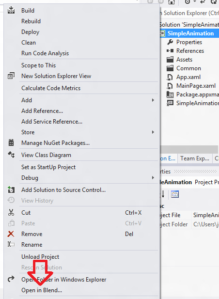
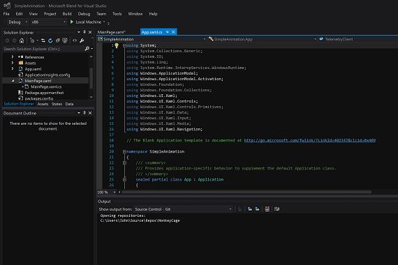
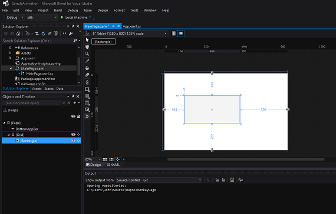
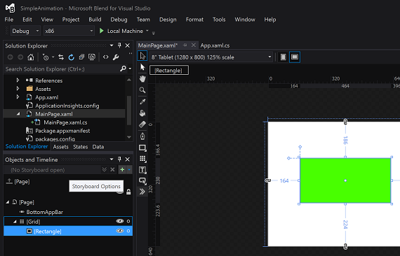
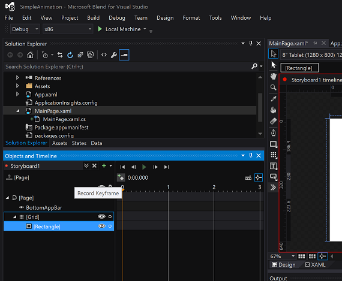
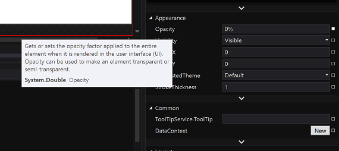
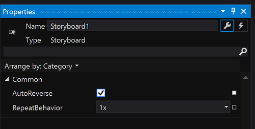

# Getting started: Animation


## Adding animations

In iOS, you most often create animation effects programmatically. For example, you might use animations provided by the block-based **UIView** class's **animateWithDuration** methods, or the older non-block based methods. Or, you might explicitly use the **CALayer** class to animate layers. Animations in Windows apps can be created programmatically, but they can also be defined declaratively with Extensible Application Markup Language (XAML). You can use Microsoft Visual Studio to edit XAML code directly, but Visual Studio also comes with a tool called **Blend**, which creates XAML code for you as you work with animations in a designer. In fact, Blend allows you to open, design, build, and run complete Visual Studio projects, graphically. The following walkthrough lets you try this out.

Create a new Universal Windows Platform (UWP) app and name it something like "SimpleAnimation". In this project, we're going to move a rectangle, apply a fade effect, and then bring it back into view. Animations in XAML are based on the concept of *storyboards* (not to be confused with iOS storyboards). Storyboards use *keyframes* to animate property changes.

With your project open, in **Solution Explorer**, right-click the project's name and then select **Open in Blend** or **Design in Blend**, as shown in the following figure. Visual Studio continues to run in the background.



After Blend starts, you should see something similar to the following figure.



Double-click on **MainPage.xaml** in the **Solution Explorer** on the left hand side. Next, from the vertical strip of tools on the edge of the central **Design View**, select the **Rectangle** tool, and then draw a rectangle in **Design View**, as shown in the following figure.



To make the rectangle green, look in the **Properties** window, and in the **Brush** area, click on the **Solid color brush** button, and then click the **Color eyedropper** icon. Click somewhere in the green band of hues.

To begin animating the rectangle, in the **Objects and Timeline** window, tap the plus symbol (**New**) button as shown in the following figure, and then tap **OK**.



A storyboard appears in the **Objects and Timeline** window (you may need to resize the view to see it properly). The **Design View** display changes to show that **Storyboard1 timeline recording is on**. To capture the current state of the rectangle, in the **Objects and Timeline** window, tap the **Record Keyframe** button just above the yellow arrow, as shown in the following figure.



Now, let's move the rectangle and fade it away. To do this, drag the orange/yellow arrow to the 2-second position, and then move your green rectangle slightly to the right. Then, in the **Properties** window, in the **Appearance** area, change the **Opacity** property to **0**, as shown in the following figure. To preview the animation, tap the **Play** button in the Storyboard panel.



Next, let's bring the rectangle back into view. In the **Objects and Timeline** window, double-click **Storyboard1**. Then, in the **Properties** window, in the **Common** area, select **AutoReverse**, as shown in the following figure.



Finally, click on the **Play** button to see what happens.

You can build and run the project by clicking on the green run button at the top of the window (or just press F5). If you do this, you'll see your project will indeed build and run, but the green rectangle will stubbornly sit perfectly still, like a toddler denied candy in a supermarket aisle. To start the animation, you'll need to add a line of code to the project. Here's how.

Save the project, by opening the **File** menu, and selecting **Save MainPage.xaml**. Return to Visual Studio. If Visual Studio displays a dialog box asking whether you want to reload the modified file, select **Yes**. Double-click the **MainPage.xaml.cs** file, which is hidden under **MainPage.xaml**, to open it, and add the following code just above the public MainPage() method:

```csharp
protected override void OnNavigatedTo(NavigationEventArgs e)
{
    // Add the following line of code.
    Storyboard1.Begin();
}
```

Run the project again, and watch the rectangle animate. Hurrah!

If you open the MainPage.xaml file, in **XAML** view, you'll see the XAML code that Blend added for you as you worked in the designer. In particular, look at the code in the `<Storyboard>` and `<Rectangle>` elements. The following code shows an example. Ellipses indicate unrelated code omitted for brevity, and line breaks have been added for code readability.)

```xml
...
<Storyboard 
        x:Name="Storyboard1" 
        AutoReverse="True">
    <DoubleAnimationUsingKeyFrames 
            Storyboard.TargetProperty="(UIElement.RenderTransform).(CompositeTransform.TranslateX)"
            Storyboard.TargetName="rectangle">
        <EasingDoubleKeyFrame 
                KeyTime="0" 
                Value="0"/>
        <EasingDoubleKeyFrame 
                KeyTime="0:0:2" 
                Value="185.075"/>
    </DoubleAnimationUsingKeyFrames>
    <DoubleAnimationUsingKeyFrames 
            Storyboard.TargetProperty="(UIElement.RenderTransform).(CompositeTransform.TranslateY)" 
            Storyboard.TargetName="rectangle">
        <EasingDoubleKeyFrame 
                KeyTime="0" 
                Value="0"/>
        <EasingDoubleKeyFrame 
                KeyTime="0:0:2" 
                Value="2.985"/>
    </DoubleAnimationUsingKeyFrames>
    <DoubleAnimationUsingKeyFrames 
            Storyboard.TargetProperty="(UIElement.Opacity)" 
            Storyboard.TargetName="rectangle">
        <EasingDoubleKeyFrame 
                KeyTime="0" 
                Value="1"/>
        <EasingDoubleKeyFrame 
                KeyTime="0:0:2"
                Value="0"/>
    </DoubleAnimationUsingKeyFrames>
</Storyboard>
...
<Rectangle 
        x:Name="rectangle" 
        Fill="#FF00FF63" 
        HorizontalAlignment="Left" 
        Height="122" 
        Margin="151,312,0,0" 
        Stroke="Black" 
        VerticalAlignment="Top" 
        Width="239" 
        RenderTransformOrigin="0.5,0.5">
    <Rectangle.RenderTransform>
        <CompositeTransform/>
    </Rectangle.RenderTransform>
</Rectangle>
...
```

You can edit this XAML manually, or return to Blend to continue working on it there. Blend makes it fun to create interesting user interfaces, and the ability to animate them using a graphical tool can dramatically speed up development time. For more info about animations, see [Animations overview](../design/motion/xaml-animation.md).

**Note**  For info about animations for <span class="legacy-term">UWP apps using JavaScript and HTML</span>, see [Animating your UI (HTML)](/previous-versions/windows/apps/hh465165(v=win.10)).

### Next step

[Getting started: What next?](getting-started-what-next.md)