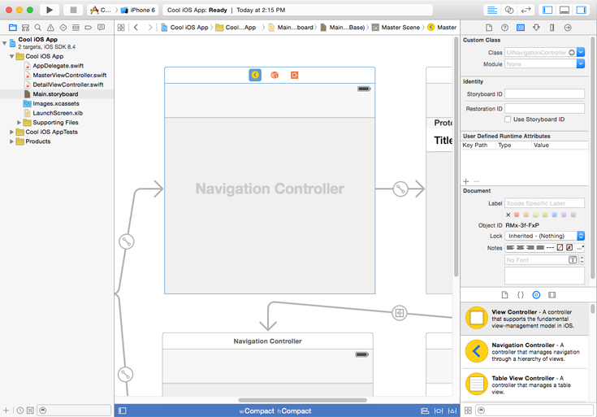
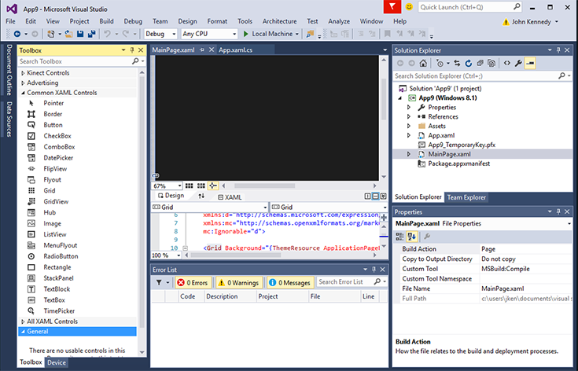
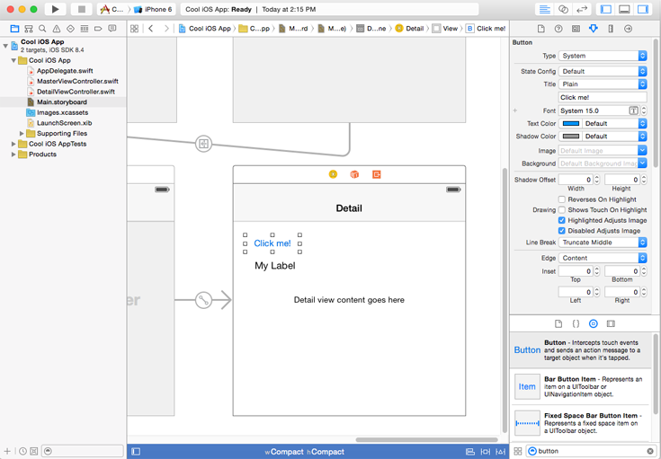
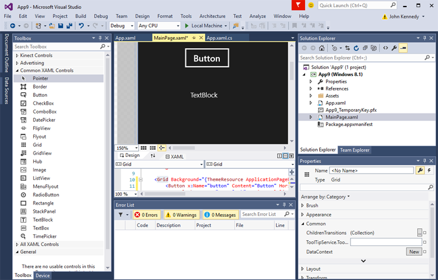
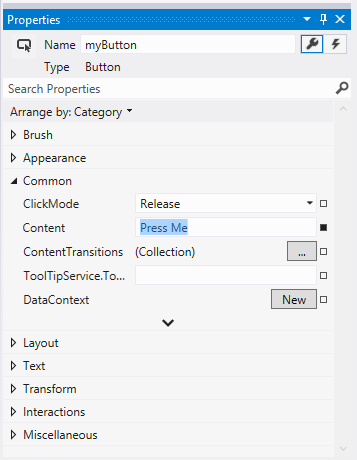
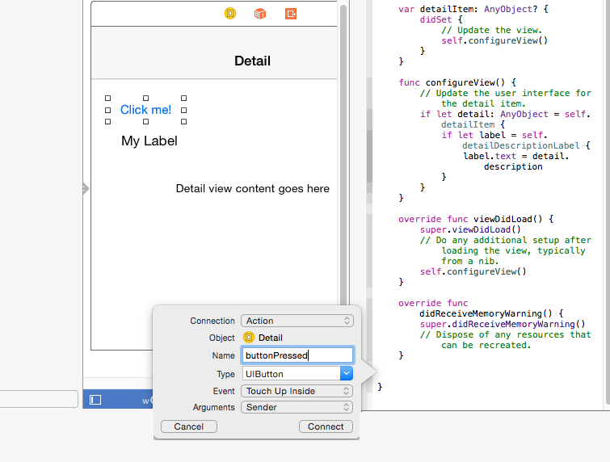
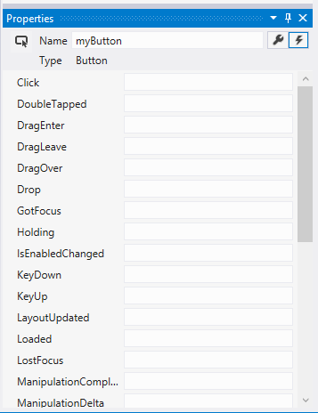
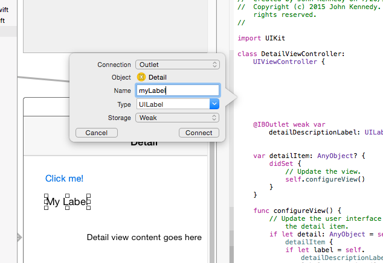
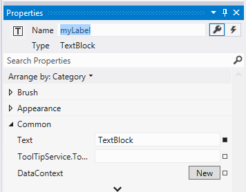
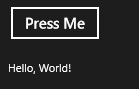

# Getting started: Getting around in Visual Studio


## Getting around in Microsoft Visual Studio

Let's now get back to the project that we created earlier, and look at how you might find your way around the Microsoft Visual Studio integrated development environment (IDE).

If you are an Xcode developer, the default view below should be familiar, with source files in the left pane, the editor (either the UI or source code) in the center pane, and controls and their properties in the right pane.



Microsoft Visual Studio looks very similar, although the default view has the controls on the left side in the **Toolbox**. The source files are in the **Solution Explorer** on the right side, and properties are in **Properties** under the **Solution Explorer** pane, like this:



If this feels a little alien to you, you'll be pleased to know you can rearrange the panes in Visual Studio to place the source files on the left of the screen and the toolbox on the right. In fact, you can click and drag the title bar of any pane to reposition it, and Visual Studio will display a shaded box telling you where it will be docked once you release it. Many panes also have a small drawing pin icon in their title bar. This allows you to pin the panel as-is, locking it in place. Unpin the pane, and it can be collapsed to save space: useful if your monitor is on the smaller side. If you mess things up (don't worry, we've all done it), select **Reset Window Layout** from the **Window** menu to restore order.

## Adding controls, setting their properties, and responding to events

Let's now add some controls to your project. We'll then change some of their properties, and write some code to respond to one of the control's events.

To add controls in Xcode, you open up the desired .xib file or the Storyboard and then drag and drop controls, such as a**Round Rect Button** or a **Label**, as shown below:



Let's do something similar in Visual Studio. From the **Toolbox**, drag the **Button** control, and then drop it onto the MainPage.xaml file's design surface.

Do the same with the **TextBlock** control, so it looks like this:



Unlike Xcode, which hides the layout and binding information inside a .xib or Storyboard file, Visual Studio encourages you to edit the XAML files used to store these details it its rich, editable, declarative, XML-like language. For more info about Extensible Application Markup Language (XAML), see [XAML overview](../xaml-platform/xaml-overview.md). For now, know that everything displayed in the **Design** pane is defined in the **XAML** pane. The **XAML** pane allows for fine control where necessary, and as you learn more about it, you can quickly develop user interface code manually. For now, however, let's focus on just the **Design** and **Properties** panes.

Let's change the button's details. As you will know, to change the button's name in Xcode, you would change the value of the **Title** field in its properties panel.

When using Visual Studio you do something very similar. In the **Design** pane, tap the button to give it focus. Then in the **Properties** pane, alter the **Content** value from "Button" to "Press Me". Next, update the name of the button control, by changing the **Name** value from "&lt;No Name&gt;" to "myButton", as shown here:



Now, let's write some code to change the **TextBlock** control's contents to "Hello, World!" after the user taps the button.

In Xcode, you would associate an event with a control by writing code and then associating that code with the control, often by control-dragging the button into the source code, like this:



```swift
// Swift implementation.

@IBAction func buttonPressed(sender: UIButton) {
    
}
```

Visual Studio is similar. At the top right of **Properties** is a lightning bolt button. This is where the possible events associated with the selected control are listed, like this:



To add code for the button's click event, first select the button in the **Design** pane. Next, click the lightning bolt button, and double-click the empty box next to the name **Click**. Visual Studio then adds the event "myButton\_Click" to the **Click** box, and then adds and displays the corresponding event handler in the MainPage.xaml.cs file, like this.

```csharp
private void myButton_Click(object sender, RoutedEventArgs e)
{

}
```

Let's now hook-up the **TextBlock** control. In Xcode, you would control-drag the button to the source code file to associate the control with its definition, like this.



```swift
// Swift implentation.

@IBOutlet weak var myLabel : UILabel
```

In Visual Studio, you don't need associated the control as this is always done for you. Let's change some of the properties though:

1.  Tap the MainPage.xaml file tab.
2.  In the **Design** pane, tap the **TextBlock** control.
3.  In the **Properties** pane, tap the wrench button to display its properties.
4.  In the **Name** box, change "&lt;No Name&gt;" to "myLabel".



Let's now add some code to the button's click event. To do this, tap the MainPage.xaml.cs file, and add the following code to the myButton\_Click event handler.

```csharp
private void myButton_Click(object sender, RoutedEventArgs e)
{
    // Add the following line of code.    
    myLabel.Text = "Hello, World!";
}
```

This is similar to what you would write in Swift:

```swift
@IBAction func buttonPressed(sender: UIButton) {
    myLabel.text = "Hello, World!"
}
```

Finally, to run the app, select the **Debug** menu, and then select **Start Debugging** (or just press F5). After the app starts, click the "Press Me" button, and see the label's contents change from "TextBlock" to "Hello, World!", as shown in the following figure.



To quit the app, return to Visual Studio, tap the **Debug** menu, and then tap **Stop Debugging** (or just press SHIFT + F5). Notice that Visual Studio lets you try the app in many different devices, to check how it will perform in each.

## Next step

[Getting started: Common Controls](getting-started-common-controls.md)