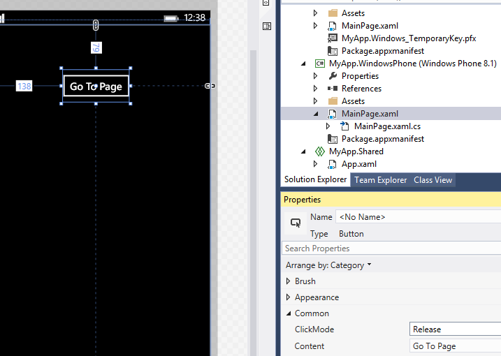
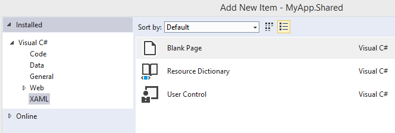
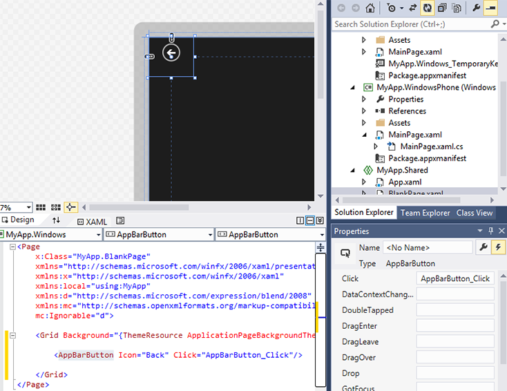

# Getting started: Navigation


## Adding navigation

iOS provides the **UINavigationController** class to help with in-app navigation: you can push and pop views to create the hierarchy of **UIViewControllers** that define your app.

In contrast, a Windows 10 app containing multiple views takes more of a web-site approach to navigation. You can imagine your users hopping from page to page as they click on controls to work their way through the app. For more info, see [Navigation design basics](../design/basics/navigation-basics.md).

One of the ways to manage this navigation in a Windows 10 app is to use the [**Frame**](/uwp/api/Windows.UI.Xaml.Controls.Frame) class. The following walkthrough shows you how to try this out.

Continuing with the solution you started earlier, open the **MainPage.xaml** file, and add a button in the **Design** view. Change the button's **Content** property from "Button" to "Go To Page". Then, create a handler for the button's **Click** event, as shown in the following figure. If you don't remember how to do this, review the walkthrough in the previous section (Hint: double-click the button in the **Design** view).



Let's add a new page. In the **Solution** view, tap the **Project** menu, and tap **Add New Item**. Tap **Blank Page** as shown in the following figure, and then tap **Add**.



Next, add a button to the BlankPage.xaml file. Let's use the AppBarButton control, and let's give it a back arrow image: in the **XAML** view, add ` <AppBarButton Icon="Back"/>` between the `<Grid> </Grid>` elements.

Now, let's add an event handler to the button: double-click the control in the **Design** view and Microsoft Visual Studio adds the text "AppBarButton\_Click" to the **Click** box, as shown in the following figure, and then adds and displays the corresponding event handler in the BlankPage.xaml.cs file.



If you return to the BlankPage.xaml file's **XAML** view, the `<AppBarButton>` element's Extensible Application Markup Language (XAML) code should now look like this:

` <AppBarButton Icon="Back" Click="AppBarButton_Click"/>`

Return to the BlankPage.xaml.cs file, and add this code to go to the previous page after the user taps the button.

```csharp
private void AppBarButton_Click(object sender, RoutedEventArgs e)
{
    // Add the following line of code.    
    Frame.GoBack();
}
```

Finally, open the MainPage.xaml.cs file and add this code. It opens BlankPage after the user taps the button.

```csharp
private void Button_Click(object sender, RoutedEventArgs e)
{
    // Add the following line of code.
    Frame.Navigate(typeof(BlankPage1));
}
```

Now, run the program. Tap the "Go To Page" button to go to the other page, and then tap the back-arrow button to return to the previous page.

Page navigation is managed by the [**Frame**](/uwp/api/Windows.UI.Xaml.Controls.Frame) class. As the **UINavigationController** class in iOS uses **pushViewController** and **popViewController** methods, the **Frame** class for UWP apps provides [**Navigate**](/uwp/api/windows.ui.xaml.controls.frame.navigate) and [**GoBack**](/uwp/api/windows.ui.xaml.controls.frame.goback) methods. The **Frame** class also has a method called [**GoForward**](/uwp/api/windows.ui.xaml.controls.frame.goforward), which does what you might expect.

This walkthrough creates a new instance of BlankPage each time you navigate to it. (The previous instance will be freed, or *released*, automatically). If you don't want a new instance to be created each time, add the following code to the BlankPage class's constructor in the BlankPage.xaml.cs file. This will enable the [**NavigationCacheMode**](/uwp/api/windows.ui.xaml.controls.page.navigationcachemode) behavior.

```csharp
public BlankPage()
{
    this.InitializeComponent();
    // Add the following line of code.
    this.NavigationCacheMode = Windows.UI.Xaml.Navigation.NavigationCacheMode.Enabled;
}
```

You can also get or set the **Frame** class's [**CacheSize**](/uwp/api/windows.ui.xaml.controls.frame.cachesize) property to manage how many pages in the navigation history can be cached.

For more info about navigation, see [Navigation](../design/basics/navigation-basics.md) and [XAML personality animations sample](https://github.com/microsoftarchive/msdn-code-gallery-microsoft/tree/411c271e537727d737a53fa2cbe99eaecac00cc0/Official%20Windows%20Platform%20Sample/Windows%208%20app%20samples/%5BC%23%5D-Windows%208%20app%20samples/C%23/Windows%208%20app%20samples/XAML%20personality%20animations%20sample%20(Windows%208)).

**Note**  For info about navigation for UWP apps using JavaScript and HTML, see [Quickstart: Using single-page navigation](/previous-versions/windows/apps/hh452768(v=win.10)).
 
### Next step

[Getting started: Animation](getting-started-animation.md)