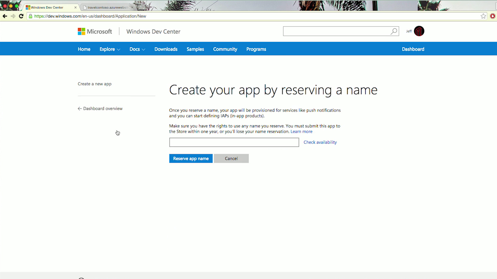
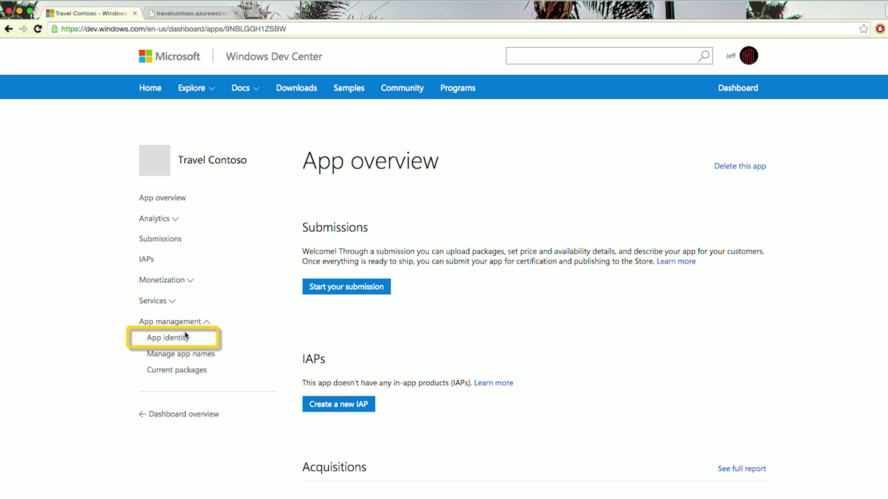

# Convert your existing Chrome app to a UWP app

We have made it easy to convert your existing Chrome hosted app to an app running on the Universal Windows Platform (UWP). There are two ways to convert your Chrome app:

- Option #1: [ManifoldJS](http://manifoldjs.com/) now accepts Chrome manifests as a form of input. 

- Option #2: We have developed a [CLI tool](https://github.com/MicrosoftEdge/hwa-cli) that generates an `.appx` package from your existing `.zip` or `.crx` files.

## Convert your existing Chrome app using the Command-Line Interface

1. Install [NodeJS](https://nodejs.org/en/) and it's package manager, [npm](https://www.npmjs.com/). 

2. Open a command prompt window to the directory of your choice

3. Install Hosted Web Apps (HWA) Command Line Interface (CLI) by entering the following in your command line: `npm i -g hwa-cli`

4. Convert your Chrome package (`.crx` and `.zip` are the supported package formats), by entering the following in your command line: `hwa convert path/to/chrome/app.crx` or `hwa convert path/to/chrome/app.zip`

	**Replace `path/to/chrome/app` with the path information leading to your chrome app.*
    
5. The generated `.appx` will appear in the same folder as your Chrome package. You are now ready to upload your app to the Microsoft Store. 

## Uploading your app to the Microsoft Store

To upload your app, visit the Dashboard in the [Windows Dev Center](https://developer.microsoft.com/windows). Click on "[Create a new app](https://developer.microsoft.com/dashboard/Application/New)" and and reserve your app name.

Upload your `AppX` package by navigating to the "Packages" page in the Submissions section.

Fill out the Microsoft Store prompts.

	During the conversion process, you will be prompted for an Identity Name, Publisher Identity, and Publisher Display Name. To retrieve these values, visit the Dashboard in the [Windows Dev Center](https://developer.microsoft.com/windows).
	- Click on "[Create a new app](https://developer.microsoft.com/dashboard/Application/New)" and reserve your app name.

	- Next, click on "App identity" in the menu on the left under the "App management" section.
	
	- You should see the three values for which you are prompted listed on the page: 
		1. Identity Name: `Package/Identity/Name`
		2. Publisher Identity: `Package/Identity/Publisher`
		3. Publisher Display Name: `Package/Properties/PublisherDisplayName`

## Guide for migrating your Hosted Web App

After packaging your web app for the Microsoft Store, customize it so that it works great across all Windows-based devices, including PCs, tablets, phones, HoloLens, Surface Hub, Xbox and Raspberry Pi.

### Application Content URI Rules

[Application Content URI Rules (ACURs)](./hwa-access-features.md) or Content URIs define the scope of your Hosted Web App through a URL allow list in your app package manifest. In order to control the communication to and from remote content, you must define which URLs are included in, and/or excluded from, this list. If a user clicks a URL that is not explicitly included, Windows will open the target path in the default browser. With ACURs, you are also able to grant a URL access to [Universal Windows APIs](https://msdn.microsoft.com/library/windows/apps/br211377.aspx).

At the very minimum, your rules should include your app’s start page. The conversion tool will automatically create a set of ACURs for you, based on your start page and its domain. However, if there are any programmatic redirects, whether on the server or on the client, those destinations will need to be added to the allow list.

*Note: ACURs only apply to page navigation. Images, JavaScript libraries, and other similar assets are not affected by these restrictions.*

Many apps use third-party sites for their login flows, e.g. Facebook and Google. The conversion tool will automatically create a set of ACURs for you, based on the most popular sites. If your method of authentication is not included in that list, and it’s a redirect flow, you will need to add its path(s) as an ACUR. You can also consider using a [web authentication broker](./hwa-access-features.md).

### Flash

Flash is not allowed in Windows 10 apps. You will need to make sure your app experience is not affected by its absence.

For ads, you will need to make sure your ad provider has an HTML5 option. You can check out [Bing Ads](https://bingads.microsoft.com/) and [Ads in Apps](http://adsinapps.microsoft.com/).

YouTube videos should still work, as they now [default to HTML5 `<video>`,](http://youtube-eng.blogspot.com/2015/01/youtube-now-defaults-to-html5_27.html) so long as you are using the [`<iframe>` embed method](https://developers.google.com/youtube/iframe_api_reference). If your app still uses the Flash API, you will need to switch to the aforementioned style of embed.

### Image assets

The Chrome web store already [requires a 128x128 app icon image](https://developer.chrome.com/webstore/images) in your app package. For Windows 10 apps, you must supply 44x44, 50x50, 150x150, and 600x350 app icon images, at the very minimum. The conversion tool will automatically create these images for you, based on the 128x128 image. For a richer, more polished app experience, we highly recommend creating your own image files. Here are some [guidelines for tile and icon assets](https://msdn.microsoft.com/library/windows/apps/mt412102.aspx).

### Capabilities

App capabilities must be [declared](https://msdn.microsoft.com/windows/uwp/packaging/app-capability-declarations) in your package manifest in order to access certain APIs and resources. The conversion tool will automatically enable three popular device capabilities for you: location, microphone, and webcam. With the former, the system will still prompt the user for permission before granting access.

*Note: Users are notified of all the capabilities that an app declares. We would recommend removing any capabilities that your app does not need.*

### File downloads

Traditional file downloads, like you see in the browser, are not currently supported.

### Chrome platform APIs

Chrome provides apps with [special-purpose APIs](https://developer.chrome.com/apps/api_index) that can be run as background script. These are not supported. You can find equivalent functionality, and much more, with the [Windows Runtime APIs](https://msdn.microsoft.com/library/windows/apps/br211377.aspx).

## Related topics

- [Enhance your web app by accessing Universal Windows Platform (UWP) features](./hwa-access-features.md)
- [Guide to Universal Windows Platform (UWP) apps](http://go.microsoft.com/fwlink/p/?LinkID=397871)
- [Download design assets for UWP apps](https://msdn.microsoft.com/library/windows/apps/xaml/bg125377.aspx)