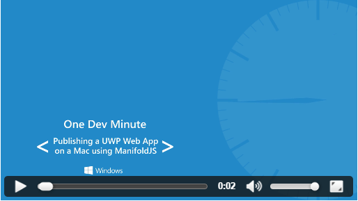

# Create your Hosted Web App using a Mac

Quickly create a Universal Windows Platform app for Windows 10 starting with just a website URL. 

> [!NOTE]
> The following instructions are for use with a Mac development platform. Windows users, visit [instructions on using a Windows development platform](./hwa-create-windows.md).

## What you need to develop on Mac

- A web browser.
- A command prompt.

## Option 1: ManifoldJS

[ManifoldJS](http://manifoldjs.com/) is a Node.js app that easily installs from NPM. It takes the meta-data about your web site and generates native hosted apps across Android, iOS, and Windows. If your site does not have a [web app manifest](https://www.w3.org/TR/appmanifest/), one will be automatically generated for you.

1. Install [NodeJS](https://nodejs.org/) which includes NPM (Node Package Manager). <br>

2. Open a command prompt and NPM install ManifoldJS:
```
npm install -g manifoldjs
```

3. Run the `manifoldjs` command on your web site URL:
```
manifoldjs http://codepen.io/seksenov/pen/wBbVyb/?editors=101
```

4. Follow the steps in the video below to complete the packaging and publish your Hosted Web App to the Microsoft Store.

[](https://sec.ch9.ms/ch9/0a67/9b06e5c7-d7aa-478d-b30d-f99e145a0a67/ManifoldJS_high.mp4 "Publishing a UWP Web App on a Mac using ManifoldJS")

## Option 2: App Studio

[App Studio](http://appstudio.windows.com/) is a free, online app creation tool that allows you to quickly build Windows 10 apps.

1. Open [App Studio](http://appstudio.windows.com/) in your web browser.

2. Click **Start now!**.

3. Under **Web app templates**, click **Hosted Web App**.

4. Follow the on-screen instructions to generate a package ready for publishing to the Microsoft Store.

## Related topics

- [Enhance your web app by accessing Universal Windows Platform (UWP) features](./hwa-access-features.md)
- [Guide to Universal Windows Platform (UWP) apps](http://go.microsoft.com/fwlink/p/?LinkID=397871)
- [Download design assets for UWP apps](https://msdn.microsoft.com/library/windows/apps/xaml/bg125377.aspx)