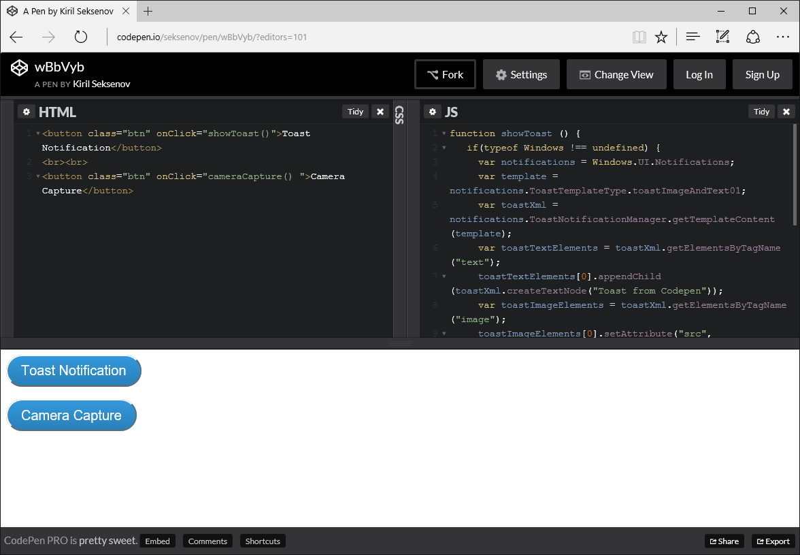
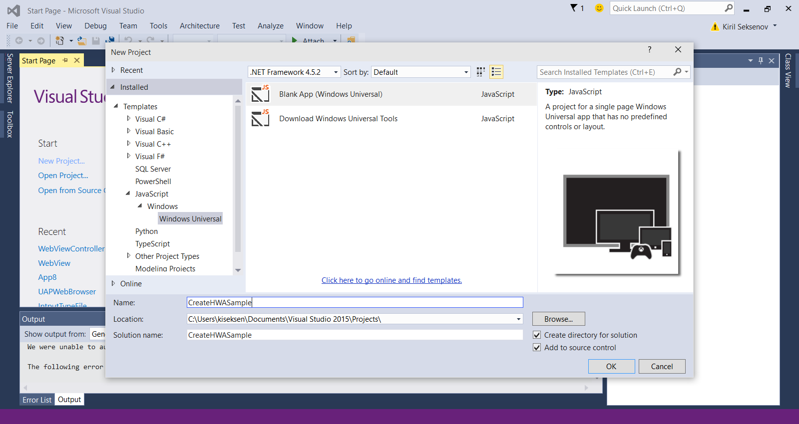
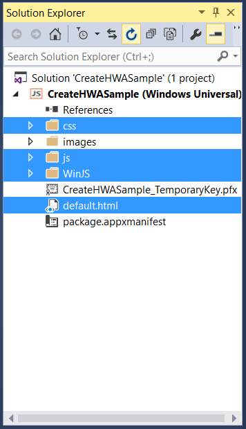
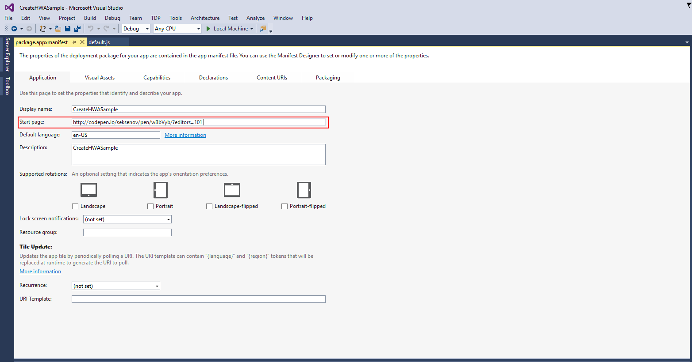
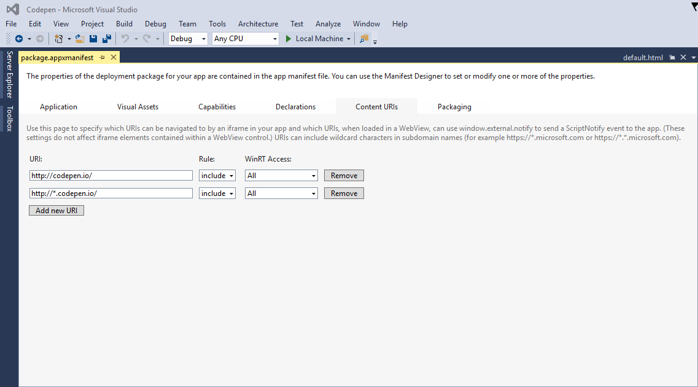
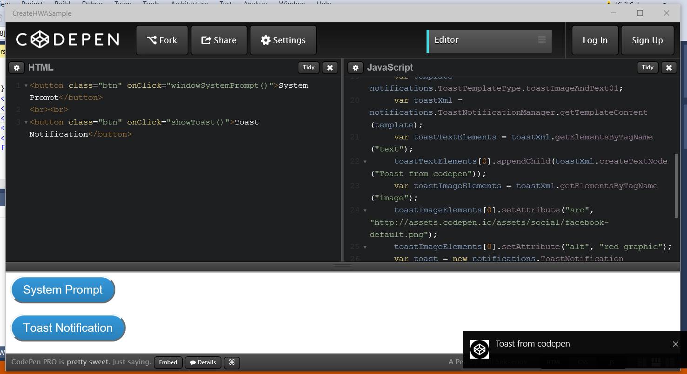

# Convert your web application to a Universal Windows Platform (UWP) app

Learn how to quickly create a Universal Windows Platform app for Windows 10 starting with just a website URL. 

> [!NOTE]
> The following instructions are for use with a Windows development platform. Mac users, visit [instructions on using a Mac development platform](./hwa-create-mac.md).

## What you need to develop on Windows

- [Visual Studio 2015.](https://www.visualstudio.com/) The free, full-featured Visual Studio Community 2015 includes the Windows 10 developer tools, universal app templates, a code editor, a powerful debugger, Windows Mobile emulators, rich language support, and much more—all ready to use in production.
- (Optional) [Windows Standalone SDK for Windows 10.](https://dev.windows.com/downloads/windows-10-sdk) If you are using a development environment other than Visual Studio 2015, you can download a standalone Windows SDK for Windows 10 installer. Note that you do not need to install this SDK if you're using Visual Studio 2015; it is already included.

## Step 1: Pick a website URL
Choose an existing website that will work great as a single-page app. We highly recommend that you are the owner or developer of the site, this way you will be able to make all the necessary changes. If you do not have a URL in mind, try using this [Codepen example](http://codepen.io/seksenov/pen/wBbVyb/?editors=101) as the website. Copy your URL, or the Codepen URL, to use throughout the tutorial. 



## Step 2: Create a blank JavaScript app

Launch Visual Studio.
1. Click **File**.
2. Click **New Project**.
3. Under **JavaScript** then **Windows Universal**, click **Blank App (Windows Universal)**.



## Step 3: Delete any packaged code

Since this is a hosted web app, where the content is served from a remote server, you will not need most of the local app files that come with the JavaScript template by default. Delete any local HTML, JavaScript, or CSS resources. All that should remain is the `package.appxmanifest` file, where you configure the app, and the image resources.



## Step 4: Set the start page URL

1. Open the `package.appxmanifest` file.
2. Under the **Application** tab, find the **Start page** text field.
3. Replace `default.html` with your website URL.



## Step 5: Define the boundaries of your web app

Application Content URI Rules (ACURs) specify which remote URLs are allowed access to your app and to the Universal Windows APIs. At the very minimum, you will need to add an ACUR for your start page and any web resources utilized by that page. For more information on ACURs, [click here](./hwa-access-features.md).
1. Open the `package.appxmanifest` file.
2. Click the **Content URIs** tab.
3. Add any necessary URIs for your start page.

For example:
```
1. http://codepen.io/seksenov/pen/wBbVyb/?editors=101
2. http://*.codepen.io/
```
4. Set the **WinRT Access** to **All** for each URI you added.



## Step 6: Run your app

At this point, you have a fully functioning Windows 10 app capable of accessing the Universal Windows APIs!

If you are following along with our Codepen example, click the **Toast Notification** button to call a Windows API from hosted script.



## Bonus: Add camera capture

Copy and paste the JavaScript code below to enable camera capture. If you are following along with your own website, create a button to invoke the `cameraCapture()` method. If you are following along with our Codepen example, a button is already present in HTML. Click the button and a take a picture.

```JavaScript
function cameraCapture() {
  if(typeof Windows != 'undefined') {
   var captureUI = new Windows.Media.Capture.CameraCaptureUI();
   //Set the format of the picture that's going to be captured (.png, .jpg, ...)
   captureUI.photoSettings.format = Windows.Media.Capture.CameraCaptureUIPhotoFormat.png;
   //Pop up the camera UI to take a picture
   captureUI.captureFileAsync(Windows.Media.Capture.CameraCaptureUIMode.photo).then(function (capturedItem) {
      // Do something with the picture
   });
  }
}
```

## Related topics

- [Enhance your web app by accessing Universal Windows Platform (UWP) features](hwa-access-features.md)
- [Guide to Universal Windows Platform (UWP) apps](http://go.microsoft.com/fwlink/p/?LinkID=397871)
- [Download design assets for UWP apps](https://msdn.microsoft.com/library/windows/apps/xaml/bg125377.aspx)