# Apply runtime fixes to an MSIX package by using the Package Support Framework

The Package Support Framework is an open source kit that helps you apply fixes to your existing win32 application when you don't have access to the source code, so that it can run in an MSIX container. The Package Support Framework helps your application follow the best practices of the modern runtime environment.

To learn more, see [Package Support Framework](https://docs.microsoft.com/windows/msix/package-support-framework-overview).

This guide will help you to identify application compatibility issues, and to find, apply, and extend runtime fixes that address them.

<a id="identify" />

## Identify packaged application compatibility issues

First, create a package for your application. Then, install it, run it, and observe its behavior. You might receive error messages that can help you identify a compatibility issue. You can also use [Process Monitor](https://docs.microsoft.com/en-us/sysinternals/downloads/procmon) to identify issues.  Common issues relate to application assumptions regarding the working directory and program path permissions.

### Using Process Monitor to identify an issue

[Process Monitor](https://docs.microsoft.com/en-us/sysinternals/downloads/procmon) is a powerful utility for observing an app's file and registry operations, and their results.  This can help you to understand application compatibility issues.  After opening Process Monitor, add a filter (Filter > Filter…) to include only events from the application executable.

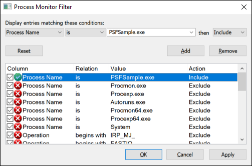

A list of events will appear. For many of these events, the word **SUCCESS** will appear in the **Result** column.

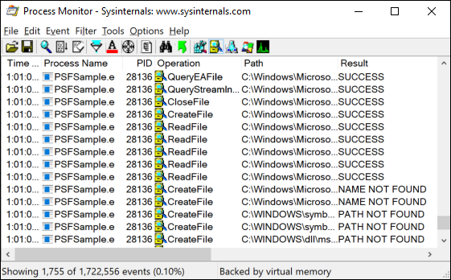

Optionally, you can filter events to only show only failures.

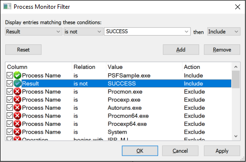

If you suspect a filesystem access failure, search for failed events that are under either the System32/SysWOW64 or the package file path. Filters can also help here, too. Start at the bottom of this list and scroll upwards. Failures that appear at the bottom of this list have occurred most recently. Pay most attention to errors that contain strings such as "access denied," and "path/name not found", and ignore things that don't look suspicious. The [PSFSample](https://github.com/Microsoft/MSIX-PackageSupportFramework/blob/master/samples/PSFSample/) has two issues. You can see those issues in the list that appears in the following image.

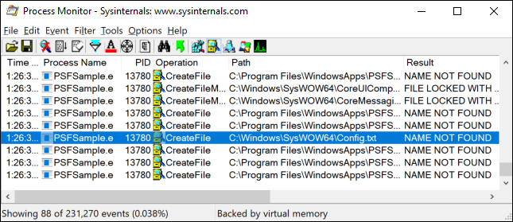

In the first issue that appears in this image, the application is failing to read from the "Config.txt" file that is located in the "C:\Windows\SysWOW64" path. It's unlikely that the application is trying to reference that path directly. Most likely, it's trying to read from that file by using a relative path, and by default, "System32/SysWOW64" is the application's working directory. This suggests that the application is expecting its current working directory to be set to somewhere in the package. Looking inside of the appx, we can see that the file exists in the same directory as the executable.

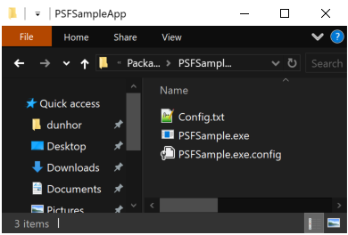

The second issue appears in the following image.

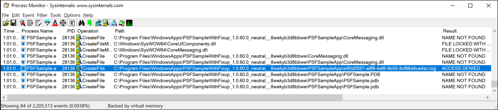

In this issue, the application is failing to write a .log file to its package path. This would suggest that a file redirection fixup might help.

<a id="find" />

## Find a runtime fix

The PSF contains runtime fixes that you can use right now, such as the file redirection fixup.

### File Redirection Fixup

You can use the [File Redirection Fixup](https://github.com/Microsoft/MSIX-PackageSupportFramework/tree/master/fixups/FileRedirectionFixup) to redirect attempts to write or read data in a directory that isn't accessible from an application that runs in an MSIX container.

For example, if your application writes to a log file that is in the same directory as your applications executable, then you can use the [File Redirection Fixup](https://github.com/Microsoft/MSIX-PackageSupportFramework/tree/master/fixups/FileRedirectionFixup) to create that log file in another location, such as the local app data store.

### Runtime fixes from the community

Make sure to review the community contributions to our [GitHub](https://github.com/Microsoft/MSIX-PackageSupportFramework) page. It's possible that other developers have resolved an issue similar to yours and have shared a runtime fix.

## Apply a runtime fix

You can apply an existing runtime fix with a few simple tools from the Windows SDK, and by following these steps.

> [!div class="checklist"]
> * Create a package layout folder
> * Get the Package Support Framework files
> * Add them to your package
> * Modify the package manifest
> * Create a configuration file

Let's go through each task.

### Create the package layout folder

If you have a .msix (or .appx) file already, you can unpack its contents into a layout folder that will serve as the staging area for your package. You can do this from a command prompt using makemsix tool, based on your installation path of the SDK, this is where you will find the makemsix.exe tool on your Windows 10 PC:
x86: C:\Program Files (x86)\Windows Kits\10\bin\x86\makemsix.exe
x64: C:\Program Files (x86)\Windows Kits\10\bin\x64\makemsix.exe

```ps
makemsix unpack /p PSFSamplePackage_1.0.60.0_AnyCPU_Debug.msix /d PackageContents

```

This will give you something that looks like the following.

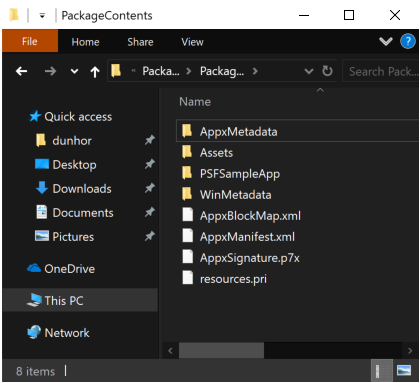

If you don't have a .msix (or .appx) file to start with, you can create the package folder and files from scratch.

### Get the Package Support Framework files

You can get the PSF Nuget package by using the standalone Nuget command line tool or via Visual Studio.

#### Get the package by using the command line tool

Install the Nuget command line tool from this location: https://www.nuget.org/downloads. Then, from the Nuget command line, run this command:

```ps
nuget install Microsoft.PackageSupportFramework
```

#### Get the package by using Visual Studio

In Visual Studio, right-click your solution or project node and pick one of the Manage Nuget Packages commands.  Search for **Microsoft.PackageSupportFramework** or **PSF** to find the package on Nuget.org. Then, install it.

### Add the Package Support Framework files to your package

Add the required 32-bit and 64-bit PSF  DLLs and executable files to the package directory. Use the following table as a guide. You'll also want to include any runtime fixes that you need. In our example, we need the file redirection runtime fix.

| Application executable is x64 | Application executable is x86 |
|-------------------------------|-----------|
| [PSFLauncher64.exe](https://github.com/Microsoft/MSIX-PackageSupportFramework/tree/master/PsfLauncher/readme.md) |  [PSFLauncher32.exe](https://github.com/Microsoft/MSIX-PackageSupportFramework/tree/master/PsfLauncher/readme.md) |
| [PSFRuntime64.dll](https://github.com/Microsoft/MSIX-PackageSupportFramework/tree/master/PsfRuntime/readme.md) | [PSFRuntime32.dll](https://github.com/Microsoft/MSIX-PackageSupportFramework/tree/master/PsfRuntime/readme.md) |
| [PSFRunDll64.exe](https://github.com/Microsoft/MSIX-PackageSupportFramework/blob/master/PsfRunDll/readme.md) | [PSFRunDll32.exe](https://github.com/Microsoft/MSIX-PackageSupportFramework/blob/master/PsfRunDll/readme.md) |

Your package content should now look something like this.

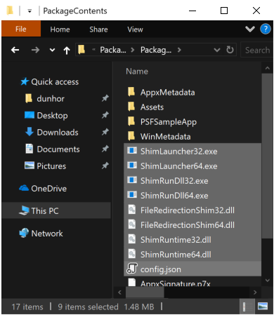

### Modify the package manifest

Open your package manifest in a text editor, and then set the `Executable` attribute of the `Application` element to the name of the PSF launcher executable file.  If you know the architecture of your target application, select the appropriate version, PSFLauncher32.exe or PSFLauncher64.exe.  If not, PSFLauncher32.exe will work in all cases.  Here's an example.

```xml
<Package ...>
  ...
  <Applications>
    <Application Id="PSFSample"
                 Executable="PSFLauncher32.exe"
                 EntryPoint="Windows.FullTrustApplication">
      ...
    </Application>
  </Applications>
</Package>
```

### Create a configuration file

Create a file name ``config.json``, and save that file to the root folder of your package. Modify the declared app ID of the config.json file to point to the executable that you just replaced. Using the knowledge that you gained from using Process Monitor, you can also set the working directory as well as use the file redirection fixup to redirect reads/writes to .log files under the package-relative "PSFSampleApp" directory.

```json
{
    "applications": [
        {
            "id": "PSFSample",
            "executable": "PSFSampleApp/PSFSample.exe",
            "workingDirectory": "PSFSampleApp/"
        }
    ],
    "processes": [
        {
            "executable": "PSFSample",
            "fixups": [
                {
                    "dll": "FileRedirectionFixup.dll",
                    "config": {
                        "redirectedPaths": {
                            "packageRelative": [
                                {
                                    "base": "PSFSampleApp/",
                                    "patterns": [
                                        ".*\\.log"
                                    ]
                                }
                            ]
                        }
                    }
                }
            ]
        }
    ]
}
```

Following is a guide for the config.json schema:

| Array | key | Value |
|-------|-----------|-------|
| applications | id |  Use the value of the `Id` attribute of the `Application` element in the package manifest. |
| applications | executable | The package-relative path to the executable that you want to start. In most cases, you can get this value from your package manifest file before you modify it. It's the value of the `Executable` attribute of the `Application` element. |
| applications | workingDirectory | (Optional) A package-relative path to use as the working directory of the application that starts. If you don't set this value, the operating system uses the `System32` directory as the application's working directory. |
| processes | executable | In most cases, this will be the name of the `executable` configured above with the path and file extension removed. |
| fixups | dll | Package-relative path to the fixup, .msix/.appx  to load. |
| fixups | config | (Optional) Controls how the fixup dl behaves. The exact format of this value varies on a fixup-by-fixup basis as each fixup can interpret this "blob" as it wants. |

The `applications`, `processes`, and `fixups` keys are arrays. That means that you can use the config.json file to specify more than one application, process, and fixup DLL.

### Package and Test the App

Next, create a package.

```ps
makeappx pack /d PackageContents /p PSFSamplePackageFixup.msix
```

Then, sign it.

```ps
signtool sign /a /v /fd sha256 /f ExportedSigningCertificate.pfx PSFSamplePackageFixup.msix
```

For more information, see [how to create a package signing certificate](https://docs.microsoft.com/en-us/windows/desktop/appxpkg/how-to-create-a-package-signing-certificate)
and [how to sign a package using signtool](https://docs.microsoft.com/en-us/windows/desktop/appxpkg/how-to-sign-a-package-using-signtool)

Using PowerShell, install the package.

>[!NOTE]
> Remember to uninstall the package first.

```ps
powershell Add-MSIXPackage .\PSFSamplePackageFixup.msix
```

Run the application and observe the behavior with runtime fix applied.  Repeat the diagnostic and packaging steps as necessary.

### Use the Trace Fixup

An alternative technique to diagnosing packaged application compatibility issues is to use the Trace Fixup. This DLL is included with the PSF and provides a detailed diagnostic view of the app's behavior, similar to Process Monitor.  It is specially designed to reveal application compatibility issues.  To use the Trace Fixup, add the DLL to the package, add the following fragment to your config.json, and then package and install your application.

```json
{
    "dll": "TraceFixup.dll",
    "config": {
        "traceLevels": {
            "filesystem": "allFailures"
        }
    }
}
```

By default, the Trace Fixup filters out failures that might be considered "expected".  For example, applications might try to unconditionally delete a file without checking to see if it already exists, ignoring the result. This has the unfortunate consequence that some unexpected failures might get filtered out, so in the above example, we opt to receive all failures from filesystem functions. We do this because we know from before that the attempt to read from the Config.txt file fails with the message "file not found". This is a failure that is frequently observed and not generally assumed to be unexpected. In practice it's likely best to start out filtering only to unexpected failures, and then falling back to all failures if there's an issue that still can't be identified.

By default, the output from the Trace Fixup gets sent to the attached debugger. For this example, we aren't going to attach a debugger, and will instead use the [DebugView](https://docs.microsoft.com/en-us/sysinternals/downloads/debugview) program from SysInternals to view its output. After running the app, we can see the same failures as before, which would point us towards the same runtime fixes.

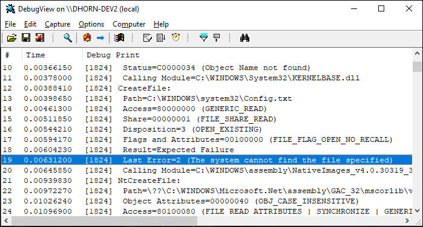

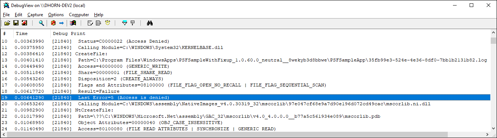

## Debug, extend, or create a runtime fix

You can use Visual Studio to debug a runtime fix, extend a runtime fix, or create one from scratch. You'll need to do these things to be successful.

> [!div class="checklist"]
> * Add a packaging project
> * Add project for the runtime fix
> * Add a project that starts the PSF Launcher executable
> * Configure the packaging project

When you're done, your solution will look something like this.

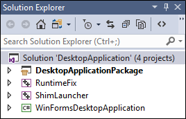

Let's look at each project in this example.

| Project | Purpose |
|-------|-----------|
| DesktopApplicationPackage | This project is based on the [Windows Application Packaging project](desktop-to-uwp-packaging-dot-net.md) and it outputs the MSIX package. |
| Runtimefix | This is a C++ Dynamic-Linked Library project that contains one or more replacement functions that serve as the runtime fix. |
| PSFLauncher | This is C++ Empty Project. This project is a place to collect the runtime distributable files of the Package Support Framework. It outputs an executable file. That executable is the first thing that runs when you start the solution. |
| WinFormsDesktopApplication | This project contains the source code of a desktop application. |

To look at a complete sample that contains all of these types of projects, see [PSFSample](https://github.com/Microsoft/MSIX-PackageSupportFramework/blob/master/samples/PSFSample/).

Let's walk through the steps to create and configure each of these projects in your solution.

### Create a package solution

If you don't already have a solution for your desktop application, create a new **Blank Solution** in Visual Studio.

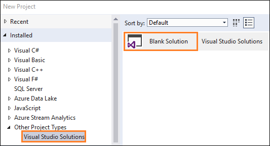

You may also want to add any application projects you have.

### Add a packaging project

If you don't already have a **Windows Application Packaging Project**, create one and add it to your solution.

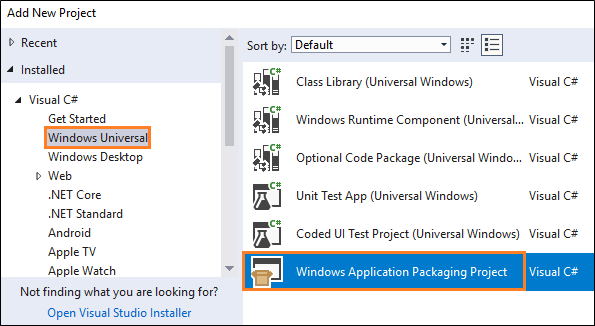

For more information on Windows Application Packaging project, see [Package your application by using Visual Studio](desktop-to-uwp-packaging-dot-net.md).

In **Solution Explorer**, right-click the packaging project, select **Edit**, and then add this to the bottom of the project file:

```xml
<Target Name="PSFRemoveSourceProject" AfterTargets="ExpandProjectReferences" BeforeTargets="_ConvertItems">
<ItemGroup>
  <FilteredNonWapProjProjectOutput Include="@(_FilteredNonWapProjProjectOutput)">
  <SourceProject Condition="'%(_FilteredNonWapProjProjectOutput.SourceProject)'=='<your runtime fix project name goes here>'" />
  </FilteredNonWapProjProjectOutput>
  <_FilteredNonWapProjProjectOutput Remove="@(_FilteredNonWapProjProjectOutput)" />
  <_FilteredNonWapProjProjectOutput Include="@(FilteredNonWapProjProjectOutput)" />
</ItemGroup>
</Target>
```

### Add project for the runtime fix

Add a C++ **Dynamic-Link Library (DLL)** project to the solution.

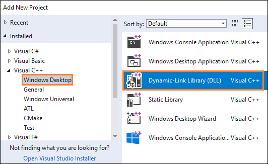

Right-click the that project, and then choose **Properties**.

In the property pages, find the **C++ Language Standard** field, and then in the drop-down list next to that field, select the **ISO C++17 Standard (/std:c++17)** option.

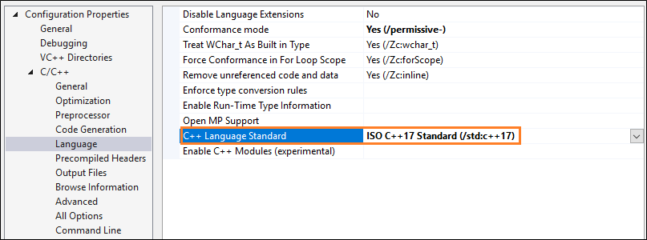

Right-click that project, and then in the context menu, choose the **Manage Nuget Packages** option. Ensure that the **Package source** option is set to **All** or **nuget.org**.

Click the settings icon next that field.

Search for the *PSF** Nuget package, and then install it for this project.

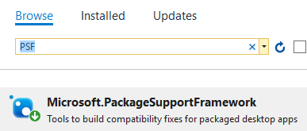

If you want to debug or extend an existing runtime fix, add the runtime fix files that you obtained by using the guidance described in the [Find a runtime fix](#find) section of this guide.

If you intend to create a brand new fix, don't add anything to this project just yet. We'll help you add the right files to this project later in this guide. For now, we'll continue setting up your solution.

### Add a project that starts the PSF Launcher executable

Add a C++ **Empty Project** project to the solution.


Add the **PSF** Nuget package to this project by using the same guidance described in the previous section.

Open the property pages for the project, and in the **General** settings page, set the **Target Name** property to ``PSFLauncher32`` or ``PSFLauncher64`` depending on the architecture of your application.

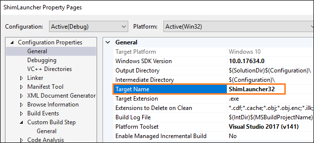

Add a project reference to the runtime fix project in your solution.

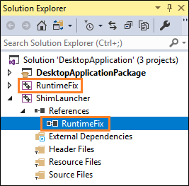

Right-click the reference, and then in the **Properties** window, apply these values.

| Property | Value |
|-------|-----------|
| Copy local | True |
| Copy Local Satellite Assemblies | True |
| Reference Assembly Output | True |
| Link Library Dependencies | False |
| Link Library Dependency Inputs | False |

### Configure the packaging project

In the packaging project, right-click the **Applications** folder, and then choose **Add Reference**.

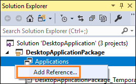

Choose the PSF launcher project and your desktop application project, and then choose the **OK** button.


>[!NOTE]
> If you don't have the source code to your application, just choose the PSF launcher project. We'll show you how to reference your executable when you create a configuration file.

In the **Applications** node, right-click the PSF launcher application, and then choose **Set as Entry Point**.


Add a file named ``config.json`` to your packaging project, then, copy and paste the following json text into the file. Set the **Package Action** property to **Content**.

```json
{
    "applications": [
        {
            "id": "",
            "executable": "",
            "workingDirectory": ""
        }
    ],
    "processes": [
        {
            "executable": "",
            "fixups": [
                {
                    "dll": "",
                    "config": {
                    }
                }
            ]
        }
    ]
}
```

Provide a value for each key. Use this table as a guide.

| Array | key | Value |
|-------|-----------|-------|
| applications | id |  Use the value of the `Id` attribute of the `Application` element in the package manifest. |
| applications | executable | The package-relative path to the executable that you want to start. In most cases, you can get this value from your package manifest file before you modify it. It's the value of the `Executable` attribute of the `Application` element. |
| applications | workingDirectory | (Optional) A package-relative path to use as the working directory of the application that starts. If you don't set this value, the operating system uses the `System32` directory as the application's working directory. |
| processes | executable | In most cases, this will be the name of the `executable` configured above with the path and file extension removed. |
| fixups | dll | Package-relative path to the fixup DLL to load. |
| fixups | config | (Optional) Controls how the fixup DLL behaves. The exact format of this value varies on a fixup-by-fixup basis as each fixup can interpret this "blob" as it wants. |

When you're done, your ``config.json`` file will look something like this.

```json
{
  "applications": [
    {
      "id": "DesktopApplication",
      "executable": "DesktopApplication/WinFormsDesktopApplication.exe",
      "workingDirectory": "WinFormsDesktopApplication"
    }
  ],
  "processes": [
    {
      "executable": ".*App.*",
      "fixups": [ { "dll": "RuntimeFix.dll" } ]
    }
  ]
}

```

>[!NOTE]
> The `applications`, `processes`, and `fixups` keys are arrays. That means that you can use the config.json file to specify more than one application, process, and fixup DLL.

### Debug a runtime fix

In Visual Studio, press F5 to start the debugger.  The first thing that starts is the PSF launcher application, which in turn, starts your target desktop application.  To debug the target desktop application, you'll have to manually attach to the desktop application process by choosing **Debug**->**Attach to Process**, and then selecting the application process. To permit the debugging of a .NET application with a native runtime fix DLL, select managed and native code types (mixed mode debugging).  

Once you've set this up, you can set break points next to lines of code in the desktop application code and the runtime fix project. If you don't have the source code to your application, you'll be able to set break points only next to lines of code in your runtime fix project.

>[!NOTE]
> While Visual Studio gives you the simplest development and debugging experience, there are some limitations, so later in this guide, we'll discuss other debugging techniques that you can apply.

## Create a runtime fix

If there isn't yet a runtime fix for the issue that you want to resolve, you can create a new runtime fix by writing replacement functions and including any configuration data that makes sense. Let's look at each part.

### Replacement functions

First, identify which function calls fail when your application runs in an MSIX container. Then, you can create replacement functions that you'd like the runtime manager to call instead. This gives you an opportunity to replace the implementation of a function with behavior that conforms to the rules of the modern runtime environment.

In Visual Studio, open the runtime fix project that you created earlier in this guide.

Declare the ``FIXUP_DEFINE_EXPORTS`` macro and then add a include statement for the `fixup_framework.h` at the top of each .CPP file where you intend to add the functions of your runtime fix.

```c++
#define FIXUP_DEFINE_EXPORTS
#include <fixup_framework.h>
```

>[!IMPORTANT]
>Make sure that the `FIXUP_DEFINE_EXPORTS` macro appears before the include statement.

Create a function that has the same signature of the function who's behavior you want to modify. Here's an example function that replaces the `MessageBoxW` function.

```c++
auto MessageBoxWImpl = &::MessageBoxW;
int WINAPI MessageBoxWFixup(
    _In_opt_ HWND hwnd,
    _In_opt_ LPCWSTR,
    _In_opt_ LPCWSTR caption,
    _In_ UINT type)
{
    return MessageBoxWImpl(hwnd, L"SUCCESS: This worked", caption, type);
}

DECLARE_FIXUP(MessageBoxWImpl, MessageBoxWFixup);
```

The call to `DECLARE_FIXUP` maps the `MessageBoxW` function to your new replacement function. When your application attempts to call the `MessageBoxW` function, it will call the replacement function instead.

#### Protect against recursive calls to functions in runtime fixes

You can optionally apply the `reentrancy_guard` type to your functions that protect against recursive calls to functions in runtime fixes.

For example, you might produce a replacement function for the `CreateFile` function. Your implementation might call the `CopyFile` function, but the implementation of the `CopyFile` function might call the `CreateFile` function. This may lead to an infinite recursive cycle of calls to the `CreateFile` function.

For more information on `reentrancy_guard` see [authoring.md](https://github.com/Microsoft/MSIX-PackageSupportFramework/blob/master/Authoring.md)

### Configuration data

If you want to add configuration data to your runtime fix, consider adding it to the ``config.json``. That way, you can use the `FixupQueryCurrentDllConfig` to easily parse that data. This example parses a boolean and string value from that configuration file.

```c++
if (auto configRoot = ::FixupQueryCurrentDllConfig())
{
    auto& config = configRoot->as_object();

    if (auto enabledValue = config.try_get("enabled"))
    {
        g_enabled = enabledValue->as_boolean().get();
    }

    if (auto logPathValue = config.try_get("logPath"))
    {
        g_logPath = logPathValue->as_string().wstring();
    }
}
```

## Other debugging techniques

While Visual Studio gives you the simplest development and debugging experience, there are some limitations.

First, F5 debugging runs the application by deploying loose files from the package layout folder path, rather than installing from a .msix / .appx package.  The layout folder typically does not have the same security restrictions as an installed package folder. As a result, it may not be possible to reproduce package path access denial errors prior to applying a runtime fix.

To address this issue, use .msix / .appx package deployment rather than F5 loose file deployment.  To create a .msix / .appx package file, use the [MakeMSIX](https://docs.microsoft.com/en-us/windows/desktop/appxpkg/make-appx-package--makeappx-exe-) utility from the Windows SDK, as described above. Or, from within Visual Studio, right-click your application project node and select **Store**->**Create App Packages**.

Another issue with Visual Studio is that it does not have built-in support for attaching to any child processes launched by the debugger.   This makes it difficult to debug logic in the startup path of the target application, which must be manually attached by Visual Studio after launch.

To address this issue, use a debugger that supports child process attach.  Note that it is generally not possible to attach a just-in-time (JIT) debugger to the target application.  This is because most JIT techniques involve launching the debugger in place of the target app, via the ImageFileExecutionOptions registry key.  This defeats the detouring mechanism used by PSFLauncher.exe to inject FixupRuntime.dll into the target app.  WinDbg, included in the [Debugging Tools for Windows](https://docs.microsoft.com/en-us/windows-hardware/drivers/debugger/index), and obtained from the [Windows SDK](https://developer.microsoft.com/en-US/windows/downloads/windows-10-sdk), supports child process attach.  It also now supports directly [launching and debugging a UWP app](https://docs.microsoft.com/en-us/windows-hardware/drivers/debugger/debugging-a-uwp-app-using-windbg#span-idlaunchinganddebuggingauwpappspanspan-idlaunchinganddebuggingauwpappspanspan-idlaunchinganddebuggingauwpappspanlaunching-and-debugging-a-uwp-app).

To debug target application startup as a child process, start ``WinDbg``.

```ps
windbg.exe -plmPackage PSFSampleWithFixup_1.0.59.0_x86__7s220nvg1hg3m -plmApp PSFSample
```

At the ``WinDbg`` prompt, enable child debugging and set appropriate breakpoints.

```ps
.childdbg 1
g
```

(execute until target application starts and breaks into the debugger)

```ps
sxe ld fixup.dll
g
```

(execute until the fixup DLL is loaded)

```ps
bp ...
```

>[!NOTE]
> [PLMDebug](https://docs.microsoft.com/en-us/windows-hardware/drivers/debugger/plmdebug) can be also used to attach a debugger to an app upon launch, and is also included in the [Debugging Tools for Windows](https://docs.microsoft.com/en-us/windows-hardware/drivers/debugger/index).  However, it is more complex to use than the direct support now provided by WinDbg.

## Support and feedback

**Find answers to your questions**

Have questions? Ask us on Stack Overflow. Our team monitors these [tags](http://stackoverflow.com/questions/tagged/project-centennial+or+desktop-bridge). You can also ask us [here](https://social.msdn.microsoft.com/Forums/en-US/home?filter=alltypes&sort=relevancedesc&searchTerm=%5BDesktop%20Converter%5D).
