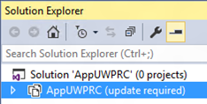

---
author: mcleblanc
description: If you have a Windows 10 project that you created with Microsoft Visual Studio 2015 RC, then you have two options when it comes to updating the project files to the format suitable for Visual Studio 2015 RTM.
title: Update your UWP Microsoft Visual Studio 2015 RC project to RTM
ms.assetid: 104E36CE-36DE-4E9C-A944-711C200B44EF
ms.author: markl
ms.date: 02/08/2017
ms.topic: article
ms.prod: windows
ms.technology: uwp
keywords: windows 10, uwp
---

# Update your UWP Microsoft Visual Studio 2015 RC project to RTM

\[ Updated for UWP apps on Windows 10. For Windows 8.x articles, see the [archive](http://go.microsoft.com/fwlink/p/?linkid=619132) \]

If you have a Windows 10 project that you created with Microsoft Visual Studio 2015 RC, then you have two options when it comes to updating the project files to the format suitable for Visual Studio 2015 RTM. The recommended method is to create a new Windows 10 project in Visual Studio 2015 RTM and copy your files into it. Alternatively, you can follow advanced documentation to edit your existing project files and move them over to the new format.

## What you see when you open a Windows 10Visual Studio 2015 RC project in Visual Studio 2015 RTM

When you open a Windows 10Visual Studio 2015 RC project in Visual Studio 2015 RTM, you'll see an "update required" message in **Solution Explorer**.



If you access the context menu for the project in **Solution Explorer** and choose **Reload Project**, then you'll see this dialog.



## Create a new project and copy files into it

1.  Launch Visual Studio 2015 RTM and create a new Blank Application (Windows Universal) project. Remember that, by default, your new project builds an app package (an appx file) that targets the Universal device family. Change that if you're targeting one or more specific device families.
2.  In your Visual Studio 2015 RC project, identify all of the source code files and visual asset files that you want to copy over. Using File Explorer, copy data models, view models, visual assets, Resource Dictionaries, folder structure, and anything else that you need (including AssemblyInfo.cs), to your new project. Copy or create sub-folders on disk as necessary.
3.  Copy views (for example, MainPage.xaml and MainPage.xaml.cs) into the new project, too. Again, create new sub-folders as necessary, and remove the existing views from the project. But, before you over-write or remove a view that Visual Studio generated, keep a copy because it may be useful to refer to it later.
4.  In **Solution Explorer**, make sure **Show All Files** is toggled on. Select the files that you copied, right-click them, and click **Include In Project**. This will automatically include their containing folders. You can then toggle **Show All Files** off if you like. An alternative workflow, if you prefer, is to use the **Add Existing Item** command, having created any necessary sub-folders in the Visual Studio **Solution Explorer**. Double-check that your visual assets have **Build Action** set to **Content** and **Copy to Output Directory** set to **Do not copy**.
5.  Add references to any extension SDKs that you referenced in your RC project, and copy any changes over from your previous Package.appxmanifest (for example, any capabilities that you declared) to the one in the new RTM project.

## Advanced: Edit your existing project files

One significant difference between the Windows 10 project format of Visual Studio 2015 RC and Visual Studio 2015 RTM is that the RTM format uses [NuGet](http://docs.nuget.org/) version 3. Bear this difference in mind if you intend to manually update your project.

If you do want to manually update your project, or if you're interested in knowing the differences between the project formats of Visual Studio 2015 RC and Visual Studio 2015 RTM, then see [Migrate apps to the Universal Windows Platform (UWP)](http://msdn.microsoft.com/library/mt148501.aspx).

