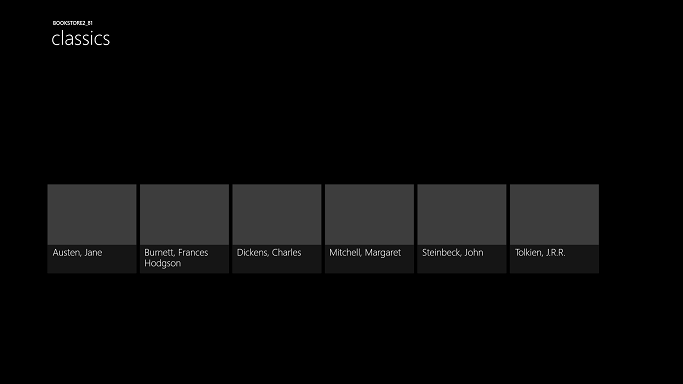
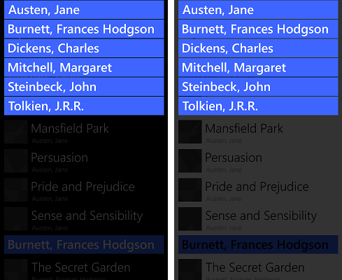
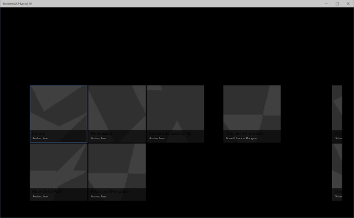
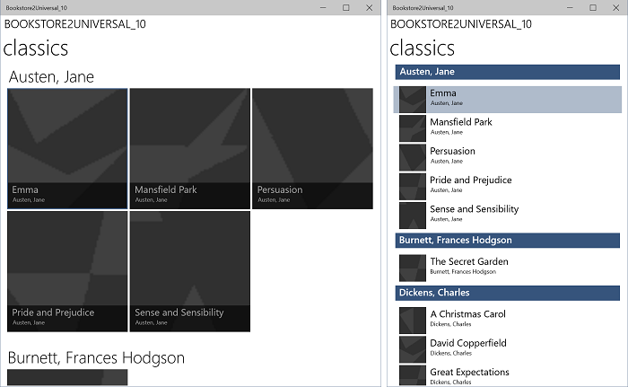
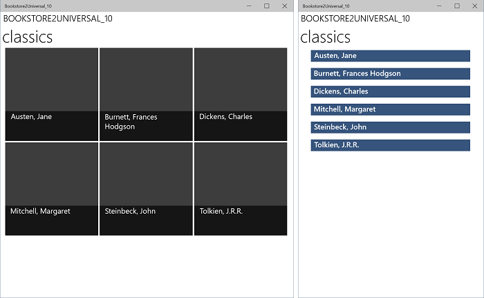
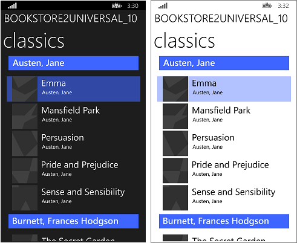
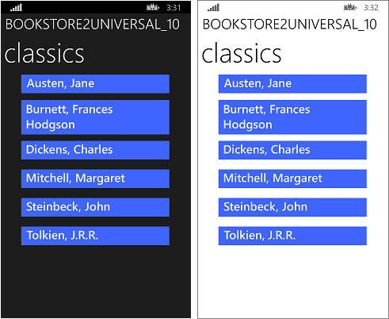

# Windows Runtime 8.x to UWP case study: Bookstore2


This case study—which builds on the info given in [Bookstore1](w8x-to-uwp-case-study-bookstore1.md)—begins with a Universal 8.1 app that displays grouped data in a [**SemanticZoom**](/uwp/api/Windows.UI.Xaml.Controls.SemanticZoom) control. In the view model, each instance of the class **Author** represents the group of the books written by that author, and in the **SemanticZoom**, we can either view the list of books grouped by author or we can zoom out to see a jump list of authors. The jump list affords much quicker navigation than scrolling through the list of books. We walk through the steps of porting the app to a Windows 10 Universal Windows Platform (UWP) app.

**Note**   When opening Bookstore2Universal\_10 in Visual Studio, if you see the message "Visual Studio update required", then follow the steps in [TargetPlatformVersion](w8x-to-uwp-troubleshooting.md).

## Downloads

[Download the Bookstore2\_81 Universal 8.1 app](https://codeload.github.com/MicrosoftDocs/windows-topic-specific-samples/zip/Bookstore2_81).

[Download the Bookstore2Universal\_10 Windows 10 app](https://codeload.github.com/MicrosoftDocs/windows-topic-specific-samples/zip/Bookstore2Universal_10).

## The Universal 8.1 app

Here’s what Bookstore2\_81—the app that we're going to port—looks like. It's a horizontally-scrolling (vertically-scrolling on Windows Phone) [**SemanticZoom**](/uwp/api/Windows.UI.Xaml.Controls.SemanticZoom) showing books grouped by author. You can zoom out to the jump list and from there you can navigate back into any group. There are two main pieces to this app: the view model that provides the grouped data source, and the user interface that binds to that view model. As we'll see, both of these pieces port easily from WinRT 8.1 technology to Windows 10.


Bookstore2\_81 on Windows, zoomed-in view
 



Bookstore2\_81 on Windows, zoomed-out view


Bookstore2\_81 on Windows Phone, zoomed-in view



Bookstore2\_81 on Windows Phone, zoomed-out view

##  Porting to a Windows 10 project

The Bookstore2\_81 solution is an 8.1 Universal App project. The Bookstore2\_81.Windows project builds the app package for Windows 8.1, and the Bookstore2\_81.WindowsPhone project builds the app package for Windows Phone 8.1. Bookstore2\_81.Shared is the project that contains source code, markup files, and other assets and resources, that are used by both of the other two projects.

Just like with the previous case study, the option we'll take (of the ones described in [If you have a Universal 8.1 app](w8x-to-uwp-root.md)) is to port the contents of the Shared project to a Windows 10 that targets the Universal device family.

Begin by creating a new Blank Application (Windows Universal) project. Name it Bookstore2Universal\_10. These are the files to copy over from Bookstore2\_81 to Bookstore2Universal\_10.

**From the Shared project**

-   Copy the folder containing the book cover image PNG files (the folder is \\Assets\\CoverImages). After copying the folder, in **Solution Explorer**, make sure **Show All Files** is toggled on. Right-click the folder that you copied and click **Include In Project**. That command is what we mean by "including" files or folders in a project. Each time you copy a file or folder, each copy, click **Refresh** in **Solution Explorer** and then include the file or folder in the project. There's no need to do this for files that you're replacing in the destination.
-   Copy the folder containing the view model source file (the folder is \\ViewModel).
-   Copy MainPage.xaml and replace the file in the destination.

**From the Windows project**

-   Copy BookstoreStyles.xaml. We'll use this one as a good starting-point because all the resource keys in this file will resolve in a Windows 10 app; some of those in the equivalent WindowsPhone file will not.
-   Copy SeZoUC.xaml and SeZoUC.xaml.cs. We'll start with the Windows version of this view, which is appropriate for wide windows, and then later we'll make it adapt to smaller windows and, consequently, smaller devices.

Edit the source code and markup files that you just copied and change any references to the Bookstore2\_81 namespace to Bookstore2Universal\_10. A quick way to do that is to use the **Replace In Files** feature. No code changes are needed in the view model, nor in any other imperative code. But, just to make it easier to see which version of the app is running, change the value returned by the **Bookstore2Universal\_10.BookstoreViewModel.AppName** property from "Bookstore2\_81" to "BOOKSTORE2UNIVERSAL\_10".

Right now, you can build and run. Here's how our new UWP app looks after having done no work yet to port it to Windows 10.



The Windows 10 app with initial source code changes running on a Desktop device, zoomed-in view


The Windows 10 app with initial source code changes running on a Desktop device, zoomed-out view

The view model and the zoomed-in and zoomed-out views are working together correctly, although there are issues that make that a little hard to see. One issue is that the [**SemanticZoom**](/uwp/api/Windows.UI.Xaml.Controls.SemanticZoom) doesn't scroll. This is because, in Windows 10, the default style of a [**GridView**](/uwp/api/Windows.UI.Xaml.Controls.GridView) causes it to be laid out vertically (and the Windows 10 design guidelines recommend that we use it that way in new and in ported apps). But, horizontal scrolling settings in the custom items panel template that we copied from the Bookstore2\_81 project (which was designed for the 8.1 app) are in conflict with vertical scrolling settings in the Windows 10 default style that is being applied as a result of us having ported to a Windows 10 app. A second thing is that the app doesn't yet adapt its user-interface to give the best experience in different-sized windows and on small devices. And, thirdly, the correct styles and brushes are not yet being used, resulting in much of the text being invisible (including the group headers that you can click to zoom out). So, in the next three sections ([SemanticZoom and GridView design changes](#semanticzoom-and-gridview-design-changes), [Adaptive UI](#adaptive-ui), and [Universal styling](#universal-styling)) we'll remedy those three issues.

## SemanticZoom and GridView design changes

The design changes in Windows 10 to the [**SemanticZoom**](/uwp/api/Windows.UI.Xaml.Controls.SemanticZoom) control are described in the section [SemanticZoom changes](w8x-to-uwp-porting-xaml-and-ui.md). We have no work to do in this section in response to those changes.

The changes to [**GridView**](/uwp/api/Windows.UI.Xaml.Controls.GridView) are described in the section [GridView/ListView changes](w8x-to-uwp-porting-xaml-and-ui.md). We have some very minor adjustments to make to adapt to those changes, as described below.

-   In SeZoUC.xaml, in `ZoomedInItemsPanelTemplate`, set `Orientation="Horizontal"` and `GroupPadding="0,0,0,20"`.
-   In SeZoUC.xaml, delete `ZoomedOutItemsPanelTemplate` and remove the `ItemsPanel` attribute from the zoomed-out view.

And that's it!

## Adaptive UI

After that change, the UI layout that SeZoUC.xaml gives us is great for when the app is running in a wide window (which is only possible on a device with a large screen). When the app's window is narrow, though (which happens on a small device, and can also happen on a large device), the UI that we had in the Windows Phone Store app is arguably most appropriate.

We can use the adaptive Visual State Manager feature to achieve this. We'll set properties on visual elements so that, by default, the UI is laid out in the narrow state using the smaller templates that we were using in the Windows Phone Store app. Then, we'll detect when the app's window is wider-than-or-equal-to a specific size (measured in units of [effective pixels](w8x-to-uwp-porting-xaml-and-ui.md)), and in response, we'll change the properties of visual elements so that we get a larger, and wider, layout. We'll put those property changes in a visual state, and we'll use an adaptive trigger to continuously monitor and determine whether to apply that visual state, or not, depending on the width of the window in effective pixels. We're triggering on window width in this case, but it's possible to trigger on window height, too.

A minimum window width of 548 epx is appropriate for this use case because that's the size of the smallest device we would want to show the wide layout on. Phones are typically smaller than 548 epx so on a small device like that we'd remain in the default narrow layout. On a PC, the window will launch by default wide enough to trigger the switch to the wide state. From there, you'll be able to drag the window narrow enough to display two columns of the 250x250-sized items. A little narrower than that and the trigger will deactivate, the wide visual state will be removed, and the default narrow layout will be in effect.

So, what properties do we need to set—and change—to achieve these two different layouts? There are two alternatives and each entails a different approach.

1.  We can put two [**SemanticZoom**](/uwp/api/Windows.UI.Xaml.Controls.SemanticZoom) controls in our markup. One would be a copy of the markup that we were using in the Windows Runtime 8.x app (using [**GridView**](/uwp/api/Windows.UI.Xaml.Controls.GridView) controls inside it), and collapsed by default. The other would be a copy of the markup that we were using in the Windows Phone Store app (using [**ListView**](/uwp/api/Windows.UI.Xaml.Controls.ListView) controls inside it), and visible by default. The visual state would switch the visibility properties of the two **SemanticZoom** controls. This would require very little effort to achieve but this not, in general, a high-performance technique. So, if you use it, you should profile your app and make sure it is still meeting your performance goals.
2.  We can use a single [**SemanticZoom**](/uwp/api/Windows.UI.Xaml.Controls.SemanticZoom) containing [**ListView**](/uwp/api/Windows.UI.Xaml.Controls.ListView) controls. To achieve our two layouts, in the wide visual state, we would change the properties of the **ListView** controls, including the templates that are applied to them, to cause them to lay out in the same way as a [**GridView**](/uwp/api/Windows.UI.Xaml.Controls.GridView) does. This might perform better, but there are so many small differences between the various styles and templates of **GridView** and **ListView** and between their various item types that this is the more difficult solution to achieve. This solution is also tightly coupled to the way the default styles and templates are designed at this moment in time, giving us a solution that's fragile and sensitive to any future changes to the defaults.

In this case study, we're going to go with the first alternative. But, if you like, you can try the second one and see if that works better for you. Here are the steps to take to implement that first alternative.

-   On the [**SemanticZoom**](/uwp/api/Windows.UI.Xaml.Controls.SemanticZoom) in the markup in your new project, set `x:Name="wideSeZo"` and `Visibility="Collapsed"`.
-   Go back to the Bookstore2\_81.WindowsPhone project and open SeZoUC.xaml. Copy the [**SemanticZoom**](/uwp/api/Windows.UI.Xaml.Controls.SemanticZoom) element markup out of that file and paste it immediately after `wideSeZo` in your new project. Set `x:Name="narrowSeZo"` on element that you just pasted.
-   But `narrowSeZo` needs a couple of styles that we haven't copied yet. Again in Bookstore2\_81.WindowsPhone, copy the two styles (`AuthorGroupHeaderContainerStyle` and `ZoomedOutAuthorItemContainerStyle`) out of SeZoUC.xaml and paste them into BookstoreStyles.xaml in your new project.
-   You now have two [**SemanticZoom**](/uwp/api/Windows.UI.Xaml.Controls.SemanticZoom) elements in your new SeZoUC.xaml. Wrap those two elements in a **Grid**.
-   In BookstoreStyles.xaml in your new project, append the word `Wide` to these three resource keys (and to their references in SeZoUC.xaml, but only to the references inside `wideSeZo`): `AuthorGroupHeaderTemplate`, `ZoomedOutAuthorTemplate`, and `BookTemplate`.
-   In the Bookstore2\_81.WindowsPhone project, open BookstoreStyles.xaml. From this file, copy those same three resources (mentioned above), and the two jump list item converters, and the namespace prefix declaration Windows\_UI\_Xaml\_Controls\_Primitives, and paste them all into BookstoreStyles.xaml in your new project.
-   Finally, in SeZoUC.xaml in your new project, add the appropriate Visual State Manager markup to the **Grid** that you added above.

```xml
    <Grid>
        <VisualStateManager.VisualStateGroups>
            <VisualStateGroup>
                <VisualState x:Name="WideState">
                    <VisualState.StateTriggers>
                        <AdaptiveTrigger MinWindowWidth="548"/>
                    </VisualState.StateTriggers>
                    <VisualState.Setters>
                        <Setter Target="wideSeZo.Visibility" Value="Visible"/>
                        <Setter Target="narrowSeZo.Visibility" Value="Collapsed"/>
                    </VisualState.Setters>
                </VisualState>
            </VisualStateGroup>
        </VisualStateManager.VisualStateGroups>

    ...

    </Grid>
```

## Universal styling

Now, let's fix up some styling issues, including one that we introduced above while copying from the old project.

-   In MainPage.xaml, change `LayoutRoot`'s Background to `"{ThemeResource ApplicationPageBackgroundThemeBrush}"`.
-   In BookstoreStyles.xaml, set the value of the resource `TitlePanelMargin` to `0` (or whatever value looks good to you).
-   In SeZoUC.xaml, set the Margin of `wideSeZo` to `0` (or whatever value looks good to you).
-   In BookstoreStyles.xaml, remove the Margin attribute from `AuthorGroupHeaderTemplateWide`.
-   Remove the FontFamily attribute from `AuthorGroupHeaderTemplate` and from `ZoomedOutAuthorTemplate`.
-   Bookstore2\_81 used the `BookTemplateTitleTextBlockStyle`, `BookTemplateAuthorTextBlockStyle`, and `PageTitleTextBlockStyle` resource keys as an indirection so that a single key had different implementations in the two apps. We don't need that indirection any more; we can just reference system styles directly. So, replace those references throughout the app with `TitleTextBlockStyle`, `CaptionTextBlockStyle`, and `HeaderTextBlockStyle` respectively. You can use the Visual Studio **Replace In Files** feature to do this quickly and accurately. You can then delete those three unused resources.
-   In `AuthorGroupHeaderTemplate`, replace `PhoneAccentBrush` with `SystemControlBackgroundAccentBrush`, and set `Foreground="White"` on the **TextBlock** so that it looks correct when running on the mobile device family.
-   In `BookTemplateWide`, copy the Foreground attribute from the second **TextBlock** to the first.
-   In `ZoomedOutAuthorTemplateWide`, change the reference to `SubheaderTextBlockStyle` (which is now a little too big) to a reference to `SubtitleTextBlockStyle`.
-   The zoomed-out view (the jump list) no longer overlays the zoomed-in view in the new platform, so we can remove the `Background` attribute from the zoomed-out view of `narrowSeZo`.
-   So that all the styles and templates are in one file, move `ZoomedInItemsPanelTemplate` out of SeZoUC.xaml and into BookstoreStyles.xaml.

That last sequence of styling operations leaves the app looking like this.



The ported Windows 10 app running on a Desktop device, zoomed-in view, two sizes of window



The ported Windows 10 app running on a Desktop device, zoomed-out view, two sizes of window



The ported Windows 10 app running on a Mobile device, zoomed-in view



The ported Windows 10 app running on a Mobile device, zoomed-out view

## Conclusion

This case study involved a more ambitious user interface than the previous one. As with the previous case study, this particular view model required no work at all, and our efforts went primarily into refactoring the user interface. Some of the changes were a necessary result of combining two projects into one while still supporting many form factors (in fact, many more than we could before). A few of the changes were to do with changes that have been made to the platform.

The next case study is [QuizGame](w8x-to-uwp-case-study-quizgame.md), in which we look at accessing and displaying grouped data.