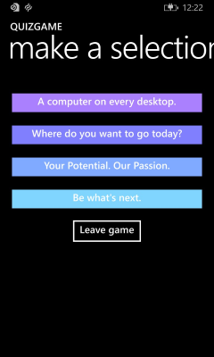

# Windows Runtime 8.x to UWP case study: QuizGame sample app


This topic presents a case study of porting a functioning peer-to-peer quiz game WinRT 8.1 sample app to a Windows 10 Universal Windows Platform (UWP) app.

A Universal 8.1 app is one that builds two versions of the same app: one app package for Windows 8.1, and a different app package for Windows Phone 8.1. The WinRT 8.1 version of QuizGame uses a Universal Windows app project arrangement, but it takes a different approach and it builds a functionally distinct app for the two platforms. The Windows 8.1 app package serves as the host for a quiz game session, while the Windows Phone 8.1 app package plays the role of the client to the host. The two halves of the quiz game session communicate via peer-to-peer networking.

Tailoring the two halves to PC, and phone, respectively makes good sense. But, wouldn't it be even better if you could run both the host and the client on just about any device of your choosing? In this case study, we'll port both apps to Windows 10 where they will each build into a single app package that users can install onto a wide range of devices.

The app uses patterns that make use of views and view models. As a result of this clean separation, the porting process for this app is very straightforward, as you'll see.

**Note**  This sample assumes your network is configured to send and receive custom UDP group multicast packets (most home networks are, although your work network may not be). The sample also sends and receives TCP packets.

 

**Note**   When opening QuizGame10 in Visual Studio, if you see the message "Visual Studio update required", then follow the steps in [TargetPlatformVersion](w8x-to-uwp-troubleshooting.md).

 

## Downloads

[Download the QuizGame Universal 8.1 app](https://codeload.github.com/MicrosoftDocs/windows-topic-specific-samples/zip/QuizGame). This is the initial state of the app prior to porting. 

[Download the QuizGame10 Windows 10 app](https://codeload.github.com/MicrosoftDocs/windows-topic-specific-samples/zip/QuizGame10). This is the state of the app just after  porting. 

[See the latest version of this sample on GitHub](https://github.com/microsoft/Windows-appsample-networkhelper).

## The WinRT 8.1 solution


Here’s what QuizGame—the app that we're going to port—looks like.


The QuizGame host app running on Windows

 



The QuizGame client app running on Windows Phone

## A walkthrough of QuizGame in use

This is a short hypothetical account of the app in use, but it provides useful info should you want to try out the app for yourself over your wireless network.

A fun quiz game is taking place in a bar. There's a big TV in the bar that everyone can see. The quizmaster has a PC whose output is being shown on the TV. That PC has "the host app" running on it. Anyone who wants to take part in the quiz just needs to install "the client app" on their phone or Surface.

The host app is in lobby mode, and on the big TV, it's advertising that it's ready for client apps to connect. Joan launches the client app on her mobile device. She types her name into the **Player name** text box and taps **Join game**. The host app acknowledges that Joan has joined by displaying her name, and Joan’s client app indicates that it's waiting for the game to begin. Next, Maxwell goes through those same steps on his mobile device.

The quizmaster clicks **Start game** and the host app shows a question and the possible answers (it also shows a list of the joined players in normal fontweight, colored gray). Simultaneously, the answers appear displayed on buttons on joined client devices. Joan taps the button with the answer "1975" on it whereupon all her buttons become disabled. On the host app, Joan’s name is painted green (and becomes bold) in acknowledgment of the receipt of her answer. Maxwell answers, also. The quizmaster, noting that all players' names are green, clicks **Next question**.

Questions continue to be asked and answered in this same cycle. When the last question is being shown on the host app, **Show results** is the content of the button, and not **Next question**. When **Show results** is clicked, the results are shown. Clicking **Return to lobby** returns to the beginning of the game lifecycle with the exception that joined players remain joined. But, going back to the lobby gives new players a chance to join, and even a convenient time for joined players to leave (although a joined player can leave at any time by tapping **Leave game**).

## Local test mode

To try out the app and its interactions on a single PC instead of distributed across devices, you can build the host app in local test mode. This mode completely bypasses use of the network. Instead, the UI of the host app displays the host portion to the left of the window and, to the right, two copies of the client app UI stacked vertically (note that, in this version, the local test mode UI is fixed for a PC display; it does not adapt to small devices). These segments of UI, all in the same app, communicate with one another via a mock client communicator, which simulates the interactions that would otherwise take place over the network.

To activate local test mode, define **LOCALTESTMODEON** (in project properties) as a conditional compilation symbol, and rebuild.

## Porting to a Windows 10 project

QuizGame has the following pieces.

-   P2PHelper. This is a portable class library that contains the peer-to-peer networking logic.
-   QuizGame.Windows. This is the project that builds the app package for the host app, which targets Windows 8.1.
-   QuizGame.WindowsPhone. This is the project that builds the app package for the client app, which targets Windows Phone 8.1.
-   QuizGame.Shared. This is the project that contains source code, markup files, and other assets and resources, that are used by both of the other two projects.

For this case study, we have the usual options described in [If you have a Universal 8.1 app](w8x-to-uwp-root.md) with respect to what devices to support.

Based on those options, we'll port QuizGame.Windows to a new Windows 10 project called QuizGameHost. And, we'll port QuizGame.WindowsPhone to a new Windows 10 project called QuizGameClient. These projects will target the universal device family, so they will run on any device. And, we'll keep the QuizGame.Shared source files, etc, in their own folder, and we'll link those shared files into the two new projects. Just like before, we'll keep everything in one solution and we'll name it QuizGame10.

**The QuizGame10 solution**

-   Create a new solution (**New Project** &gt; **Other Project Types** &gt; **Visual Studio Solutions**) and name it QuizGame10.

**P2PHelper**

-   In the solution, create a new Windows 10 class library project (**New Project** &gt; **Windows Universal** &gt; **Class Library (Windows Universal)**) and name it P2PHelper.
-   Delete Class1.cs from the new project.
-   Copy P2PSession.cs, P2PSessionClient.cs, and P2PSessionHost.cs into the new project's folder and include the copied files in the new project.
-   The project will build without needing further changes.

**Shared files**

-   Copy the folders Common, Model, View, and ViewModel from \\QuizGame.Shared\\ to \\QuizGame10\\.
-   Common, Model, View, and ViewModel are what we'll mean when we refer to the shared folders on disk.

**QuizGameHost**

-   Create a new Windows 10 app project (**Add** &gt; **New Project** &gt; **Windows Universal** &gt; **Blank Application (Windows Universal)**) and name it QuizGameHost.
-   Add a reference to P2PHelper (**Add Reference** &gt; **Projects** &gt; **Solution** &gt; **P2PHelper**).
-   In **Solution Explorer**, create a new folder for each of the shared folders on disk. In turn, right-click each folder you just created and click **Add** &gt; **Existing Item** and navigate up a folder. Open the appropriate shared folder, select all files, and then click **Add As Link**.
-   Copy MainPage.xaml from \\QuizGame.Windows\\ to \\QuizGameHost\\ and change the namespace to QuizGameHost.
-   Copy App.xaml from \\QuizGame.Shared\\ to \\QuizGameHost\\ and change the namespace to QuizGameHost.
-   Instead of overwriting app.xaml.cs, we'll keep the version in the new project and just make one targeted change to it to support local test mode. In app.xaml.cs, replace this line of code:

```CSharp
rootFrame.Navigate(typeof(MainPage), e.Arguments);
```

with this:

```CSharp
#if LOCALTESTMODEON
    rootFrame.Navigate(typeof(TestView), e.Arguments);
#else
    rootFrame.Navigate(typeof(MainPage), e.Arguments);
#endif
```

-   In **Properties** &gt; **Build** &gt; **conditional compilation symbols**, add LOCALTESTMODEON.
-   You'll now be able to go back to the code you added to app.xaml.cs and resolve the TestView type.
-   In package.appxmanifest, change the capability name from internetClient to internetClientServer.

**QuizGameClient**

-   Create a new Windows 10 app project (**Add** &gt; **New Project** &gt; **Windows Universal** &gt; **Blank Application (Windows Universal)**) and name it QuizGameClient.
-   Add a reference to P2PHelper (**Add Reference** &gt; **Projects** &gt; **Solution** &gt; **P2PHelper**).
-   In **Solution Explorer**, create a new folder for each of the shared folders on disk. In turn, right-click each folder you just created and click **Add** &gt; **Existing Item** and navigate up a folder. Open the appropriate shared folder, select all files, and then click **Add As Link**.
-   Copy MainPage.xaml from \\QuizGame.WindowsPhone\\ to \\QuizGameClient\\ and change the namespace to QuizGameClient.
-   Copy App.xaml from \\QuizGame.Shared\\ to \\QuizGameClient\\ and change the namespace to QuizGameClient.
-   In package.appxmanifest, change the capability name from internetClient to internetClientServer.

You'll now be able to build and run.

## Adaptive UI

The QuizGameHost Windows 10 app looks fine when the app is running in a wide window (which is only possible on a device with a large screen). When the app's window is narrow, though (which happens on a small device, and can also happen on a large device), the UI is squashed so much that it's unreadable.

We can use the adaptive Visual State Manager feature to remedy this, as we explained in [Case study: Bookstore2](w8x-to-uwp-case-study-bookstore2.md). First, set properties on visual elements so that, by default, the UI is laid out in the narrow state. All of these changes take place in \\View\\HostView.xaml.

-   In the main **Grid**, change the **Height** of the first **RowDefinition** from "140" to "Auto".
-   On the **Grid** that contains the **TextBlock** named `pageTitle`, set `x:Name="pageTitleGrid"` and `Height="60"`. These first two steps are so that we can effectively control the height of that **RowDefinition** via a setter in a visual state.
-   On `pageTitle`, set `Margin="-30,0,0,0"`.
-   On the **Grid** indicated by the comment `<!-- Content -->`, set `x:Name="contentGrid"` and `Margin="-18,12,0,0"`.
-   On the **TextBlock** immediately above the comment `<!-- Options -->`, set `Margin="0,0,0,24"`.
-   In the default **TextBlock** style (the first resource in the file), change the **FontSize** setter's value to "15".
-   In `OptionContentControlStyle`, change the **FontSize** setter's value to "20". This step and the previous one will give us a good type ramp that will work well on all devices. These are much more flexible sizes than the "30" we were using for the Windows 8.1 app.
-   Finally, add the appropriate Visual State Manager markup to the root **Grid**.

```xml
<VisualStateManager.VisualStateGroups>
    <VisualStateGroup>
        <VisualState x:Name="WideState">
            <VisualState.StateTriggers>
                <AdaptiveTrigger MinWindowWidth="548"/>
            </VisualState.StateTriggers>
            <VisualState.Setters>
                <Setter Target="pageTitleGrid.Height" Value="140"/>
                <Setter Target="pageTitle.Margin" Value="0,0,30,40"/>
                <Setter Target="contentGrid.Margin" Value="40,40,0,0"/>
            </VisualState.Setters>
        </VisualState>
    </VisualStateGroup>
</VisualStateManager.VisualStateGroups>
```

## Universal styling


You'll notice that in Windows 10, the buttons don't have the same touch-target padding in their template. Two small changes will remedy that. First, add this markup to app.xaml in both QuizGameHost and QuizGameClient.

```xml
<Style TargetType="Button">
    <Setter Property="Margin" Value="12"/>
</Style>
```

And second, add this setter to `OptionButtonStyle` in \\View\\ClientView.xaml.

```xml
<Setter Property="Margin" Value="6"/>
```

With that last tweak, the app will behave and look just the same as it did before the port, with the additional value that it will now run everywhere.

## Conclusion

The app that we ported in this case study was a relatively complex one involving several projects, a class library, and quite a large amount of code and user interface. Even so, the port was straightforward. Some of the ease of porting is directly attributable to the similarity between the Windows 10 developer platform and the Windows 8.1 and Windows Phone 8.1 platforms. Some is due to the way the original app was designed to keep the models, the view models, and the views separate.
