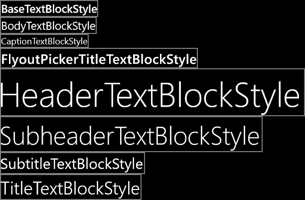

# Porting Windows Runtime 8.x XAML and UI to UWP


The previous topic was [Troubleshooting](w8x-to-uwp-troubleshooting.md).

The practice of defining UI in the form of declarative XAML markup translates extremely well from Universal 8.1 apps to Universal Windows Platform (UWP) apps. You'll find that most of your markup is compatible, although you may need to make some adjustments to the system Resource keys or custom templates that you're using. The imperative code in your view models will require little or no change. Even much, or most, of the code in your presentation layer that manipulates UI elements should also be straightforward to port.

## Imperative code

If you just want to get to the stage where your project builds, you can comment or stub out any non-essential code. Then iterate, one issue at a time, and refer to the following topics in this section (and the previous topic: [Troubleshooting](w8x-to-uwp-troubleshooting.md)), until any build and runtime issues are ironed-out and your port is complete.

## Adaptive/responsive UI

Because your app can run on a potentially wide range of devices—each with its own screen size and resolution—you'll want to go beyond the minimal steps to port your app and you'll want to tailor your UI to look its best on those devices. You can use the adaptive Visual State Manager feature to dynamically detect window size and to change layout in response, and an example of how to do that is shown in the section [Adaptive UI](w8x-to-uwp-case-study-bookstore2.md) in the Bookstore2 case study topic.

## Back button handling

For Universal 8.1 apps, Windows Runtime 8.x apps and Windows Phone Store apps have different approaches to the UI you show and the events you handle for the back button. But, for Windows 10 apps, you can use a single approach in your app. On mobile devices, the button is provided for you as a capacitive button on the device, or as a button in the shell. On a desktop device, you add a button to your app's chrome whenever back-navigation is possible within the app, and this appears in the title bar for windowed apps or in the task bar for Tablet mode. The back button event is a universal concept across all device families, and buttons implemented in hardware or in software raise the same [**BackRequested**](/uwp/api/windows.ui.core.systemnavigationmanager.backrequested) event.

The example below works for all device families and it is good for cases where the same processing applies to all pages, and where you do not need to confirm navigation (for example, to warn about unsaved changes).

```csharp
   // app.xaml.cs

    protected override void OnLaunched(LaunchActivatedEventArgs e)
    {
        [...]

        Windows.UI.Core.SystemNavigationManager.GetForCurrentView().BackRequested += App_BackRequested;
        rootFrame.Navigated += RootFrame_Navigated;
    }

    private void RootFrame_Navigated(object sender, NavigationEventArgs e)
    {
        Frame rootFrame = Window.Current.Content as Frame;

        // Note: On device families that have no title bar, setting AppViewBackButtonVisibility can safely execute 
        // but it will have no effect. Such device families provide back button UI for you.
        if (rootFrame.CanGoBack)
        {
            Windows.UI.Core.SystemNavigationManager.GetForCurrentView().AppViewBackButtonVisibility = 
                Windows.UI.Core.AppViewBackButtonVisibility.Visible;
        }
        else
        {
            Windows.UI.Core.SystemNavigationManager.GetForCurrentView().AppViewBackButtonVisibility = 
                Windows.UI.Core.AppViewBackButtonVisibility.Collapsed;
        }
    }

    private void App_BackRequested(object sender, Windows.UI.Core.BackRequestedEventArgs e)
    {
        Frame rootFrame = Window.Current.Content as Frame;

        if (rootFrame.CanGoBack)
        {
            rootFrame.GoBack();
        }
    }
```

There's also a single approach for all device families for programmatically exiting the app.

```csharp
   Windows.UI.Xaml.Application.Current.Exit();
```

## Charms

You don't need to change any of your code that integrates with charms, but you do need to add some UI to your app to take the place of the Charms bar, which is not a part of the Windows 10 shell. A Universal 8.1 app running on Windows 10 has its own replacement UI provided by system-rendered chrome in the app's title bar.

## Controls, and control styles and templates

A Universal 8.1 app running on Windows 10 will retain the 8.1 appearance and behavior with respect to controls. But, when you port that app to a Windows 10 app, there are some differences in appearance and behavior to be aware of. The architecture and design of controls is essentially unchanged for Windows 10 apps, so the changes are mostly around the design language, simplification, and usability improvements.

**Note**   The PointerOver visual state is relevant in custom styles/templates in Windows 10 apps and in Windows Runtime 8.x apps, but not in Windows Phone Store apps. For this reason (and because of the system resource keys that are supported for Windows 10 apps), we recommend that you re-use the custom styles/templates from your Windows Runtime 8.x apps when you're porting your app to Windows 10.
If you want to be certain that your custom styles/templates are using the latest set of visual states, and are benefitting from performance improvements made to the default styles/templates, then edit a copy of the new Windows 10 default template and re-apply your customization to that. One example of a performance improvement is that any **Border** that formerly enclosed a **ContentPresenter** or a Panel has been removed and a child element now renders the border.

Here are some more specific examples of changes to controls.

| Control name | Change |
|--------------|--------|
| **AppBar**   | If you are using the **AppBar** control ([**CommandBar**](/uwp/api/Windows.UI.Xaml.Controls.AppBar) is recommended instead), then it is not hidden by default in a Windows 10 app. You can control this with the [**AppBar.ClosedDisplayMode**](/uwp/api/windows.ui.xaml.controls.appbar.closeddisplaymode) property. |
| **AppBar**, [**CommandBar**](/uwp/api/Windows.UI.Xaml.Controls.AppBar) | In a Windows 10 app, **AppBar** and [**CommandBar**](/uwp/api/Windows.UI.Xaml.Controls.AppBar) have a **See more** button (the ellipsis). |
| [**CommandBar**](/uwp/api/Windows.UI.Xaml.Controls.AppBar) | In a Windows Runtime 8.x app, the secondary commands of a [**CommandBar**](/uwp/api/Windows.UI.Xaml.Controls.AppBar) are always visible. In a Windows Phone Store app, and in a Windows 10 app, the don't appear until the command bar opens. |
| [**CommandBar**](/uwp/api/Windows.UI.Xaml.Controls.AppBar) | For a Windows Phone Store app, the value of [**CommandBar.IsSticky**](/uwp/api/windows.ui.xaml.controls.appbar.issticky) does not affect whether or not the bar is light-dismissible. For a Windows 10 app, if **IsSticky** is set to true, then the **CommandBar** disregards a light dismiss gesture. |
| [**CommandBar**](/uwp/api/Windows.UI.Xaml.Controls.AppBar) | In a Windows 10 app, [**CommandBar**](/uwp/api/Windows.UI.Xaml.Controls.AppBar) does not handle the [**EdgeGesture.Completed**](/uwp/api/windows.ui.input.edgegesture.completed) nor [**UIElement.RightTapped**](/uwp/api/windows.ui.xaml.uielement.righttapped) events. Nor does it respond to a tap nor a swipe up. You still have the option to handle these events and set [**IsOpen**](/uwp/api/windows.ui.xaml.controls.appbar.isopen). |
| [**DatePicker**](/uwp/api/Windows.UI.Xaml.Controls.DatePicker), [**TimePicker**](/uwp/api/Windows.UI.Xaml.Controls.TimePicker) | Review how your app looks with the visual changes to [**DatePicker**](/uwp/api/Windows.UI.Xaml.Controls.DatePicker) and [**TimePicker**](/uwp/api/Windows.UI.Xaml.Controls.TimePicker). For a Windows 10 app running on a mobile device, these controls no longer navigate to a selection page but instead use a light-dismissible popup. |
| [**DatePicker**](/uwp/api/Windows.UI.Xaml.Controls.DatePicker), [**TimePicker**](/uwp/api/Windows.UI.Xaml.Controls.TimePicker) | In a Windows 10 app, you can't put [**DatePicker**](/uwp/api/Windows.UI.Xaml.Controls.DatePicker) or [**TimePicker**](/uwp/api/Windows.UI.Xaml.Controls.TimePicker) inside a fly-out. If you want those controls to be displayed in a popup-type control, then you can use [**DatePickerFlyout**](/uwp/api/Windows.UI.Xaml.Controls.DatePickerFlyout) and [**TimePickerFlyout**](/uwp/api/Windows.UI.Xaml.Controls.TimePickerFlyout). |
| **GridView**, **ListView** | For **GridView**/**ListView**, see [GridView and ListView changes](#gridview-and-listview-changes). |
| [**Hub**](/uwp/api/Windows.UI.Xaml.Controls.Hub) | In a Windows Phone Store app, a [**Hub**](/uwp/api/Windows.UI.Xaml.Controls.Hub) control wraps around from the last section to the first. In a Windows Runtime 8.x app, and in a Windows 10 app, hub sections do not wrap around. |
| [**Hub**](/uwp/api/Windows.UI.Xaml.Controls.Hub) | In a Windows Phone Store app, a [**Hub**](/uwp/api/Windows.UI.Xaml.Controls.Hub) control's background image moves in parallax relative to the hub sections. In a Windows Runtime 8.x app, and in a Windows 10 app, parallax is not used. |
| [**Hub**](/uwp/api/Windows.UI.Xaml.Controls.Hub)  | In a Universal 8.1 app, the [**HubSection.IsHeaderInteractive**](/uwp/api/windows.ui.xaml.controls.hubsection.isheaderinteractive) property causes the section header—and a chevron glyph rendered next to it—to become interactive. In a Windows 10 app, there is an interactive "See more" affordance beside the header, but the header itself is not interactive. **IsHeaderInteractive** still determines whether interaction raises the [**Hub.SectionHeaderClick**](/uwp/api/windows.ui.xaml.controls.hub.sectionheaderclick) event. |
| **MessageDialog** | If you're using **MessageDialog**, then consider instead using the more flexible [**ContentDialog**](/uwp/api/Windows.UI.Xaml.Controls.ContentDialog). Also, see the [XAML UI Basics](https://github.com/Microsoft/Windows-universal-samples/tree/master/Samples/XamlUIBasics) sample. |
| **ListPickerFlyout**, **PickerFlyout**  | **ListPickerFlyout** and **PickerFlyout** are deprecated for a Windows 10 app. For a single selection fly-out, use [**MenuFlyout**](/uwp/api/Windows.UI.Xaml.Controls.MenuFlyout); for more complex experiences, use [**Flyout**](/uwp/api/Windows.UI.Xaml.Controls.Flyout). |
| [**PasswordBox**](/uwp/api/Windows.UI.Xaml.Controls.PasswordBox) | The [**PasswordBox.IsPasswordRevealButtonEnabled**](/uwp/api/windows.ui.xaml.controls.passwordbox.ispasswordrevealbuttonenabled) property is deprecated in a Windows 10 app, and setting it has no effect. Use [**PasswordBox.PasswordRevealMode**](/uwp/api/windows.ui.xaml.controls.passwordbox.passwordrevealmode) instead, which defaults to **Peek** (in which an eye glyph is displayed, like in a Windows Runtime 8.x app). Also, see [Guidelines for password boxes](../design/controls-and-patterns/password-box.md). |
| [**Pivot**](/uwp/api/Windows.UI.Xaml.Controls.Pivot) | The [**Pivot**](/uwp/api/Windows.UI.Xaml.Controls.Pivot) control is now universal, it is no longer limited to use on mobile devices. |
| [**SearchBox**](/uwp/api/Windows.UI.Xaml.Controls.SearchBox) | Although [**SearchBox**](/uwp/api/windows.ui.xaml.controls.searchbox) is implemented in the Universal device family, it is not fully functional on mobile devices. See [SearchBox deprecated in favor of AutoSuggestBox](#searchbox-deprecated-in-favor-of-autosuggestbox). |
| **SemanticZoom** | For **SemanticZoom**, see [SemanticZoom changes](#semanticzoom-changes). |
| [**ScrollViewer**](/uwp/api/Windows.UI.Xaml.Controls.ScrollViewer)  | Some default properties of [**ScrollViewer**](/uwp/api/Windows.UI.Xaml.Controls.ScrollViewer) have changed. [**HorizontalScrollMode**](/uwp/api/windows.ui.xaml.controls.scrollviewer.horizontalscrollmode) is **Auto**, [**VerticalScrollMode**](/uwp/api/windows.ui.xaml.controls.scrollviewer.verticalscrollmode) is **Auto**, and [**ZoomMode**](/uwp/api/windows.ui.xaml.controls.scrollviewer.zoommode) is **Disabled**. If the new default values are not appropriate for your app, then you can change them either in a style or as local values on the control itself.  |
| [**TextBox**](/uwp/api/Windows.UI.Xaml.Controls.TextBox) | In a Windows Runtime 8.x app, spell-checking is off by default for a [**TextBox**](/uwp/api/Windows.UI.Xaml.Controls.TextBox). In a Windows Phone Store app, and in a Windows 10 app, it is on by default. |
| [**TextBox**](/uwp/api/Windows.UI.Xaml.Controls.TextBox) | The default font size for a [**TextBox**](/uwp/api/Windows.UI.Xaml.Controls.TextBox) has changed from 11 to 15. |
| [**TextBox**](/uwp/api/Windows.UI.Xaml.Controls.TextBox) | The default value of [**TextBox.TextReadingOrder**](/uwp/api/windows.ui.xaml.controls.textblock.textreadingorder) has changed from **Default** to **DetectFromContent**. If that's undesirable, then use **UseFlowDirection**. **Default** is deprecated. |
| Various | Accent color applies to a Windows Phone Store apps, and to Windows 10 apps, but not to Windows Runtime 8.x apps.  |

For more info on UWP app controls, see [Controls by function](../design/controls-and-patterns/controls-by-function.md), [Controls list](../design/controls-and-patterns/index.md), and [Guidelines for controls](../design/controls-and-patterns/index.md).

##  Design language in Windows 10

There are some small but important differences in design language between Universal 8.1 apps and Windows 10 apps. For all the details, see [Design](https://developer.microsoft.com/windows/apps/design). Despite the design language changes, our design principles remain consistent: be attentive to detail but always strive for simplicity through focusing on content not chrome, fiercely reducing visual elements, and remaining authentic to the digital domain; use visual hierarchy especially with typography; design on a grid; and bring your experiences to life with fluid animations.

## Effective pixels, viewing distance, and scale factors

Previously, view pixels were the way to abstract the size and layout of UI elements away from the actual physical size and resolution of devices. View pixels have now evolved into effective pixels, and here's an explanation of that term, what it means, and the extra value it offers.

The term "resolution" refers to a measure of pixel density and not, as is commonly thought, pixel count. "Effective resolution" is the way the physical pixels that compose an image or glyph resolve to the eye given differences in viewing distance and the physical pixel size of the device (pixel density being the reciprocal of physical pixel size). Effective resolution is a good metric to build an experience around because it is user-centric. By understanding all the factors, and controlling the size of UI elements, you can make the user's experience a good one.

Different devices are a different number of effective pixels wide, ranging from 320 epx for the smallest devices, to 1024 epx for a modest-sized monitor, and far beyond to much higher widths. All you have to do is continue to use auto-sized elements and dynamic layout panels as you always have. There will also be some cases where you'll set the properties of your UI elements to a fixed size in XAML markup. A scale factor is automatically applied to your app depending on what device it runs on and the display settings made by the user. And that scale factor serves to keep any UI element with a fixed size presenting a more-or-less constant-sized touch (and reading) target to the user across a wide variety of screen sizes. And together with dynamic layout, your UI won't merely optically scale on different devices. It will instead do what's necessary to fit the appropriate amount of content into the available space.

So that your app has the best experience across all displays, we recommend that you create each bitmap asset in a range of sizes, each suitable for a particular scale factor. Providing assets at 100%-scale, 200%-scale, and 400%-scale (in that priority order) will give you excellent results in most cases at all the intermediate scale factors.

**Note**  If, for whatever reason, you cannot create assets in more than one size, then create 100%-scale assets. In Microsoft Visual Studio, the default project template for UWP apps provides branding assets (tile images and logos) in only one size, but they are not 100%-scale. When authoring assets for your own app, follow the guidance in this section and provide 100%, 200%, and 400% sizes, and use asset packs.

If you have intricate artwork, then you may want to provide your assets in even more sizes. If you're starting with vector art, then it's relatively easy to generate high-quality assets at any scale factor.

We don't recommend that you try to support all of the scale factors, but the full list of scale factors for Windows 10 apps is 100%, 125%, 150%, 200%, 250%, 300%, and 400%. If you provide them, the Store will pick the correct-sized asset(s) for each device, and only those assets will be downloaded. The Store selects the assets to download based on the DPI of the device. You can re-use assets from your Windows Runtime 8.x app at scale factors such as 140% and 220%, but your app will run at one of the new scale factors and so some bitmap scaling will be unavoidable. Test your app on a range of devices to see whether you're happy with the results in your case.

You may be re-using XAML markup from a Windows Runtime 8.x app where literal dimension values are used in the markup (perhaps to size shapes or other elements, perhaps for typography). But, in some cases, a larger scale factor is used on a device for a Windows 10 app than for a Universal 8.1 app (for example, 150% is used where 140% was before, and 200% is used where 180% was). So, if you find that these literal values are now too big on Windows 10, then try multiplying them by 0.8. For more info, see [Responsive design 101 for UWP apps](../design/layout/screen-sizes-and-breakpoints-for-responsive-design.md).

## GridView and ListView changes

Several changes have been made to the default style setters for [**GridView**](/uwp/api/Windows.UI.Xaml.Controls.GridView) to make the control scroll vertically (instead of horizontally, as it did previously by default). If you edited a copy of the default style in your project, then your copy won't have these changes, so you'll need to make them manually. Here is a list of the changes.

-   The setter for [**ScrollViewer.HorizontalScrollBarVisibility**](/uwp/api/windows.ui.xaml.controls.scrollviewer.horizontalscrollbarvisibility) has changed from **Auto** to **Disabled**.
-   The setter for [**ScrollViewer.VerticalScrollBarVisibility**](/uwp/api/windows.ui.xaml.controls.scrollviewer.verticalscrollbarvisibility) has changed from **Disabled** to **Auto**.
-   The setter for [**ScrollViewer.HorizontalScrollMode**](/uwp/api/windows.ui.xaml.controls.scrollviewer.horizontalscrollmode) has changed from **Enabled** to **Disabled**.
-   The setter for [**ScrollViewer.VerticalScrollMode**](/uwp/api/windows.ui.xaml.controls.scrollviewer.verticalscrollmode) has changed from **Disabled** to **Enabled**.
-   In the setter for [**ItemsPanel**](/uwp/api/windows.ui.xaml.controls.itemscontrol.itemspanel), the value of [**ItemsWrapGrid.Orientation**](/uwp/api/windows.ui.xaml.controls.itemswrapgrid.orientation) has changed from **Vertical** to **Horizontal**.

If that last change (the change to **Orientation**) seems contradictory, then remember that we're talking about a wrap grid. A horizontally-oriented wrap grid (the new value) is similar to a writing system where text flows horizontally and breaks to the next line down at the end of a page. A page of text like that scrolls vertically. Conversely, a vertically-oriented wrap grid (the previous value) is similar to a writing system where text flows vertically and therefore scrolls horizontally.

Here are the aspects of [**GridView**](/uwp/api/Windows.UI.Xaml.Controls.GridView) and [**ListView**](/uwp/api/Windows.UI.Xaml.Controls.ListView) that have change or are not supported in Windows 10.

-   The [**IsSwipeEnabled**](/uwp/api/windows.ui.xaml.controls.listviewbase.isswipeenabled) property (Windows Runtime 8.x apps only) is not supported for Windows 10 apps. The API is still present, but setting it has no effect. All previous selection gestures are supported except downward swipe (which is unsupported because data shows that it is not discoverable) and right-click (which is reserved for showing a context menu).
-   The [**ReorderMode**](/uwp/api/windows.ui.xaml.controls.listviewbase.reordermode) property (Windows Phone Store apps only) is not supported for Windows 10 apps. The API is still present, but setting it has no effect. Instead, set [**AllowDrop**](/uwp/api/windows.ui.xaml.uielement.allowdrop) and [**CanReorderItems**](/uwp/api/windows.ui.xaml.controls.listviewbase.canreorderitems) to true on your **GridView** or **ListView** and then the user will be able to reorder using a press-and-hold (or click-and-drag) gesture.
-   When developing for Windows 10, use [**ListViewItemPresenter**](/uwp/api/Windows.UI.Xaml.Controls.Primitives.ListViewItemPresenter) instead of [**GridViewItemPresenter**](/uwp/api/Windows.UI.Xaml.Controls.Primitives.GridViewItemPresenter) in your item container style, both for [**ListView**](/uwp/api/Windows.UI.Xaml.Controls.ListView) and for [**GridView**](/uwp/api/Windows.UI.Xaml.Controls.GridView). If you edit a copy of the default item container styles, then you will get the correct type.
-   The selection visuals have changed for a Windows 10 app. If you set [**SelectionMode**](/uwp/api/windows.ui.xaml.controls.listviewbase.selectionmode) to **Multiple**, then by default, a check box is rendered for each item. The default setting for **ListView** items means that the check box is laid out inline beside the item, and as a result, the space occupied by the rest of the item will be slightly reduced and shifted. For **GridView** items, the check box is overlaid on top of the item by default. But, in either case, you can control the layout (Inline or Overlay) of the check boxes (with the [**CheckMode**](/uwp/api/windows.ui.xaml.controls.primitives.listviewitempresenter.checkmode) property) and whether they are shown at all (with the [**SelectionCheckMarkVisualEnabled**](/uwp/api/windows.ui.xaml.controls.primitives.listviewitempresenter.selectioncheckmarkvisualenabled) property) on the [**ListViewItemPresenter**](/uwp/api/windows.ui.xaml.controls.primitives.listviewitempresenter) element inside your item container style as in the example below.
-   In Windows 10, the [**ContainerContentChanging**](/uwp/api/windows.ui.xaml.controls.listviewbase.containercontentchanging) event is raised twice per item during UI virtualization: once for the reclaim, and once for the re-use. If the value of [**InRecycleQueue**](/uwp/api/windows.ui.xaml.controls.containercontentchangingeventargs.inrecyclequeue) is **true** and you have no special reclaim work to do, then you can exit your event handler immediately with the assurance that it will be re-entered when that same item is re-used (at which time **InRecycleQueue** will be **false**).

```xml
<Style x:Key="CustomItemContainerStyle" TargetType="ListViewItem|GridViewItem">
    ...
    <Setter.Value>
        <ControlTemplate TargetType="ListViewItem|GridViewItem">
            <ListViewItemPresenter CheckMode="Inline|Overlay" ... />
        </ControlTemplate>
    </Setter.Value>
    ...
</Style>
```


A ListViewItemPresenter with inline check box


A ListViewItemPresenter with an overlaid check box

-   With the removal of downward swipe and right-click gestures for selection (for the reasons given above), the interaction model has changed, one consequence of which is that the [**ItemClick**](/uwp/api/windows.ui.xaml.controls.listviewbase.itemclick) and [**SelectionChanged**](/uwp/api/windows.ui.xaml.controls.primitives.selector.selectionchanged) events are no longer mutually exclusive. For your Windows 10 app, review your scenarios and decide whether to adopt the "selection" or the "invoke" interaction model. For details, see [How to change the interaction mode](/previous-versions/windows/apps/hh780625(v=win.10)).
-   There are some changes to the properties that you use to style [**ListViewItemPresenter**](/uwp/api/windows.ui.xaml.controls.primitives.listviewitempresenter). Properties that are new are [**CheckBoxBrush**](/uwp/api/windows.ui.xaml.controls.primitives.listviewitempresenter.checkboxbrush), [**PressedBackground**](/uwp/api/windows.ui.xaml.controls.primitives.listviewitempresenter.pressedbackground), [**SelectedPressedBackground**](/uwp/api/windows.ui.xaml.controls.primitives.listviewitempresenter.selectedpressedbackground), and [**FocusSecondaryBorderBrush**](/uwp/api/windows.ui.xaml.controls.primitives.listviewitempresenter.focussecondaryborderbrush). Properties that are ignored for a Windows 10 app are [**Padding**](/uwp/api/windows.ui.xaml.controls.primitives.listviewitempresenter.padding) (use [**ContentMargin**](/uwp/api/windows.ui.xaml.controls.primitives.listviewitempresenter.contentmargin) instead), [**CheckHintBrush**](/uwp/api/windows.ui.xaml.controls.primitives.listviewitempresenter.checkhintbrush), [**CheckSelectingBrush**](/uwp/api/windows.ui.xaml.controls.primitives.listviewitempresenter.checkselectingbrush), [**PointerOverBackgroundMargin**](/uwp/api/windows.ui.xaml.controls.primitives.listviewitempresenter.pointeroverbackgroundmargin), [**ReorderHintOffset**](/uwp/api/windows.ui.xaml.controls.primitives.listviewitempresenter.reorderhintoffset), [**SelectedBorderThickness**](/uwp/api/windows.ui.xaml.controls.primitives.listviewitempresenter.selectedborderthickness), and [**SelectedPointerOverBorderBrush**](/uwp/api/windows.ui.xaml.controls.primitives.listviewitempresenter.selectedpointeroverborderbrush).

This table describes the changes to the visual states and visual state groups in the [**ListViewItem**](/uwp/api/Windows.UI.Xaml.Controls.ListViewItem) and [**GridViewItem**](/uwp/api/Windows.UI.Xaml.Controls.GridViewItem) control templates.

| 8.1                 |                         | Windows 10        |                     |
|---------------------|-------------------------|-------------------|---------------------|
| CommonStates        |                         | CommonStates      |                     |
|                     | Normal                  |                   | Normal              |
|                     | PointerOver             |                   | PointerOver         |
|                     | Pressed                 |                   | Pressed             |
|                     | PointerOverPressed      |                   | [unavailable]       |
|                     | Disabled                |                   | [unavailable]       |
|                     | [unavailable]           |                   | PointerOverSelected |
|                     | [unavailable]           |                   | Selected            |
|                     | [unavailable]           |                   | PressedSelected     |
| [unavailable]       |                         | DisabledStates    |                     |
|                     | [unavailable]           |                   | Disabled            |
|                     | [unavailable]           |                   | Enabled             |
| SelectionHintStates |                         | [unavailable]     |                     |
|                     | VerticalSelectionHint   |                   | [unavailable]       |
|                     | HorizontalSelectionHint |                   | [unavailable]       |
|                     | NoSelectionHint         |                   | [unavailable]       |
| [unavailable]       |                         | MultiSelectStates |                     |
|                     | [unavailable]           |                   | MultiSelectDisabled |
|                     | [unavailable]           |                   | MultiSelectEnabled  |
| SelectionStates     |                         | [unavailable]     |                     |
|                     | Unselecting             |                   | [unavailable]       |
|                     | Unselected              |                   | [unavailable]       |
|                     | UnselectedPointerOver   |                   | [unavailable]       |
|                     | UnselectedSwiping       |                   | [unavailable]       |
|                     | Selecting               |                   | [unavailable]       |
|                     | Selected                |                   | [unavailable]       |
|                     | SelectedSwiping         |                   | [unavailable]       |
|                     | SelectedUnfocused       |                   | [unavailable]       |

If you have a custom [**ListViewItem**](/uwp/api/Windows.UI.Xaml.Controls.ListViewItem) or [**GridViewItem**](/uwp/api/Windows.UI.Xaml.Controls.GridViewItem) control template, then review it in light of the above changes. We recommend that you start over by editing a copy of the new default template and re-applying your customization to that. If, for whatever reason, you can't do that and you need to edit your existing template, then here is some general guidance around how you might go about doing that.

-   Add the new MultiSelectStates visual state group.
-   Add the new MultiSelectDisabled visual state.
-   Add the new MultiSelectEnabled visual state.
-   Add the new DisabledStates visual state group.
-   Add the new Enabled visual state.
-   In the CommonStates visual state group, remove the PointerOverPressed visual state.
-   Move the Disabled visual state to the DisabledStates visual state group.
-   Add the new PointerOverSelected visual state.
-   Add the new PressedSelected visual state.
-   Remove the SelectedHintStates visual state group.
-   In the SelectionStates visual state group, move the Selected visual state to the CommonStates visual state group.
-   Remove the entire SelectionStates visual state group.

## Localization and globalization

You can re-use the Resources.resw files from your Universal 8.1 project in your UWP app project. After copying the file over, add it to the project and set **Build Action** to **PRIResource** and **Copy to Output Directory** to **Do not copy**. The [**ResourceContext.QualifierValues**](/uwp/api/windows.applicationmodel.resources.core.resourcecontext.qualifiervalues) topic describes how to load device family-specific resources based on the device family resource selection factor.

## Play To

The APIs in the [**Windows.Media.PlayTo**](/uwp/api/Windows.Media.PlayTo) namespace are deprecated for Windows 10 apps in favor of the [**Windows.Media.Casting**](/uwp/api/Windows.Media.Casting) APIs.

## Resource keys, and TextBlock style sizes

The design language has evolved for Windows 10 and consequently certain system styles have changed. In some cases, you will want to revisit the visual designs of your views so that they are in harmony with the style properties that have changed.

In other cases, resource keys are no longer supported. The XAML markup editor in Visual Studio highlights references to resource keys that can't be resolved. For example, the XAML markup editor will underline a reference to the style key `ListViewItemTextBlockStyle` with a red squiggle. If that isn't corrected, then the app will immediately terminate when you try to deploy it to the emulator or device. So, it's important to attend to XAML markup correctness. And you will find Visual Studio to be a great tool for catching such issues.

For keys that are still supported, changes in design language mean that properties set by some styles have changed. For example, `TitleTextBlockStyle` sets **FontSize** to 14.667px in a Windows Runtime 8.x app and 18.14px in a Windows Phone Store app. But, the same style sets **FontSize** to a much larger 24px in a Windows 10 app. Review your designs and layouts and use the appropriate styles in the right places. For more info, see [Guidelines for fonts](https://docs.microsoft.com/windows/uwp/controls-and-patterns/fonts) and [Design UWP apps](https://developer.microsoft.com/windows/apps/design).

This is a full list of the keys that are no longer supported.

-   CheckBoxAndRadioButtonMinWidthSize
-   CheckBoxAndRadioButtonTextPaddingThickness
-   ComboBoxFlyoutListPlaceholderTextOpacity
-   ComboBoxFlyoutListPlaceholderTextThemeMargin
-   ComboBoxHighlightedBackgroundThemeBrush
-   ComboBoxHighlightedBorderThemeBrush
-   ComboBoxHighlightedForegroundThemeBrush
-   ComboBoxInlinePlaceholderTextForegroundThemeBrush
-   ComboBoxInlinePlaceholderTextThemeFontWeight
-   ComboBoxItemDisabledThemeOpacity
-   ComboBoxItemHighContrastBackgroundThemeMargin
-   ComboBoxItemMinHeightThemeSize
-   ComboBoxPlaceholderTextBlockStyle
-   ComboBoxPlaceholderTextThemeMargin
-   CommandBarBackgroundThemeBrush
-   CommandBarForegroundThemeBrush
-   ContentDialogButton1HostPadding
-   ContentDialogButton2HostPadding
-   ContentDialogButtonsMinHeight
-   ContentDialogContentLandscapeWidth
-   ContentDialogContentMinHeight
-   ContentDialogDimmingColor
-   ContentDialogTitleMinHeight
-   ControlContextualInfoTextBlockStyle
-   ControlHeaderContentPresenterStyle
-   ControlHeaderTextBlockStyle
-   FlyoutContentPanelLandscapeThemeMargin
-   FlyoutContentPanelPortraitThemeMargin
-   GrabberMargin
-   GridViewItemMargin
-   GridViewItemPlaceholderBackgroundThemeBrush
-   GroupHeaderTextBlockStyle
-   HeaderContentPresenterStyle
-   HighContrastBlack
-   HighContrastWhite
-   HubHeaderCharacterSpacing
-   HubHeaderFontSize
-   HubHeaderMarginThickness
-   HubSectionHeaderCharacterSpacing
-   HubSectionHeaderFontSize
-   HubSectionHeaderMarginThickness
-   HubSectionMarginThickness
-   InlineWindowPlayPauseMargin
-   ItemTemplate
-   LeftFullWindowMargin
-   LeftMargin
-   ListViewEmptyStaticTextBlockStyle
-   ListViewItemContentTextBlockStyle
-   ListViewItemContentTranslateX
-   ListViewItemMargin
-   ListViewItemMultiselectCheckBoxMargin
-   ListViewItemSubheaderTextBlockStyle
-   ListViewItemTextBlockStyle
-   MediaControlPanelAudioThemeBrush
-   MediaControlPanelPhoneVideoThemeBrush
-   MediaControlPanelVideoThemeBrush
-   MediaControlPanelVideoThemeColor
-   MediaControlPlayPauseThemeBrush
-   MediaControlTimeRowThemeBrush
-   MediaControlTimeRowThemeColor
-   MediaDownloadProgressIndicatorThemeBrush
-   MediaErrorBackgroundThemeBrush
-   MediaTextThemeBrush
-   MenuFlyoutBackgroundThemeBrush
-   MenuFlyoutBorderThemeBrush
-   MenuFlyoutLandscapeThemePadding
-   MenuFlyoutLeftLandscapeBorderThemeThickness
-   MenuFlyoutPortraitBorderThemeThickness
-   MenuFlyoutPortraitThemePadding
-   MenuFlyoutRightLandscapeBorderThemeThickness
-   MessageDialogContentStyle
-   MessageDialogTitleStyle
-   MinimalWindowMargin
-   PasswordBoxCheckBoxThemeMargin
-   PhoneAccentBrush
-   PhoneBackgroundBrush
-   PhoneBackgroundColor
-   PhoneBaseBlackColor
-   PhoneBaseHighColor
-   PhoneBaseLowColor
-   PhoneBaseLowSolidColor
-   PhoneBaseMediumHighColor
-   PhoneBaseMediumMidColor
-   PhoneBaseMediumMidSolidColor
-   PhoneBaseMidColor
-   PhoneBaseWhiteColor
-   PhoneBorderThickness
-   PhoneButtonBasePressedForegroundBrush
-   PhoneButtonContentPadding
-   PhoneButtonFontWeight
-   PhoneButtonMinHeight
-   PhoneButtonMinWidth
-   PhoneChromeBrush
-   PhoneChromeColor
-   PhoneControlBackgroundColor
-   PhoneControlDisabledColor
-   PhoneControlForegroundColor
-   PhoneDisabledBrush
-   PhoneDisabledColor
-   PhoneFontFamilyLight
-   PhoneFontFamilySemiBold
-   PhoneForegroundBrush
-   PhoneForegroundColor
-   PhoneHighContrastSelectedBackgroundThemeBrush
-   PhoneHighContrastSelectedForegroundThemeBrush
-   PhoneImagePlaceholderColor
-   PhoneLowBrush
-   PhoneMidBrush
-   PhonePageBackgroundColor
-   PhonePivotLockedTranslation
-   PhonePivotUnselectedItemOpacity
-   PhoneRadioCheckBoxBorderBrush
-   PhoneRadioCheckBoxBrush
-   PhoneRadioCheckBoxCheckBrush
-   PhoneRadioCheckBoxPressedBrush
-   PhoneStrokeThickness
-   PhoneTextHighColor
-   PhoneTextLowColor
-   PhoneTextMidColor
-   PhoneTextOverAccentColor
-   PhoneTouchTargetLargeOverhang
-   PhoneTouchTargetOverhang
-   PivotHeaderItemPadding
-   PlaceholderContentPresenterStyle
-   ProgressBarHighContrastAccentBarThemeBrush
-   ProgressBarIndeterminateRectagleThemeSize
-   ProgressBarRectangleStyle
-   ProgressRingActiveBackgroundOpacity
-   ProgressRingElipseThemeMargin
-   ProgressRingElipseThemeSize
-   ProgressRingTextForegroundThemeBrush
-   ProgressRingTextThemeMargin
-   ProgressRingThemeSize
-   RichEditBoxTextThemeMargin
-   RightFullWindowMargin
-   RightMargin
-   ScrollBarMinThemeHeight
-   ScrollBarMinThemeWidth
-   ScrollBarPanningThumbThemeHeight
-   ScrollBarPanningThumbThemeWidth
-   SliderThumbDisabledBorderThemeBrush
-   SliderTrackBorderThemeBrush
-   SliderTrackDisabledBorderThemeBrush
-   TextBoxBackgroundColor
-   TextBoxBorderColor
-   TextBoxDisabledHeaderForegroundThemeBrush
-   TextBoxFocusedBackgroundThemeBrush
-   TextBoxForegroundColor
-   TextBoxPlaceholderColor
-   TextControlHeaderMarginThemeThickness
-   TextControlHeaderMinHeightSize
-   TextStyleExtraExtraLargeFontSize
-   TextStyleExtraLargePlusFontSize
-   TextStyleMediumFontSize
-   TextStyleSmallFontSize
-   TimeRemainingElementMargin

## SearchBox deprecated in favor of AutoSuggestBox

Although [**SearchBox**](/uwp/api/windows.ui.xaml.controls.searchbox) is implemented in the Universal device family, it is not fully functional on mobile devices. Use [**AutoSuggestBox**](/uwp/api/Windows.UI.Xaml.Controls.AutoSuggestBox) for your universal search experience. Here's how you typically implement a search experience with **AutoSuggestBox**.

Once the user starts typing, the **TextChanged** event is raised, with a reason of **UserInput**. You then populate the list of suggestions and set the **ItemsSource** of the [**AutoSuggestBox**](/uwp/api/Windows.UI.Xaml.Controls.AutoSuggestBox). As the user navigates the list, the **SuggestionChosen** event is raised (and if you have set **TextMemberDisplayPath**, the text box is auto-filled with the property specified). When the user submits a choice with the Enter key, the **QuerySubmitted** event is raised, at which point you can take action on that suggestion (in this case, most likely navigating to another page with more details on the specified content). Note that the **LinguisticDetails** and **Language** properties of **SearchBoxQuerySubmittedEventArgs** are no longer supported (there are equivalent APIs to support that functionality). And **KeyModifiers** is no longer supported.

[**AutoSuggestBox**](/uwp/api/Windows.UI.Xaml.Controls.AutoSuggestBox) also has support for input method editors (IMEs). And, if you want to show a "find" icon, then you can do that too (interacting with the icon will cause the **QuerySubmitted** event to be raised).

```xml
   <AutoSuggestBox ... >
        <AutoSuggestBox.QueryIcon>
            <SymbolIcon Symbol="Find"/>
        </AutoSuggestBox.QueryIcon>
    </AutoSuggestBox>
```

Also, see [AutoSuggestBox porting sample](https://github.com/Microsoft/Windows-universal-samples/tree/master/Samples/XamlAutoSuggestBox).

## SemanticZoom changes

The zooming-out gesture for a [**SemanticZoom**](/uwp/api/Windows.UI.Xaml.Controls.SemanticZoom) has converged on the Windows Phone model, which is to tap or click a group header (so, on desktop computers, the minus button affordance to zoom out is no longer displayed). Now, we get the same, consistent, behavior for free on all devices. One cosmetic difference from the Windows Phone model is that the zoomed-out view (the jump list) replaces the zoomed-in view rather than overlaying it. For this reason, you can remove any semi-opaque backgrounds from zoomed-out views.

In a Windows Phone Store app, the zoomed-out view expands to the size of the screen. In a Windows Runtime 8.x app, and in a Windows 10 app, the size of the zoomed-out view is constrained to the bounds of the **SemanticZoom** control.

In a Windows Phone Store app, content behind the zoomed-out view (in z-order) shows through if the zoomed-out view has any transparency in its background. In a Windows Runtime 8.x app, and in a Windows 10 app, nothing is visible behind the zoomed out view.

In a Windows Runtime 8.x app, when the app is deactivated and reactivated, the zoomed-out view is dismissed (if it was being shown) and the zoomed-in view is shown instead. In a Windows Phone Store app, and in a Windows 10 app, the zoomed-out view will remain showing if it was being shown.

In a Windows Phone Store app, and in a Windows 10 app, the zoomed-out view is dismissed when the back button is pressed. For a Windows Runtime 8.x app, there is no built-in back button processing, so the question doesn't apply.

## Settings

The Windows Runtime 8.x **SettingsPane** class is not appropriate for Windows 10. Instead, in addition to building a Settings page, you should give your users a way to access it from within your app. We recommend that you expose this app Settings page at the top level, as the last pinned item on your navigation pane, but here are the full set of your options.

-   Navigation pane. Settings should be the last item in the navigational list of choices, and pinned to the bottom.
-   Appbar/toolbar (within a tabs view or pivot layout). Settings should be the last item in the appbar or toolbar menu flyout. It is not recommended for Settings to be one of the top-level items within the navigation.
-   Hub. Settings should be located inside of the menu flyout (could be from the app bar menu or the toolbar menu within the Hub layout).

It's also not recommended to bury Settings within a master-detail pane.

Your Settings page should fill the whole of your app's window, and your Settings page is also where About and Feedback should be. For guidance on the design of your Settings page, see [Guidelines for app settings](../design/app-settings/guidelines-for-app-settings.md).

## Text

Text (or typography) is an important aspect of a UWP app and, while porting, you may want to revisit the visual designs of your views so that they are in harmony with the new design language. Use these illustrations to find the Universal Windows Platform (UWP) **TextBlock** system styles that are available. Find the ones that correspond to the Windows Phone Silverlight styles you used. Alternatively, you can create your own universal styles and copy the properties from the Windows Phone Silverlight system styles into those.

 <br/>System TextBlock styles for Windows 10 apps

In Windows Runtime 8.x apps and Windows Phone Store apps, the default font family is Global User Interface. In a Windows 10 app, the default font family is Segoe UI. As a result, font metrics in your app may look different. If you want to reproduce the look of your 8.1 text, you can set your own metrics using properties such as [**LineHeight**](/uwp/api/windows.ui.xaml.controls.textblock.lineheight) and [**LineStackingStrategy**](/uwp/api/windows.ui.xaml.controls.textblock.linestackingstrategy).

In Windows Runtime 8.x apps and Windows Phone Store apps, the default language for text is set to the language of the build, or to en-us. In a Windows 10 app, the default language is set to the top app language (font fallback). You can set [**FrameworkElement.Language**](/uwp/api/windows.ui.xaml.frameworkelement.language) explicitly, but you will enjoy better font fallback behavior if you do not set a value for that property.

For more info, see [Guidelines for fonts](https://docs.microsoft.com/windows/uwp/controls-and-patterns/fonts) and [Design UWP apps](https://developer.microsoft.com/). Also, see the [Controls](#controls-and-control-styles-and-templates) section above for changes to text controls.

## Theme changes

For a Universal 8.1 app, the default theme is dark by default. For Windows 10 devices, the default theme has changed, but you can control the theme used by declaring a requested theme in App.xaml. For example, to use a dark theme on all devices, add `RequestedTheme="Dark"` to the root Application element.

## Tiles and toasts

For tiles and toasts, the templates you're currently using will continue to work in your Windows 10 app. But, there are new, adaptive templates available for you to use, and these are described in [Notifications, tiles, toasts, and badges](../design/shell/tiles-and-notifications/index.md).

Previously, on desktop computers, a toast notification was a transitory message. It would disappear, and no longer be retrievable, once it was missed or ignored. On Windows Phone, if a toast notification is ignored or temporarily dismissed, it would go into the Action Center. Now, Action Center is no longer limited to the Mobile device family.

To send a toast notification, there is no longer any need to declare a capability.

## Window size

For a Universal 8.1 app, the [**ApplicationView**](/uwp/schemas/appxpackage/appxmanifestschema2013/element-applicationview) app manifest element is used to declare a minimum window width. In your UWP app, you can specify a minimum size (both width and height) with imperative code. The default minimum size is 500x320epx, and that's also the smallest minimum size accepted. The largest minimum size accepted is 500x500epx.

```csharp
   Windows.UI.ViewManagement.ApplicationView.GetForCurrentView().SetPreferredMinSize
        (new Size { Width = 500, Height = 500 });
```

The next topic is [Porting for I/O, device, and app model](w8x-to-uwp-input-and-sensors.md).