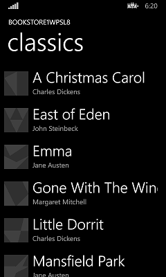
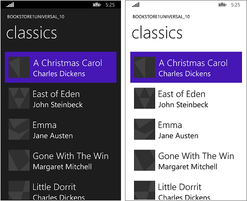

# Windows Phone Silverlight to UWP case study: Bookstore1


This topic presents a case study of porting a very simple Windows Phone Silverlight app to a Windows 10 Universal Windows Platform (UWP) app. With Windows 10, you can create a single app package that your customers can install onto a wide range of devices, and that's what we'll do in this case study. See [Guide to UWP apps](../get-started/universal-application-platform-guide.md).

The app we'll port consists of a **ListBox** bound to a view model. The view model has a list of books that shows title, author, and book cover. The book cover images have **Build Action** set to **Content** and **Copy to Output Directory** set to **Do not copy**.

The previous topics in this section describe the differences between the platforms, and they give details and guidance on the porting process for various aspects of an app from XAML markup, through binding to a view model, down to accessing data. A case study aims to complement that guidance by showing it in action in a real example. The case studies assume you've read the guidance, which they do not repeat.

**Note**   When opening Bookstore1Universal\_10 in Visual Studio, if you see the message "Visual Studio update required", then follow the steps for selecting a Target Platform Versioning in [TargetPlatformVersion](wpsl-to-uwp-troubleshooting.md).

## Downloads

[Download the Bookstore1WPSL8 Windows Phone Silverlight app](https://codeload.github.com/MicrosoftDocs/windows-topic-specific-samples/zip/Bookstore1WPSL8).

[Download the Bookstore1Universal\_10 Windows 10 app](https://codeload.github.com/MicrosoftDocs/windows-topic-specific-samples/zip/Bookstore1Universal_10).

## The Windows Phone Silverlight app

Here’s what Bookstore1WPSL8—the app that we're going to port—looks like. It's just a vertically-scrolling list box of books beneath the heading of the app's name and page title.



## Porting to a Windows 10 project

It's a very quick task to create a new project in Visual Studio, copy files over to it from Bookstore1WPSL8, and include the copied files in the new project. Start by creating a new Blank Application (Windows Universal) project. Name it Bookstore1Universal\_10. These are the files to copy over from Bookstore1WPSL8 to Bookstore1Universal\_10.

-   Copy the folder containing the book cover image PNG files (the folder is \\Assets\\CoverImages). After copying the folder, in **Solution Explorer**, make sure **Show All Files** is toggled on. Right-click the folder that you copied and click **Include In Project**. That command is what we mean by "including" files or folders in a project. Each time you copy a file or folder, click **Refresh** in **Solution Explorer** and then include the file or folder in the project. There's no need to do this for files that you're replacing in the destination.
-   Copy the folder containing the view model source file (the folder is \\ViewModel).
-   Copy MainPage.xaml and replace the file in the destination.

We can keep the App.xaml, and App.xaml.cs that Visual Studio generated for us in the Windows 10 project.

Edit the source code and markup files that you just copied and change any references to the Bookstore1WPSL8 namespace to Bookstore1Universal\_10. A quick way to do that is to use the **Replace In Files** feature. In the imperative code in the view model source file, these porting changes are needed:

-   Change `System.ComponentModel.DesignerProperties` to `DesignMode` and then use the **Resolve** command on it. Delete the `IsInDesignTool` property and use IntelliSense to add the correct property name: `DesignModeEnabled`.
-   Use the **Resolve** command on `ImageSource`.
-   Use the **Resolve** command on `BitmapImage`.
-   Delete using `System.Windows.Media;` and `using System.Windows.Media.Imaging;`.
-   Change the value returned by the **Bookstore1Universal\_10.BookstoreViewModel.AppName** property from "BOOKSTORE1WPSL8" to "BOOKSTORE1UNIVERSAL".

In MainPage.xaml, these porting changes are needed:

-   Change `phone:PhoneApplicationPage` to `Page` (don't forget the occurrences in property element syntax).
-   Delete the `phone` and `shell` namespace prefix declarations.
-   Change "clr-namespace" to "using" in the remaining namespace prefix declaration.

We can choose to correct markup compilation errors very cheaply if we want to see results soonest, even if that means temporarily removing markup. But, let's keep a record of the debt we accrue by doing so. Here it is in this case.

1.  In the root **Page** element in **MainPage.xaml**, delete `SupportedOrientations="Portrait"`.
2.  In the root **Page** element in **MainPage.xaml**, delete `Orientation="Portrait"`.
3.  In the root **Page** element in **MainPage.xaml**, delete `shell:SystemTray.IsVisible="True"`.
4.  In the `BookTemplate` data template, delete the references to the `PhoneTextExtraLargeStyle` and `PhoneTextSubtleStyle` **TextBlock** styles.
5.  In the `TitlePanel` **StackPanel**, delete the references to the `PhoneTextNormalStyle` and `PhoneTextTitle1Style` **TextBlock** styles.

Let's work on the UI for the mobile device family first, and we can consider other form factors after that. You can build and run the app now. Here's how it looks on the mobile emulator.


The view and the view model are working together correctly, and the **ListBox** is functioning. We mostly just need to fix the styling and get the images to show up.

## Paying off the debt items, and some initial styling

By default, all orientations are supported. The Windows Phone Silverlight app explicitly constrains itself to portrait-only, though, so debt items \#1 and \#2 are paid off by going into the app package manifest in the new project and checking **Portrait** under **Supported orientations**.

For this app, item \#3 is not a debt since the status bar (formerly called the system tray) is shown by default. For items \#4 and \#5, we need to find four Universal Windows Platform (UWP) **TextBlock** styles that correspond to the Windows Phone Silverlight styles that we were using. You can run the Windows Phone Silverlight app in the emulator and compare it side-by-side with the illustration in the [Text](wpsl-to-uwp-porting-xaml-and-ui.md) section. From doing that, and from looking at the properties of the Windows Phone Silverlight system styles, we can make this table.

| Windows Phone Silverlight style key | UWP style key          |
|-------------------------------------|------------------------|
| PhoneTextExtraLargeStyle            | TitleTextBlockStyle    |
| PhoneTextSubtleStyle                | SubtitleTextBlockStyle |
| PhoneTextNormalStyle                | CaptionTextBlockStyle  |
| PhoneTextTitle1Style                | HeaderTextBlockStyle   |
 
To set those styles, you can just type them into the markup editor or you can use the Visual Studio XAML Tools and set them without typing a thing. To do that, you right-click a **TextBlock** and click **Edit Style** &gt; **Apply Resource**. To do that with the **TextBlock**s in the item template, right click the **ListBox** and click **Edit Additional Templates** &gt; **Edit Generated Items (ItemTemplate)**.

There is an 80% opaque white background behind the items, because the default style of the **ListBox** control sets its background to the `ListBoxBackgroundThemeBrush` system resource. Set `Background="Transparent"` on the **ListBox** to clear that background. To left-align the **TextBlock**s in the item template, edit it again the same way as described above and set a **Margin** of `"9.6,0"` on both **TextBlock**s.

After that is done, because of [changes related to view pixels](wpsl-to-uwp-porting-xaml-and-ui.md), we need to go through and multiply any fixed size dimension that we haven’t yet changed (margins, width, height, etc) by 0.8. So, for example, the images should change from 70x70px to 56x56px.

But, let’s get those images to render before we show the results of our styling.

## Binding an Image to a view model

In Bookstore1WPSL8, we did this:

```csharp
    // this.BookCoverImagePath contains a path of the form "/Assets/CoverImages/one.png".
    return new BitmapImage(new Uri(this.CoverImagePath, UriKind.Relative));
```

In Bookstore1Universal, we use the ms-appx [URI scheme](/previous-versions/windows/apps/jj655406(v=win.10)). So that we can keep the rest of our code the same, we can use a different overload of the **System.Uri** constructor to put the ms-appx URI scheme in a base URI and append the rest of the path onto that. Like this:

```csharp
    // this.BookCoverImagePath contains a path of the form "/Assets/CoverImages/one.png".
    return new BitmapImage(new Uri(new Uri("ms-appx://"), this.CoverImagePath));
```

## Universal styling

Now, we just need to make some final styling tweaks and confirm that the app looks good on desktop (and other) form factors as well as mobile. The steps are below. And you can use the links at the top of this topic to download the projects and see the results of all the changes between here and the end of the case study.

-   To tighten up the spacing between items, find the `BookTemplate` data template in MainPage.xaml and delete the `Margin` attribute from the root **Grid**.
-   If you want to give the page title a little more breathing room, you can reset the bottom margin of `-5.6` to `0` on the page title **TextBlock**.
-   Now, we need to set `LayoutRoot`'s Background to the correct default value so that the app looks appropriate when running on all devices no matter what the theme is. Change it from `"Transparent"` to `"{ThemeResource ApplicationPageBackgroundThemeBrush}"`.

With a more sophisticated app, this would be the point at which we'd use the guidance in [Porting for form factor and user experience](wpsl-to-uwp-form-factors-and-ux.md) and really make optimal use of the form factor of each of the many devices the app can now run on. But, for this simple app, we can stop here and see how the app looks after that last sequence of styling operations. It actually looks the same on mobile and desktop devices, although it's not making best use of space on wide form factors (but we'll investigate how to do that in a later case study).

See [Theme changes](wpsl-to-uwp-porting-xaml-and-ui.md) to see how to control the theme of your app.



The ported Windows 10 app running on a Mobile device

## An optional adjustment to the list box for Mobile devices

When the app is running on a Mobile device, the background of a list box is light by default in both themes. That may be the style that you prefer and, if so, then there's nothing more to do. But, controls are designed so that you can customize their look while leaving their behavior unaffected. So, if you want the list box to be dark in the dark theme—the way the original app looked—then follow [these instructions](w8x-to-uwp-case-study-bookstore1.md) under "An optional adjustment".

## Conclusion

This case study showed the process of porting a very simple app—arguably an unrealistically simple one. For instance, list controls can be used for selection or for establishing a context for navigation; the app navigates to a page with more details about the item that was tapped. This particular app does nothing with the user's selection, and it has no navigation. Even so, the case study served to break the ice, to introduce the porting process, and to demonstrate important techniques that you can use in real UWP apps.

The next case study is [Bookstore2](wpsl-to-uwp-case-study-bookstore2.md), in which we look at accessing and displaying grouped data.