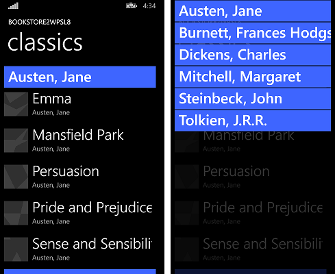

# Windows Phone Silverlight to UWP case study: Bookstore2


This case study—which builds on the info given in [Bookstore1](wpsl-to-uwp-case-study-bookstore1.md)—begins with a Windows Phone Silverlight app that displays grouped data in a **LongListSelector**. In the view model, each instance of the class **Author** represents the group of the books written by that author, and in the **LongListSelector**, we can either view the list of books grouped by author or we can zoom out to see a jump list of authors. The jump list affords much quicker navigation than scrolling through the list of books. We walk through the steps of porting the app to a Windows 10 Universal Windows Platform (UWP) app.

**Note**   When opening Bookstore2Universal\_10 in Visual Studio, if you see the message "Visual Studio update required", then follow the steps for setting Target Platform Version in [TargetPlatformVersion](w8x-to-uwp-troubleshooting.md).

## Downloads

[Download the Bookstore2WPSL8 Windows Phone Silverlight app](https://codeload.github.com/MicrosoftDocs/windows-topic-specific-samples/zip/Bookstore2WPSL8).

[Download the Bookstore2Universal\_10 Windows 10 app](https://codeload.github.com/MicrosoftDocs/windows-topic-specific-samples/zip/Bookstore2Universal_10).

##  The Windows Phone Silverlight app

The illustration below shows what Bookstore2WPSL8—the app that we're going to port—looks like. It's a vertically-scrolling **LongListSelector** of books grouped by author. You can zoom out to the jump list, and from there, you can navigate back into any group. There are two main pieces to this app: the view model that provides the grouped data source, and the user interface that binds to that view model. As we'll see, both of these pieces port easily from Windows Phone Silverlight technology to the Universal Windows Platform (UWP).



##  Porting to a Windows 10 project

It's a quick task to create a new project in Visual Studio, copy files over to it from Bookstore2WPSL8, and include the copied files in the new project. Start by creating a new Blank Application (Windows Universal) project. Name it Bookstore2Universal\_10. These are the files to copy over from Bookstore2WPSL8 to Bookstore2Universal\_10.

-   Copy the folder containing the book cover image PNG files (the folder is \\Assets\\CoverImages). After copying the folder, in **Solution Explorer**, make sure **Show All Files** is toggled on. Right-click the folder that you copied and click **Include In Project**. That command is what we mean by "including" files or folders in a project. Each time you copy a file or folder, click **Refresh** in **Solution Explorer** and then include the file or folder in the project. There's no need to do this for files that you're replacing in the destination.
-   Copy the folder containing the view model source file (the folder is \\ViewModel).
-   Copy MainPage.xaml and replace the file in the destination.

We can keep the App.xaml, and App.xaml.cs that Visual Studio generated for us in the Windows 10 project.

Edit the source code and markup files that you just copied and change any references to the Bookstore2WPSL8 namespace to Bookstore2Universal\_10. A quick way to do that is to use the **Replace In Files** feature. In the imperative code in the view model source file, these porting changes are needed.

-   Change `System.ComponentModel.DesignerProperties` to `DesignMode` and then use the **Resolve** command on it. Delete the `IsInDesignTool` property and use IntelliSense to add the correct property name: `DesignModeEnabled`.
-   Use the **Resolve** command on `ImageSource`.
-   Use the **Resolve** command on `BitmapImage`.
-   Delete `using System.Windows.Media;` and `using System.Windows.Media.Imaging;`.
-   Change the value returned by the **Bookstore2Universal\_10.BookstoreViewModel.AppName** property from "BOOKSTORE2WPSL8" to "BOOKSTORE2UNIVERSAL".
-   Just as we did for [Bookstore1](wpsl-to-uwp-case-study-bookstore1.md), update the implementation of the **BookSku.CoverImage** property (see [Binding an Image to a view model](wpsl-to-uwp-case-study-bookstore1.md)).

In MainPage.xaml, these initial porting changes are needed.

-   Change `phone:PhoneApplicationPage` to `Page` (including the occurrences in property element syntax).
-   Delete the `phone` and `shell` namespace prefix declarations.
-   Change "clr-namespace" to "using" in the remaining namespace prefix declaration.
-   Delete `SupportedOrientations="Portrait"`, and `Orientation="Portrait"`, and configure **Portrait** in the app package manifest in the new project.
-   Delete `shell:SystemTray.IsVisible="True"`.
-   The types of the jump list item converters (which are present in the markup as resources) have moved to the [**Windows.UI.Xaml.Controls.Primitives**](/uwp/api/Windows.UI.Xaml.Controls.Primitives) namespace. So, add the namespace prefix declaration Windows\_UI\_Xaml\_Controls\_Primitives and map it to **Windows.UI.Xaml.Controls.Primitives**. On the jump list item converter resources, change the prefix from `phone:` to `Windows_UI_Xaml_Controls_Primitives:`.
-   Just as we did for [Bookstore1](wpsl-to-uwp-case-study-bookstore1.md), replace all references to the `PhoneTextExtraLargeStyle` **TextBlock** style with a reference to `SubtitleTextBlockStyle`, replace `PhoneTextSubtleStyle` with `SubtitleTextBlockStyle`, replace `PhoneTextNormalStyle` with `CaptionTextBlockStyle`, and replace `PhoneTextTitle1Style` with `HeaderTextBlockStyle`.
-   There is one exception in `BookTemplate`. The style of the second **TextBlock** should reference `CaptionTextBlockStyle`.
-   Remove the FontFamily attribute from the **TextBlock** inside `AuthorGroupHeaderTemplate` and set the Background of the **Border** to reference `SystemControlBackgroundAccentBrush` instead of `PhoneAccentBrush`.
-   Because of [changes related to view pixels](wpsl-to-uwp-porting-xaml-and-ui.md), go through the markup and multiply any fixed size dimension (margins, width, height, etc) by 0.8.

## Replacing the LongListSelector


Replacing the **LongListSelector** with a [**SemanticZoom**](/uwp/api/Windows.UI.Xaml.Controls.SemanticZoom) control will take several steps, so let's make a start on that. A **LongListSelector** binds directly to the grouped data source, but a **SemanticZoom** contains [**ListView**](/uwp/api/Windows.UI.Xaml.Controls.ListView) or [**GridView**](/uwp/api/Windows.UI.Xaml.Controls.GridView) controls, which bind indirectly to the data via a [**CollectionViewSource**](/uwp/api/Windows.UI.Xaml.Data.CollectionViewSource) adapter. The **CollectionViewSource** needs to be present in the markup as a resource, so let's begin by adding that to the markup in MainPage.xaml inside `<Page.Resources>`.

```xml
    <CollectionViewSource
        x:Name="AuthorHasACollectionOfBookSku"
        Source="{Binding Authors}"
        IsSourceGrouped="true"/>
```

Note that the binding on **LongListSelector.ItemsSource** becomes the value of **CollectionViewSource.Source**, and **LongListSelector.IsGroupingEnabled** becomes **CollectionViewSource.IsSourceGrouped**. The **CollectionViewSource** has a name (note: not a key, as you might expect) so that we can bind to it.

Next, replace the `phone:LongListSelector` with this markup, which will give us a preliminary **SemanticZoom** to work with.

```xml
    <SemanticZoom>
        <SemanticZoom.ZoomedInView>
            <ListView
                ItemsSource="{Binding Source={StaticResource AuthorHasACollectionOfBookSku}}"
                ItemTemplate="{StaticResource BookTemplate}">
                <ListView.GroupStyle>
                    <GroupStyle
                        HeaderTemplate="{StaticResource AuthorGroupHeaderTemplate}"
                        HidesIfEmpty="True"/>
                </ListView.GroupStyle>
            </ListView>
        </SemanticZoom.ZoomedInView>
        <SemanticZoom.ZoomedOutView>
            <ListView
                ItemsSource="{Binding CollectionGroups, Source={StaticResource AuthorHasACollectionOfBookSku}}"
                ItemTemplate="{StaticResource ZoomedOutAuthorTemplate}"/>
        </SemanticZoom.ZoomedOutView>
    </SemanticZoom>
```

The **LongListSelector** notion of flat list and jump list modes is answered in the **SemanticZoom** notion of a zoomed-in and a zoomed-out view, respectively. The zoomed-in view is a property, and you set that property to an instance of a **ListView**. In this case, the zoomed-out view is also set to a **ListView**, and both **ListView** controls are bound to our **CollectionViewSource**. The zoomed-in view uses the same item template, group header template, and **HideEmptyGroups** setting (now named **HidesIfEmpty**) as the **LongListSelector**'s flat list does. And the zoomed-out view uses an item template very much like the one inside the **LongListSelector**'s jump list style (`AuthorNameJumpListStyle`). Also, note that the zoomed-out view binds to a special property of the **CollectionViewSource** named **CollectionGroups**, which is a collection containing the groups rather than the items.

We no longer need `AuthorNameJumpListStyle`, at least not all of it. We only need the data template for the groups (which are authors in this app) in the zoomed-out view. So, we delete the `AuthorNameJumpListStyle` style and replace it with this data template.

```xml
   <DataTemplate x:Key="ZoomedOutAuthorTemplate">
        <Border Margin="9.6,0.8" Background="{Binding Converter={StaticResource JumpListItemBackgroundConverter}}">
            <TextBlock Margin="9.6,0,9.6,4.8" Text="{Binding Group.Name}" Style="{StaticResource SubtitleTextBlockStyle}"
            Foreground="{Binding Converter={StaticResource JumpListItemForegroundConverter}}" VerticalAlignment="Bottom"/>
        </Border>
    </DataTemplate>
```

Note that, since the data context of this data template is a group rather than an item, we bind to a special property named **Group**.

You can build and run the app now. Here's how it looks on the mobile emulator.


The view model and the zoomed-in and zoomed-out views are working together correctly, although one issue is that we need to do a little more styling and templating work. For example, the correct styles and brushes are not yet being used, so the text is invisible on the group headers that you can click to zoom out. If you run the app on a desktop device, then you'll see a second issue, which is that the app doesn't yet adapt its user-interface to give the best experience and use of space on larger devices where windows can be potentially much larger than the screen of a mobile device. So, in the next few sections ([Initial styling and templating](#initial-styling-and-templating), [Adaptive UI](#adaptive-ui), and [Final styling](#final-styling)), we'll remedy those issues.

## Initial styling and templating

To space out the group headers nicely, edit `AuthorGroupHeaderTemplate` and set a **Margin** of `"0,0,0,9.6"` on the **Border**.

To space out the book items nicely, Edit `BookTemplate` and set the **Margin** to `"9.6,0"` on both **TextBlock**s.

To lay out the app name and the page title a little better, inside `TitlePanel`, remove the top **Margin** on the second **TextBlock** by setting the value to `"7.2,0,0,0"`. And on `TitlePanel` itself, set the margin to `0` (or whatever value looks good to you)

Change `LayoutRoot`'s Background to `"{ThemeResource ApplicationPageBackgroundThemeBrush}"`.

## Adaptive UI

Because we started out with a phone app, it's no surprise that our ported app's UI layout really only makes sense for small devices and narrow windows at this stage in the process. But, we'd really like the UI layout to adapt itself and make better use of space when the app is running in a wide window (which is only possible on a device with a large screen), and for it only to use the UI that we have currently when the app's window is narrow (which happens on a small device, and can also happen on a large device).

We can use the adaptive Visual State Manager feature to achieve this. We'll set properties on visual elements so that, by default, the UI is laid out in the narrow state using the templates that we're using right now. Then, we'll detect when the app's window is wider-than-or-equal-to a specific size (measured in units of [effective pixels](wpsl-to-uwp-porting-xaml-and-ui.md)), and in response, we'll change the properties of visual elements so that we get a larger, and wider, layout. We'll put those property changes in a visual state, and we'll use an adaptive trigger to continuously monitor and determine whether to apply that visual state, or not, depending on the width of the window in effective pixels. We're triggering on window width in this case, but it's possible to trigger on window height, too.

A minimum window width of 548 epx is appropriate for this use case because that's the size of the smallest device we would want to show the wide layout on. Phones are typically smaller than 548 epx, so on a small device like that, we'd remain in the default narrow layout. On a PC, the window will launch by default wide enough to trigger the switch to the wide state, which will display 250x250-sized items. From there, you'll be able to drag the window narrow enough to display a minimum of two columns of the 250x250 items. Any narrower than that and the trigger will deactivate, the wide visual state will be removed, and the default narrow layout will be in effect.

Before tackling the adaptive Visual State Manager piece, we first need to design the wide state and that means adding some new visual elements and templates to our markup. These steps describe how to do that. By way of naming conventions for visual elements and templates, we'll include the word "wide" in the name of any element or template that is for the wide state. If an element or template does not contain the word "wide", then you can assume that it is for the narrow state, which is the default state and whose property values are set as local values on visual elements in the page. Only the property values for the wide state are set via an actual Visual State in the markup.

-   Make a copy of the [**SemanticZoom**](/uwp/api/Windows.UI.Xaml.Controls.SemanticZoom) control in the markup and set `x:Name="narrowSeZo"` on the copy. On the original, set `x:Name="wideSeZo"` and also set `Visibility="Collapsed"` so that the wide one is not visible by default.
-   In `wideSeZo`, change the **ListView**s to **GridView**s in both the zoomed-in view and the zoomed-out view.
-   Make a copy of these three resources `AuthorGroupHeaderTemplate`, `ZoomedOutAuthorTemplate`, and `BookTemplate` and append the word `Wide` to the keys of the copies. Also, update `wideSeZo` so that it references the keys of these new resources.
-   Replace the contents of `AuthorGroupHeaderTemplateWide` with `<TextBlock Style="{StaticResource SubheaderTextBlockStyle}" Text="{Binding Name}"/>`.
-   Replace the contents of `ZoomedOutAuthorTemplateWide` with:

```xml
    <Grid HorizontalAlignment="Left" Width="250" Height="250" >
        <Border Background="{StaticResource ListViewItemPlaceholderBackgroundThemeBrush}"/>
        <StackPanel VerticalAlignment="Bottom" Background="{StaticResource ListViewItemOverlayBackgroundThemeBrush}">
          <TextBlock Foreground="{StaticResource ListViewItemOverlayForegroundThemeBrush}"
              Style="{StaticResource SubtitleTextBlockStyle}"
            Height="80" Margin="15,0" Text="{Binding Group.Name}"/>
        </StackPanel>
    </Grid>
```

-   Replace the contents of `BookTemplateWide` with:

```xml
    <Grid HorizontalAlignment="Left" Width="250" Height="250">
        <Border Background="{StaticResource ListViewItemPlaceholderBackgroundThemeBrush}"/>
        <Image Source="{Binding CoverImage}" Stretch="UniformToFill"/>
        <StackPanel VerticalAlignment="Bottom" Background="{StaticResource ListViewItemOverlayBackgroundThemeBrush}">
            <TextBlock Style="{StaticResource SubtitleTextBlockStyle}"
                Foreground="{StaticResource ListViewItemOverlaySecondaryForegroundThemeBrush}"
                TextWrapping="NoWrap" TextTrimming="CharacterEllipsis"
                Margin="12,0,24,0" Text="{Binding Title}"/>
            <TextBlock Style="{StaticResource CaptionTextBlockStyle}" Text="{Binding Author.Name}"
                Foreground="{StaticResource ListViewItemOverlaySecondaryForegroundThemeBrush}" TextWrapping="NoWrap"
                TextTrimming="CharacterEllipsis" Margin="12,0,12,12"/>
        </StackPanel>
    </Grid>
```

-   For the wide state, the groups in the zoomed-in view will need more vertical breathing space around them. Creating and referencing an items panel template will give us the results we want. Here's how the markup looks.

```xml
   <ItemsPanelTemplate x:Key="ZoomedInItemsPanelTemplate">
        <ItemsWrapGrid Orientation="Horizontal" GroupPadding="0,0,0,20"/>
    </ItemsPanelTemplate>
    ...

    <SemanticZoom x:Name="wideSeZo" ... >
        <SemanticZoom.ZoomedInView>
            <GridView
            ...
            ItemsPanel="{StaticResource ZoomedInItemsPanelTemplate}">
            ...
```

-   Finally, add the appropriate Visual State Manager markup as the first child of `LayoutRoot`.

```xml
    <Grid x:Name="LayoutRoot" ... >
        <VisualStateManager.VisualStateGroups>
            <VisualStateGroup>
                <VisualState x:Name="WideState">
                    <VisualState.StateTriggers>
                        <AdaptiveTrigger MinWindowWidth="548"/>
                    </VisualState.StateTriggers>
                    <VisualState.Setters>
                        <Setter Target="wideSeZo.Visibility" Value="Visible"/>
                        <Setter Target="narrowSeZo.Visibility" Value="Collapsed"/>
                    </VisualState.Setters>
                </VisualState>
            </VisualStateGroup>
        </VisualStateManager.VisualStateGroups>

    ...
```

## Final styling

All that remains are some final styling tweaks.

-   In `AuthorGroupHeaderTemplate`, set `Foreground="White"` on the **TextBlock** so that it looks correct when running on the mobile device family.
-   Add `FontWeight="SemiBold"` to the **TextBlock** in both `AuthorGroupHeaderTemplate` and `ZoomedOutAuthorTemplate`.
-   In `narrowSeZo`, the group headers and the authors in the zoomed-out view are left-aligned instead of stretched, so let's work on that. We'll create a [**HeaderContainerStyle**](/uwp/api/windows.ui.xaml.controls.groupstyle.headercontainerstyle) for the zoomed-in view with [**HorizontalContentAlignment**](/uwp/api/windows.ui.xaml.controls.control.horizontalcontentalignment) set to `Stretch`. And we'll create an [**ItemContainerStyle**](/uwp/api/windows.ui.xaml.controls.itemscontrol.itemcontainerstyle) for the zoomed-out view containing that same [**Setter**](/uwp/api/Windows.UI.Xaml.Setter). Here's what that looks like.

```xml
   <Style x:Key="AuthorGroupHeaderContainerStyle" TargetType="ListViewHeaderItem">
        <Setter Property="HorizontalContentAlignment" Value="Stretch"/>
    </Style>

    <Style x:Key="ZoomedOutAuthorItemContainerStyle" TargetType="ListViewItem">
        <Setter Property="HorizontalContentAlignment" Value="Stretch"/>
    </Style>

    ...

    <SemanticZoom x:Name="narrowSeZo" ... >
        <SemanticZoom.ZoomedInView>
            <ListView
            ...
                <ListView.GroupStyle>
                    <GroupStyle
                    ...
                    HeaderContainerStyle="{StaticResource AuthorGroupHeaderContainerStyle}"
                    ...
        <SemanticZoom.ZoomedOutView>
            <ListView
                ...
                ItemContainerStyle="{StaticResource ZoomedOutAuthorItemContainerStyle}"
                ...
```

That last sequence of styling operations leaves the app looking like this.


The ported Windows 10 app running on a Desktop device, zoomed-in view, two sizes of window
 


The ported Windows 10 app running on a Desktop device, zoomed-out view, two sizes of window


The ported Windows 10 app running on a Mobile device, zoomed-in view


The ported Windows 10 app running on a Mobile device, zoomed-out view

## Making the view model more flexible

This section contains an example of facilities that open up to us by virtue of having moved our app to use the UWP. Here, we explain optional steps that you can follow to make your view model more flexible when accessed via a **CollectionViewSource**. The view model (the source file is in ViewModel\\BookstoreViewModel.cs) that we ported from the Windows Phone Silverlight app Bookstore2WPSL8 contains a class named Author, which derives from **List&lt;T&gt;**, where **T** is BookSku. That means that the Author class *is a* group of BookSku.

When we bind **CollectionViewSource.Source** to Authors, the only thing we're communicating is that each Author in Authors is a group of *something*. We leave it to the **CollectionViewSource** to determine that Author is, in this case, a group of BookSku. That works: but it's not flexible. What if we want Author to be *both* a group of BookSku *and* a group of the addresses where the author has lived? Author can't *be* both of those groups. But, Author can *have* any number of groups. And that's the solution: use the *has-a-group* pattern instead of, or in addition to, the *is-a-group* pattern that we're using currently. Here's how:

-   Change Author so that it no longer derives from **List&lt;T&gt;**.
-   Add this field to 
-   Add this property to 
-   And of course we can repeat the above two steps to add as many groups to Author as we need.
-   Change the implementation of the AddBookSku method to `this.BookSkus.Add(bookSku);`.
-   Now that Author *has* at least one group, we need to communicate to the **CollectionViewSource** which of those groups it should use. To do that, add this property to the **CollectionViewSource**: `ItemsPath="BookSkus"`

Those changes leave this app functionally unchanged, but you now know how you could extend Author, and the **CollectionViewSource**, should you need to. Let's make one last change to Author so that, if we use it *without* specifying **CollectionViewSource.ItemsPath**, a default group of our choosing will be used:

```csharp
    public class Author : IEnumerable<BookSku>
    {
        ...

        public IEnumerator<BookSku> GetEnumerator()
        {
            return this.BookSkus.GetEnumerator();
        }
        System.Collections.IEnumerator System.Collections.IEnumerable.GetEnumerator()
        {
            return this.BookSkus.GetEnumerator();
        }
    }
```

And now we can choose to remove `ItemsPath="BookSkus"` if we like and the app will still behave the same way.

## Conclusion

This case study involved a more ambitious user interface than the previous one. All of the facilities and concepts of the Windows Phone Silverlight **LongListSelector**—and more—were found to be available to a UWP app in the form of **SemanticZoom**, **ListView**, **GridView**, and **CollectionViewSource**. We showed how to re-use, or copy-and-edit, both imperative code and markup in a UWP app to achieve functionality, UI, and interactions tailored to suit the narrowest and widest Windows device form factors and all sizes in-between.