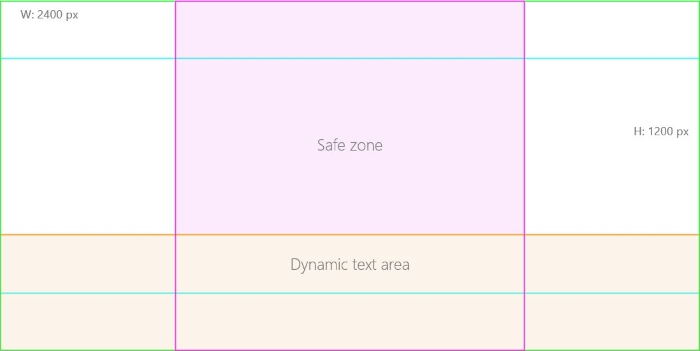
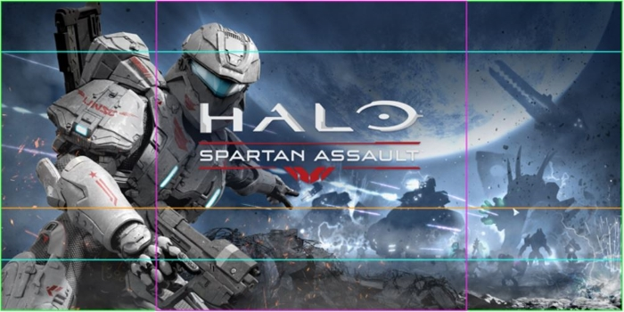

---
author: jnHs
Description: You can select the screenshots, logos, and other art assets (such as trailers and promotional images) to include in your app's Store listing.
title: App screenshots, images, and trailers
ms.assetid: D216DD2B-F43D-4D26-82EE-0CD34DB929D8
ms.author: wdg-dev-content
ms.date: 08/08/2017
ms.topic: article
ms.prod: windows
ms.technology: uwp
keywords: windows 10, uwp
---

# App screenshots, images, and trailers

Well-designed images are one of the main ways for you to represent your app to potential customers in the Store.

You can provide [screenshots](#screenshots), [logos](#store-logos), and other art assets (such as [trailers](#trailers) and [promotional images](##additional-art-assets) to include in your app's Store listing. Some of these are required, and some are optional (although some of the optional images are important to include for the best Store display). 

During the [app submission process](app-submissions.md), you provide these art assets in the [Store listings](create-app-store-listings.md) step. Note that the images which are used in the Store, and the way that they appear, may vary depending on the customer's operating system and other factors.

The Store may also use your app's tile and other images that you include in your app's package. Run the [Windows App Certification Kit](../debug-test-perf/windows-app-certification-kit.md) to determine if you're missing any required images before you submit your app. For guidance and recommendations about these images, see [Tile and icon assets](../controls-and-patterns/tiles-and-notifications-app-assets.md).

## Screenshots

Screenshots are images of your app that are displayed to your customers in your app's Store listing.

You have the option to provide screenshots for different device families, so that the appropriate screenshots will appear when a customer views your app's Store listing on that type of device. 

Only one screenshot (for any device family) is required for your submission, though you can provide several; up to 9 desktop screenshots and up to 8 screenshots for the other device families. We suggest providing at least four screenshots for each device family that your app supports so that people can see how the app will look on their device type.

> [!NOTE]
> Microsoft Visual Studio provides a [tool to help you capture screenshots](https://docs.microsoft.com/visualstudio/debugger/run-windows-store-apps-in-the-simulator#BKMK_Capture_a_screenshot_of_your_app_for_submission_to_the_Microsoft_Store).

Each screenshot must be a .png file in either landscape or portrait orientation, and the file size can't be larger than 5 MB.

The size requirements vary depending on the device family:
- Mobile: either 768 x 1280, 720 x 1280, or 480 x 800 pixels
- Desktop: 1366 x 768 pixels or larger
- Holographic: 1268 x 720 pixels or larger
- Xbox: 3480 x 2160 pixels or smaller

For the best display, keep the following guidelines in mind when creating your screenshots:
- Keep critical visuals and text in the top 3/4 of the image. Text overlays may appear on the bottom 1/4. 
- Don’t add additional logos, icons, or marketing messages to your screenshots.
- Don’t use extremely light or dark colors or highly-contrasting stripes that may interfere with readability of text overlays.

You can also provide a short caption that describes each screenshot in 200 characters or less.

> [!TIP]
> Screenshots are displayed in your listing in order. After you upload your screenshots, you can drag and drop them to reorder them. 

Note that if you create Store listings for [multiple languages](supported-languages.md), you'll have a **Store listing** page for each one. You'll need to upload images for each language separately (even if you are using the same images), and provide captions to use for each language.

## Store logos

Store logos are optional images that you can upload for a more customized display in the Store. We recommend that you provide these images for the best Store listing display on all of the devices and OS versions that your app supports.

You can provide these images as .png files, which should follow the guidelines below:

- **9:16 (720 x 1080 or 1440 x 2160 pixels)**: This is used as the main image on Store listings for customers on Windows 10 and Xbox devices, so we strongly recommend providing this image; your listing may not look good without it. The image should include your app’s name, and any text on the image should meet accessible readability requirements (4.51 contrast ratio).  
- **1:1 (1080 x 1080 or 2160 x 2160 pixels)**: This image may appear in some layouts. If you provide it, be sure to include your app’s name.
- **1:1 (300 x 300 pixels)**: This image, sometimes referred to as the **App tile icon**, is used when displaying your app's Store listing to customers on Windows Phone 8.1 and earlier. If you don't provide this image, customers on Windows Phone 8.1 or earlier will see a blank icon with your app's listing. (This also applies to customers on Windows 10, if your app only has packages targeting Windows Phone 8.1 or earlier.) If your submission *only* includes UWP packages, you don’t need to provide this image. (Note that if your submission includes both Windows Phone 8.x packages and UWP packages, and you provide this image, it may be used on Windows 10 in certain Store layouts. To prevent this, you can create a [platform-specific listing](create-platform-specific-store-listings.md) for the Windows Phone OS versions, and only include the app tile icon there.)

You also have the option to prevent the Store from using logo images in your app's packages when displaying your listing to customers on Windows 10, and instead have the Store use only images that you upload. This gives you more control over your app’s appearance in various displays throughout the Store on Windows 10.

To use only uploaded images for display in the Store on Windows 10, check the box that says **For Windows 10 customers, display uploaded logo images instead of the images from my packages**.

When you check this box, a new section called **Uploaded Store logos** appears. Here, you can upload 3 images, including the 300 x 300 “app tile icon” size (if you check the box, the field to provide that image will move into this section). We recommend providing all three image sizes if you use this option: 300 x 300, 150 x 150, and 71 x 71 pixels. However, only the 300 x 300 size is required.

## Additional art assets

This section lets you provide artwork to help display your product more effectively in the Store: promotional images, Xbox images, optional promotional images, and trailers. We recommend providing these images to create a more inviting Store listing. The **16:9 "hero" (1920 x 1080 or 3840 x 2160 pixels)** is especially recommended if you plan to include [video trailers](#trailers) in your Store listing; if you don't include it, your trailers won't appear at the top of your listing.

To add these images, select **Show details** in the **Additional art assets** section.

## Promotional images

The images in this section can help your app listing look better, and also allow us to consider your app for featured promotional opportunities. Note that providing these images doesn't guarantee that your app will be featured. See [Making your app easy to promote](make-your-app-easier-to-promote.md) for more information.

Here are some tips to keep in mind when designing your promotional artwork:

- Images must be in .png format.
- Select dynamic images that relate to the app and drive recognition and differentiation. Avoid stock photography or generic visuals.
- Don't include text (aside from your branding).
- Minimize empty space in the image.
- Avoid showing your app's UI, and do not use any device-specific imagery.
- Avoid political and national themes, flags, or religious symbols.
- Don't include images of insensitive gestures, nudity, gambling, currency, drugs, tobacco, or alcohol.
- Don't use weapons pointing at the viewer or excessive violence and gore.

The **16:9 "hero" (1920 x 1080 or 3840 x 2160 pixels)** is used in various layouts in the Store on all Windows 10 device types. We recommend providing this image, regardless of which OS versions or device types your app targets. This image is *required* for proper display if your listing includes [video trailers](#trailers). For customers on Windows 10, version 1607 or later, it is used as the main image on the top of your Store listing (or appears after any trailers finish playing). 

The **2:1 (2400 x 1200)** image size is only used if your app supports the Holographic device family.

When designing your image, keep in mind that in some layouts, we'll apply a gradient over the bottom third so that we can legibly display marketing text over the image. Because of this, make sure you avoid placing text and key visual elements in the bottom third. Additionally, we may crop your image, so place your app's branding and the most important details in the center.  

<!-- update?  

The image below shows the key proportions to keep in mind. The "safe zone" in the center will be prominent even if we crop the image. The "dynamic text area" is where text and a gradient may appear.  -->

## Xbox images

These images are recommended for proper display if you publish your app to Xbox. 

There are 3 different sizes that you can upload:
- **Branded key art, 584 x 800 pixels**: Used in the Xbox.com Store. Must include the product’s title. 
- **Titled hero, 1920 x 1080 pixels**: Must include the product’s title.
- **Featured promo, 1080 x 1080 pixels**: Used in the Xbox Store. Must include the product’s title.

> [!NOTE]
> For the best display on Xbox, you must also provide a **9:16 (720 x 1080 or 1440 x 2160 pixels)** image in the [Store logos](#store-logos) section.

## Optional promotional images

If your app supports earlier OS versions (Windows 8.x and/or Windows Phone 8.x), these images must be provided in order for us to consider featuring your app in promotional layouts (though they don't guarantee that your app will be featured). If your app does not support these earlier OS versions, you can skip this section.

**For Windows Phone 8.1 and earlier**, two image sizes can be used in promotional layouts: **1000 x 800 pixels (5:4)** and **358 x 358 pixels (1:1)**. If your app runs on Windows Phone 8.1 or earlier, we recommend providing images in both of these sizes for promotional consideration.  

> [!TIP]
> Be sure to provide a 300 x 300 app tile icon image in the [Store logos](#store-logos) section for any submission that supports Windows Phone 8.1 or earlier. This will ensure that your app does not appear in the Store with a blank icon.  

**For Windows 8.1 and earlier**, some promotional layouts may use an image in the **414 x 180** pixel size. If your app runs on Windows 8.1 or earlier, we recommend providing an image in this size for promotional consideration.

## Trailers

Trailers are short videos that give customers a way to see your product in action, so they can get a better understanding of what it’s like. They are shown at the top of your app's Store listing (as long as you include a **1920 x 1080 pixel image (16:9)** in the [Promotional images](#promotional-images) section). 

Trailers are encoded with [Smooth Streaming](http://www.iis.net/downloads/microsoft/smooth-streaming), which adapts the quality of a video stream delivered to clients in real time based on their available bandwidth and CPU resources.

> [!NOTE]
> Trailers are only shown to customers on Windows 10, version 1607 or later.

### Upload trailers

You can add up to 15 trailers to your Store listing. Be sure they meet the requirements listed below for each trailer.

You must provide a video file (.mp4 or .mov), a thumbnail image, and a title for each trailer.

> [!IMPORTANT]
> When using trailers, you must also provide a **1920 x 1080 pixel image (16:9)** in the [Promotional images](#promotional-images) section in order for your trailers to appear at the top of your Store listing. This image will appear after your trailers have finished playing.

Follow these recommendations to make your trailers effective:
- Trailers should be of good quality and minimal length (2 minutes or less recommended). 
- Frame rate and resolution should match the source material. For example, content shot at 720p60 should be encoded and uploaded at 720p60. 
- Use a different thumbnail for each trailer so that customers know they are unique.
- Because some layouts may slightly crop the top and bottom of your trailer, make sure key info appears in the center of the screen.

You must also follow the requirements stated below.

**To add trailers to your listing:**
1. Upload your trailer **video file** in the indicated box. A drop-down box is also shown in case you want to reuse a trailer you have alread uploaded (perhaps for a Store listing in a different language).
2. After you have uploaded the trailer, you'll need to upload a **thumbnail image** to go along with it. This must be a .png file that is 1920 x 1080 pixels, and is typically a still image taken from the trailer.
3. Click the pencil icon to add a **title** for your trailer (255 characters or fewer).
4. If you want to add more trailers to the listing, click **Add trailer** and repeat the steps listed above.

To remove a trailer, click the **X** next to its file name. You can choose whether to remove it from only the current Store listings, or from all Store listings for your product (that is, for only this language or for all languages).

### Trailer requirements

When providing your trailers, be sure to follow these requirements:

- The video format must be MOV or MP4. 
- The video duration must be less than 30 minutes. 
- The file size of the trailer can’t exceed 10 GB. 
- The thumbnail must be a PNG file with a resolution of 1920 x 1080 pixels. 
- The title can’t exceed 255 characters. 

Like the other fields on the Store listing page, trailers must pass certification before you can publish them to the Store. Be sure your trailers comply with the [Windows Store Policies](https://msdn.microsoft.com/library/windows/apps/dn764944.aspx).

There are additional requirements depending on the type of file.

#### MOV

<table>
<tr>
<td>
**Video:**
<ul>
<li>1080p ProRes (HQ where appropriate)</li>
<li>Native framerate; 29.97 FPS preferred</li>
</ul>
</td>
<td>
**Audio:**
<ul>
<li>Stereo required</li>
<li>Recommended Audio Level: -16 LKFS/LUFS</li>
</ul> 
</td>
</tr>
</table>

#### MP4

<table>
<tr>
<td>
**Video:**
<ul>
<li>Codec: H.264</li>
<li>Progressive scan (no interlacing)</li>
<li>High Profile</li>
<li>2 consecutive B frames</li>
<li>Closed GOP. GOP of half the frame rate</li>
<li>CABAC</li>
<li>50 MB/s </li>
<li>Color Space: 4.2.0</li>
</ul>
</td>
<td>
**Audio:**
<ul>
<li>Codec: AAC-LC</li>
<li>Channels: Stereo or surround sound</li>
<li>Sample rate: 48 KHz</li>
<li>Audio Bitrate: 384 KB/s for Stereo, 512 KB/s for surround sound</li>
</ul>
</td>
</tr>
</table>

For H.264 Mezzanine files, we recommend the following:
- Container: MP4
- No Edit Lists (or you might lose AV sync)
- moov atom at the front of the file (Fast Start)

