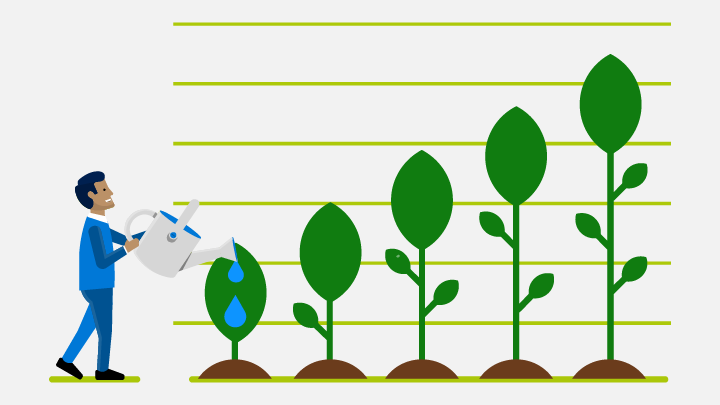
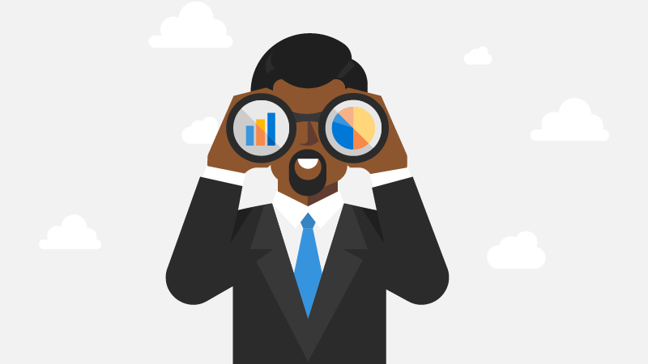

# Attract customers and promote your apps

Once your app is in the Microsoft Store, it's time to get it in front of as many customers as possible. [Partner Center](https://partner.microsoft.com/dashboard) offers many features that help you promote your products and grow your customer base, including ad campaigns, promo codes, sale pricing, and more.

## App promotion campaigns

:::row:::
    :::column:::
        
    :::column-end:::
	:::column span="2":::
**Paid campaigns**

These campaigns will run ads in any other app that matches your app’s device and category. You can also choose a universal campaign, where the ads will also appear within MSN.com, Outlook.com, Skype, and other Microsoft premium properties.

[EXPLORE MORE >](create-an-ad-campaign-for-your-app.md)
    :::column-end:::
:::row-end:::

:::row:::
    :::column:::
        
    :::column-end:::
	:::column span="2":::
**Free house campaigns**

These campaigns will run ads only in your other apps, free of charge.

[EXPLORE MORE >](about-house-ads.md)
    :::column-end:::
:::row-end:::

:::row:::
    :::column:::
        
    :::column-end:::
	:::column span="2":::
    
**Free community campaigns**

These campaigns will run ads in apps published by other developers who also participate in community ad campaigns, free of charge.

[EXPLORE MORE >](create-an-ad-campaign-for-your-app.md)
    :::column-end:::
:::row-end:::

## Ad experiences for campaigns

:::row:::
    :::column:::
        
    :::column-end:::
	:::column span="2":::
**Banner and banner interstitial ads**

Banner ads use a portion of the app's real estate. Banner interstitial ads are full-screen ads that grab the complete attention of users.

[EXPLORE MORE >](../monetize/supported-ad-sizes-for-banner-ads.md)
    :::column-end:::
:::row-end:::

:::row:::
    :::column:::
        
    :::column-end:::
	:::column span="2":::
**Video ads**

Video ads are full-screen ads that show users the features of your game in a visually engaging manner. Video ads are currently available for high-budget campaigns. To learn more, email us at aiacare@microsoft.com.

[EXPLORE MORE >](../monetize/interstitial-ads.md)
    :::column-end:::
:::row-end:::

:::row:::
    :::column:::
        
    :::column-end:::
	:::column span="2":::
**Native ads**

Native ads enable you to send all the individual components of your ad (such as the image, title, and description) to the receiving app. The app stitches these components together to provide a native experience for the user.

[EXPLORE MORE >](../monetize/native-ads.md)
    :::column-end:::
:::row-end:::

## Learn more about app promotion campaigns

[Create an ad campaign in the dashboard](create-an-ad-campaign-for-your-app.md)

[Create an ad campaign using our REST API](../monetize/run-ad-campaigns-using-windows-store-services.md)

[Review campaign performance data in the dashboard](/windows/uwp/publish/ad-campaign-report)

[Get campaign performance data using our REST API](../monetize/index.md)

## Promotion analytics

[Ad campaign report](/windows/uwp/publish/ad-campaign-report)

[Acquisitions report](acquisitions-report.md)

[Get analytics data using our REST API](../monetize/access-analytics-data-using-windows-store-services.md)

## Other ways to promote your app

[Promotional codes](generate-promotional-codes.md)

[Sale pricing](put-apps-and-add-ons-on-sale.md)

[Microsoft store badges](https://developer.microsoft.com/store/badges)

[Custom promotion campaigns](create-a-custom-app-promotion-campaign.md)

[Microsoft Store marketing guidelines for apps](app-marketing-guidelines.md)

[Link to your app](link-to-your-app.md)

[Make your app easier to promote](make-your-app-easier-to-promote.md)