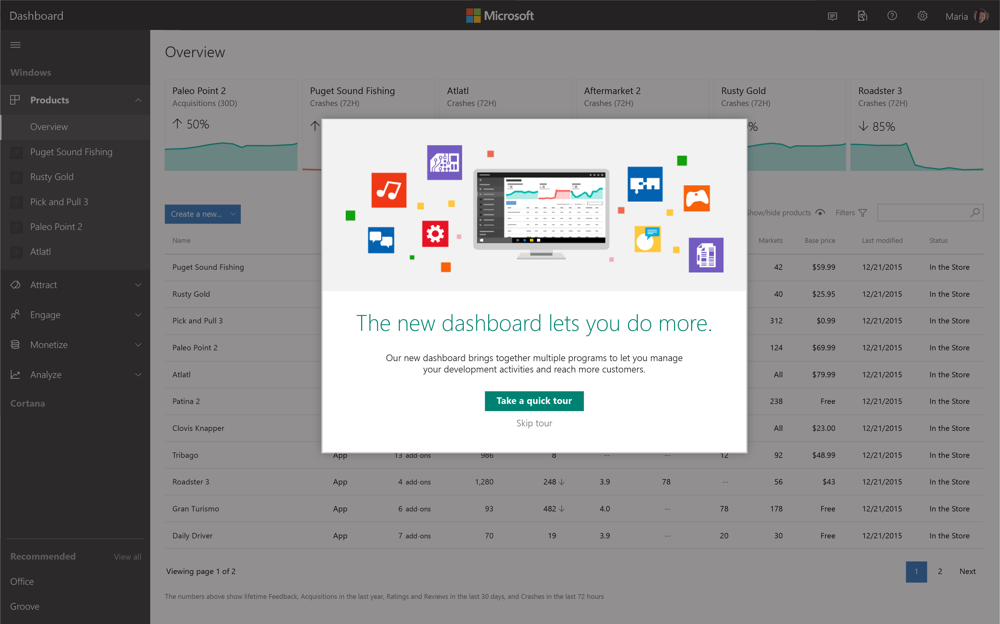
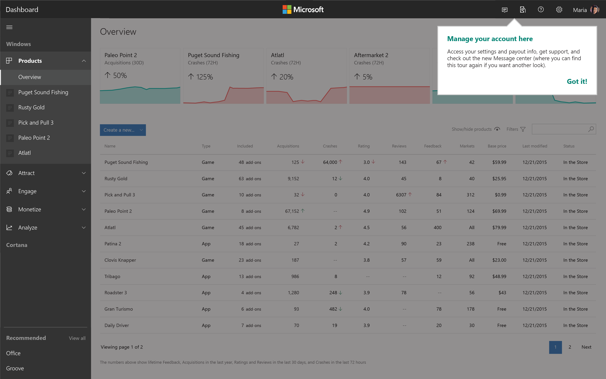

---
title: Dev Center Insider Program
description: Try out new Dev Center features before they become available to all developers and let us know what you think.
author: JnHs
ms.author: wdg-dev-content
ms.date: 04/25/2017
ms.topic: article
ms.prod: windows
ms.technology: uwp
keywords: windows 10, uwp
ms.assetid: 6fa470dd-e46e-4af1-b278-54bb501a69b0
---

# Dev Center Insider Program

As a [registered developer](http://go.microsoft.com/fwlink/?LinkID=615100), you can help influence the functionality we make available in the Dev Center dashboard by joining the Dev Center Insider Program. This program allows you to try out new features before they become available to all developers. We encourage you to give us your feedback on these features by using the Feedback link in the bottom right corner of Dev Center. All of the feedback we receive from Dev Center Insiders will be read closely and given priority consideration.

To join the program, opt in on the **Account settings** page in your Dev Center dashboard. You can opt out at any time.

> **Important** The terms of the [App Developer Agreement](https://msdn.microsoft.com/windows/apps/hh694058.aspx) apply to your participation in the program. Please read them, particularly Exhibit I, before you join the program. Keep in mind that the features made available exclusively to people in the Dev Center Insider Program may include experimental and early prerelease services. This means that these features often don’t have documentation available yet, and you may experience unintended results when using them. 

Here are some of the features that we’ve made available exclusively to members of the Dev Center Insider Program. This list will change over time as new features are added (and as features introduced to the Insider Program are made available to everyone).

| Dev Center Insider Program feature   | How Dev Center Insiders can try it | Date added |
|--------------------------------------|------------------------------------|------------|
|**Email notification for analytic trend changes**: Get notified about significant changes in your apps' acquisitions. | If we detect a significant change in an app's acquisition numbers compared to its historical data, we'll automatically send you an email. |April 2017|
|**App trends on overview page**: Get a quick look at how your app metrics have changed. | On your Overview page, look for the sparklines and arrows next to the metrics numbers. The sparklines give you a quick visual representation of recent trends. The direction of the arrow lets you know whether the numbers have recently increased or decreased significantly. Note that you may not see arrows next to every sparkline. |February 2017|
|**Choose which products to show on your dashboard**: If you have created apps that you don’t plan to work on for a while, you can now hide them from your dashboard. | On your dashboard overview page, select **Show/hide products**. Uncheck the boxes for any products you wish to hide (or check boxes for any which you wish to restore), then click **Show/hide products** again. |January 2017| 
|**Universal app promotion campaigns**: In addition to apps, your ad campaigns will now target MSN.com, Outlook.com, Skype, and other Microsoft premium properties. | To reach this larger set of potential new customers, just create a new ad campaign (**Promotions > Ad campaigns**). |December 2016|
|**Real time analytics**: See details about your app's most recent acquisitions and add-ons. The new report uses real-time event collection from your Windows 10 customers. | Choose **Real time report** in the left menu under **Analytics**. Select the time range to review data over the last 7 days or up to the last hour on a per-minute basis. Note that the report includes only data from customers on Windows 10.  |August 2016|
|**Manage add-ons in bulk**: Make changes to multiple add-ons at once rather than submitting each update individually. | Click **Manage add-ons in bulk** on an app’s Overview or Add-ons page. |June 2016|

## Coming soon: Dashboard enhancements for Dev Center Insiders

We're thrilled to announce that **the new developer dashboard is coming soon** and, as a member of the Dev Center Insider Program, you will be among the first to experience it!

Beginning in early May, the new dashboard experience will be available for Insiders to use and provide us with feedback. It will include all of the existing Dev Center capabilities, while adding more of the ones you've been asking for.

Some of the **highlights of the new dashboard** will include:

- **Instant access to all of your developer programs** in one simple experience, without having to sign in and out to each one. We'll suggest new programs you might be interested in as they become available.

- **A single location to access info relevant to you** including profile and account details, payout statements, and notifications.

- **New account-level views** that allow you to quickly assess status and peform tasks without having to repeat the same steps for every product in your portfolio.

- **A familiar, streamlined navigation model** to help you be more productive.

As always, your participation and feedback helps us build the best capabilities and experiences possible so we can continue to succeed and grow together. Please use the **Feedback** link in the bottom right corner of Dev Center to let us know what you think. If you decide you're not ready to use the new dashboard design, you can always opt out of the Dev Center Insider Program in **Account Settings**.

