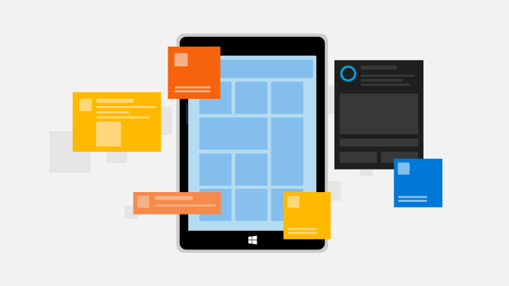
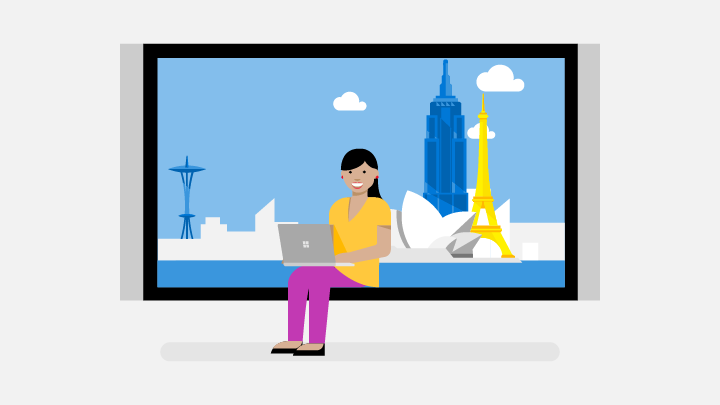

# Engage with your customers

Drive customer engagement and satisfaction by using features like push notifications, targeted offers, and responses to feedback and reviews. [Partner Center](https://partner.microsoft.com/dashboard) includes these features and more to help you drive customer engagement and satisfaction.

## Understand your audience

:::row:::
    :::column:::
        
    :::column-end:::
    :::column span="2":::
**Define customer segments**

Use the dashboard to define segments of your app’s customers, based on demographic or revenue criteria that you choose. 

[Define segments](create-customer-segments.md)
    :::column-end:::
:::row-end:::

:::row:::
    :::column:::
        
    :::column-end:::
    :::column span="2":::
**Targeted Offers**

Show attractive, personalized content to specific segments of your customers to increase engagement, retention, and monetization.

[Promote offers](use-targeted-offers-to-maximize-engagement-and-conversions.md)
    :::column-end:::
:::row-end:::

:::row:::
    :::column:::
        
    :::column-end:::
    :::column span="2":::
**Targeted push notifications**

Use the dashboard to create and send push notifications to segments of your app’s customers, tailoring each notification for each audience.

[Send notifications](send-push-notifications-to-your-apps-customers.md)
    :::column-end:::
:::row-end:::

## Run experiments and connect with customers

:::row:::
    :::column:::
        
    :::column-end:::
    :::column span="2":::
**A/B testing**

Run experiments in your apps to measure the effectiveness of feature changes before you enable them for all of your customers.

[Run A/B tests](../monetize/run-app-experiments-with-a-b-testing.md)
    :::column-end:::
:::row-end:::

:::row:::
    :::column:::
        
    :::column-end:::
    :::column span="2":::
**App feedback**

Invite your Windows 10 customers to tell you what they think by directing them to the Feedback Hub, where they can submit problems, suggestions, and upvotes. Then review and respond to their feedback in the dashboard.

[Get feedback](respond-to-customer-feedback.md)
    :::column-end:::
:::row-end:::

:::row:::
    :::column:::
        
    :::column-end:::
    :::column span="2":::
**Respond to reviews**

Follow up and connect with your customers by responding publicly or privately to their reviews. You can submit your responses either in the dashboard or by using our REST API.

[Respond to reviews](respond-to-customer-reviews.md)
    :::column-end:::
:::row-end:::

## Engagement analytics

Keep tabs on your customer engagement activities by using these features and reports.

- [Create customer groups](create-customer-groups.md)
- [Reviews report](reviews-report.md)
- [Feedback report](feedback-report.md)
- [Get analytics data using our REST API](../monetize/access-analytics-data-using-windows-store-services.md)