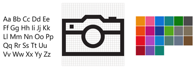

---
description: Learn how to use color, typography and motion to define your UWP app’s personality with Windows Dev Center UWP style guide.
keywords: uwp style guide, design guidance, typography, motion, sound, motion, app development
title: UWP style guide - Windows app development
author: mijacobs
label: Style
template: detail.hbs
ms.author: mijacobs
ms.date: 02/08/2017
ms.topic: article
ms.prod: windows
ms.technology: uwp
ms.assetid: 4df395d2-f10e-4e0e-9bf2-660f82b8a9fa
---
# UWP style guide

<link rel="stylesheet" href="https://az835927.vo.msecnd.net/sites/uwp/Resources/css/custom.css"> 



  

  
Design guidance and code examples that teach you how to define your UWP app’s personality through color, typography, and motion.

  

  

    
  







  

   
<b>[Color](color.md)</b> 
   Color provides intuitive wayfinding through an app's various levels of information and serves as a crucial tool for reinforcing the interaction model.

  

  

   
<b>[Icons](icons.md)</b> 
   Good icons harmonize with typography and with the rest of the design language. They don’t mix metaphors, and they communicate only what’s needed, as speedily and simply as possible.

  






  

   
<b>[Motion](motion.md)</b> 
   Purposeful, well-designed animations bring apps to life and make the experience feel crafted and polished. Help users understand context changes, and tie experiences together with visual transitions.

  

  

   
<b>[Sound](sound.md)</b> 
   Sound helps complete an application's user experience, and gives them that extra audio edge they need to match the feel of Windows across all platforms.

  






  

   
<b>[Typography](typography.md)</b> 
   As the visual representation of language, typography’s main task is to be clear. Its style should never get in the way of that goal. But typography also has an important role as a layout component—with a powerful effect on the density and complexity of the design—and on the user’s experience of that design.

   

   <ul>
    <li>[Fonts](fonts.md)</li>
    <li>[Segoe MDL2 icons](segoe-ui-symbol-font.md)</li>
   </ul>
   

  

  
  
  

   
<b>[Styling controls](../controls-and-patterns/styling-controls.md)</b> 
   You can customize the appearance of your apps in many ways by using the XAML framework. Styles let you set control properties and reuse those settings for a consistent appearance across multiple controls.

  




