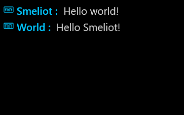
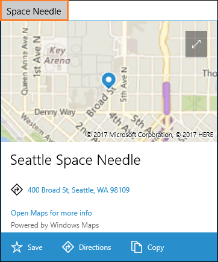
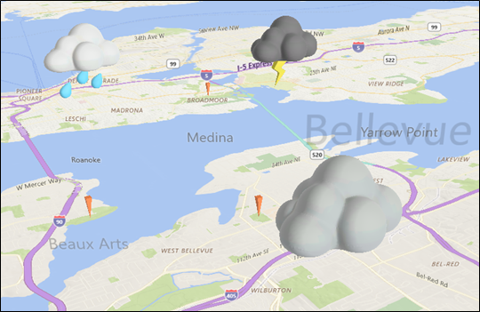
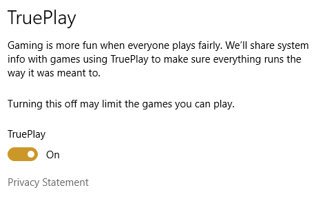

Please include future what's new entries in the table below here.

## Features

### Activating UWP apps

The following new features are now available:

* Use the [StartupTask class](https://docs.microsoft.com/uwp/api/windows.applicationmodel.startuptask) to specify that a UWP app start when the user logs on, or at system startup.

* Identify if a UWP app was [launched from the command line](https://docs.microsoft.com/uwp/api/Windows.ApplicationModel.Activation.ActivationKind).

* Programmatically request that your UWP app restart by using the [RequestRestartAsync() and RequestRestartForUserAsync()](https://docs.microsoft.com/uwp/api/windows.applicationmodel.core.coreapplication) APIs.

* [Launch the Windows Settings app](../launch-resume/launch-settings-app) has been updated to reflect new URI schemes such as `ms-settings:storagesense`, `ms-settings:cortana-notifications`, and others.

### Conditional XAML

You can now preview [conditional XAML](../debug-test-perf/conditional-xaml.md) to create [version adaptive apps](../debug-test-perf/version-adaptive-apps.md). Conditional XAML lets you use the ApiInformation.IsApiContractPresent method in XAML markup, so you can set properties and instantiate objects in markup based on the presence of an API, without needing to use code behind.

### Dashboard, monetization and Store services

The following new features are now available:

* The Microsoft Advertising SDK now enables you to show [native ads](../monetize/native-ads.md) in your apps. A native ad is a component-based ad format where each piece of the ad creative (such as the title, image, description, and call-to-action text) is delivered to your app as an individual element. Native ads are currently only available to developers who join a pilot program, but we intend to make this feature available to all developers soon.

* The [Windows Store analytics API](../monetize/access-analytics-data-using-windows-store-services.md) now provides a method you can use to [download the CAB file for an error in your app](../monetize/download-the-cab-file-for-an-error-in-your-app.md).

* [Targeted offers](../publish/use-targeted-offers-to-maximize-engagement-and-conversions.md) let you target specific segments of your customers with attractive, personalized content to increase engagement, retention, and monetization.

* Your app's Store listing can now include [video trailers](../publish/app-screenshots-and-images.md#trailers).

* New pricing and availability options let you [schedule price changes](../publish/set-and-schedule-app-pricing.md) and [set precise release dates](..//publish/configure-precise-release-scheduling.md).

* You can [import and export Store listings](../publish/import-and-export-store-listings.md) to make updates faster, especially if you have listings in many languages.

### Dashboard, monetization and Store services

We now provide more flexibility when [associating Azure AD tenants with your Dev Center account](../publish/associate-azure-ad-with-dev-center.md) to add multiple account users. You can associate multiple Azure AD tenants with a single Dev Center account, or associate a single Azure AD tenant with more than one Dev Center account.

### Desktop Bridge Packaging project

Visual Studio introduces a new [packaging project](../porting/desktop-to-uwp-packaging-dot-net.md) that eliminates all of the manual steps that used to be necessary to package a full-trust desktop application. Just add a packaging project, reference your desktop project, and then press F5 to debug your app. No manual tweaks necessary. This new streamlined experience is a vast improvement over the experience that was available in the previous version of Visual Studio.

### Design Toolkits

The [design toolkits and resources for UWP apps](../design-downloads/index.md) have been expanded with the addition of the Sketch and Adobe XD toolkits. The previously-existing toolkits have also been updated and revamped, providing more robust controls and layout templates for your UWP apps.

### Diagnostics and Threading

New diagnostic APIs provide information about running apps:
* The [AppMemoryReport](https://docs.microsoft.com/uwp/api/Windows.System.AppMemoryReport) class provides information about an apps expected total commit limit, private commit usage, and so on.
* The [AppDiagnosticInfo](https://docs.microsoft.com/uwp/api/windows.system.appdiagnosticinfo) class can now monitor the execution state of an app or task, and provides notifications when the execution state changes.
* The [MemoryManager](https://docs.microsoft.com/uwp/api/windows.system.memorymanager) class has new methods to set the app memory usage limit and report the expected app memory usage limit.

You can queue tasks, in priority order, and run them on a different thread with the [DispatcherQueue](https://docs.microsoft.com/uwp/api/windows.system.dispatcherqueue) class. This functionality is also available from Win32 via the [CreateDispatcherQueueController](https://msdn.microsoft.com/library/windows/desktop/mt826210.aspx) function.

### Fluent Design

Available to [Windows Insiders](https://insider.windows.com/) in SDK Preview Builds, these new effects use depth, perspective, and movement to help users focus on important UI elements.

[Acrylic material](../style/acrylic.md) is a type of brush that creates transparent textures.

The [Parallax effect](../style/parallax.md) adds three-dimensional depth and perspective to your app.

[Reveal](../style/reveal.md) highlights important elements of your app.

### Game Chat Overlay

The [GameChatOverlay class](https://docs.microsoft.com/uwp/api/windows.gaming.ui.gamechatoverlay) provides methods to get the default game chat overlay instance, set the desired position of the overlay, and add messages to it.

### Game Mode

The [Game Mode](https://msdn.microsoft.com/library/windows/desktop/mt808808) APIs for the Universal Windows Platform (UWP) allow you to produce the most optimized gaming experience by taking advantage of Game Mode in Windows 10. These APIs are located in the **&lt;expandedresources.h&gt;** header.

### Game Monitor

The [GameMonitor class](https://docs.microsoft.com/uwp/api/windows.gaming.ui.gamemonitor) allows an app to get the game monitor permission state of the device and potentially prompt the user to enable game monitoring.

### Gaming Device Information

Due to differing console capabilities, Universal Windows Platform (UWP) game developers need a way to determine the type of console the game is running on, in order to make run-time choices on how to best use the hardware. The [Gaming Device Information](https://aka.ms/gamingdeviceinfo) APIs in **&lt;gamingdeviceinformation.h&gt;** provide this functionality.

### Game broadcast management and capture
New APIs in the **[Windows.Media.AppBroadcasting](https://docs.microsoft.com/uwp/api/windows.media.appbroadcasting)** namespace allow your app to launch the system-provided game broadcast UI. You can also register for events that notify your app when broadcasting starts or stops. New APIs in the **[Windows.Media.AppRecording](https://docs.microsoft.com/uwp/api/windows.media.apprecording)** namespace allow you to record audio and video and capture screen shots of gameplay. You can also provide metadata that the system will embed into broadcast and capture streams, allowing apps to provide viewing experiences that are synchronized with gameplay events. For more information on these features, see [Game broadcast and capture](../gaming/game-broadcast-and-capture.md).

### Map Place Info

You can show users a map inside of a [light-weight pop-up window](../maps-and-location/display-maps.md#placecard) above, below or to the side of a UI element or an area of the app where the user touches.  This window dismisses itself when the user changes context. This keeps users from having to switch to another app or browser window to obtain information about a location.

### Map Layers

You can add points of interest elements to a [map layer](../maps-and-location/display-poi.md#layers), and then bind XAML directly to that layer. Group your elements into layers. Then, you can manipulate each layer independently from one another. For example, each layer has it's own set of events so you can respond to an event on a specific layer and perform an action specific to that event.

### Map 3D Elements

You can add three-dimensional objects to a map. You can use the new [MapModel3D](https://docs.microsoft.com/uwp/api/windows.ui.xaml.controls.maps.mapmodel3d) class to import a 3D object from a [3D Manufacturing Format (3MF)](http://3mf.io/specification/) file.

### Map Element Styling

You can customize the appearance of map elements by using two new [MapElement](https://docs.microsoft.com/uwp/api/windows.ui.xaml.controls.maps.mapelement) properties: [MapStyleSheetEntry](https://docs.microsoft.com/uwp/api/windows.ui.xaml.controls.maps.mapelement#Windows_UI_Xaml_Controls_Maps_MapElement_MapStyleSheetEntry), and [MapStyleSheetEntryState](https://docs.microsoft.com/uwp/api/windows.ui.xaml.controls.maps.mapelement#Windows_UI_Xaml_Controls_Maps_MapElement_MapStyleSheetEntryState).  

You can use the [MapStyleSheetEntry](https://docs.microsoft.com/uwp/api/windows.ui.xaml.controls.maps.mapelement#Windows_UI_Xaml_Controls_Maps_MapElement_MapStyleSheetEntry) property to make your map elements look like they are part of the base map (For example: by setting an element style to an existing entry in the map style sheet such as *Water*).

You can use the [MapStyleSheetEntryState](https://docs.microsoft.com/uwp/api/windows.ui.xaml.controls.maps.mapelement#Windows_UI_Xaml_Controls_Maps_MapElement_MapStyleSheetEntryState) property to modify the appearance of your map elements by leveraging default states like *Hover* and *Selected* in the map style sheet, or override them to create your own.

### My People

Available to [Windows Insiders](https://insider.windows.com/) in SDK Preview Builds, the upcoming My People feature allows users to pin contacts from an application directly to their taskbar. [Learn how to add My People support to your application.](../contacts-and-calendar/my-people-support.md)

[My People sharing](../contacts-and-calendar/my-people-sharing.md) allows users to share files through your application, right from the taskbar.

[My People notifications](../contacts-and-calendar/my-people-support.md) are a new kind of toast notification that users can send to their pinned contacts.

### Pin to Taskbar

Available to [Windows Insiders](https://insider.windows.com/) in SDK Preview Builds, the new TaskbarManager class allows you to ask your user to [pin your app to the taskbar](../controls-and-patterns/pin-to-taskbar.md).

### Submission API supports video trailers and gaming options

The [Windows Store submission API](../monetize/create-and-manage-submissions-using-windows-store-services.md) now enables you to include [video trailers](../monetize/manage-app-submissions.md#trailer-object) and [gaming options](../monetize/manage-app-submissions.md#gaming-options-object) with your app submissions.

### TruePlay

[TruePlay](https://aka.ms/trueplay) provides developers with a new set of tools to combat cheating within their PC games. A game enrolled in TruePlay will run in a protected process, which mitigates a class of common attacks. The TruePlay APIs for the Universal Windows Platform (UWP) allow limited interaction between games and the game monitoring system on Windows 10 PCs. These APIs are located in the **&lt;gamemonitor.h&gt;** header.

### URI set-speech-recognition-timeouts

### UI Controls

Available to [Windows Insiders](https://insider.windows.com/) in SDK Preview Builds, these new controls make it easier to quickly build a great looking UI.

The [color picker control](../controls-and-patterns/color-picker.md) enables users to browse through and select colors.  

The [navigation view control](../controls-and-patterns/navigationview.md) makes it easy to add top-level navigation to your app.

The [person picture control](../controls-and-patterns/person-picture.md) displays the avatar image for a person.

The [rating control](../controls-and-patterns/rating.md) enables users to easily view and set ratings that reflect degrees of satisfaction with content and services.

### User activities

A new [Windows.ApplicationModel.UserActivities](https://docs.microsoft.com/uwp/api/windows.applicationmodel.useractivities) API enables you to encapsulate a user task that can be continued at a later time, and potentially on a different device.

### Windows Template Studio

Use the new [Windows Template Studio](https://aka.ms/wtsinstall) extension for Visual Studio 2017 to quickly build a UWP app with the pages, framework, and features that you want. This wizard-based experience implements proven patterns and best practices to save you time and trouble adding features to your app.

### .NET Standard 2.0 Compliant

The Universal Windows Platform has fully implemented the [.NET Standard 2.0](https://docs.microsoft.com/dotnet/standard/net-standard#net-implementation-support). This new version of the standard includes a massive increase in the number of .NET APIs along with a compatibility shim for your favorite NuGet packages and third party libraries.

If you intend to target other platforms such as iOS and Android, or if you have a desktop application and want to create a UWP app, move code into .NET Standard 2.0 class libraries and then reuse that code in each version of your app.

## Developer Guidance

### App services and extensions

We've added a new guide, [Create and consume an app extension](../launch-resume/how-to-create-an-extension.md), to help you write and host Universal Windows Platform (UWP) app extensions to extend your app via packages that users can install from the Windows Store.

We've added a new guide, [Extend your app with services, extensions, and packages](../launch-resume/extend-your-app-with-services-extensions-packages.md), which categorizes the different technologies in Windows 10 that you can use to extend and componentize your app.

### Background tasks

We've added three guides that help you take advantage of background tasks.

See [Run in the background indefinitely](../launch-resume/run-in-the-background-indefinetly.md) to use all resources available on a device without any background or extended execution throttling. Applies to Enterprise UWP apps and UWP apps that will not be submitted to the Windows Store.

See [Trigger a background task from within your app](../launch-resume/trigger-background-task-from-app.md) to activate a background task from within your app.

See [Run a background task when your UWP app is updated](../launch-resume/run-a-background-task-during-updatetask.md) to create a background task that runs when your UWP app is updated.

### Data schemas for Store products

We've added the [Data schemas for Store products](../monetize/data-schemas-for-store-products.md) article. This article provides schemas for the Store-related data available for several objects in the [Windows.Services.Store](https://msdn.microsoft.com/library/windows/apps/windows.services.store.aspx) namespace, including [StoreProduct](https://docs.microsoft.com/uwp/api/windows.services.store.storeproduct) and [StoreAppLicense](https://docs.microsoft.com/uwp/api/windows.services.store.storeapplicense).

### Desktop Bridge

We've added two guides that help you to add modern experiences that light up for Windows 10 users.

See [Enhance your desktop application for Windows 10](https://docs.microsoft.com/windows/uwp/porting/desktop-to-uwp-enhance) to find and reference the correct files, and then write code to light up UWP experiences for Windows 10 users.  

See [Extend your desktop application with modern UWP components](https://docs.microsoft.com/windows/uwp/porting/desktop-to-uwp-extend) to incorporate modern XAML UIs and other UWP experiences that must run in a UWP app container.

See [Migrate your application to the Universal Windows Platform](https://review.docs.microsoft.com/windows/uwp/porting/desktop-to-uwp-migrate) to share code between your WPF, Windows Forms, UWP, Android, and iOS applications.

### Get Started Tutorials

The Get Started section of the UWP docs has been updated with a [new landing page for the tutorials section](https://docs.microsoft.com/windows/uwp/get-started/create-uwp-apps). This section provides new and improved structure to the Get Started experience, helping users easily find and use the tutorials which are right for them - including the XAML basics tutorials mentioned above.

### Getting started with point of service

We've added a new guide to help you [get started with point of service devices](https://docs.microsoft.com/en-us/windows/uwp/devices-sensors/pos-get-started). It covers topics like device enumeration, checking device capabilities, claiming devices, and device sharing.

### Media Capture

The article [Process media frames with MediaFrameReader](../audio-video-camera/process-media-frames-with-mediaframereader.md) has been updated to show the usage of the new [Multi​Source​Media​Frame​Reader](https://docs.microsoft.com/uwp/api/windows.media.capture.frames.multisourcemediaframereader) class, which allows you to obtain time-correlated frames from multiple media sources. This is useful if you need to process frames from different sources, such as a depth camera and an color camera, and you need to make sure that the frames from each source were captured close to each other in time. For more information, see [Use MultiSourceMediaFrameReader to get time-corellated frames from multiple sources](../audio-video-camera/process-media-frames-with-mediaframereader.md#use-multisourcemediaframereader-to-get-time-corellated-frames-from-multiple-sources).

[Process media frames with MediaFrameReader](../audio-video-camera/process-media-frames-with-mediaframereader.md) has been updated to include a description of buffered frame acquisition mode that allows apps to request that acquired frames be provided to the app in sequence, without dropping frames acquired while the app was processing a previous frame. The default, realtime mode provides the app with the most recent frame, dropping any extra frames that were acquired while the app was processing a previous frame.

Also, when a **MediaCapture** object has been initialized with a media frame source group containing one or more media frame sources, you can create a  **[MediaSource](https://docs.microsoft.com/uwp/api/windows.media.core.mediasource)** object that allows you to present the media frames in a **MediaPlayerElement** control in a XAML page. For more information, see [Process media frames with MediaFrameReader](../audio-video-camera/process-media-frames-with-mediaframereader.md).

### Media Playback

New sections have been added to the basic media playback article, [Play audio and video with MediaPlayer](../audio-video-camera/play-audio-and-video-with-mediaplayer.md). The section [Play spherical video with MediaPlayer](../audio-video-camera/play-audio-and-video-with-mediaplayer.md) shows you how to playback spherically encodeded video, including adjusting the field of view and view orientation for supported formats. The section [Use MediaPlayer in frame server mode](../audio-video-camera/play-audio-and-video-with-mediaplayer.md#use-mediaplayer-in-frame-server-mode) shows you how to copy frames from media played back with [MediaPlayer](https://docs.microsoft.com/uwp/api/Windows.Media.Playback.MediaPlayer) to a Direct3D surface. This enables scenarios such as applying real-time effects with pixel shaders. The example code shows a quick implementation of a blur effect for video playback using Win2D.

### Packaging
App Installer has been expanded to allow UWP app packages to be downloaded from a webpage. Additionally, related sets of an app pacakge can now be downloaded with App Installer. See the new [Install UWP apps with App Installer](../packaging/appinstaller-root.md) section to learn more.

### Scoped Search

A "UWP" scope has been added to the [UWP conceptual](../get-started/whats-a-uwp.md) and [API reference](https://docs.microsoft.com/en-us/uwp/api/) documentation on docs.microsoft.com. Unless this scope is deactivated, searches made from within these areas will return UWP docs only.

### Test your Windows app for Windows 10 S

Test your Windows app to ensure that it will operate correctly on devices that run Windows S.
Use [this new guide](../porting/desktop-to-uwp-test-windows-s.md) to learn how.

### Voice and tone

We've added new [guidance on voice in tone in UWP apps](https://docs.microsoft.com/windows/uwp/in-app-help/voice-and-tone) to provide you with advice for writing text in your app. Whatever you're creating, it's important that the language you use is approachable, friendly, and informative.

### XAML basics tutorials

We've written four [XAML basics tutorials](https://docs.microsoft.com/en-us/windows/uwp/get-started/xaml-basics-intro) to accompany the new [PhotoLab sample](https://github.com/Microsoft/Windows-appsample-photo-lab), covering four core aspects of XAML programming: user interfaces, data binding, custom styles, and adaptive layouts. Each tutorial track starts with a partially-complete version of the PhotoLab Sample, and builds one missing component of the final app step-by-step.

  

Here's a quick overview of the new articles:

+ [**Create user interfaces**](https://docs.microsoft.com/en-us/windows/uwp/get-started/xaml-basics-ui) shows how to create the basic photo gallery interface.
+ [**Create data bindings**](https://docs.microsoft.com/en-us/windows/uwp/get-started/xaml-basics-data-binding) shows how to add data bindings to the photo gallery, populating it with real image data.
+ [**Create custom styles**](https://docs.microsoft.com/en-us/windows/uwp/get-started/xaml-basics-style) shows how to add fancy custom styles to the photo editing menu.
+ [**Create adaptive layouts**](https://docs.microsoft.com/en-us/windows/uwp/get-started/xaml-basics-adaptive-layout) shows how to make the gallery layout adaptive, so it looks good on every device and screen size.

### Xbox Live

We've added docs for Xbox Live developers, for both UWP and Xbox Developer Kit (XDK) games.

See the [Xbox Live developer guide](https://docs.microsoft.com/en-us/windows/uwp/xbox-live/) to learn how to use the Xbox Live APIs to connect your game to the Xbox Live social gaming network.

With the [Xbox Live Creators Program](https://docs.microsoft.com/en-us/windows/uwp/xbox-live/get-started-with-creators/get-started-with-xbox-live-creators), any UWP game developer can develop and publish an Xbox Live-enabled game on both the PC and Xbox One.

See the [Xbox Live developer program overview](https://docs.microsoft.com/en-us/windows/uwp/xbox-live/developer-program-overview) for information about the programs and features available to Xbox Live developers.

## Samples

### Annotated audio app sample

[A mini-app sample that demonstrates audio, ink, and OneDrive data roaming scenarios](https://github.com/Microsoft/Windows-appsample-annotated-audio). This sample records audio while allowing the synchronized capture of ink annotations so that you can later recall what was being discussed at the time a note was taken.

  

### Customer Orders

The [Customer Orders Database](https://github.com/Microsoft/Windows-appsample-customers-orders-database) sample has been updated to use the new .NET Core 2.0 and Entity Framework.

### PhotoLab sample

The [PhotoLab sample](https://github.com/Microsoft/windows-appsample-photo-lab) provides a basic photo gallery and photo-editing experience.

### Shopping app sample

[A mini-app that presents a basic shopping experience where a user can buy emoji](https://github.com/Microsoft/Windows-appsample-shopping). This app shows how to use the [Payment Request APIs](https://docs.microsoft.com/uwp/api/windows.applicationmodel.payments) to implement the checkout experience.

    

## Videos

### Accessibility

Building accessibility into your apps opens them up to a much wider audience. [Watch the video](https://channel9.msdn.com/Blogs/One-Dev-Minute/Developing-Apps-for-Accessibility), then learn more about [developing apps for accessibility](https://developer.microsoft.com/en-us/windows/accessible-apps).

### Mixed Reality

A series of new tutorial videos have been released for [Microsoft HoloLens Course 250](https://developer.microsoft.com/en-us/windows/mixed-reality/mixed_reality_250). If you've already installed the tools and are famiilar with the basics of development for Mixed Reality, check out these video courses for information upon creating shared experiences across Mixed Reality devices.

### Narrator and Dev Mode

You might already know that you can use [Narrator](https://support.microsoft.com/help/22798/windows-10-narrator-get-started) to test the screen reading experience of your app. But Narrator also features a developer mode, which gives you a good visual representation of the information exposed to it. [Watch the video](https://channel9.msdn.com/Blogs/One-Dev-Minute/Using-Narrator-and-Dev-Mode), then learn more about [Narrator developer mode](https://channel9.msdn.com/Blogs/One-Dev-Minute/Using-Narrator-and-Dev-Mode).

### Payments Request API

The Payment Request API helps custoemrs and sellers seamlessly complete the online checkout process. [Watch the video](https://channel9.msdn.com/Blogs/One-Dev-Minute/Using-the-Payments-Request-API), then explore the [Payment Request documentation](https://channel9.msdn.com/Blogs/One-Dev-Minute/Using-the-Payments-Request-API).

### Windows 10 IoT Core

With Windows 10 IoT Core and the Universal Windows Platform, you can quickly protoype and build projects with vision and component connections, such as this Pet Recognition Door. [Watch the video](https://channel9.msdn.com/Blogs/One-Dev-Minute/Building-a-Pet-Recognition-Door-Using-Windows-10-IoT-Core), then learn more about how to [get started with Windows 10 IoT Core](https://developer.microsoft.com/en-us/windows/iot).

### Windows Template Studio

A more detailed overview of the Windows Template Studio is given in [this video](https://channel9.msdn.com/Blogs/One-Dev-Minute/Getting-Started-with-Windows-Template-Studio). When you're ready, [install the extension](https://aka.ms/wtsinstall) or [check out the source code and documentation](https://aka.ms/wtsinstall).
