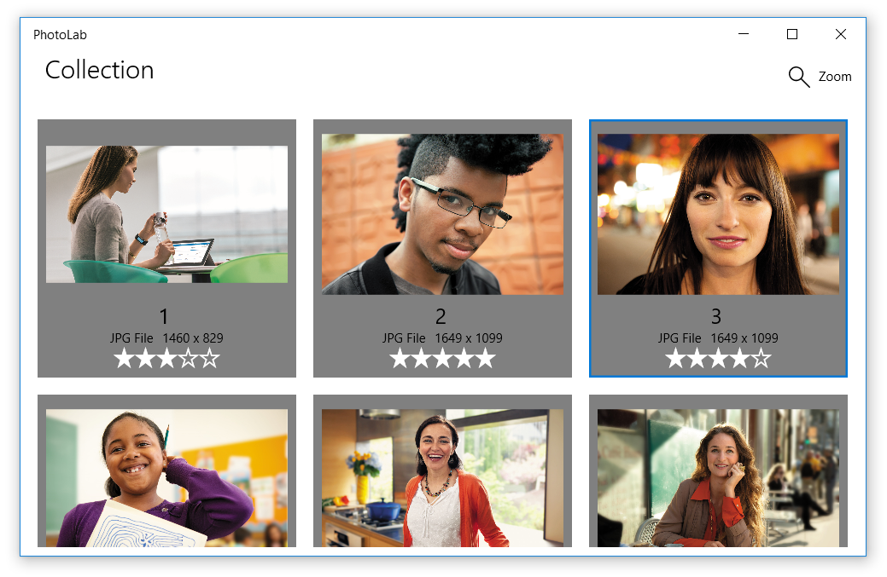

# Contribute What's New items here

As we've done in the past, add your What's New items into the appropriate category below. I'll be pulling from these entries to create our What's New topics.

(Side note - this topic is excluded from the build, and will never show up on staging or be published life. It lives in RS4 so it's never exposed publicly on github.)

## Features

### Sample Feature Entry

Sample feature text. With a sample image below!

### Enter free-form prices in a specific market's local currency

When you override your app's base price for a specific market, you are no longer limited to choosing one of the standard price tiers; you now have the option to enter a free-form price in the market's local currency. For more info, see [Set and schedule app pricing](../publish/set-and-schedule-app-pricing.md)

## Developer Guidance

## Videos

## Samples
