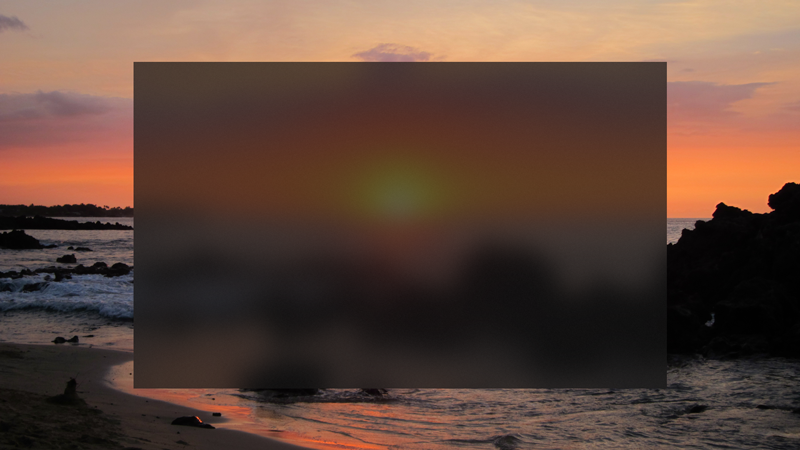
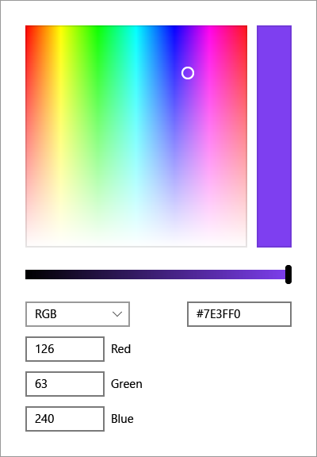
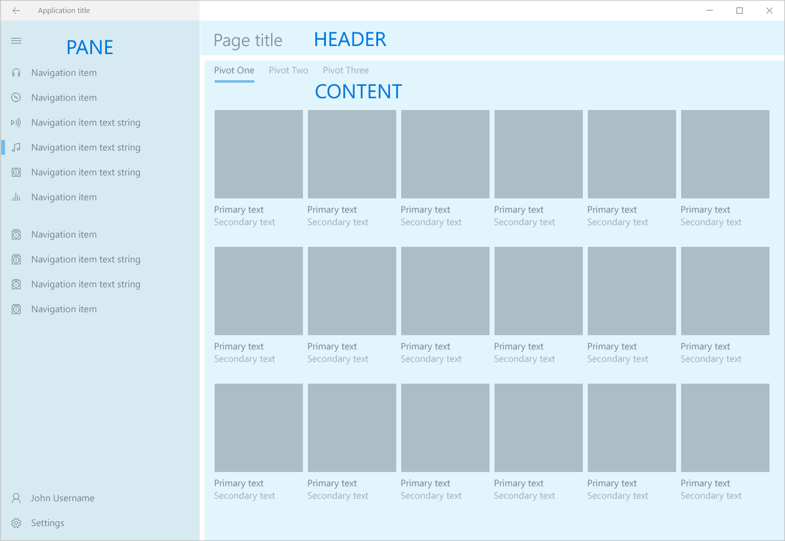

# What's New in Windows 10 at Microsoft Build 2017

Released to accompany the [Microsoft Build 2017 developer conference](https://developer.microsoft.com/windows/projects/events/build/2017?ocid=wdgbld17_intreferral_devcenterhp_null_null_devcenter_hppost&utm_campaign=wdgbld17&utm_medium=internalreferral&utm_source=devcenterhp&utm_content=devcenter_hppost), Windows 10 SDK Preview Build 16190 will continue to provide the tools, features, and experiences powered by the Universal Windows Platform. [Install the tools and SDK](http://go.microsoft.com/fwlink/?LinkId=821431) on Windows 10 and you’re ready to either [create a new Universal Windows app](https://msdn.microsoft.com/library/windows/apps/bg124288) or explore how you can use your [existing app code on Windows](https://msdn.microsoft.com/library/windows/apps/mt238321).

Many of the below features and tutorials have been released alongside the SDK Preview Build at the Build 2017 conference, but do not require the preview build to be used. For more information on the specific changes, you can [explore prerelease documentation for new and updated API namespaces in this preview build.](windows-10-build-16190-api-diff.md)

For more information on the highlighted features of this and other Windows updates, see [What's cool in Windows 10](http://go.microsoft.com/fwlink/?LinkId=823181). In addition, see [Windows Developer Platform features](https://developer.microsoft.com/windows/platform/features) for a high-level overview of both past and future additions to the Windows platform.

## New Features

### Effects

These new effects use depth, perspective, and movement to help users focus on important UI elements. They are only available in the SDK Preview Build.

[Acrylic material](../style/acrylic.md) is a type of brush that creates transparent textures. 

The [Parallax effect](../style/parallax.md) adds three-dimensional depth and perspective to your app.

[Reveal](../style/reveal.md) highlights important elements of your app. 

### Controls

These new controls make it easier to quickly build a great looking UI. They are only available in the SDK Preview Build.

The [color picker control](../controls-and-patterns/color-picker.md) enables users to browse through and select colors.  

The [navigation view control](../controls-and-patterns/navigationview.md) makes it easy to add top-level navigation to your app.  

The [person picture control](../controls-and-patterns/person-picture.md) displays the avatar image for a person.

The [rating control](../controls-and-patterns/rating.md) enables users to easily view and set ratings that reflect degrees of satisfaction with content and services.

The [tree view control](../controls-and-patterns/tree-view.md) creates a hierarchical list with expanding and collapsing nodes that contain nested items.

 

#### Keyboard

With [Keyboard interactions](https://docs.microsoft.com/en-us/windows/uwp/input-and-devices/keyboard-interactions), design and optimize your UWP apps so they provide the best experience possible for both keyboard power users and those with disabilities and other accessibility requirements.

Use [Access keys](https://docs.microsoft.com/en-us/windows/uwp/input-and-devices/access-keys) to improve both the usability and the accessibility of your Windows app. Access keys provide an intuitive way for users to quickly navigate and interact with an app's visible UI through a keyboard instead of a pointer device (such as touch or mouse).

[Custom keyboard interactions](https://docs.microsoft.com/en-us/windows/uwp/input-and-devices/custom-keyboard-interactions) provide comprehensive and consistent keyboard interaction experiences in your UWP apps and custom controls for both keyboard power users and those with disabilities and other accessibility requirements.

The [Keyboard events](https://docs.microsoft.com/en-us/windows/uwp/input-and-devices/keyboard-events) topic details how to add keyboard events for both hardware and touch keyboards.

#### Remote Sessions APIs (Project Rome)

The Project Rome team has released the remote sessions SDK for UWP developers (see the new members in the [RemoteSystems](https://docs.microsoft.com/en-us/uwp/api/windows.system.remotesystems) namespace, such as the [RemoteSystemSession](https://docs.microsoft.com/en-us/uwp/api/windows.system.remotesystems.remotesystemsession) class). Windows apps can now connect devices through "shared experiences," in which devices become participants in an exclusive two-way communication channel. Data packets can be sent to any or all of the other participants in the channel, enabling a number of new cross-device scenarios such as remote app messaging.

The remote sessions SDK features are only available in the Windows SDK Preview build.

#### Project Rome for iOS
Microsoft's Project Rome feature has debuted on the iOS platform. With the new preview SDK, developers can write iOS apps that remotely launch apps and continue tasks on users' Windows devices. See the official [Project Rome repo for cross-platform scenarios](https://github.com/Microsoft/project-rome) to get started.

#### Windows Ink

The [Recognize Windows Ink strokes as text and shapes](https://docs.microsoft.com/en-us/windows/uwp/input-and-devices/convert-ink-to-text) topic contains details on rich recognition with the [Windows Ink analysis engine](https://docs.microsoft.com/en-us/uwp/api/windows.ui.input.inking.analysis). We demonstrate how to classify, analyze, and recognize a set of strokes as text or shapes (ink analysis can also be used to recognize document structure, bullet lists, and generic drawings).

## Samples and Tutorials

#### High DPI

Updates have been made to the [Per-window DPI Awareness sample](https://github.com/Microsoft/Windows-classic-samples/tree/master/Samples/DPIAwarenessPerWindow), supporting the new Per-Monitor v2 DPI awareness context mode added in the Creators Update. This sample shows how to assign different DPI awareness modes to different top-level windows within a single desktop application process, and showcases the behavioral differences between those modes.

#### RadialController

The [Support the Surface Dial (and other wheel devices) in your UWP app](https://docs.microsoft.com/en-us/windows/uwp/get-started/radialcontroller-walkthrough) tutorial has been released. It steps through how to use the RadialController APIs to customize the Dial experience in a sample app.

#### WebVR

The [Adding WebVR support to a 3D Babylon.js game](https://docs.microsoft.com/en-us/windows/uwp/get-started/adding-webvr-to-a-babylonjs-game) tutorial has been released. You'll need a Windows Mixed Reality headset in order to follow the tutorial, which begins with a working Babylon.js game and steps through the process of how to configure it for WebVR.

#### Windows Ink

The [Support ink in your UWP app](https://docs.microsoft.com/en-us/windows/uwp/get-started/ink-walkthrough) tutorial has been released. It steps through how to create a basic UWP app that supports writing and drawing with Windows Ink.