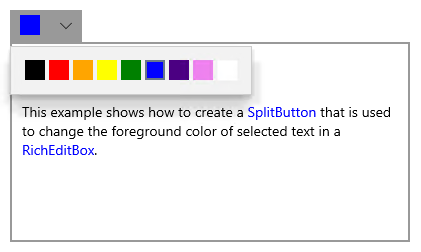

# What's New in the Windows Developer Docs in August 2018

The Windows Developer Documentation is constantly being updated with information on new features available to developers across the Windows platform. The following feature overviews, developer guidance, and videos have been made available in the month of August.

[Install the tools and SDK](https://developer.microsoft.com/windows/downloads#_blank) on Windows 10 and you’re ready to either [create a new Universal Windows app](../get-started/create-uwp-apps.md) or explore how you can use your [existing app code on Windows](../porting/index.md).

## Features

### Design

The following features have been added to the Windows Insider Preview builds, available through the [Windows Insider](https://insider.windows.com/) program.

* The [Windows UI Library](/uwp/toolkits/winui/) is a set of NuGet packages that provide controls and other user interfact elements for UWP apps. These packages are also compatable with earlier versions of Windows 10, so your app works even if your users don't have the latest OS version.

* [DropDownButton](../design/controls-and-patterns/buttons.md#create-a-drop-down-button), [SplitButton](../design/controls-and-patterns/buttons.md#create-a-split-button), and [ToggleSplitButton](../design/controls-and-patterns/buttons.md#create-a-toggle-split-button) provide button controls with specialized features to enhance your app's user interface.

* NavigationView now supports [Top navigation](../design/controls-and-patterns/navigationview.md), for cases in which your app has a smaller number of navigation options and require more space for your app's content.

* TreeView has been enhanced to support [data binding, item templates, and drag and drop.](../design/controls-and-patterns/tree-view.md)

### Package Support Framework

The package support framework is an open-source kit that helps you apply fixes to your win32 application when you don’t have access to the source code, so that it can run in an MSIX container.

To learn more, see [Apply runtime fixes to an MSIX package by using the Package Support Framework](/windows/msix/psf/package-support-framework).

## Developer Guidance

### Web API extensions

A list of [legacy Microsoft API extensions](https://developer.mozilla.org/docs/Web/API/Microsoft_API_extensions) has been added to the Mozilla Developer Network documentation for cross-browser web development. These API extensions are unique to Internet Explorer or Microsoft Edge, and supplement existing information about compatibility and broswer support in the MDN web docs. Legacy Microsoft [CSS extensions](https://developer.mozilla.org/docs/Web/CSS/Microsoft_Extensions) and [JavaScript extensions](https://developer.mozilla.org/docs/Web/JavaScript/Microsoft_JavaScript_extensions) are also available, and you can find rich web API information from MDN surfaced directly in [Visual Studio Code.](https://code.visualstudio.com/updates/v1_25#_new-css-pseudo-selectors-and-pseudo-elements-from-mdn)

### C++/WinRT Code examples

We've added 250 [C++/WinRT](../cpp-and-winrt-apis/index.md) code listings to topics in our docs, accompanying existing C++/CX code examples.

### Project Rome

The [Project Rome docs](/windows/project-rome/) site has been reorganized into a feature-first approach. This should make it easier for developers to find what they're looking for, and to implement features of their choice across multiple platforms.

## Videos

### Xbox Live Unity plugin

The Xbox Live plugin for Unity contains support for adding Xbox Live signing, stats, friends lists, cloud storage, and leaderboards to your title. [Watch the video](https://youtu.be/fVQZ-YgwNpY) to learn more, then [download the GitHub package](https://aka.ms/UnityPlugin) to get started.

### One Dev Question

In the One Dev Question video series, longtime Microsoft developers cover a series of questions about Windows development, team culture, and history. Here's the latest questions that we've answered!

Raymond Chen:

* [How does the kernel know when to restart a video driver?](https://youtu.be/3SNAdyO1l5c)

Larry Osterman:

* [What's the story behind the Burgermaster object in Windows?](https://youtu.be/0TDSbyAIvX0)