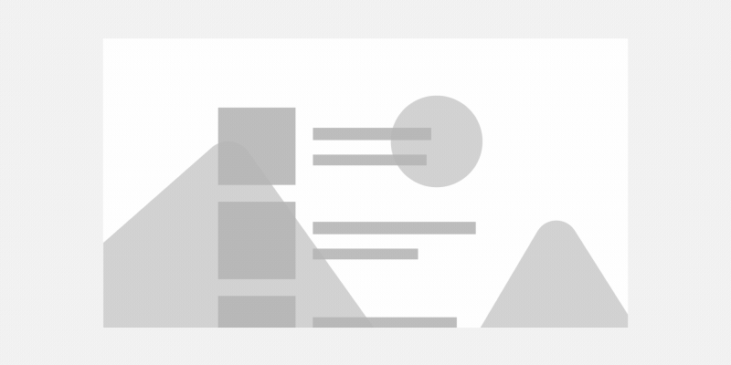
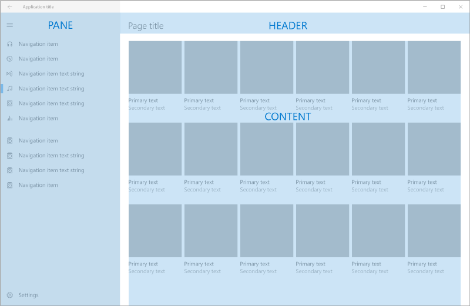
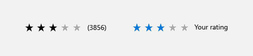
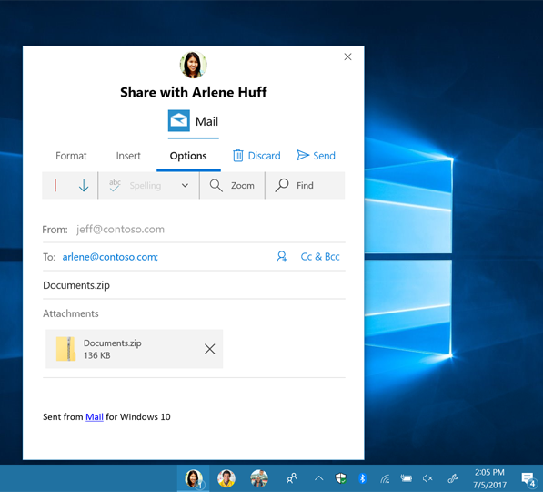
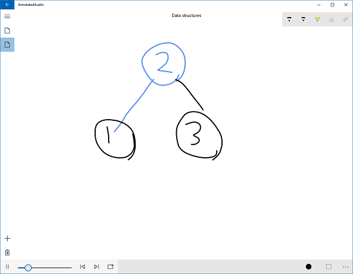
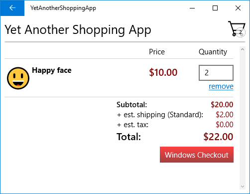

# What's New in the Windows Developer Docs in July 2017

The Windows Developer Documentation is constantly being updated with information on new features available to developers across the Windows platform. The following feature overviews, developer guidance, and code samples have recently been made available, containing new and updated information for Windows developers.

[Install the tools and SDK](https://developer.microsoft.com/windows/downloads#_blank) on Windows 10 and you’re ready to either [create a new Universal Windows app](../get-started/your-first-app.md) or explore how you can use your [existing app code on Windows](../porting/index.md).

## Features

### Fluent Design

Available to [Windows Insiders](https://insider.windows.com/) in SDK Preview Builds, these new effects use depth, perspective, and movement to help users focus on important UI elements.

[Acrylic material](../design/style/acrylic.md) is a type of brush that creates transparent textures. 

The [Parallax effect](../design/motion/parallax.md) adds three-dimensional depth and perspective to your app.

[Reveal](../design/style/reveal.md) highlights important elements of your app. 

### UI Controls

Available to [Windows Insiders](https://insider.windows.com/) in SDK Preview Builds, these new controls make it easier to quickly build a great looking UI.

The [color picker control](../design/controls-and-patterns/color-picker.md) enables users to browse through and select colors.  

The [navigation view control](../design/controls-and-patterns/navigationview.md) makes it easy to add top-level navigation to your app.

The [person picture control](../design/controls-and-patterns/person-picture.md) displays the avatar image for a person.

The [rating control](../design/controls-and-patterns/rating.md) enables users to easily view and set ratings that reflect degrees of satisfaction with content and services.

### Design Toolkits

The [design toolkits and resources for UWP apps](../design/downloads/index.md) have been expanded with the addition of the Sketch and Adobe XD toolkits. The previously-existing toolkits have also been updated and revamped, providing more robust controls and layout templates for your UWP apps.

### Dashboard, monetization and Store services

The following new features are now available:

* The Microsoft Advertising SDK now enables you to show [native ads](../monetize/native-ads.md) in your apps. A native ad is a component-based ad format where each piece of the ad creative (such as the title, image, description, and call-to-action text) is delivered to your app as an individual element. Native ads are currently only available to developers who join a pilot program, but we intend to make this feature available to all developers soon.

* The [Microsoft Store analytics API](../monetize/access-analytics-data-using-windows-store-services.md) now provides a method you can use to [download the CAB file for an error in your app](../monetize/download-the-cab-file-for-an-error-in-your-app.md).

* [Targeted offers](../publish/use-targeted-offers-to-maximize-engagement-and-conversions.md) let you target specific segments of your customers with attractive, personalized content to increase engagement, retention, and monetization. 

* Your app's Store listing can now include [video trailers](../publish/app-screenshots-and-images.md#trailers).

* New pricing and availability options let you [schedule price changes](../publish/set-and-schedule-app-pricing.md) and [set precise release dates](..//publish/configure-precise-release-scheduling.md).

* You can [import and export Store listings](../publish/import-and-export-store-listings.md) to make updates faster, especially if you have listings in many languages.

### My People

Available to [Windows Insiders](https://insider.windows.com/) in SDK Preview Builds, the upcoming My People feature allows users to pin contacts from an application directly to their taskbar. [Learn how to add My People support to your application.](../contacts-and-calendar/my-people-support.md)

[My People sharing](../contacts-and-calendar/my-people-sharing.md) allows users to share files through your application, right from the taskbar.

[My People notifications](../contacts-and-calendar/my-people-support.md) are a new kind of toast notification that users can send to their pinned contacts.

### Pin to Taskbar

Available to [Windows Insiders](https://insider.windows.com/) in SDK Preview Builds, the new TaskbarManager class allows you to ask your user to [pin your app to the taskbar](../design/shell/pin-to-taskbar.md).

## Developer Guidance

### Media Playback

New sections have been added to the basic media playback article, [Play audio and video with MediaPlayer](../audio-video-camera/play-audio-and-video-with-mediaplayer.md). The section [Play spherical video with MediaPlayer](../audio-video-camera/play-audio-and-video-with-mediaplayer.md) shows you how to playback spherically encodeded video, including adjusting the field of view and view orientation for supported formats. The section [Use MediaPlayer in frame server mode](../audio-video-camera/play-audio-and-video-with-mediaplayer.md#use-mediaplayer-in-frame-server-mode) shows you how to copy frames from media played back with [MediaPlayer](/uwp/api/Windows.Media.Playback.MediaPlayer) to a Direct3D surface. This enables scenarios such as applying real-time effects with pixel shaders. The example code shows a quick implementation of a blur effect for video playback using Win2D.

### Media Capture

The article [Process media frames with MediaFrameReader](../audio-video-camera/process-media-frames-with-mediaframereader.md) has been updated to show the usage of the new [Multi​Source​Media​Frame​Reader](/uwp/api/windows.media.capture.frames.multisourcemediaframereader) class, which allows you to obtain time-correlated frames from multiple media sources. This is useful if you need to process frames from different sources, such as a depth camera and an color camera, and you need to make sure that the frames from each source were captured close to each other in time. For more information, see [Use MultiSourceMediaFrameReader to get time-corellated frames from multiple sources](../audio-video-camera/process-media-frames-with-mediaframereader.md#use-multisourcemediaframereader-to-get-time-corellated-frames-from-multiple-sources).

### Scoped Search

A "UWP" scope has been added to the [UWP conceptual](../get-started/universal-application-platform-guide.md) and [API reference](/uwp/api/) documentation on docs.microsoft.com. Unless this scope is deactivated, searches made from within these areas will return UWP docs only.

### Test your Windows app for Windows 10 S

Test your Windows app to ensure that it will operate correctly on devices that run Windows S. Use [this new guide](/windows/msix/desktop/desktop-to-uwp-test-windows-s) to learn how.

## Samples

### Annotated audio app sample

[A mini-app sample that demonstrates audio, ink, and OneDrive data roaming scenarios](https://github.com/Microsoft/Windows-appsample-annotated-audio). This sample records audio while allowing the synchronized capture of ink annotations so that you can later recall what was being discussed at the time a note was taken.

  

### Shopping app sample

[A mini-app that presents a basic shopping experience where a user can buy emoji](https://github.com/Microsoft/Windows-appsample-shopping). This app shows how to use the [Payment Request APIs](/uwp/api/windows.applicationmodel.payments) to implement the checkout experience.

  

## Videos

### Accessibility

Building accessibility into your apps opens them up to a much wider audience. [Watch the video](https://channel9.msdn.com/Blogs/One-Dev-Minute/Developing-Apps-for-Accessibility), then learn more about [developing apps for accessibility](https://developer.microsoft.com/windows/accessible-apps).

### Payments Request API

The Payment Request API helps custoemrs and sellers seamlessly complete the online checkout process. [Watch the video](https://channel9.msdn.com/Blogs/One-Dev-Minute/Using-the-Payments-Request-API), then explore the [Payment Request documentation](https://channel9.msdn.com/Blogs/One-Dev-Minute/Using-the-Payments-Request-API).

### Windows 10 IoT Core

With Windows 10 IoT Core and the Universal Windows Platform, you can quickly protoype and build projects with vision and component connections, such as this Pet Recognition Door. [Watch the video](https://channel9.msdn.com/Blogs/One-Dev-Minute/Building-a-Pet-Recognition-Door-Using-Windows-10-IoT-Core), then learn more about how to [get started with Windows 10 IoT Core](https://developer.microsoft.com/windows/iot).