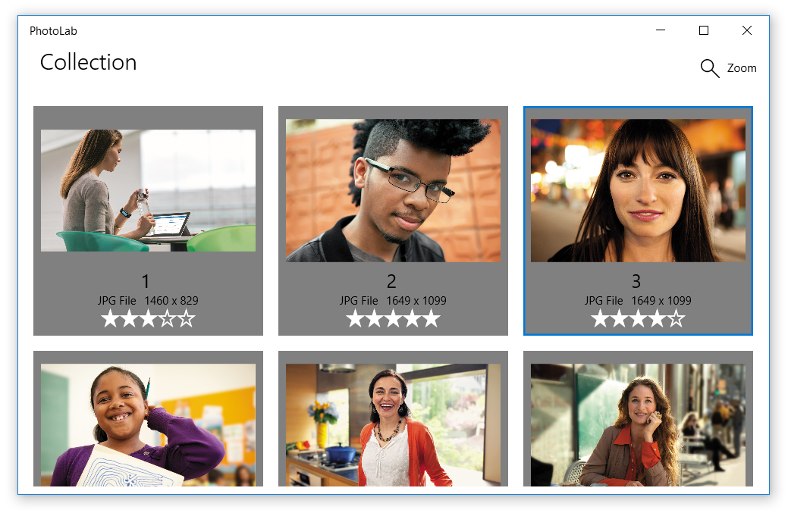

# What's New in the Windows Developer Docs in September 2017

The Windows Developer Documentation is constantly being updated with information on new features available to developers across the Windows platform. The following feature overviews, developer guidance, and samples have recently been made available, containing new and updated information for Windows developers.

Of course, the Fall Creators Update is right around the corner, so stay tuned for a great deal of more documentation that will be arriving in the coming month!

[Install the tools and SDK](https://developer.microsoft.com/windows/downloads#_blank) on Windows 10 and you’re ready to either [create a new Universal Windows app](../get-started/your-first-app.md) or explore how you can use your [existing app code on Windows](../porting/index.md).

## Features

### Xbox Live Creators Program

The Xbox Live Creators Program is now live, allowing you to easily build and publish UWP games that can run on both Windows 10 PCs and Xbox One consoles. For more information, see [Get started with the Xbox Live Creators Program](/gaming/xbox-live/get-started-with-creators/get-started-with-xbox-live-creators.md).

## Developer Guidance

### XAML basics tutorials

We've written four [XAML basics tutorials](../design/basics/xaml-basics-ui.md) to accompany the new [PhotoLab sample](https://github.com/Microsoft/Windows-appsample-photo-lab), covering four core aspects of XAML programming: user interfaces, data binding, custom styles, and adaptive layouts. Each tutorial track starts with a partially-complete version of the PhotoLab Sample, and builds one missing component of the final app step-by-step. 

  

Here's a quick overview of the new articles:

+ [**Create user interfaces**](../design/basics/xaml-basics-ui.md) shows how to create the basic photo gallery interface.
+ [**Create data bindings**](../data-binding/xaml-basics-data-binding.md) shows how to add data bindings to the photo gallery, populating it with real image data.
+ [**Create custom styles**](https://docs.microsoft.com/windows/uwp/design/controls-and-patterns/xaml-basics-style) shows how to add fancy custom styles to the photo editing menu.
+ [**Create adaptive layouts**](../design/basics/xaml-basics-adaptive-layout.md) shows how to make the gallery layout adaptive, so it looks good on every device and screen size.

### Get Started Tutorials

The Get Started section of the UWP docs has been updated with a [new landing page for the tutorials section](../get-started/create-uwp-apps.md). This section provides new and improved structure to the Get Started experience, helping users easily find and use the tutorials which are right for them - including the XAML basics tutorials mentioned above.

### Voice and tone

We've added new [guidance on voice in tone in UWP apps](../design/style/writing-style.md) to provide you with advice for writing text in your app. Whatever you're creating, it's important that the language you use is approachable, friendly, and informative.

## Samples

### PhotoLab sample

The [PhotoLab sample](https://github.com/Microsoft/windows-appsample-photo-lab) provides a basic photo gallery and photo-editing experience.

  

### Customer Orders

The [Customer Orders Database](https://github.com/Microsoft/Windows-appsample-customers-orders-database) sample has been updated to use the new .NET Core 2.0 and Entity Framework.