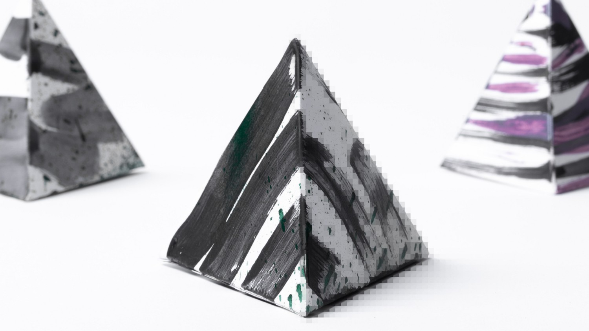

# What's New in the Windows Developer Docs in September 2018

The Windows Developer Documentation is constantly being updated with information on new features available to developers across the Windows platform. The following feature overviews, developer guidance, and videos have been made available in the month of September.

[Install the tools and SDK](https://developer.microsoft.com/windows/downloads#_blank) on Windows 10 and you’re ready to either [create a new Universal Windows app](../get-started/create-uwp-apps.md) or explore how you can use your [existing app code on Windows](../porting/index.md).

## Features

### Windows Machine Learning

[The Windows Machine Learning docs](/windows/ai/) now reside on their own site, and are updated for the latest Windows Insider SDK. There are desktop and UWP tutorials in C++ and C# to help you get started adding WinML to your application.

[The Windows.AI.MachineLearning API reference](/uwp/api/windows.ai.machinelearning) has been updated for the latest Windows Insider SDK.

[The Windows-Machine-Learning GitHub repo](https://github.com/Microsoft/Windows-Machine-Learning) has been updated with new samples that work with the latest SDK.

### Windows UI Library

[The Windows UI Library](/uwp/toolkits/winui/) is a set of NuGet packages that provide controls and other user interface elements for UWP apps. These packages are also compatible with earlier versions of Windows 10, so your app works even if your users don't have the latest OS version.

For more information on the Windows UI Library, see [this list of API namespaces included in the NuGet package.](/uwp/api/overview/winui/)

## Developer Guidance

### How blur effects work

One of our writers, the esteemed Mike Jacobs, has begun a series of articles in Medium about blur, from vision to photography to app and game design. If you're interested in learning more about this ubiquitous visual effect, check out [the first article on vision and photography](https://medium.com/microsoft-design/science-in-the-system-how-blur-effects-work-8b0590996e09) and [the second on anti-aliasing in graphics.](https://medium.com/microsoft-design/science-in-the-system-how-blur-effects-work-part-2-c5589a738515)

### Contributing guidance

We've updated [our contributing guidance](https://github.com/MicrosoftDocs/windows-uwp/blob/docs/CONTRIBUTING.md) for our UWP documentation. This new guidance clarifies the workflow and expectations for external contributions to our docs.

## Videos

### One Dev Question

In the One Dev Question video series, longtime Microsoft developers cover a series of questions about Windows development, team culture, and history. Here's the latest questions that we've answered!

Aaron Gustafson:

* [6 videos on Progressive Web Apps](https://www.youtube.com/playlist?list=PLWs4_NfqMtoyPHoI-CIB71mEq-om6m35I)

Chris Heilmann

* [4 videos on the webhint tool](https://www.youtube.com/watch?v=eXfmxmiA00Y&list=PLWs4_NfqMtow00LM-vgyECAlMDxx84Q2v)

Larry Osterman:

* [What parts of COM are in the Windows Runtime?](https://youtu.be/_nsMjHqRn1w)