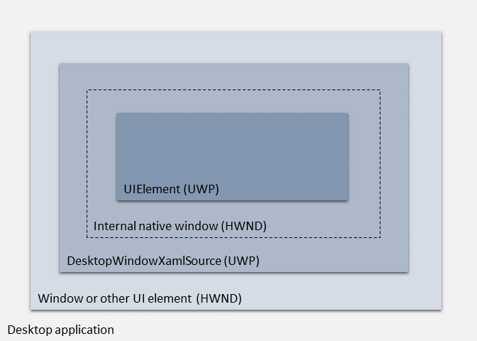

# Using the UWP XAML hosting API in a desktop application

> [!NOTE]
> The UWP XAML hosting API is currently available as a developer preview. Although we encourage you to try out this API in your own prototype code now, we do not recommend that you use it in production code at this time. This API will continue to mature and stabilize in future Windows releases. Microsoft makes no warranties, express or implied, with respect to the information provided here.

Starting in Windows 10 Insider Preview SDK build 17709, non-UWP desktop applications (including WPF, Windows Forms, and C++ Win32 applications) can use the *UWP XAML hosting API* to host UWP controls in any UI element that is associated with a window handle (HWND). This API enables non-UWP desktop applications to use the latest Windows 10 UI features that are only available via UWP controls. For example, non-UWP desktop applications can use this API to host UWP controls that use the [Fluent Design System](../design/fluent-design-system/index.md) and support [Windows Ink](../design/input/pen-and-stylus-interactions.md).

The UWP XAML hosting API provides the foundation for a broader set of controls that we are providing to enable developers to bring Fluent UI to non-UWP desktop applications. This scenario is sometimes called *XAML islands*. For more details about this developer scenario, see [UWP controls in desktop applications](xaml-host-controls.md).

## Is the UWP XAML hosting API right for your desktop application?

The UWP XAML hosting API provides the low-level infrastructure for hosting UWP controls in desktop applications. Some types of desktop applications have the option of using alternative, more convenient APIs to accomplish this goal.  

* If you have a C++ Win32 desktop application and you want to host UWP controls in your application, you must use the UWP XAML hosting API. There are no alternatives for these types of applications.

* For WPF and Windows Forms applications, we recommend that you use the [wrapped controls](xaml-host-controls.md#wrapped-controls) and [host controls](xaml-host-controls.md#host-controls) in the Windows Community Toolkit instead of the UWP XAML hosting API. These controls use the UWP XAML hosting API internally and provide a simpler development experience. However, you can use the UWP XAML hosting API directly in these types of applications if you choose.

## Related samples

The way you use the UWP XAML hosting API in your code depends on your application type, the design of your application, and other factors. To help illustrate how to use this API in the context of a complete application, this article refers to code from the following samples.

### C++ Win32

There are several samples on GitHub that demonstrate how to use the UWP XAML hosting API in a C++ Win32 application:

  * [XamlHostingSample](https://github.com/Microsoft/Windows-appsample-Xaml-Hosting). This sample demonstrates how to add the UWP [InkCanvas](https://docs.microsoft.com/uwp/api/windows.ui.xaml.controls.inkcanvas), [InkToolbar](https://docs.microsoft.com/uwp/api/windows.ui.xaml.controls.inktoolbar), and [MediaPlayerElement](https://docs.microsoft.com/uwp/api/windows.ui.xaml.controls.mediaplayerelement) controls to a C++ Win32 application.
  * [XamlIslands32](https://github.com/clarkezone/cppwinrt/tree/master/Desktop/XamlIslandsWin32). This sample demonstrates how to add several basic UWP controls to a C++ Win32 application and handle DPI changes.

### WPF and Windows Forms

The [WindowsXamlHost](https://docs.microsoft.com/windows/communitytoolkit/controls/wpf-winforms/windowsxamlhost) control in the Windows Community Toolkit acts as a reference sample for using the UWP hosting API in WPF and Windows Forms applications. The source code is available at the following locations:

  * For the WPF version of the control, [go here](https://github.com/Microsoft/WindowsCommunityToolkit/tree/master/Microsoft.Toolkit.Win32/Microsoft.Toolkit.Wpf.UI.XamlHost). The WPF version derives from [**System.Windows.Interop.HwndHost**](https://docs.microsoft.com/dotnet/api/system.windows.interop.hwndhost).
  * For the Windows Forms version of the control, [go here](https://github.com/Microsoft/WindowsCommunityToolkit/tree/master/Microsoft.Toolkit.Win32/Microsoft.Toolkit.Forms.UI.XamlHost). The Windows Forms version derives from [**System.Windows.Forms.Control**](https://docs.microsoft.com/dotnet/api/system.windows.forms.control).

## Prerequisites

The UWP XAML hosting API has these prerequisites.

* Windows 10 Insider Preview build 17709 (or a later build) and the corresponding Insider Preview build of the Windows SDK. Because this is an evolving feature, for the best experience we recommend using the latest available build.

* To use the UWP XAML hosting API in your desktop application, you'll need to configure your project so you can call UWP APIs:

    * **C++ Win32:** We recommend that you configure your project to use [C++/WinRT](../cpp-and-winrt-apis/index.md). Download and install the [C++/WinRT Visual Studio Extension (VSIX)](https://aka.ms/cppwinrt/vsix) from the Visual Studio Marketplace and then add the ```<CppWinRTEnabled>true</CppWinRTEnabled>``` property to your .vcxproj file as described [here](../cpp-and-winrt-apis/intro-to-using-cpp-with-winrt.md#visual-studio-support-for-cwinrt-and-the-vsix).

    * **Windows Forms and WPF:** Follow [these instructions](../porting/desktop-to-uwp-enhance.md#modify-a-net-project-to-use-uwp-apis).

## Architecture of XAML islands

The UWP XAML hosting API includes [**DesktopWindowXamlSource**](https://docs.microsoft.com/uwp/api/windows.ui.xaml.hosting.desktopwindowxamlsource), [**WindowsXamlManager**](https://docs.microsoft.com/uwp/api/windows.ui.xaml.hosting.windowsxamlmanager), and other related types in the [**Windows.UI.Xaml.Hosting**](https://docs.microsoft.com/uwp/api/windows.ui.xaml.hosting) namespace. Desktop applications can use this API to render UWP controls and route keyboard focus navigation into and out of the elements. Desktop applications can also size and position the UWP controls as desired.

When you create a XAML island using the XAML hosting API in a desktop application, you will have the following hierarchy of objects:

* At the base level is the UI element in your application where you want to host the XAML island. This UI element must have a window handle (HWND). Examples of UI elements in which you can host a XAML island include [**System.Windows.Interop.HwndHost**](https://docs.microsoft.com/dotnet/api/system.windows.interop.hwndhost) for WPF applications, [**System.Windows.Forms.Control**](https://docs.microsoft.com/dotnet/api/system.windows.forms.control) for Windows Forms applications, and a [window](https://docs.microsoft.com/windows/desktop/winmsg/about-windows) for C++ Win32 applications.

* At the next level is a **DesktopWindowXamlSource** object. This object provides the infrastructure for hosting the XAML island. Your code is responsible for creating this object and attaching it to the parent UI element.

* When you create a **DesktopWindowXamlSource**, this object automatically creates a native child window to host your UWP control. This native child window is mostly abstracted away from your code, but you can access its handle (HWND) if necessary.

* Finally, at the top level is the UWP control you want to host in your desktop application. This can be any UWP object that derives from [**Windows.UI.Xaml.UIElement**](https://docs.microsoft.com/uwp/api/windows.ui.xaml.uielement), including any UWP control provided by the Windows SDK as well as custom user controls.

The following diagram illustrates the hierarchy of objects in a XAML island.



## How to host UWP XAML controls

Here are the main steps for using the UWP XAML hosting API to host a UWP control in your application.

1. Initialize the UWP XAML framework for the current thread before your application creates any of the [**Windows.UI.Xaml.UIElement**](https://docs.microsoft.com/uwp/api/windows.ui.xaml.uielement) objects that it will host in the [**DesktopWindowXamlSource**](https://docs.microsoft.com/uwp/api/windows.ui.xaml.hosting.desktopwindowxamlsource).

    * If your application creates the **DesktopWindowXamlSource** object before it creates any of the **Windows.UI.Xaml.UIElement** objects, this framework will be initialized for you when you instantiate the **DesktopWindowXamlSource** object. In this scenario, you don't need to add any code of your own to initialize the framework.

    * However, if your application creates the **Windows.UI.Xaml.UIElement** objects before it creates the **DesktopWindowXamlSource** object that will host them, your application must call the static [**WindowsXamlManager.InitializeForCurrentThread**](https://docs.microsoft.com/uwp/api/windows.ui.xaml.hosting.windowsxamlmanager.initializeforcurrentthread) method to explicitly initialize the UWP XAML framework before the **Windows.UI.Xaml.UIElement** objects are instantiated. Your application should typically should call this method when the parent UI element that hosts the **DesktopWindowXamlSource** is instantiated.

    ```cppwinrt
    Windows::UI::Xaml::Hosting::WindowsXamlManager windowsXamlManager =
        Windows::UI::Xaml::Hosting::WindowsXamlManager::InitializeForCurrentThread();
    ```

    ```csharp
    global::Windows.UI.Xaml.Hosting.WindowsXamlManager windowsXamlManager =
        global::Windows.UI.Xaml.Hosting.WindowsXamlManager.InitializeForCurrentThread();
    ```

    > [!NOTE]
    > This method returns a [**WindowsXamlManager**](https://docs.microsoft.com/uwp/api/windows.ui.xaml.hosting.windowsxamlmanager) object that contains a reference to the UWP XAML framework. You can create as many **WindowsXamlManager** objects as you want on a given thread. However, because each object holds a reference to the UWP XAML framework, you should dispose the objects to ensure that XAML resources are eventually released.

2. Create a [**DesktopWindowXamlSource**](https://docs.microsoft.com/uwp/api/windows.ui.xaml.hosting.desktopwindowxamlsource) object and attach it to a parent UI element in your application that is associated with a window handle.

    To do this, you'll need to follow these steps:

    1. Create a **DesktopWindowXamlSource** object and cast it to the **IDesktopWindowXamlSourceNative** COM interface. This interface is declared in the ```windows.ui.xaml.hosting.desktopwindowxamlsource.h``` header file in the Windows SDK. In a C++ Win32 project, you can reference this header file directly. In a WPF or Windows Forms project, you'll need to declare this interface in your application code using the [**ComImport**](https://docs.microsoft.com/dotnet/api/system.runtime.interopservices.comimportattribute) attribute. Make sure your interface declaration exactly matches the interface declaration in ```windows.ui.xaml.hosting.desktopwindowxamlsource.h```.

    2. Call the **AttachToWindow** method of the **IDesktopWindowXamlSourceNative** interface, and pass in the window handle of the parent UI element in your application.

    3. Set the initial size of the internal child window contained in the **DesktopWindowXamlSource**. By default, this internal child window is set to a width and height of 0. If you don't set the size of the window, any UWP controls you add to the **DesktopWindowXamlSource** will not be visible. To access the internal child window in the **DesktopWindowXamlSource**, use the **WindowHandle** property of the **IDesktopWindowXamlSourceNative** interface. The following examples use the [SetWindowPos](https://docs.microsoft.com/windows/desktop/api/winuser/nf-winuser-setwindowpos) function to set the size of the window.

    Here are some code examples that demonstrate this process.

    ```cppwinrt
    // This example assumes you already have an HWND variable named 'parentHwnd' that
    // contains the handle of the parent window.
    Windows::UI::Xaml::Hosting::DesktopWindowXamlSource desktopWindowXamlSource;
    auto interop = desktopWindowXamlSource.as<IDesktopWindowXamlSourceNative>();
    check_hresult(interop->AttachToWindow(parentHwnd));

    HWND childInteropHwnd = nullptr;
    interop->get_WindowHandle(&childInteropHwnd);

    SetWindowPos(childInteropHwnd, 0, 0, 0, 300, 300, SWP_SHOWWINDOW);
    ```

    ```csharp
    // This WPF example assumes you already have an HwndHost named 'parentHwndHost'
    // that will act as the parent UI elemnt for your XAML island. It also assumes
    // you have used the DllImport attribute to import SetWindowPos from user32.dll
    // as a static method into a class named NativeMethods.
    Windows.UI.Xaml.Hosting.DesktopWindowXamlSource desktopWindowXamlSource =
        new Windows.UI.Xaml.Hosting.DesktopWindowXamlSource();

    IntPtr iUnknownPtr = System.Runtime.InteropServices.Marshal.GetIUnknownForObject(
        desktopWindowXamlSource);
    IDesktopWindowXamlSourceNative desktopWindowXamlSourceNative =
        System.Runtime.InteropServices.Marshal.Marshal.GetTypedObjectForIUnknown(
            iUnknownPtr, typeof(IDesktopWindowXamlSourceNative))
            as IDesktopWindowXamlSourceNative;

    desktopWindowXamlSourceNative.AttachToWindow(parentHwndHost.Handle);

    var childInteropHwnd = desktopWindowXamlSourceNative.WindowHandle;
    NativeMethods.SetWindowPos(childInteropHwnd, HWND_TOP, 0, 0, 300, 300, SWP_SHOWWINDOW);
    ```

3. Set the **Windows.UI.Xaml.UIElement** you want to host to the [**Content**](https://docs.microsoft.com/uwp/api/windows.ui.xaml.hosting.desktopwindowxamlsource.content) property of your **DesktopWindowXamlSource** object. The following example sets a [**Windows.UI.Xaml.Controls.Grid**](https://docs.microsoft.com/uwp/api/windows.ui.xaml.controls.grid) named ```myGrid``` to the **Content** property.

   ```cppwinrt
   desktopWindowXamlSource.Content(myGrid);
   ```

   ```csharp
   desktopWindowXamlSource.Content = myGrid;
   ```

For complete examples that demonstrate these tasks in the context of a working sample application, see the following code files:

  * **C++ Win32:** See the [Main.cpp](https://github.com/Microsoft/Windows-appsample-Xaml-Hosting/blob/master/XamlHostingSample/Main.cpp) file in the [XamlHostingSample](https://github.com/Microsoft/Windows-appsample-Xaml-Hosting) sample or the [Desktop.cpp](https://github.com/clarkezone/cppwinrt/blob/master/Desktop/XamlIslandsWin32/Desktop.cpp) file in the [XamlIslands32](https://github.com/clarkezone/cppwinrt/tree/master/Desktop/XamlIslandsWin32) sample.
  * **WPF:** See the [WindowsXamlHostBase.cs](https://github.com/Microsoft/WindowsCommunityToolkit/blob/master/Microsoft.Toolkit.Win32/Microsoft.Toolkit.Wpf.UI.XamlHost/WindowsXamlHostBase.cs) and  [WindowsXamlHost.cs](https://github.com/Microsoft/WindowsCommunityToolkit/blob/master/Microsoft.Toolkit.Win32/Microsoft.Toolkit.Wpf.UI.XamlHost/WindowsXamlHost.cs) files in the Windows Community Toolkit.  
  * **Windows Forms:** See the [WindowsXamlHostBase.cs](https://github.com/Microsoft/WindowsCommunityToolkit/blob/master/Microsoft.Toolkit.Win32/Microsoft.Toolkit.Forms.UI.XamlHost/WindowsXamlHostBase.cs) and  [WindowsXamlHost.cs](https://github.com/Microsoft/WindowsCommunityToolkit/blob/master/Microsoft.Toolkit.Win32/Microsoft.Toolkit.Forms.UI.XamlHost/WindowsXamlHost.cs) files in the Windows Community Toolkit.


## How to host custom UWP XAML controls

> [!IMPORTANT]
> Currently, custom UWP XAML controls from 3rd parties are only supported in C# WPF and Windows Forms applications. You must have the source code for the controls so you can compile against it in your application.

If you want to host a custom UWP XAML control (either a control you define yourself or a control provided by a 3rd party), you must perform the following additional tasks in addition to the process described in the [previous section](#how-to-host-uwp-xaml-controls).

1. Define a custom type that derives from [**Windows.UI.Xaml.Application**](https://docs.microsoft.com/uwp/api/windows.ui.xaml.application) and also implements [**IXamlMetadataProvider**](https://docs.microsoft.com/uwp/api/windows.ui.xaml.markup.ixamlmetadataprovider). This type acts as a root metadata provider for loading metadata for custom UWP XAML types in assemblies in the current directory of your application.

    For an example that demonstrates how to do this, see the [XamlApplication.cs](https://github.com/Microsoft/WindowsCommunityToolkit/tree/master/Microsoft.Toolkit.Win32/Microsoft.Windows.Interop.WindowsXamlHost.Shared/XamlApplication.cs) code file in the Windows Community Toolkit. This file is part of the shared implementation of the **WindowsXamlHost** classes for WPF and Windows Forms, which help illustrate how to use the UWP XAML hosting API in those types of apps.

2. Call the [**GetXamlType**](https://docs.microsoft.com/uwp/api/windows.ui.xaml.markup.ixamlmetadataprovider.getxamltype) method of your root metadata provider when the type name of the UWP XAML control is assigned (this could be assigned in code at run time, or you might choose to enable this to be assigned in the Visual Studio Properties window).

    For an example that demonstrates how to do this, see the [UWPTypeFactory.cs](https://github.com/Microsoft/WindowsCommunityToolkit/tree/master/Microsoft.Toolkit.Win32/Microsoft.Windows.Interop.WindowsXamlHost.Shared/UWPTypeFactory.cs) code file in the Windows Community Toolkit. This file is part of the shared implementation of the **WindowsXamlHost** classes for WPF and Windows Forms.

3. Integrate the source code for the custom UWP XAML control into your host application solution, build the custom control, and use it in your application by following [these instructions](https://docs.microsoft.com/windows/communitytoolkit/controls/wpf-winforms/windowsxamlhost#add-a-custom-uwp-control).

## How to handle keyboard focus navigation

When the user navigates through the UI elements in your application using the keyboard (for example, by pressing **Tab** or direction/arrow key), you'll need to programmatically move focus into and out of the **DesktopWindowXamlSource** object. When the user's keyboard navigation reaches the **DesktopWindowXamlSource**, move focus into the first [**Windows.UI.Xaml.UIElement**](https://docs.microsoft.com/uwp/api/windows.ui.xaml.uielement) object in the navigation order for your UI, continue to move focus to the following **Windows.UI.Xaml.UIElement** objects as the user cycles through the elements, and then move focus back out of the **DesktopWindowXamlSource** and into the parent UI element.  

The UWP XAML hosting API provides several types and members to help you accomplish these tasks.

1. When the keyboard navigation enters your **DesktopWindowXamlSource**, the [**GotFocus**](https://docs.microsoft.com/uwp/api/windows.ui.xaml.hosting.desktopwindowxamlsource.gotfocus) event is raised. Handle this event and programmatically move focus to the first hosted **Windows.UI.Xaml.UIElement** by using the [**NavigateFocus**](https://docs.microsoft.com/uwp/api/windows.ui.xaml.hosting.desktopwindowxamlsource.navigatefocus) method.

2. When the user is on the last focusable element in your **DesktopWindowXamlSource** and presses the **Tab** key or an arrow key, the [**TakeFocusRequested**](https://docs.microsoft.com/uwp/api/windows.ui.xaml.hosting.desktopwindowxamlsource.takefocusrequested) event is raised. Handle this event and programmatically move focus to the next focusable element in the host application. For example, in a WPF application where the **DesktopWindowXamlSource** is hosted in a [**System.Windows.Interop.HwndHost**](https://docs.microsoft.com/dotnet/api/system.windows.interop.hwndhost), you can use the [**MoveFocus**](https://docs.microsoft.com/dotnet/api/system.windows.frameworkelement.movefocus) method to transfer focus to the next focusable element in the host application.

For examples that demonstrate how to do this in the context of a working sample application, see the following code files:
  * **WPF:** See the [WindowsXamlHostBase.Focus.cs](https://github.com/Microsoft/WindowsCommunityToolkit/blob/master/Microsoft.Toolkit.Win32/Microsoft.Toolkit.Wpf.UI.XamlHost/WindowsXamlHostBase.Focus.cs) file in the Windows Community Toolkit.  
  * **Windows Forms:** See the [WindowsXamlHostBase.KeyboardFocus.cs](https://github.com/Microsoft/WindowsCommunityToolkit/blob/master/Microsoft.Toolkit.Win32/Microsoft.Toolkit.Forms.UI.XamlHost/WindowsXamlHostBase.KeyboardFocus.cs) file in the Windows Community Toolkit.

## How to handle layout changes

When the user changes the size of the parent UI element, you'll need to handle any necessary layout changes to make sure your UWP controls display as you expect. Here are some important scenarios to consider.

1. When the parent UI element needs to get the size of the rectangular area needed to fit the **Windows.UI.Xaml.UIElement** that you are hosting on the **DesktopWindowXamlSource**, call the [**Measure**](https://docs.microsoft.com/uwp/api/windows.ui.xaml.uielement.measure) method of the **Windows.UI.Xaml.UIElement**. For example:
    * In a WPF application you might do this from the [**MeasureOverride**](https://docs.microsoft.com/dotnet/api/system.windows.frameworkelement.measureoverride) method of the [**HwndHost**](https://docs.microsoft.com/dotnet/api/system.windows.interop.hwndhost) that hosts the **DesktopWindowXamlSource**.
    * In a Windows Forms application you might do this from the [**GetPreferredSize**](https://docs.microsoft.com/dotnet/api/system.windows.forms.control.getpreferredsize) method of the [**Control**](https://docs.microsoft.com/dotnet/api/system.windows.forms.control) that hosts the **DesktopWindowXamlSource**.

2. When the size of the parent UI element changes, call the [**Arrange**](https://docs.microsoft.com/uwp/api/windows.ui.xaml.uielement.arrange) method of the root **Windows.UI.Xaml.UIElement** that you are hosting on the **DesktopWindowXamlSource**. For example:
    * In a WPF application you might do this from the [**ArrangeOverride**](https://docs.microsoft.com/dotnet/api/system.windows.frameworkelement.arrangeoverride) method of the [**HwndHost**](https://docs.microsoft.com/dotnet/api/system.windows.interop.hwndhost) object that hosts the **DesktopWindowXamlSource**.
    * In a Windows Forms application you might do this from the handler for the [**SizeChanged**](https://docs.microsoft.com/dotnet/api/system.windows.forms.control.sizechanged) event of the [**Control**](https://docs.microsoft.com/dotnet/api/system.windows.forms.control) that hosts the **DesktopWindowXamlSource**.

For examples that demonstrate how to do this in the context of a working sample application, see the following code files:
  * **WPF:** See the [WindowsXamlHost.Layout.cs](https://github.com/Microsoft/WindowsCommunityToolkit/blob/master/Microsoft.Toolkit.Win32/Microsoft.Toolkit.Wpf.UI.XamlHost/WindowsXamlHostBase.Layout.cs) file in the Windows Community Toolkit.  
  * **Windows Forms:** See the [WindowsXamlHost.Layout.cs](https://github.com/Microsoft/WindowsCommunityToolkit/blob/master/Microsoft.Toolkit.Win32/Microsoft.Toolkit.Forms.UI.XamlHost/WindowsXamlHostBase.Layout.cs) file in the Windows Community Toolkit.

## How to handle DPI changes

If you want to handle DPI changes in the window that hosts your UWP control (for example, if the user drags the window between monitors with different screen DPI), you'll need to configure the UWP control with a render transform, listen for DPI changes in your app, and update the window position and render transform of the UWP control in response to the DPI changes.

The following steps illustrate one way to handle this process in the context of a C++ Win32 application. For a complete example, see the [Desktop.cpp](https://github.com/clarkezone/cppwinrt/blob/master/Desktop/XamlIslandsWin32/Desktop.cpp) and [Desktop.h](https://github.com/clarkezone/cppwinrt/blob/master/Desktop/XamlIslandsWin32/Desktop.h) code files in the [XamlIslands32](https://github.com/clarkezone/cppwinrt/tree/master/Desktop/XamlIslandsWin32) sample on GitHub.

1. Maintain a [**ScaleTransform**](https://docs.microsoft.com/uwp/api/windows.ui.xaml.media.scaletransform) object in your app and assign it to the [**RenderTransform**](https://docs.microsoft.com/uwp/api/windows.ui.xaml.uielement.rendertransform) method of your UWP control. The following example does this for a [**Windows.UI.Xaml.Controls.Grid**](https://docs.microsoft.com/uwp/api/windows.ui.xaml.controls.grid) control in a C++ Win32 application.

    ```cppwinrt
    // Private fields maintained by your app, such as in a window class you have defined.
    Windows::UI::Xaml::Media::ScaleTransform m_scale;
    Windows::UI::Xaml::Controls::Grid m_rootGrid;

    // Code that runs during initialization, such as the constructor for a window class you have defined.
    m_rootGrid.RenderTransform(m_scale);
    ```

2. In your [**WindowProc**](https://msdn.microsoft.com/library/windows/desktop/ms633573.aspx) function, listen for the [**WM_DPICHANGED**](https://docs.microsoft.com/windows/desktop/hidpi/wm-dpichanged) message. In response to this message:
    * Use the [**SetWindowPos**](https://docs.microsoft.com/windows/desktop/api/winuser/nf-winuser-setwindowpos) function to resize the window that contains the UWP control to the rectangle passed to the message.
    * Update the x-axis and y-axis scale factors of your **ScaleTransform** object according to the new DPI value.
    * Make any necessary adjustments to the appearance and layout of your UWP control. The following code example adjusts the [**Padding**](https://docs.microsoft.com/uwp/api/windows.ui.xaml.controls.grid.padding) of the hosted **Windows.UI.Xaml.Controls.Grid** control in response to DPI changes.

    ```cppwinrt
    LRESULT HandleDpiChange(HWND hWnd, WPARAM wParam, LPARAM lParam)
    {
        HWND hWndStatic = GetWindow(hWnd, GW_CHILD);
        if (hWndStatic != nullptr)
        {
            UINT uDpi = HIWORD(wParam);

            // Resize the window
            auto lprcNewScale = reinterpret_cast<RECT*>(lParam);

            SetWindowPos(hWnd, nullptr, lprcNewScale->left, lprcNewScale->top,
                lprcNewScale->right - lprcNewScale->left, lprcNewScale->bottom - lprcNewScale->top,
                SWP_NOZORDER | SWP_NOACTIVATE);

            NewScale(uDpi);
          }
          return 0;
    }

    void NewScale(UINT dpi) {

        auto scaleFactor = (float)dpi / 100;

        if (m_scale != nullptr) {
            m_scale.ScaleX(scaleFactor);
            m_scale.ScaleY(scaleFactor);
        }

        ApplyCorrection(scaleFactor);
    }

    void ApplyCorrection(float scaleFactor) {
        float rightCorrection = (m_rootGrid.Width() * scaleFactor - m_rootGrid.Width()) / scaleFactor;
        float bottomCorrection = (m_rootGrid.Height() * scaleFactor - m_rootGrid.Height()) / scaleFactor;

        m_rootGrid.Padding(Windows::UI::Xaml::ThicknessHelper::FromLengths(0, 0, rightCorrection, bottomCorrection));
    }
    ```

2. To configure your application to be per-monitor DPI aware, add a [side-by-side assembly manifest](https://docs.microsoft.com/windows/desktop/SbsCs/application-manifests) to your project and set ```<dpiAwareness>``` element to ```PerMonitorV2```. For more information about this value, see the description for [**DPI_AWARENESS_CONTEXT_PER_MONITOR_AWARE_V2**](https://docs.microsoft.com/windows/desktop/hidpi/dpi-awareness-context).

    ```xml
    <?xml version="1.0" encoding="UTF-8" standalone="yes"?>
    <assembly xmlns="urn:schemas-microsoft-com:asm.v1" manifestVersion="1.0">
        <application xmlns="urn:schemas-microsoft-com:asm.v3">
            <windowsSettings>
                <dpiAwareness xmlns="http://schemas.microsoft.com/SMI/2016/WindowsSettings">PerMonitorV2</dpiAwareness>
            </windowsSettings>
        </application>
    </assembly>
    ```

    For a complete example side-by-side assembly manifest, see the [XamlIslandsWin32.exe.manifest](https://github.com/clarkezone/cppwinrt/blob/master/Desktop/XamlIslandsWin32/XamlIslandsWin32.exe.manifest) file in the [XamlIslands32](https://github.com/clarkezone/cppwinrt/tree/master/Desktop/XamlIslandsWin32) sample on GitHub.

## Limitations

The XAML hosting API shares the same limitations as all other types of XAML host controls for Windows 10. For a detailed list, see [XAML host control limitations](xaml-host-controls.md#limitations).

## Troubleshooting

### Error using UWP XAML hosting API in a UWP app

| Issue | Resolution |
|-------|------------|
| Your app receives a **COMException** with the following message: "Cannot activate DesktopWindowXamlSource. This type cannot be used in a UWP app." or "Cannot activate WindowsXamlManager. This type cannot be used in a UWP app." | This error indicates you are trying to use the UWP XAML hosting API (specifically, you are trying to instantiate the [**DesktopWindowXamlSource**](https://docs.microsoft.com/uwp/api/windows.ui.xaml.hosting.desktopwindowxamlsource) or [**WindowsXamlManager**](https://docs.microsoft.com/uwp/api/windows.ui.xaml.hosting.windowsxamlmanager) types) in a UWP app. The UWP XAML hosting API is only intended to be used in non-UWP desktop apps, such as WPF, Windows Forms, and C++ Win32 applications. |

### Error attaching to a window on a different thread

| Issue | Resolution |
|-------|------------|
| Your app receives a **COMException** with the following message: "AttachToWindow method failed because the specified HWND was created on a different thread." | This error indicates that your application called the **IDesktopWindowXamlSourceNative.AttachToWindow** method and passed it the HWND of a window that was created on a different thread. You must pass this method the HWND of a window that was created on the same thread as the code from which you are calling the method. |

### Error attaching to a window on a different top-level window

| Issue | Resolution |
|-------|------------|
| Your app receives a **COMException** with the following  message: "AttachToWindow method failed because the specified HWND descends from a different top-level window than the HWND that was previously passed to AttachToWindow on the same thread." | This error indicates that your application called the **IDesktopWindowXamlSourceNative.AttachToWindow** method and passed it the HWND of a window that descends from a different top-level window than a window you specified in a previous call to this method on the same thread.</p></p>After your application calls **IDesktopWindowXamlSourceNative.AttachToWindow** on a particular thread, all other [**DesktopWindowXamlSource**](https://docs.microsoft.com/uwp/api/windows.ui.xaml.hosting.desktopwindowxamlsource) objects on the same thread can only attach to windows that are descendants of the same top-level window that was passed in the first call to **IDesktopWindowXamlSourceNative.AttachToWindow**. When all the **DesktopWindowXamlSource** objects are closed for a particular thread, the next **DesktopWindowXamlSource** is then free to attach to any window again.</p></p>To resolve this issue, either close all **DesktopWindowXamlSource** objects that are bound to other top-level windows on this thread, or create a new thread for this **DesktopWindowXamlSource**. |

## Related topics

* [UWP controls in desktop applications](xaml-host-controls.md)
