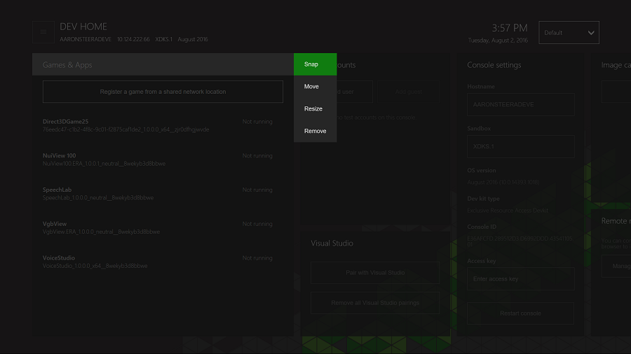
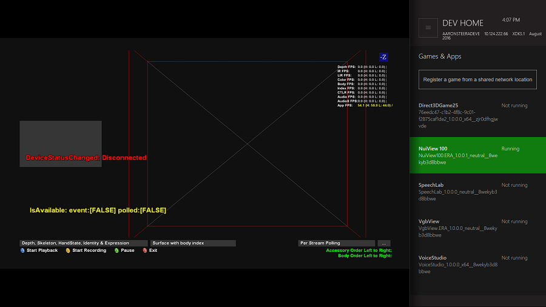
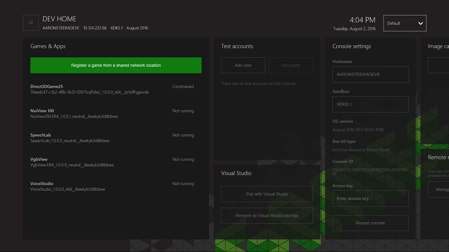

# Developer Home on the Console (Dev Home)
   
  
Dev Home is a tools experience on the Xbox One development kit designed to aid developer productivity. Dev Home offers functionality to manage and configure your development kit, manage users, launch installed titles and perform captures and traces. In future releases we will continue to expand the functionality to enable additional features based on your feedback, and also to enable extensibility and the addition of your own tools.   
   
  
We are very interested in your feedback on Dev Home and the scenarios you are most interested in seeing it support. Please provide your comments through the methods described under **Send Feedback** in the main menu of the app or through your Developer Account Manager (DAM).   
   
  
To launch Dev Home on the November 2015 or later recovery:  
 
   1. Open the guide by moving left on Home, or double clicking the Nexus button  
   1. Move down to **Settings** (the gear icon)   
   1. Select **All settings**  
   1. From the default **Developer** page, select **Developer Home** (the home icon)   

    
  
On earlier recoveries select the Dev Home tile on the right side of the home screen in **featured content** or view the application list in Xbox One Manager and launch **Dev Home**.   
  

   

## User Interface  
   
  
The header of the Dev Home user interface contains the following important "at a glance" info about the development console:   
 
   *  **Console IP:** The current IP address of the console.   
   *  **Console name:** The current hostname of the console.  
   *  **Sandbox:** The name of the sandbox that the console is in.  
   *  **OS version:** The current recovery version that is running on the console.
   *  Current system time.   

   
  
The rest of the Dev Home UI is divided into the following pages. For more information about the tools on these pages, see their individual topics.   
 
   *  [Home](devhome-home.md)  
   *  [Xbox Live](devhome-live.md)  
   *  [Settings](devhome-settings.md)  
   *  [Media capture](devhome-capture.md)  
   *  [Networking](devhome-networking.md)  
   *  [Performance](devhome-performance.md)  

  

   

## Main Menu  
   
  
By pressing the **menu** button on your controller, you can access the main menu that allows configuration of the app workspace, the ability to manage credentials for accessing network locations and information on providing feedback on the app.   
  

   

## Snap Mode UX  
   
  
Several existing and upcoming tools in Dev Home, such as Networking and Multiplayer, are designed to be used snapped to the side while you are running your title, so that you can have easy access to tools while you are testing.   
   
  
To access Snap mode, highlight the title of the appropriate tool, press the **view** button on your controller, and select **snap** from the context menu:  
    
  
Dev Home will snap right. You can switch context by double tapping the Nexus button as usual.  
   

   

## Customizing Dev Home  
   
  
Dev Home has been designed to be customizable and personal. You can configure the app to suit your workflow, and then save that as a workspace. This workspace can be exported and imported, allowing you to copy the layout to other consoles as needed. These options are found in the main menu under **workspace**. The exported file will be located on the system scratch drive in the `Dev Home\Workspaces` directory.   
 

   

### Resizing and Reordering Tools  
   
  
To change the size or position of a tool, use the context menu button (view button on your controller) while the title has focus. From the context menu select **Move** or **Resize**.   
   

   

### Changing theme color and background image  
   
  
From the Main Menu, you can select **Workspace** and then **Change theme color**. Select a new color and select **Save** to update the theme color used for focus highlighting.   
   

   

### Setting the default application for a package  
   
  
If a package contains multiple applications, Dev Home will allow you to set the default application to be launched. Highlight the package in the launcher and press the **A** button to open the list of available applications. Highlight the one you wish to set as the default and press the **view** button, and then choose **Set as Default** from the context menu.   
   

   

### Using Dev Home to register and launch titles from a network share  
   
  
From the launcher, at the bottom of the installed apps and games list, you can select the option **Register a game from a network share** to run a loose file version of a title remotely.   
    
  
You can then enter the network path to the appxmanifest.xml file for the title you wish to register. Dev Home will attempt to register the title using any existing credentials for that share, and if needed will prompt for new network credentials. If you need to access additional shares (for example to access symbolically linked resources on a separate server) then you will need to add those via the option below.   
   
  
You can manage these stored credentials (and add additional ones) on the console via the main menu's **Manage network credentials** option.   
    
  
You can view the credentials currently on the console, edit credentials by selecting the path of the credential and clicking **A** button and remove a credential by selecting the remove link and clicking **A** button.   
   

   

## In this section  
  
[Home Page (Dev Home)](devhome-home.md)  

&nbsp;&nbsp;Provides quick access to the tasks that are routinely performed on a development console. 
  
  
[Xbox Live Page (Dev Home)](devhome-live.md)  

&nbsp;&nbsp;Captures multiplayer information and displays the current status of the Xbox Live service. 
  
  
[Settings Page (Dev Home)](devhome-settings.md)  

&nbsp;&nbsp;Provides access to various settings for the development console. 
  
  
[Media Capture Page (Dev Home)](devhome-capture.md)  

&nbsp;&nbsp;The **Media capture** page of Dev Home captures video of the title that is currently running on the console. 
  
  
[Networking Page (Dev Home)](devhome-networking.md)  

&nbsp;&nbsp;Simulates various networking conditions for troubleshooting purposes. 
  
  
[Performance Page (Dev Home)](devhome-performance.md)  

&nbsp;&nbsp;Simulates various disk activity and CPU usage conditions for troubleshooting purposes. 
 