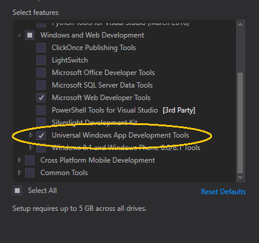
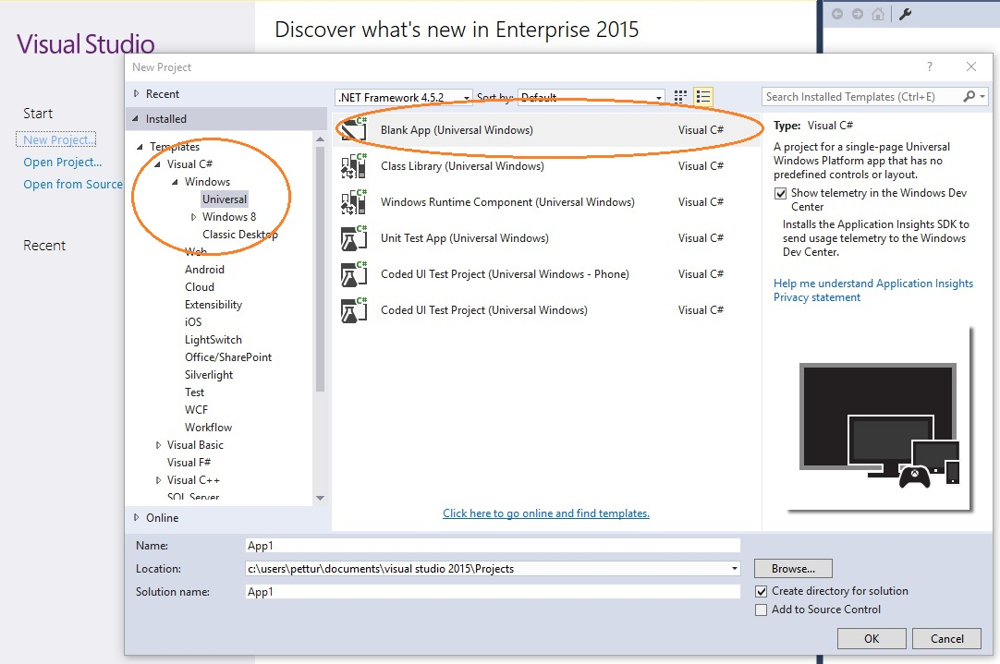
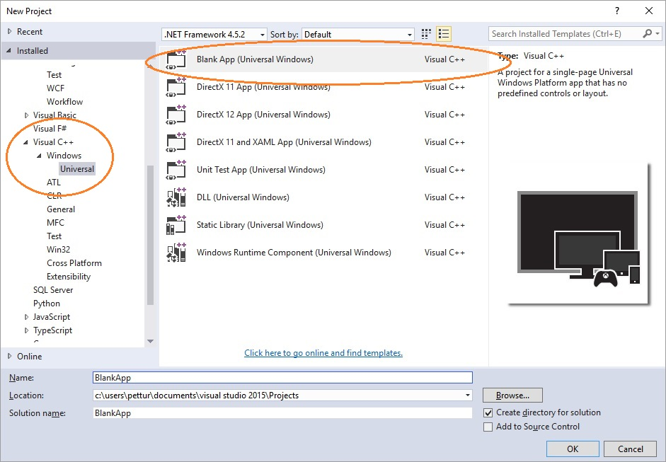
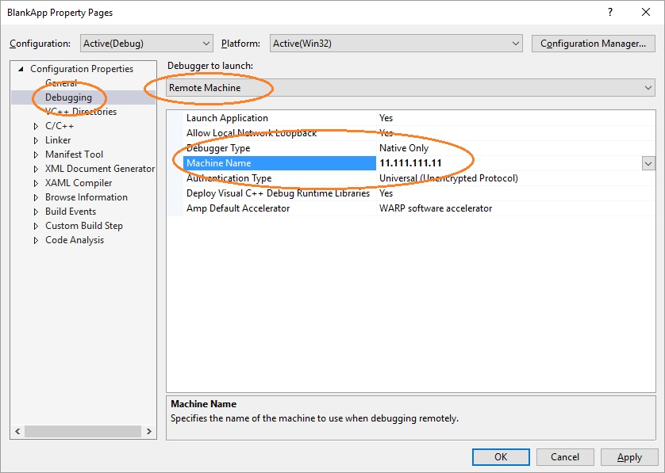
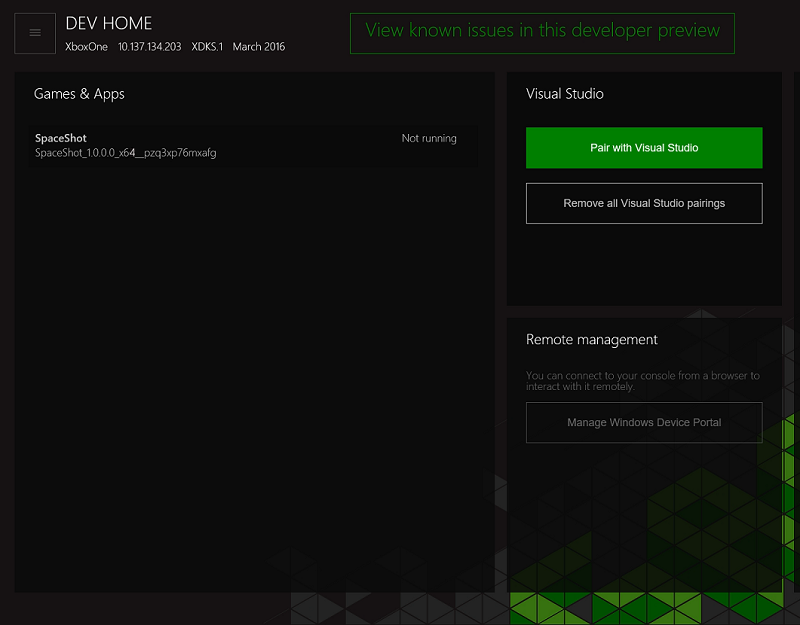

# Set up your UWP on Xbox development environment

The Universal Windows Platform (UWP) on Xbox development environment consists of a development PC connected to an Xbox One console through a local network.
The development PC requires Windows 10, Visual Studio 2015 Update 2, Windows 10 SDK preview build 14295, and a range of supporting tools.

This article covers the steps to set up and test your development environment.

## Visual Studio setup

1. Install Visual Studio 2015 Update 2 or later. For more information and to install, see [Downloads and tools for Windows 10](https://dev.windows.com/downloads).

1. When installing Visual Studio 2015 Update 2, ensure that the **Universal Windows App Development Tools** check box is selected.

  

## Windows 10 SDK setup

Install the latest Windows 10 SDK preview build. For installation information, see [Download Insider Preview updates for developers](http://go.microsoft.com/fwlink/p/?LinkId=780552).

> [!IMPORTANT]
> You need to install the latest SDK, but you do _not_ need to install the latest Windows Insider Preview release of the operating system.

## Enabling Developer Mode

Before you can deploy applications from your development PC, you must enable Developer Mode through the Windows menu: Settings / Update & security / For developers / Developer mode.

## Setting up your Xbox One

Before you can deploy an app to your Xbox One, you must have a user signed in on the console. 
You can either use your existing Xbox Live account or create a new account for your console in Developer Mode. 

## Create your first application

1. Make sure your development PC is on the same local network as the target Xbox One console. Typically, this means they should use the same router and be on the same subnet. A wired network connection is recommended.

1. Ensure that your Xbox One console is in Developer Mode.  For more information, see [Enabling Developer Mode on Xbox One](devkit-activation.md).

1. Decide the programming language that you want to use for your UWP app.

1. On your development PC, select **New Project**, and then select **Windows / Universal / Blank App**.

### Starting a C# project

  

1. Select the default options in the **New Universal Windows Project** dialog. If the **Developer Mode** dialog appears, click **OK**. A new blank app is created.

1. Configure your development environment for remote debugging:

  1. Right-click the project, and then select **Properties**.
  1. On the **Debug** tab, change **Platform** to **Active (x64)**. (x86 is no longer a supported platform on Xbox.)   
  1. Change **Target device** to **Remote Machine**.
  1. In **Remote machine**, enter the system IP address or hostname of the Xbox One console. For information about obtaining the IP address or hostname, see [Introduction to Xbox One tools](introduction-to-xbox-tools.md).
  1. In the **Authentication Mode** drop-down list, select **Universal (Unencrypted Protocol)**.

    

### Starting a C++ project

  

1. Select the default options in the **New Universal Windows Project** dialog. If the **Developer Mode** dialog appears, click **OK**. A new blank app is created.

1. Configure your development environment for remote debugging:

   1. Right-click the project, and then select **Properties**.
   1. On the **Debugging** tab, change **Debugger to launch** to **Remote Machine**.
   1. In **Machine Name**, enter the system IP address or hostname of the Xbox One console. For information about obtaining the IP address or hostname, see [Introduction to Xbox One tools](introduction-to-xbox-tools.md).
   1. In the **Authentication Type** drop-down list, select **Universal (Unencrypted Protocol)**.

    

### Pin-pair your device with Visual Studio

1. Save your settings, and make sure your Xbox One console is in Developer Mode.

1. Press F5.

1. If this is your first deployment, you will get a dialog from Visual Studio asking to PIN-pair your device.

  1. To obtain a PIN, open **Dev Home** from the Home screen on your Xbox One console.
  1. Select **Pair with Visual Studio**.

    

  1. Enter your PIN into the **Pair with Visual Studio** dialog. The following PIN is just an example; yours will differ.

    

  1. Deployment errors, if any, will appear in the **Output** window.

Congratulations, you've successfully created and deployed your first UWP app on Xbox!

## See also
- [Enabling Developer Mode on Xbox One](devkit-activation.md)  
- [Downloads and tools for Windows 10](https://dev.windows.com/downloads)  
- [Download Insider Preview updates for developers](http://go.microsoft.com/fwlink/?LinkId=780552)  
- [Introduction to Xbox One tools](introduction-to-xbox-tools.md) 
- [UWP on Xbox One](index.md)

----
