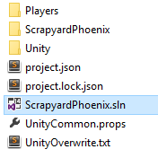
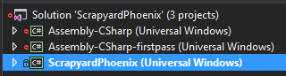

# Unity: Version control your UWP project

Still haven't built your Unity game for Xbox using the Universal Windows Platform (UWP)?  First see [Bringing Unity games to UWP on Xbox](development-lanes-unity.md).

There are a few different reasons why you would want to add parts of your generated UWP directory to version control, one of which is adding dependencies (for example,Xbox Live SDK).  We'll use this scenario as an example for this tutorial, and hopefully it will help you solve your project's individual needs.

***Disclaimer: We'll be using Git as our version control solution.  If yours differs, the concepts should still translate.***

To refresh your memory, this is what the directory for our game, ***ScrapyardPhoenix***, looks like currently:

And this is what our UWP directory looks like:

In this directory, we're only concerned about one folder, the ***ScrapyardPhoenix*** (insert your game's name here) folder.  Everything else can be ignored in our version control.

***Unfamiliar with what a .gitignore file is?  See [gitignore](https://git-scm.com/docs/gitignore).***

    ##################################################################
    # The original .gitignore file can be found at
    # https://github.com/github/gitignore/blob/master/Unity.gitignore
    ##################################################################

    # standard ignores for a Unity Project
    ...

    # ignore the whole UWP directory
    /UWP/**

    # except we want to keep... (this line will be modified and removed further down)
    !/UWP/ScrapyardPhoenix/

We're going to want to select a few different files and folders from within the **UWP/ScrapyardPhoenix** folder to add to our version control.  First let's look at the full thing in detail:

  

## Folders  

`Assets` | ***Include*** | Contains Microsoft Store images  
`Data`   | ***Ignore*** | Where Unity compiles your project to (Scenes, Shaders, Scripts, Prefabs, etc.)  
`Dependencies` | ***Include*** | This folder is one I created to keep all UWP dependencies in (for example, XboxLiveSDK.dll)  
`Properties` | ***Include*** | Contains more advanced settings that can be modified by the developer  
`Unprocessed` | ***Ignore*** | Contains Unity `.dll` and `.pdb` files  

## Files  

`App.cs` | ***Include*** | Entry point for your UWP application; this can be modified and extended with other source files  
`Package.appxmanifest` | ***Include*** | App package manifest source file for your .msix or .appx package  
`project.json` | ***Include*** | Describes the NuGet packages your `*.csproj` depends on  
`ScrapyardPhoenix.csproj` | ***Include*** | Describes your UWP build target; if you add additional dependencies to your UWP project, this `*.csproj` file will contain that information  
`ScrapyardPhoenix.csproj.user` | ***Ignore*** | This file contains local user information

## Resulting .gitignore

    ##################################################################
    # The original .gitignore file can be found at
    # https://github.com/github/gitignore/blob/master/Unity.gitignore
    ##################################################################

    # standard ignores for a Unity Project
    ...

    # ignore the whole UWP directory
    /UWP/**

    # except we want to keep...
    !/UWP/ScrapyardPhoenix/Assets/*
    !/UWP/ScrapyardPhoenix/Dependencies/*
    !/UWP/ScrapyardPhoenix/Properties/*
    !/UWP/ScrapyardPhoenix/App.cs
    !/UWP/ScrapyardPhoenix/Package.appxmanifest
    !/UWP/ScrapyardPhoenix/project.json
    !/UWP/ScrapyardPhoenix/ScrapyardPhoenix.csproj

And there you go, now your teammates will be in sync with the UWP project you've generated. Now you can feel free to add additional assets, source, and dependencies to your UWP project.

Some more examples of versioning the UWP folder can be found in [these examples](https://bitbucket.org/Unity-Technologies/windowsstoreappssamples/overview).

## Adding dependencies to your UWP app

Add dependencies to DLLs and WINMDs by putting them in your **Unity Assets** folder under a **Plugins** folder, then select them and set their target platform settings appropriately in the Inspector.

***ScrapyardPhoenix (Universal Windows)*** is the project you would add a reference to, for example, the Xbox Live SDK.

## See also
- [Bringing existing games to Xbox](development-lanes-landing.md)
- [UWP on Xbox One](index.md)
