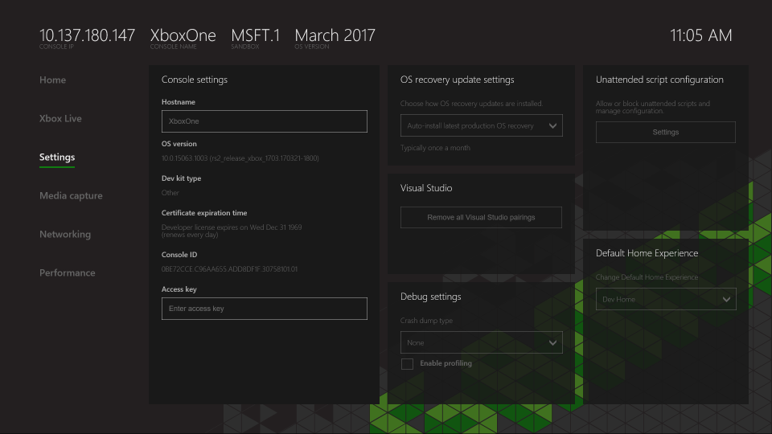

# Settings Page (Dev Home)
   
  
The **Settings** page of Dev Home provides access to various settings for the development console.   
    
  
The **Settings** page contains the following panes:   
 
   *  [Console settings](#ID4EEB)  
   *  [OS recovery update settings](#ID4EOB)  
   *  [Visual Studio](#ID4EYB)  
   *  [Debug settings](#ID4ECC)  
   *  [Unattended script configuration](#ID4EMC)  
   *  [Default Home Experience](#ID4E3C)  

 

   

## Console settings  
   
  
The **Console settings** pane provides an "at a glance" view of console settings and information. You can use these tools to view and edit the console's hostname, sandbox, and security access key settings.   
  

   

## OS recovery update settings  
   
  
The **OS recovery update settings** pane configures the console's auto update settings. Note that changes to these settings can take up to 24 hours to take effect.   
  

   

## Visual Studio  
   
  
The **Visual Studio** pane is used to pair the console with Visual Studio. You can also remove all paired Visual Studio instances.   
  

   

## Debug settings  
   
  
The **Debug settings** pane is used to view and toggle common debug settings.   
  

   

## Unattended script configuration  
   
  
The **Unattended script configuration** pane manages setup scripts for Xbox One consoles.   
  

   

## Default Home Experience  
   
  
The **Default Home Experience** pane determines whether the retail Home screen or the [Developer Home on the Console (Dev Home)](dev-home.md) screen is displayed when the console starts up.   
  

   

## See also  
 [Developer Home on the Console (Dev Home)](dev-home.md)

  