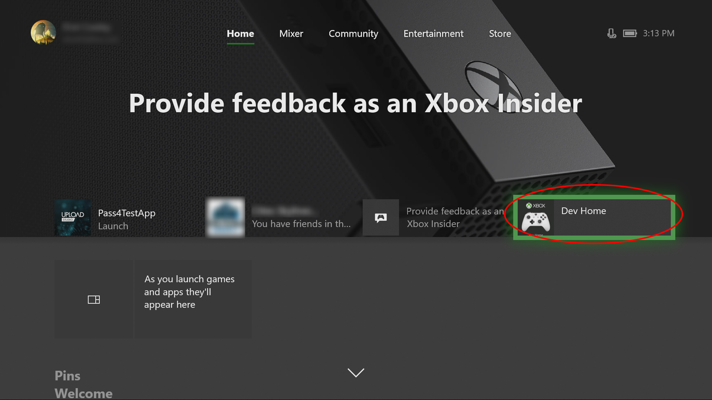
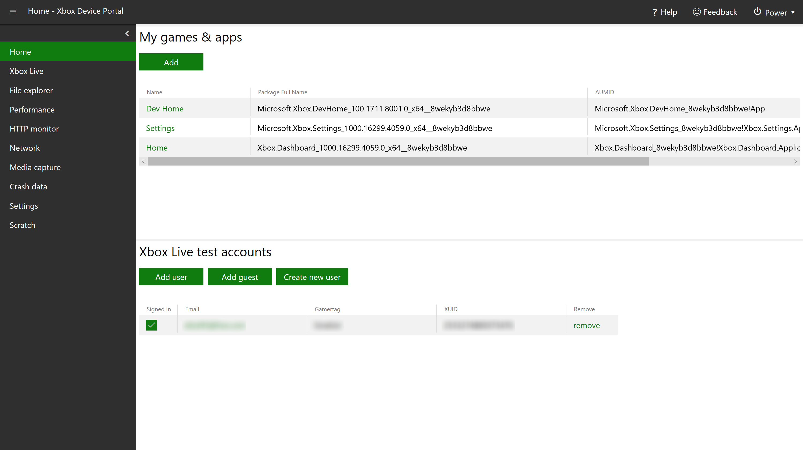
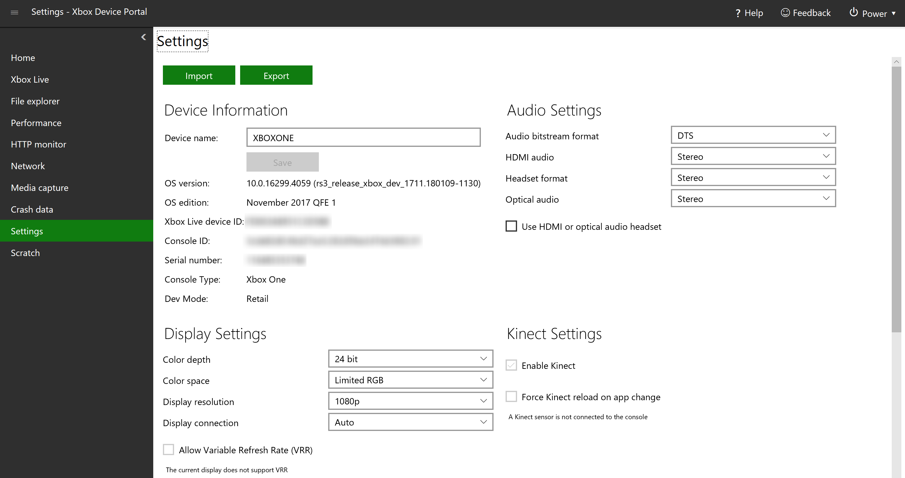
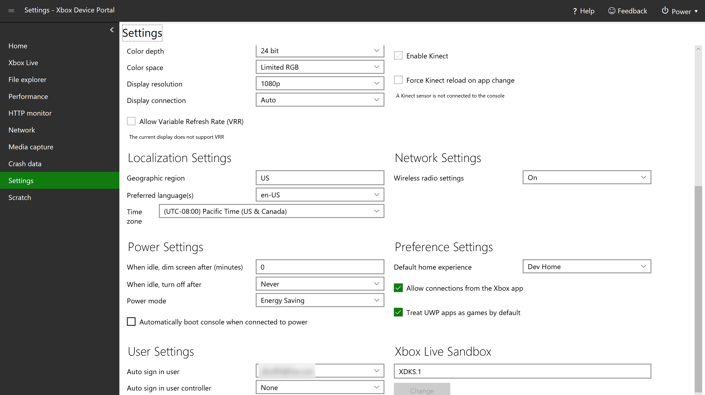

# Device Portal for Xbox

## Set up Device Portal on Xbox

The following steps show how to enable the Xbox Device Portal, which gives you remote access to your development Xbox.

1. Open Dev Home. This should open by default when you boot up your development Xbox, but you can also open it from the home screen.

    

2. Within Dev Home, on the **Home** tab, under **Remote Access**, select **Remote Access Settings**.

    

3. Check the **Enable Xbox Device Portal** setting.

4. Under **Authentication**, select **Set username and password**. Enter a **User name** and **Password** to use to authenticate access to your dev kit from a browser, and **Save** them.

5. **Close** the **Remote Access** page and note the URL listed under **Remote Access** on the **Home** tab.

6. Enter the URL in your browser, and then sign in with the credentials you configured.

7. You will receive a warning about the certificate that was provided, similar to that pictured below. In Edge, click on **Details** and then **Go on to the webpage** to access the Xbox Device Portal. In the dialog that pops up, enter the username and password that you entered previously on your Xbox.

    

## Device Portal pages

The Xbox Device Portal provides a set of standard pages similar to what's available on the Windows Device Portal, as well as several pages that are unique. For detailed descriptions of the former, see [Windows Device Portal overview](../debug-test-perf/device-portal.md). The following sections describe the pages that are unique to the Xbox Device Portal.

### Home

Similar to the Windows Device Portal's **Apps manager** page, the Xbox Device Portal's **Home** page displays a list of installed games and apps under **My games & apps**. You can click on the name of a game or app to see more details about it, such as the **Package family name**. In the **Actions** drop down, you can take action on the game or app, such as **Launch** it.

Under **Xbox Live test accounts**, you can manage the accounts associated with your Xbox. You can add users and guest accounts, create new users, sign users in and out, and remove accounts.

### Xbox Live (Game saves)

Both the Windows Device Portal and the Xbox Device Portal have an **Xbox Live** page. However, the Xbox Device Portal has a unique section, **Xbox Live game saves**, where you can save data for games installed on your Xbox. Enter the **Service Configuration ID (SCID)** (see [Xbox Live service configuration](/gaming/xbox-live/xbox-live-service-configuration.md#get-your-ids) for more information), **Membername (MSA)**, and **Package Family Name (PFN)** associated with the title and game save, browse for the **Input File (.json or .xml)**, and then select one of the buttons (**Reset**, **Import**, **Export**, and **Delete**) to manipulate the save data.

In the **Generate** section, you can generate dummy data and save to the specified input file. Simply enter the **Containers (default 2)**, **Blobs (default 3)**, and **Blob Size (default 1024)**, and select **Generate**.

### HTTP monitor

The HTTP Monitor allows you to view decrypted HTTP and HTTPS traffic from your app or game when it's running on your Xbox One.

To enable it, open Dev Home on your Xbox One, go to the **Settings** tab, and in the **HTTP Monitor Settings** box, check **Enable HTTP Monitor**.

Once enabled, in the Xbox Device Portal, you can **Stop**, **Clear**, and **Save to file** HTTP and HTTPS traffic by selecting the respective buttons.

### Network (Fiddler tracing)

The **Network** page in the Xbox Device Portal is almost identical to the **Networking** page in the Windows Device Portal, with the exception of **Fiddler tracing**, which is unique to the Xbox Device Portal. This allows you to run Fiddler on your PC to log and inspect HTTP and HTTPS traffic between your Xbox One and the internet. See [How to use Fiddler with Xbox One when developing for UWP](../xbox-apps/uwp-fiddler.md) for more information.

### Media capture

On the **Media capture** page, you can select **Capture Screenshot** to take a screenshot of your Xbox One. Once you do, your browser will prompt you to download the file. You can check **Prefer HDR** if you want to take the screenshot in HDR (if the console supports it).

### Settings

On the **Settings** page, you can view and edit several settings for your Xbox One. At the top, you can select **Import** to import settings from a file and **Export** to export the current settings to a .txt file. Importing settings can make bulk editing easier, especially when configuring multiple consoles. To create a settings file to import, change the settings to how you want them to be, and then export the settings. Then you can use this file to import settings quickly and easily for other consoles.

There are several sections with different settings to view and/or edit, which are explained below.

#### Device Information

* **Device name**: The name of the device. To edit, change the name in the box and select **Save**.

* **OS version**: Read-only. The version number of the operating system.

* **OS edition**: Read-only. The name of the major release of the operating system.

* **Xbox Live device ID**: Read-only.

* **Console ID**: Read-only.

* **Serial number**: Read-only.

* **Console Type**: Read-only. The type of Xbox One device (Xbox One, Xbox One S, or Xbox One X).

* **Dev Mode**: Read-only. The developer mode that the device is in.

#### Audio Settings

* **Audio bitstream format**: The format of the audio data.

* **HDMI audio**: The type of audio through the HDMI port.

* **Headset format**: The format of the audio that comes through headphones.

* **Optical audio**: The type of audio through the optical port.

* **Use HDMI or optical audio headset**: Check this box if you are using a headset connected via HDMI or optical.

#### Display Settings

* **Color depth**: The number of bits used for each color component of a single pixel.

* **Color space**: The color gamut available to the display.

* **Display resolution**: The resolution of the display.

* **Display connection**: The type of connection to the display.

* **Allow high dynamic range (HDR)**: Enables HDR on the display. Only available to compatible displays.

* **Allow 4K**: Enables 4K resolution on the display. Only available to compatible displays.

* **Allow Variable Refresh Rate (VRR)**: Enable VRR on the display. Only available to compatible displays.

#### Kinect Settings

A Kinect sensor must be connected to the console in order to change these settings.

* **Enable Kinect**: Enable the attached Kinect sensor.

* **Force Kinect reload on app change**: Reload the attached Kinect sensor whenever a different app or game is run.

#### Localization Settings

* **Geographic region**: The geographic region that the device is set to. Must be the specific 2-character country code (for example, **US** for United States).

* **Preferred language(s)**: The language that the device is set to.

* **Time zone**: The time zone that the device is set to.

#### Network Settings

* **Wireless radio settings**: The wireless settings of the device (whether certain aspects such as wireless LAN are on or off).

#### Power Settings

* **When idle, dim screen after (minutes)**: The screen will dim after the device has been idle for this amount of time. Set to **0** to never dim the screen.

* **When idle, turn off after**: The device will shut down after it has been idle for this amount of time.

* **Power mode**: The power mode of the device. See [About energy-saving and instant-on power modes](https://support.xbox.com/xbox-one/console/learn-about-power-modes) for more information.

* **Automatically boot console when connected to power**: The device will automatically turn on when it is connected to a power source.

#### Preference Settings

* **Default home experience**: Sets which home screen appears when the device is turned on.

* **Allow connections from the Xbox app**: The Xbox app on another device (such as a Windows 10 PC) can connect to this console.

* **Treat UWP apps as games by default**: Games and apps get different resources allocated to them on Xbox. If you check this box, all UWP packages will be identified as games and thus will get more resources.

#### User Settings

* **Auto sign in user**: Automatically signs in the selected user when the device is turned on.

* **Auto sign in user controller**: Automatically associates a particular controller type with a particular user.

#### Xbox Live Sandbox

Here you can change the Xbox Live sandbox that the device is in. Enter the name of the sandbox in the box, and select **Change**.

### Scratch

This is a blank workspace, which you can customize to your liking. You can use the menu (click the menu button at the top left) to add tools (select **Add tools to workspace**, then the tools that you want to add, then **Add**). Note that you can use this menu to add tools to any workspace, as well as manage the workspaces themselves.

### Game event data

On the **Game event data** page, you can view a realtime graph that streams in the number of Event Tracing for Windows (ETW) game events currently recorded on your Xbox One. If there are game events recorded on the system, you can also view details (event name, event occurrence, and the game title) describing each event in a data table below the data graph. The table is only available if there are events recorded.

## See also

* [Windows Device Portal overview](../debug-test-perf/device-portal.md)
* [Device Portal core API reference](../debug-test-perf/device-portal-api-core.md)