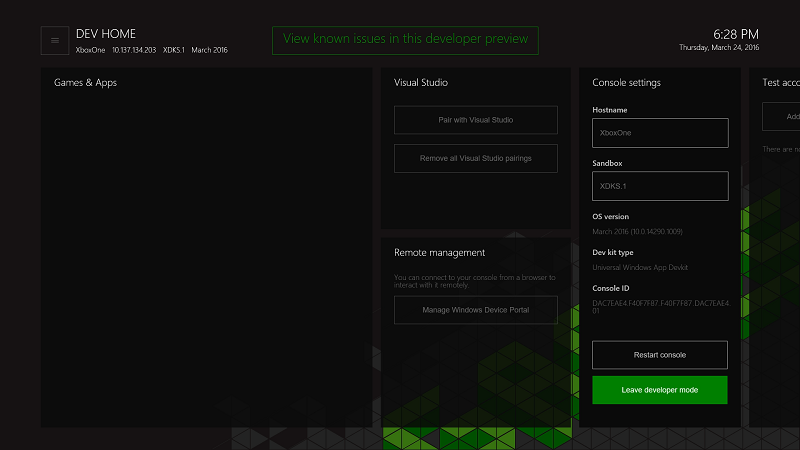
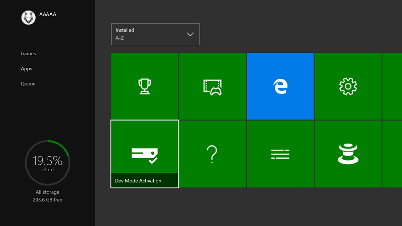
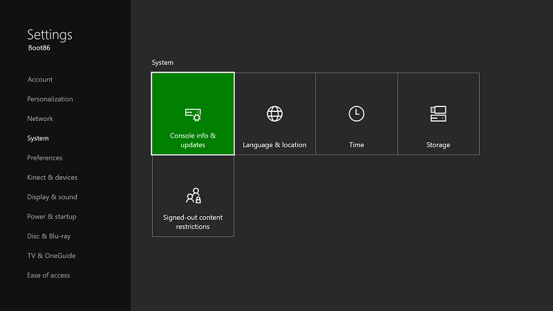
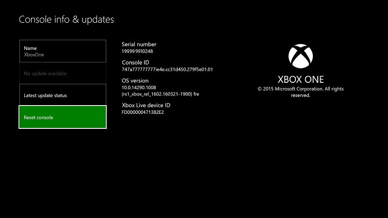
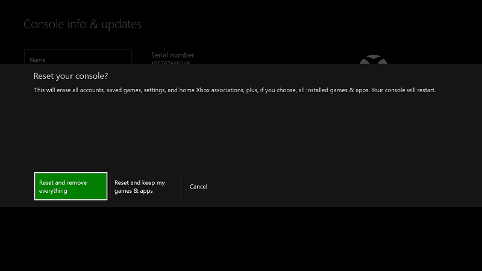

# Xbox One Developer Mode deactivation

* [Switch to Retail Mode](#switch-to-retail-mode)
* [Deactivate your console using the Dev Mode Activation app](#deactivate-your-console-using-the-dev-mode-activation-app)  
* [Reset your console](#reset-your-console)
* [Deactivate your console using Windows Dev Center](#deactivate-your-console-using-windows-dev-center)

If you decide you no longer want to use your console for development, use the following steps to deactivate Developer Mode.

## Switch to Retail Mode
First, return your Xbox One console to Retail Mode.

1. Open **Dev Home**.
2. Click **Leave developer mode**.  Your console will restart in Retail Mode.  

   

Now deactivate your console by using one of the following methods.

## Deactivate your console using the Dev Mode Activation app

The preferred method of deactivating Developer Mode on your console is to use the Dev Mode Activation app. 

1. Navigate to **My games & apps** > **Apps**.
  
       
   
2.  Open the Dev Mode Activation app.    
3.  Click **Deactivate**.
  

## Reset your console

You can also deactivate Developer Mode by resetting your console.  

> [!NOTE]
> When you reset your console, all local save game data will be lost.

To reset your console perform the following steps:

1.  Go to **My games & apps**.  
2.  Select **Apps**, and then select **Settings**.  
3.  Go to **System** in the left pane, and then select **Console info & updates** in the right pane.  
4.  Go to **Console info & updates**.  
   
      
    
5.  Click **Reset console**.
    
    
    
6.  Next, click **Reset and remove everything**. This option resets the console to its original retail state.  All of your apps, games, and local save data will be deleted. Note that choosing the other option, **Reset and keep my games & apps**, will not remove your console from the developer program.  
   
    

## Deactivate your console using Windows Dev Center

If you are unable to access your console for any reason, you can also deactivate Developer Mode on your console by using Windows Dev Center.

1. Go to [developer.microsoft.com/xboxdevices](https://developer.microsoft.com/xboxdevices).    
2. Sign in to Dev Center with your Dev Center account.    
3. Find the console that you want to deactivate in the list of consoles by matching the serial number, console ID, or the device ID.  
4. Click **Deactivate**.  
  

If you didn't previously return your Xbox One console to Retail Mode, do so now.

1. Launch **Dev Home**.
2. Click **Leave developer mode**.  Your console will restart in Retail Mode.

## See also
- [Xbox One Developer Mode activation](devkit-activation.md)
- [UWP on Xbox One](index.md)
