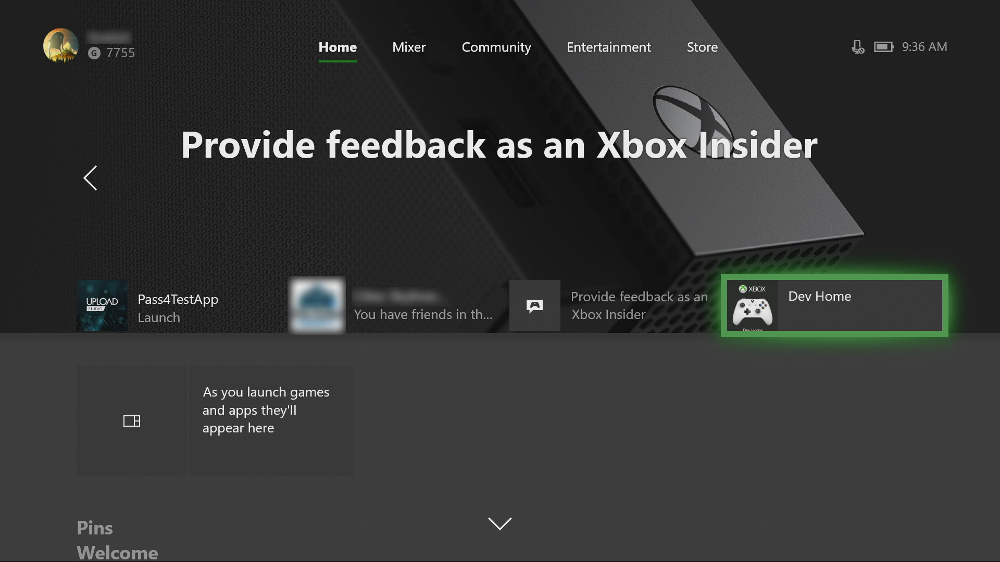
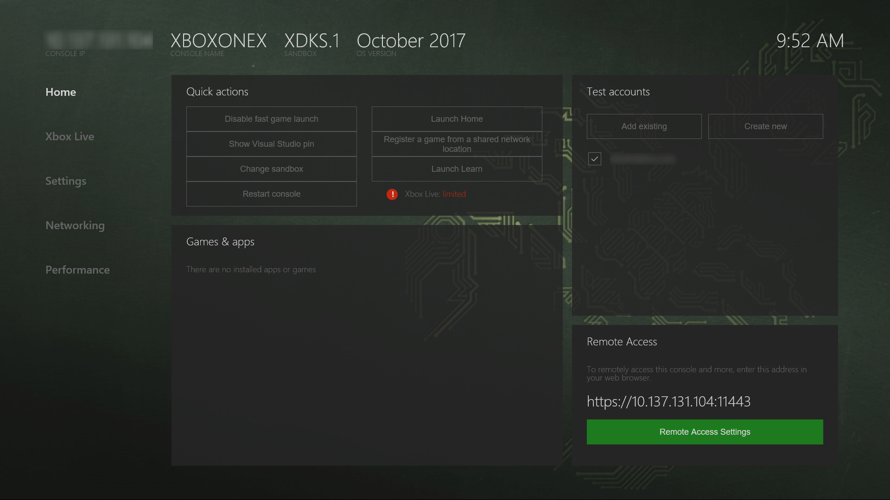
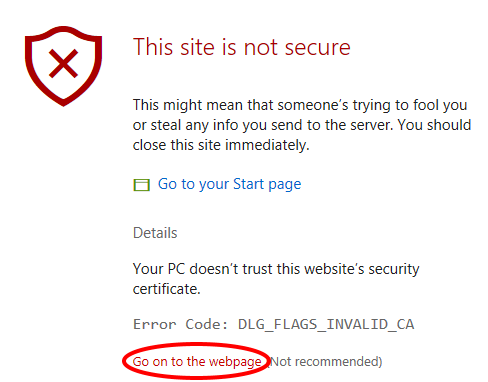

# Introduction to Xbox One tools

This section covers how to access the Xbox Device Portal through the Dev Home app.

## Dev Home

Dev Home is a tools experience on the Xbox One Development Kit designed to aid developer productivity. Dev Home offers functionality to manage and configure your dev kit.

Dev Home is the default app that is opened when your console in Developer Mode boots up. You can also open Dev Home by selecting the **Dev Home** tile on the home screen. If there is no tile present, the console is not in Developer Mode.

For more information about Dev Home, see [Developer Home on the Console (Dev Home)](dev-home.md).

## Xbox Device Portal
The Xbox Device Portal is a browser-based device management tool that allows you to add games and apps, add Xbox Live test accounts, change sandboxes, and much more.

To enable the Xbox Device Portal on your Xbox One console:

1. Select the **Dev Home** tile on the home screen.

  

2. Within Dev Home, navigate to the **Home** tab, and in the **Remote Access** section, select **Remote Access Settings**.

  

3. Select the **Enable Xbox Device Portal** checkbox.

4. Under **Authentication**, select the **Require authentication to remotely access this console from the web or PC tools** checkbox.

5. Enter a **User name** and __Password__, and select **Save**. These credentials are used to authenticate access to your dev kit from a browser.

6. Select **Close**, and on the **Home** tab, note the URL listed in the **Remote Access** tool.

7. Enter the URL in your browser. You will receive a warning about the certificate that was provided, similar to the following screenshot, because the security certificate signed by your Xbox One console is not considered a well-known, trusted publisher. On Edge, click **Details** and then **Go on to the webpage** to access the Xbox Device Portal.

    

8. Sign in with the credentials you configured.

## Xbox Dev Mode Companion
Xbox Dev Mode Companion is a tool that allows you to work on your console without leaving your PC. The app allows you to view the console screen and send input to it. For more information, see [Xbox Dev Mode Companion](xbox-dev-mode-companion.md).

## See also
- [How to use Fiddler with Xbox One when developing for UWP](uwp-fiddler.md)
- [Windows Device Portal overview](../debug-test-perf/device-portal.md)
- [UWP on Xbox One](index.md)