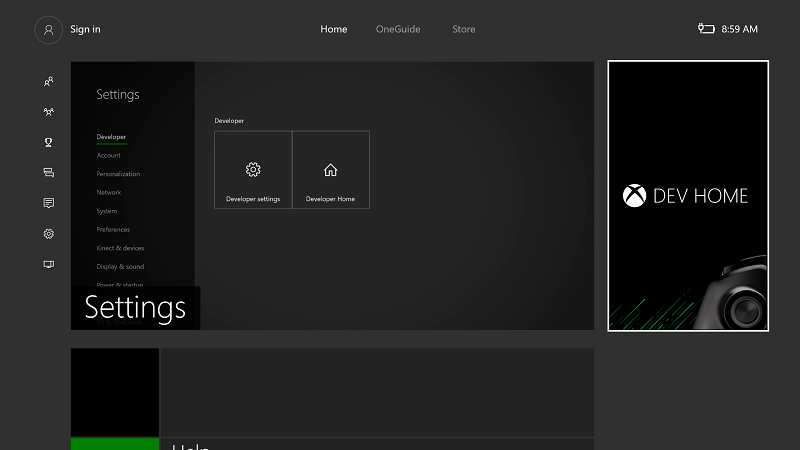
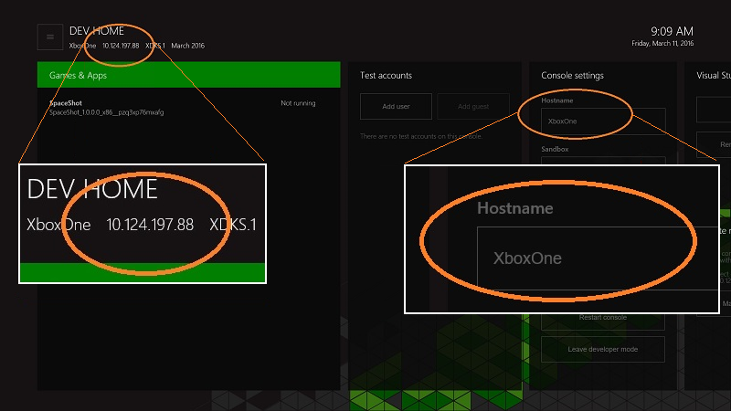
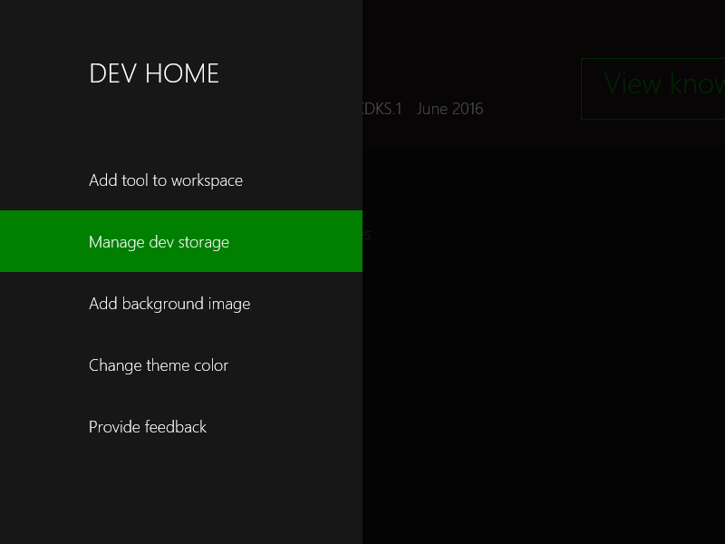
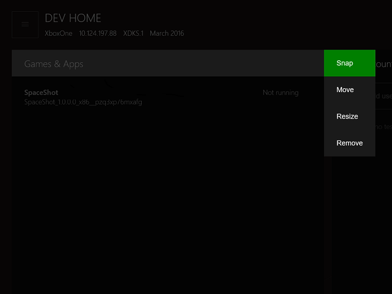
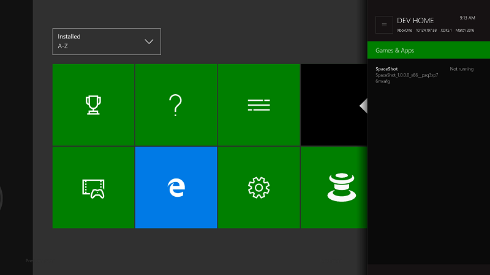
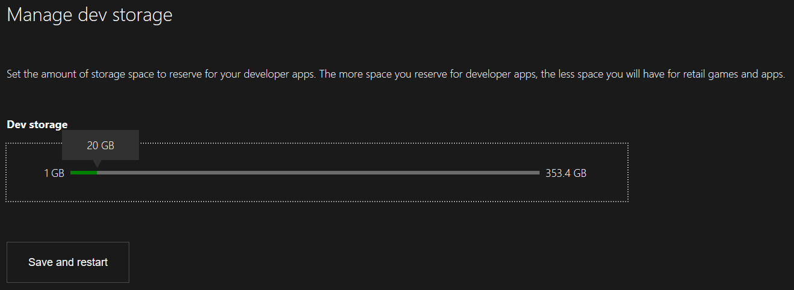
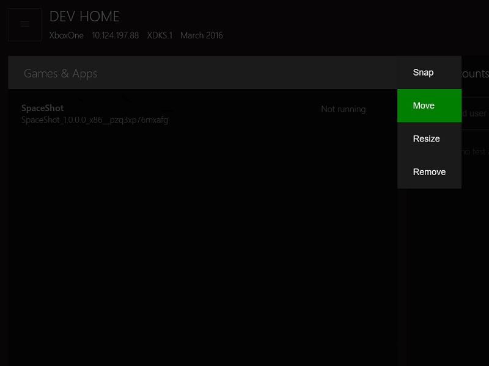
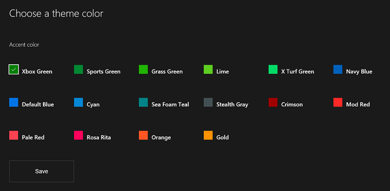
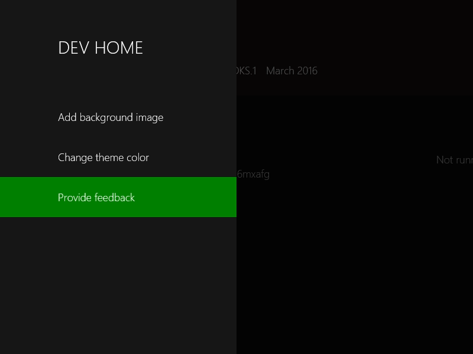
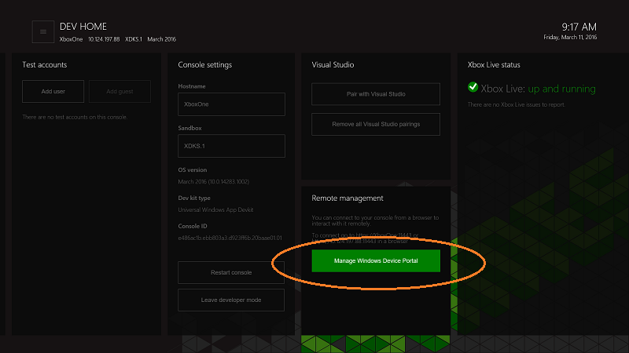

# Introduction to Xbox One tools

This section covers the Xbox One-specific tool _Dev Home_, using the Windows Device Portal.

## Dev Home

_Dev Home_ is a tools experience on the Xbox One Development Kit designed to aid developer productivity. Dev Home offers functionality to manage and configure your dev kit.

To open Dev Home, select the **Dev Home** tile on the home screen. If there is no tile present, the console is not in Developer Mode.

  

### User interface
The Dev Home user interface is divided into the areas described in the following sections. Note the console IP address and friendly name are displayed here.

  

#### Header
The header contains important “at a glance” information about the dev kit. This includes the console name, its IP address, the Xbox Live sandbox it is in, and the version of the operating system it is running. On the right of the header, the current system time and date is shown for convenience.

#### Tool windows
Under the header is the main area of the app, which contains a set of configurable tool windows. These are intended to allow developers to customize the app to provide access to various tools and sets of information. For more details about the tools, see the following individual tool descriptions. For information about how to configure the layout and appearance of the tool windows, see the [Customizing Dev Home](#customizing-dev-home) section later on this page.

#### Main menu
By pressing the **Menu** button on your controller or navigating to the menu (“Hamburger”) button at the top left of the screen, you can access the main menu that allows you to configure the theme color and background image for the app workspace, and provide feedback on the app.

  

#### Snap mode
Tools in Dev Home can be snapped to the side while you are running your title so that you can have easy access to tools while you are testing.

To access **Snap** mode, select the title of the appropriate tool, press the **View** button on your controller, and on the context menu, select **Snap**.

  

Dev Home will snap right. You can switch context by double tapping the **Nexus** button as usual.

  

#### Tool descriptions
| Tool	| Capabilities |
|-------|--------------|
| Games & Apps	| Lists the titles and apps installed on the dev kit and the ability to quickly open them. You can also view the process lifetime management (PLM) state of games and apps, and change PLM states from a context menu. |
| Users	| Lists the users currently registered on the console. Enables one-click user sign in/out, adding users and guests, and viewing details of users and guests. |
| [Console settings](#console-settings) | Provides an “at a glance” view and editing options of console settings and information. |
| Visual Studio | Enables you to pair the console with an instance of Visual Studio to allow deployment. If necessary, clear any existing paired VS instances to prevent UWP app deployment to a kit. |
| [Windows Device Portal](#windows-device-portal) |	Enables WDP (a browser-based device management tool) on the kit. |
| Xbox Live status | Provides the current status of the Xbox Live service. |
 
### Managing the size of the developer storage allocation

To increase or decrease the amount of disk space that is used for developer storage, select **Manage dev storage** from the main menu. Change the value of the **Dev storage** bar, and then select **Save and restart** to restart your console.

  

### Customizing Dev Home

Dev Home has been designed to be customizable and personal. You can choose a background image and theme color to personalize your Dev Home experience. These options are found on the main menu.

#### Resizing and reordering tools
To change the size or position of a tool, use the context menu button (**View** button on your controller) while the title has focus. On the context menu, select **Move** or **Resize**.

  

#### Changing theme color and background image
On the main menu, you can select **Change theme color**. To update the theme color used for focus highlighting, select a new color and then click **Save**.

  

### Providing feedback
To provide feedback on Dev Home, or any of the tools processes, select the **Provide feedback** option on the main menu.

  

## Console settings
The Console settings tool provides quick access to the settings of the dev kit.

### Setting a hostname for the console
When communicating with the console from your development PC, you can set a friendly name (called a _hostname_) for the Xbox One dev kit to use as an alternative to the console IP address. Your development PC and the dev kit must be on the same subnet for hostname connectivity to work.  

To define a hostname for a dev kit, go to the Console settings tool and type the hostname in the __Hostname__ box.  

> [!NOTE]
> Name uniqueness is not enforced when the hostname is created. Be careful to avoid name duplication. One way to do this is to derive the hostname from the name of your development computer, which is usually unique within an organization.

## Windows Device Portal
Windows Device Portal (WDP) is a OneCore device management tool that allows a browser-based device management experience.

> [!NOTE]
> For more information on WDP, see the [Windows Device Portal overview](../debug-test-perf/device-portal.md).

To enable WDP on your Xbox One console:

1. Select the Dev Home tile on the home screen.

  

2. Within Dev Home, navigate to the **Remote management** tool.

  

3. Select __Manage Windows Device Portal__, and then press __A__.
4. Select the __Enable Windows Device Portal__ check box.
5. Enter a __Username__ and __Password__, and save them. These are used to authenticate access to your dev kit from a browser.
6. Close the __Settings__ page, and note the URL listed on the _Remote Management_ tool to connect.
7. Enter the URL in your browser, and then sign in with the credentials you configured.
8. You will receive a warning about the certificate that was provided, similar to the following screenshot, because the security certificate signed by your Xbox One console is not considered a well-known trusted publisher. Click **Continue to this website** to access the Windows Device Portal.

  

## Xbox Dev Mode Companion
Xbox Dev Mode Companion is a tool that allows you to work on your console without leaving your PC. The app allows you to view the console screen and send input to it. For more information, see [Xbox Dev Mode Companion](xbox-dev-mode-companion.md).

## See also
- [How to use Fiddler with Xbox One when developing for UWP](uwp-fiddler.md)
- [Windows Device Portal overview](../debug-test-perf/device-portal.md)
- [UWP on Xbox One](index.md)

----
