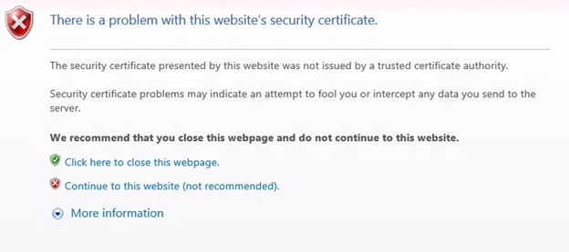

# Known issues with UWP on Xbox Developer Program

This topic describes known issues with the UWP on Xbox One Developer Program. 
For more information about this program, see [UWP on Xbox](index.md). 

\[If you came here from a link in an API reference topic, and are looking for Universal device family API information, see [UWP features not supported on Xbox](/uwp/extension-sdks/uwp-limitations-on-xbox).\]

The following list highlights some known issues that you may encounter, but this list is not exhaustive.

**We want to get your feedback**, so please report any issues that you find on the [Developing Universal Windows Platform apps](https://social.msdn.microsoft.com/forums/windowsapps/home?forum=wpdevelop) forum. 

If you get stuck, read the information in this topic, see [Frequently asked questions](frequently-asked-questions.md), and use the forums to ask for help.

 
## Deploying from VS fails with Parental Controls turned on

Launching your app from VS will fail if the console has Parental Controls turned on in Settings.

To work around this issue, either temporarily disable Parental Controls, or:
1. Deploy your app to the console with Parental Controls turned off.
2. Turn on Parental Controls.
3. Launch your app from the console.
4. Enter a PIN or password to allow the app to launch.
5. App will launch.
6. Close the app.
7. Launch from VS using F5, and the app will launch with no prompting.

At this point the permission is _sticky_ until you sign the user out, even if you uninstall and reinstall the app.
 
There is another type of exemption that is only available for child accounts. A child account requires a parent to sign in to grant permission, but when they do, the parent has the option of choosing to **Always** allow the child to launch the app. That exemption is stored in the cloud and will persist even if the child signs out and signs back in.

## StorageFile.CopyAsync fails to copy encrypted files to unencrypted destination 

When StorageFile.CopyAsync is used to copy a file that is encrypted to a destination that is not encrypted, the call will fail with the following exception:

```
System.UnauthorizedAccessException: Access is denied. (Excep_FromHResult 0x80070005)
```

This can affect Xbox developers who want to copy files that are deployed as part of their app package to another location. 
The reason for this is that the package contents are encrypted on an Xbox in retail mode, but not in Dev Mode. 
As a result, the app may appear to work as expected during development and testing, but then fail once it has been published and then installed to a retail Xbox.
 

## Blocked networking ports on Xbox One

Universal Windows Platform (UWP) apps on Xbox One devices are restricted from binding to ports in the range [57344, 65535], inclusive. 
Although binding to these ports might appear to succeed at run-time, network traffic can be silently dropped before reaching your app. 
Your app should bind to port 0 wherever possible, which allows the system to select the local port. 
If you need to use a specific port, the port number must be in the range [1025, 49151], and you should check and avoid conflicts with the IANA registry. 
For more information, see the [Service Name and Transport Protocol Port Number Registry](https://www.iana.org/assignments/service-names-port-numbers/service-names-port-numbers.xhtml).

## Windows Runtime API coverage

Not all Windows Runtime APIs are supported on Xbox. For the list of APIs that we know don't work, see [UWP features not supported on Xbox](/uwp/extension-sdks/uwp-limitations-on-xbox). If you find issues with other APIs, please report them on the forums.

## Navigating to WDP causes a certificate warning

You will receive a warning about the certificate that was provided, similar to the following screenshot, because the security certificate signed by your Xbox One console is not considered a well-known trusted publisher. To access the Windows Device Portal, click **Continue to this website**.




## KnownFolders.MediaServerDevices caveat on Xbox

On Desktop, media servers are “paired” with the PC, and the Device Association Service is constantly tracking which of the servers are currently on-line, so an initial file system query can immediately return a list of the paired servers that are currently online.

On Xbox, there is no UI to add or remove servers, so the initial file system query will always return empty. You must create a query and subscribe to the ContentsChanged event and refresh the query each time you get a notification. Servers will trickle in and most will have been discovered within 3 seconds.

Simple example code:

```
namespace TestDNLA {

    public sealed partial class MainPage : Page {
        public MainPage() {
            this.InitializeComponent();
        }

        private async void FindFiles_Click(object sender, RoutedEventArgs e) {
            try {
                StorageFolder library = KnownFolders.MediaServerDevices;
                var folderQuery = library.CreateFolderQuery();
                folderQuery.ContentsChanged += FolderQuery_ContentsChanged;
                IReadOnlyList<StorageFolder> rootFolders = await folderQuery.GetFoldersAsync();
                if (rootFolders.Count == 0) {
                    Debug.WriteLine("No Folders found");
                } else {
                    Debug.WriteLine("Folders found");
                }
            } catch (Exception ex) {
                Debug.WriteLine("Error: " + ex.Message);
            } finally {
                Debug.WriteLine("Done");
            }
        }

        private async void FolderQuery_ContentsChanged(Windows.Storage.Search.IStorageQueryResultBase sender, object args) {
            Debug.WriteLine("Folder added " + sender.Folder.Name);
            IReadOnlyList<StorageFolder> topLevelFolders = await sender.Folder.GetFoldersAsync();
            foreach (StorageFolder topLevelFolder in topLevelFolders) {
                Debug.WriteLine(topLevelFolder.Name);
            }
        }
    }
}
```

## See also
- [Frequently asked questions](frequently-asked-questions.md)
- [UWP on Xbox One](index.md)